**DX-CT11-B&C**

**4G模块技术手册**

> 版本：2.1
>
> 日期：2026-03-23

**更新记录**

|          |            |              |          |
|:--------:|:----------:|:------------:|:--------:|
| **版本** |  **日期**  |   **说明**   | **作者** |
|   V1.0   | 2025/10/12 |   初始版本   |   YXR    |
|   V1.1   | 2025/11/10 | 增加引脚说明 |   YXR    |
|   V2.0   | 2026/01/06 | 增加底板资料 |   YXR    |
|   V2.1   | 2026/03/23 |   更新参数   |   YXR    |

**联系我们**

**深圳大夏龙雀科技有限公司**

邮箱：sales@szdx-smart.com

电话：0755-2997 8125

网址：[www.szdx-smart.com](http://www.szdx-smart.com)

地址：深圳市宝安区航城街道航空路庄边工业园厂房A栋4层

**目录**

[1. 模块介绍 [- 6 -](#模块介绍)](#模块介绍)

[1.1. 概述 [- 6 -](#_Toc21580)](#_Toc21580)

[1.2. 特点 [- 6 -](#_Toc21904)](#_Toc21904)

[1.3. 应用 [- 7 -](#_Toc17234)](#_Toc17234)

[1.4. 功能框图 [- 7 -](#_Toc28888)](#_Toc28888)

[1.5. 基础参数 [- 8 -](#_Toc17530)](#_Toc17530)

[2. 应用接口 [- 9 -](#应用接口)](#应用接口)

[2.1. 模块引脚定义 [- 9 -](#_Toc16584)](#_Toc16584)

[2.2. 模块引脚描述 [- 10 -](#_Toc12852)](#_Toc12852)

[2.3. 模块版块定义 [- 12 -](#_Toc22747)](#_Toc22747)

[2.4. 底板版块定义说明 [- 13 -](#_Toc26645)](#_Toc26645)

[2.5. 电源设计 [- 13 -](#_Toc10775)](#_Toc10775)

[2.5.1. 电源稳定性要求 [- 13 -](#_Toc15054)](#_Toc15054)

[2.5.2. 硬件使能 [- 14 -](#_Toc21814)](#_Toc21814)

[2.6. 交互应用 [- 15 -](#_Toc7395)](#_Toc7395)

[2.6.1. 网络指示引脚状态描述 [- 15 -](#_Toc1628)](#_Toc1628)

[2.6.2. 休眠管脚描述 [- 15 -](#_Toc31925)](#_Toc31925)

[2.6.3. GPIO拓展口 [- 16 -](#_Toc3144)](#_Toc3144)

[2.7. (U)SIM卡 [- 17 -](#_Toc9446)](#_Toc9446)

[2.7.1. 管脚描述 [- 17 -](#_Toc26491)](#_Toc26491)

[2.7.2. (U)SIM卡接口应用 [- 17 -](#_Toc4895)](#_Toc4895)

[2.8. USB接口 [- 18 -](#_Toc15481)](#_Toc15481)

[2.9. UART接口 [- 20 -](#_Toc5384)](#_Toc5384)

[2.9.1. 管脚描述 [- 20 -](#_Toc9978)](#_Toc9978)

[2.9.2. UART接口应用 [- 21 -](#_Toc19890)](#_Toc19890)

[2.10. RF接口 [- 22 -](#_Toc645)](#_Toc645)

[3. 电气特性和可靠性 [- 24 -](#电气特性和可靠性)](#电气特性和可靠性)

[3.1. 电气特性 [- 24 -](#_Toc8885)](#_Toc8885)

[3.2. 温度特性 [- 24 -](#_Toc16509)](#_Toc16509)

[3.3. 电源功耗 [- 24 -](#_Toc30896)](#_Toc30896)

[3.4. 静电防护 [- 25 -](#_Toc9523)](#_Toc9523)

[4. 射频功能介绍 [- 26 -](#射频功能介绍)](#射频功能介绍)

[4.1. 4G频段特性 [- 26 -](#_Toc8507)](#_Toc8507)

[4.2. 天线电路设计 [- 27 -](#_Toc26234)](#_Toc26234)

[4.3. 天线接口 [- 28 -](#_Toc8826)](#_Toc8826)

[4.4. 4G-FPC天线基础参数 [- 28 -](#_Toc24561)](#_Toc24561)

[5. 机械尺寸及标签 [- 29 -](#机械尺寸及标签)](#机械尺寸及标签)

[5.1. 模块结构尺寸 [- 29 -](#_Toc18383)](#_Toc18383)

[5.2. 产品标签 [- 29 -](#_Toc11625)](#_Toc11625)

[6. 储存、生产 [- 31 -](#储存生产)](#储存生产)

[6.1. 存储条件 [- 31 -](#_Toc8845)](#_Toc8845)

[7. 安全警告和注意事项 [- 32 -](#安全警告和注意事项)](#安全警告和注意事项)

**表格索引**

[表 1 ：基础参数表 [- 8 -](#_Toc3876)](#_Toc3876)

[表 2 ：常用引脚描述表 [- 10 -](#_Toc15392)](#_Toc15392)

[表 3 ：引脚类型说明 [- 12 -](#_Toc16907)](#_Toc16907)

[表 4 ：底板版块定义说明表 [- 13 -](#_Toc8737)](#_Toc8737)

[表 5 ：网络状态指示引脚的工作状态 [- 15 -](#_Toc17964)](#_Toc17964)

[表 6 ：休眠控制引脚的工作状态 [- 16 -](#_Toc11299)](#_Toc11299)

[表 7 ：休眠功耗表 [- 16 -](#_Toc26555)](#_Toc26555)

[表 8 ：GPIO接口描述 [- 16 -](#_Toc14868)](#_Toc14868)

[表 9 ：(U)SIM0卡信号定义及说明 [- 17 -](#_Toc5022)](#_Toc5022)

[表 10 ：(U)SIM1卡信号定义及说明 [- 17 -](#_Toc15149)](#_Toc15149)

[表 11 ：USB接口管脚定义 [- 19 -](#_Toc24507)](#_Toc24507)

[表 12 ：UART接口管脚定义 [- 20 -](#_Toc20841)](#_Toc20841)

[表 13 ：RF接口描述 [- 22 -](#_Toc2378)](#_Toc2378)

[表 14 ：电气特性 [- 24 -](#_Toc22260)](#_Toc22260)

[表 15 ：温度特性 [- 24 -](#_Toc13300)](#_Toc13300)

[表 16 ：电源功耗表 [- 24 -](#_Toc1150)](#_Toc1150)

[表 17 ：模块引脚的ESD耐受电压情况表 [- 25 -](#_Toc29953)](#_Toc29953)

[表 18 ：射频频段 [- 26 -](#_Toc6706)](#_Toc6706)

[表 19 ：发射功率 [- 26 -](#_Toc342)](#_Toc342)

[表 20 ：接收灵敏度 [- 27 -](#_Toc8678)](#_Toc8678)

[表 21 ：基础参数表 [- 28 -](#_Toc24201)](#_Toc24201)

[表 22 ：标签描述 [- 30 -](#_Toc11543)](#_Toc11543)

**图片索引**

[图 1 ：功能框图 [- 7 -](#_Toc31240)](#_Toc31240)

[图 2 ：模块引脚定义 [- 9 -](#_Toc10249)](#_Toc10249)

[图 3 ：底板定义(CT11-B) [- 12 -](#_Toc23338)](#_Toc23338)

[图 4 ：底板定义(CT11-C) [- 12 -](#_Toc13311)](#_Toc13311)

[图 5 ：DC/DC供电参考电路( CT11-B模块 ) [- 14 -](#_Toc5320)](#_Toc5320)

[图 6 ：电池供电参考电路( CT11-C模块 ) [- 14 -](#_Toc29073)](#_Toc29073)

[图 7 ：使能参考电路 [- 15 -](#_Toc8439)](#_Toc8439)

[图 8 ：USIM接口示意图 [- 18 -](#_Toc9903)](#_Toc9903)

[图 9 ：USB接口参考设计 [- 19 -](#_Toc32550)](#_Toc32550)

[图 10 ：UART接口示意图 [- 21 -](#_Toc23738)](#_Toc23738)

[图 11 ：模块串口与AP应用处理器4线接法 [- 21 -](#_Toc22862)](#_Toc22862)

[图 12 ：模块串口与 AP 应用处理器完整接法 [- 22 -](#_Toc7674)](#_Toc7674)

[图 13 ：电平转换参考电路 [- 22 -](#_Toc31299)](#_Toc31299)

[图 14 ：射频参考电路 [- 23 -](#_Toc29075)](#_Toc29075)

[图 15 ：天线匹配网络 [- 27 -](#_Toc4181)](#_Toc4181)

[图 16 ：天线路径参考设计 [- 28 -](#_Toc21429)](#_Toc21429)

[图 17 ：模块尺寸 [- 29 -](#_Toc14977)](#_Toc14977)

[图 18 ：DX-CT11-B&C系列标签 [- 29 -](#_Toc32276)](#_Toc32276)

# 模块介绍

1.  **概述**

    DX-CT11-B&C是深圳大夏龙雀科技有限公司的一款4G模块，是为IoT行业研发的一款CAT1通信模组，采用LCC+LGA封装，尺寸为17.7mm×15.8mm×2.2mm。具备多种接口和丰富协议，多版本USB驱动，应用简单便捷。能很好满足客户对高性价比、低功耗的应用要求。该模组主要应用于POS、POC、共享经济、追踪器、IPC、智慧城市和智慧农业等场景。

    DX-CT11-B和DX-CT11-C供电区别：

    CT11-B：5~16V宽电压供电；

    CT11-C：3.4~4.5V锂电池供电。

2.  **特点**

    模块参数：

- 工作电压：

  CT11-B：5~16V宽电压供电

  CT11-C：3.4~4.5V锂电池供电

- 功耗：

  CT11-B(连接网络，连接MQTT服务器)：13.65mA@5V

  CT11-C(连接网络，连接MQTT服务器)：[15.32mA@3.8V](mailto:15mA@3.8V)

- 产品尺寸规格：

  模块尺寸：17.7mm×15.8mm×2.2mm

  底板尺寸：32mm×28mm

- 接口：

  (U)SIM0卡(1.8V/3.0V) / (U)SIM1卡(1.8V) / UART / 4G天线接口

- 认证：

  CCC

- 支持协议：

  支持IPv4/PING/NTP/DNS/TCP/UDP/MQTT等

  1.  **应用**

<!-- -->

- DTU

- POS

- POC

- 共享经济

- 追踪器

- IPC

- 智慧城市

- 智慧农业

  1.  **功能框图**

下图为DX-CT11-B&C模块的功能框图，阐述了其如下主要功能：

- 电源部分

- 基带部分

- 存储器

- 射频部分

- 外围接口

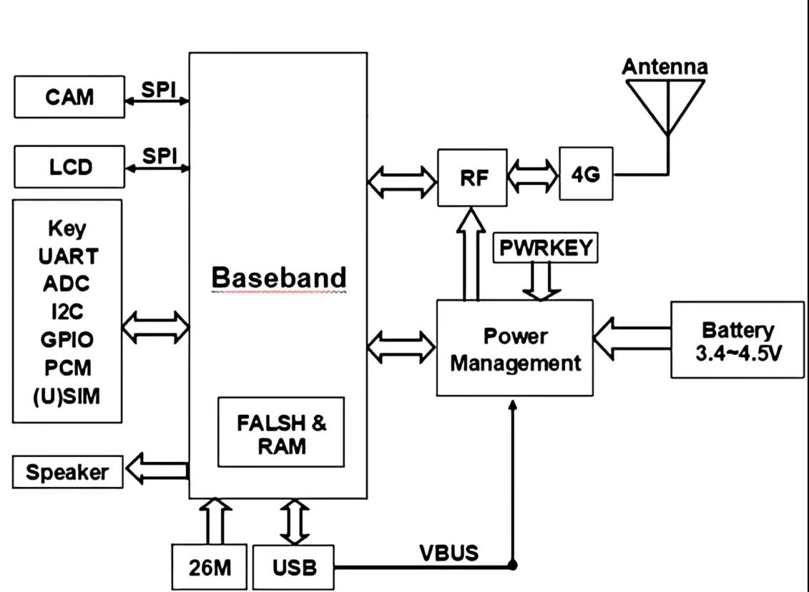

**图 1****：功能框图**

1.  **基础参数**

|  |  |  |  |
|:--:|:--:|:--:|:--:|
| **参数名称** | **详情** | **参数名称** | **详情** |
| 模块型号 | DX-CT11-B&C | 模块尺寸 | 17.7mm×15.8mm×2.2mm |
| CT11-B工作电压 | VIN：5~16 V(典型值：5V) | CT11-B工作电流 | CT11-B：13.65mA@5V |
| CT11-C工作电压 | VBAT：3.4V~4.5V(典型值：3.8V) | CT11-C工作电流 | CT11-C：15.32mA@3.8V |
| 射频输入阻抗 | 50Ω | 硬件接口 | USB ADC UART I2C SPI GPIO |
| 4G频段 | TDD-LTE，FDD-LTE | 4G协议 | TCP UDP MQTT |
| 4G发射功率 | 23dBm±2dB | 4G天线接口 | 外接天线 |
| 工作温度 | MIN：-30℃ - MAX：+75℃ | 存储温度 | MIN：-45℃ - MAX：+90℃ |

**表 1****：基础参数表**

**备注**

|  |
|:---|
| 频道：FDD Band1，FDD Band3，FDD Band5，FDD Band8，TDD Band34，TDD Band38，TDD Band39，TDD Band40，TDD Band41。 |

# 应用接口

1.  **模块引脚定义**

<table style="width:85%;">
<colgroup>
<col style="width: 85%" />
</colgroup>
<tbody>
<tr>
<td><table style="width:72%;">
<colgroup>
<col style="width: 71%" />
</colgroup>
<tbody>
<tr>
<td></td>
</tr>
</tbody>
</table>
<table style="width:65%;">
<colgroup>
<col style="width: 1%" />
<col style="width: 3%" />
<col style="width: 15%" />
<col style="width: 15%" />
<col style="width: 15%" />
<col style="width: 13%" />
</colgroup>
<tbody>
<tr>
<td><strong>图</strong></td>
<td><blockquote>

<strong>例</strong>

</blockquote></td>
<td style="text-align: left;"><blockquote>

<strong>RESERVED</strong>

</blockquote></td>
<td style="text-align: left;"><blockquote>

<strong>GND</strong>

</blockquote></td>
<td style="text-align: left;"><blockquote>

<strong>POWER</strong>

</blockquote></td>
<td style="text-align: left;"><strong>CONTROL</strong></td>
</tr>
<tr>
<td></td>
<td style="text-align: left;"></td>
<td style="text-align: left;"><blockquote>

<strong>USIM</strong>

</blockquote></td>
<td style="text-align: left;"><blockquote>

<strong>UART</strong>

</blockquote></td>
<td style="text-align: left;"><blockquote>

<strong>GPIO</strong>

</blockquote></td>
<td style="text-align: left;"><blockquote>

<strong>RF</strong>

</blockquote></td>
</tr>
<tr>
<td></td>
<td></td>
<td style="text-align: left;"><blockquote>

<strong>USB</strong>

<strong>IIC</strong>

</blockquote></td>
<td style="text-align: left;"><blockquote>

<strong>ANALOG</strong>

</blockquote></td>
<td style="text-align: left;"><strong>AUDIO</strong></td>
<td style="text-align: left;"><blockquote>

<strong>LCD</strong>

</blockquote></td>
</tr>
</tbody>
</table></td>
</tr>
</tbody>
</table>

**图 2****：模块引脚定义**

2.  **模块引脚描述**

> DX-CT11共有109个引脚，接口具体功能如下。

<table style="width:100%;">
<caption><blockquote>

<strong>表 2</strong><strong>：常用引脚描述表</strong>

</blockquote></caption>
<colgroup>
<col style="width: 15%" />
<col style="width: 21%" />
<col style="width: 9%" />
<col style="width: 24%" />
<col style="width: 29%" />
</colgroup>
<tbody>
<tr>
<td style="text-align: center;"><strong>引脚名</strong></td>
<td style="text-align: center;"><strong>引脚号</strong></td>
<td style="text-align: center;"><strong>类型</strong></td>
<td style="text-align: center;"><strong>功能描述</strong></td>
<td style="text-align: center;"><strong>备注（V）</strong></td>
</tr>
<tr>
<td colspan="5" style="text-align: center;"><strong>POWER</strong></td>
</tr>
<tr>
<td style="text-align: center;">VBAT</td>
<td style="text-align: center;">42,43</td>
<td style="text-align: center;">PI</td>
<td style="text-align: center;">模组供电输入</td>
<td style="text-align: center;">3.4~4.5</td>
</tr>
<tr>
<td style="text-align: center;">VDD_EXT</td>
<td style="text-align: center;">24</td>
<td style="text-align: center;">PO</td>
<td style="text-align: center;">模组供电输出</td>
<td style="text-align: center;">1.8</td>
</tr>
<tr>
<td colspan="5" style="text-align: center;"><strong>UART</strong></td>
</tr>
<tr>
<td style="text-align: center;">UART0_RXD</td>
<td style="text-align: center;">17</td>
<td style="text-align: center;">DI</td>
<td style="text-align: center;">接收数据</td>
<td style="text-align: center;">1.8</td>
</tr>
<tr>
<td style="text-align: center;">UART0_TXD</td>
<td style="text-align: center;">18</td>
<td style="text-align: center;">DO</td>
<td style="text-align: center;">发送数据</td>
<td style="text-align: center;">1.8</td>
</tr>
<tr>
<td style="text-align: center;">UART0_CTS</td>
<td style="text-align: center;">22</td>
<td style="text-align: center;">DO</td>
<td style="text-align: center;">清除发送</td>
<td style="text-align: center;">1.8</td>
</tr>
<tr>
<td style="text-align: center;">UART0_RTS</td>
<td style="text-align: center;">23</td>
<td style="text-align: center;">DI</td>
<td style="text-align: center;">请求发送</td>
<td style="text-align: center;">1.8</td>
</tr>
<tr>
<td style="text-align: center;">UART0_DTR</td>
<td style="text-align: center;">19</td>
<td style="text-align: center;">DI</td>
<td style="text-align: center;">数据终端准备就绪</td>
<td style="text-align: center;">0</td>
</tr>
<tr>
<td style="text-align: center;">UART0_DCD</td>
<td style="text-align: center;">21</td>
<td style="text-align: center;">DO</td>
<td style="text-align: center;">载波检测</td>
<td style="text-align: center;">0</td>
</tr>
<tr>
<td style="text-align: center;">UART0_RI</td>
<td style="text-align: center;">20</td>
<td style="text-align: center;">DO</td>
<td style="text-align: center;">串口振铃</td>
<td style="text-align: center;">0</td>
</tr>
<tr>
<td style="text-align: center;">UART1_RXD</td>
<td style="text-align: center;">28</td>
<td style="text-align: center;">DI</td>
<td style="text-align: center;">接收数据</td>
<td style="text-align: center;">0（GNSS版本不支持）</td>
</tr>
<tr>
<td style="text-align: center;">UART1_TXD</td>
<td style="text-align: center;">29</td>
<td style="text-align: center;">DO</td>
<td style="text-align: center;">发送数据</td>
<td style="text-align: center;">0（GNSS版本不支持）</td>
</tr>
<tr>
<td style="text-align: center;">DBG_RXD</td>
<td style="text-align: center;">38</td>
<td style="text-align: center;">DI</td>
<td style="text-align: center;">调试串口接收</td>
<td style="text-align: center;">1.8</td>
</tr>
<tr>
<td style="text-align: center;">DBG_TXD</td>
<td style="text-align: center;">39</td>
<td style="text-align: center;">DO</td>
<td style="text-align: center;">调试串口发送</td>
<td style="text-align: center;">1.8</td>
</tr>
<tr>
<td colspan="5" style="text-align: center;"><strong>USIM</strong></td>
</tr>
<tr>
<td style="text-align: center;">USIM0_RESET</td>
<td style="text-align: center;">12</td>
<td style="text-align: center;">DO</td>
<td style="text-align: center;">(U)SIM卡复位信号</td>
<td style="text-align: center;">1.8</td>
</tr>
<tr>
<td style="text-align: center;">USIM0_CLK</td>
<td style="text-align: center;">13</td>
<td style="text-align: center;">DO</td>
<td style="text-align: center;">(U)SIM卡时钟信号</td>
<td style="text-align: center;">0</td>
</tr>
<tr>
<td style="text-align: center;">USIM0_DATA</td>
<td style="text-align: center;">11</td>
<td style="text-align: center;">DIO</td>
<td style="text-align: center;">(U)SIM卡数据信号</td>
<td style="text-align: center;">1.8</td>
</tr>
<tr>
<td style="text-align: center;">USIM0_PWR</td>
<td style="text-align: center;">14</td>
<td style="text-align: center;">PO</td>
<td style="text-align: center;">(U)SIM卡供电</td>
<td style="text-align: center;">1.8</td>
</tr>
<tr>
<td style="text-align: center;">USIM0_DET</td>
<td style="text-align: center;">79</td>
<td style="text-align: center;">DI</td>
<td style="text-align: center;">(U)SIM卡检测信号</td>
<td style="text-align: center;">1.8</td>
</tr>
<tr>
<td style="text-align: center;">USIM1_RESET</td>
<td style="text-align: center;">63</td>
<td style="text-align: center;">DO</td>
<td style="text-align: center;">(U)SIM卡复位信号</td>
<td style="text-align: center;">0(只支持1.8V SIM卡)</td>
</tr>
<tr>
<td style="text-align: center;">USIM1_CLK</td>
<td style="text-align: center;">62</td>
<td style="text-align: center;">DO</td>
<td style="text-align: center;">(U)SIM卡时钟信号</td>
<td style="text-align: center;">0(只支持1.8V SIM卡)</td>
</tr>
<tr>
<td style="text-align: center;">USIM1_DATA</td>
<td style="text-align: center;">64</td>
<td style="text-align: center;">DIO</td>
<td style="text-align: center;">(U)SIM卡数据信号</td>
<td style="text-align: center;">0(只支持1.8V SIM卡)</td>
</tr>
<tr>
<td style="text-align: center;">USIM1_PWR</td>
<td style="text-align: center;">65</td>
<td style="text-align: center;">PO</td>
<td style="text-align: center;">(U)SIM卡供电</td>
<td style="text-align: center;">0(只支持1.8V SIM卡)</td>
</tr>
<tr>
<td style="text-align: center;">USIM1_DET</td>
<td style="text-align: center;">77</td>
<td style="text-align: center;">DI</td>
<td style="text-align: center;">(U)SIM卡检测信号</td>
<td style="text-align: center;">0</td>
</tr>
<tr>
<td colspan="5" style="text-align: center;"><strong>GPIO</strong></td>
</tr>
<tr>
<td style="text-align: center;">GPIO0</td>
<td style="text-align: center;">76</td>
<td style="text-align: center;">IO</td>
<td style="text-align: center;">通用输入输出</td>
<td style="text-align: center;">0</td>
</tr>
<tr>
<td style="text-align: center;">GPIO2</td>
<td style="text-align: center;">86</td>
<td style="text-align: center;">IO</td>
<td style="text-align: center;">通用输入输出</td>
<td style="text-align: center;">0</td>
</tr>
<tr>
<td style="text-align: center;">GPIO3</td>
<td style="text-align: center;">87</td>
<td style="text-align: center;">IO</td>
<td style="text-align: center;">通用输入输出</td>
<td style="text-align: center;">0</td>
</tr>
<tr>
<td colspan="5" style="text-align: center;"><strong>RF</strong></td>
</tr>
<tr>
<td style="text-align: center;">ANT_MAIN</td>
<td style="text-align: center;">35</td>
<td style="text-align: center;">RF</td>
<td style="text-align: center;">射频主集天线</td>
<td style="text-align: center;">0</td>
</tr>
<tr>
<td colspan="5" style="text-align: center;"><strong>USB</strong></td>
</tr>
<tr>
<td style="text-align: center;">USB_VBUS</td>
<td style="text-align: center;">61</td>
<td style="text-align: center;">PI</td>
<td style="text-align: center;">USB电源输入</td>
<td style="text-align: center;">0(无供电能力，支持 USB插入检测。)</td>
</tr>
<tr>
<td style="text-align: center;">USB_DP</td>
<td style="text-align: center;">59</td>
<td style="text-align: center;">AIO</td>
<td style="text-align: center;">USB差分数据D+</td>
<td style="text-align: center;">0</td>
</tr>
<tr>
<td style="text-align: center;">USB_DM</td>
<td style="text-align: center;">60</td>
<td style="text-align: center;">AIO</td>
<td style="text-align: center;">USB差分数据D-</td>
<td style="text-align: center;">0</td>
</tr>
<tr>
<td colspan="5" style="text-align: center;"><strong>ANALOG</strong></td>
</tr>
<tr>
<td style="text-align: center;">ADC0</td>
<td style="text-align: center;">9</td>
<td style="text-align: center;">AI</td>
<td style="text-align: center;">ADC模数转换接口</td>
<td style="text-align: center;">0</td>
</tr>
<tr>
<td style="text-align: center;">ADC1</td>
<td style="text-align: center;">96</td>
<td style="text-align: center;">AI</td>
<td style="text-align: center;">ADC模数转换接口</td>
<td style="text-align: center;">0</td>
</tr>
<tr>
<td colspan="5" style="text-align: center;"><strong>AUDIO</strong></td>
</tr>
<tr>
<td style="text-align: center;">PCM_OUT</td>
<td style="text-align: center;">33</td>
<td style="text-align: center;">DO</td>
<td style="text-align: center;">PCM数据输出</td>
<td style="text-align: center;">0</td>
</tr>
<tr>
<td colspan="5" style="text-align: center;"><strong>CONTROL</strong></td>
</tr>
<tr>
<td style="text-align: center;">PWR_ON/OFF</td>
<td style="text-align: center;">7</td>
<td style="text-align: center;">DI</td>
<td style="text-align: center;">模组开关机</td>
<td style="text-align: center;">3.8(有时存在80mv电平)</td>
</tr>
<tr>
<td style="text-align: center;">RESET</td>
<td style="text-align: center;">15</td>
<td style="text-align: center;">DI</td>
<td style="text-align: center;">模组复位</td>
<td style="text-align: center;">1.67</td>
</tr>
<tr>
<td style="text-align: center;">WAKEUPOUT</td>
<td style="text-align: center;">49</td>
<td style="text-align: center;">DO</td>
<td style="text-align: center;">模组休眠唤醒输出</td>
<td style="text-align: center;">1.8</td>
</tr>
<tr>
<td colspan="5" style="text-align: center;"><strong>CONTROL(continued)</strong></td>
</tr>
<tr>
<td style="text-align: center;">NETLIGHT</td>
<td style="text-align: center;">16</td>
<td style="text-align: center;">DO</td>
<td style="text-align: center;">网络状态指示</td>
<td style="text-align: center;">0</td>
</tr>
<tr>
<td style="text-align: center;">STATE</td>
<td style="text-align: center;">25</td>
<td style="text-align: center;">DO</td>
<td style="text-align: center;">模组状态指示</td>
<td style="text-align: center;">0</td>
</tr>
<tr>
<td style="text-align: center;">BOOT_MODE</td>
<td style="text-align: center;">82</td>
<td style="text-align: center;">DI</td>
<td style="text-align: center;">强制下载</td>
<td style="text-align: center;">1.8</td>
</tr>
<tr>
<td style="text-align: center;">PWM0</td>
<td style="text-align: center;">74</td>
<td style="text-align: center;">DO</td>
<td style="text-align: center;">PWM输出</td>
<td style="text-align: center;">0</td>
</tr>
<tr>
<td style="text-align: center;">PWM1</td>
<td style="text-align: center;">75</td>
<td style="text-align: center;">DO</td>
<td style="text-align: center;">PWM输出</td>
<td style="text-align: center;">0</td>
</tr>
<tr>
<td colspan="5" style="text-align: center;"><strong>GND</strong></td>
</tr>
<tr>
<td style="text-align: center;">GND</td>
<td style="text-align: center;">
1, 10, 27, 34, 36,

37, 40, 41, 45 ~ 48,

70 ~ 73, 88 ~ 95
</td>
<td style="text-align: center;">-</td>
<td style="text-align: center;">地</td>
<td style="text-align: center;">GND</td>
</tr>
<tr>
<td colspan="5" style="text-align: center;"><strong>RESERVED</strong></td>
</tr>
<tr>
<td style="text-align: center;">RSV</td>
<td style="text-align: center;">
2 ~ 6, 8, 26, 30 ~

32, 44, 50 ~ 58, 66

~ 69, 78, 80, 81, 83

~ 85, 97 ~ 109
</td>
<td style="text-align: center;">-</td>
<td style="text-align: center;">保留，悬空处理</td>
<td style="text-align: center;">0</td>
</tr>
</tbody>
</table>

> 注：RSV表示功能暂未定义，建议做悬空处理；
>
> 输入输出方向定义的前提是模组作为主设备。

|          |                      |          |                      |
|:--------:|:--------------------:|:--------:|:--------------------:|
| **引脚** |     **引脚说明**     | **引脚** |     **引脚说明**     |
|    PI    |       电源输入       |    PO    |       功率输出       |
|    DI    |       数字输入       |    DO    |       数字输出       |
|    IO    |       输入输出       |    AI    |       模拟输入       |
|    AO    |       模拟输出       |    RF    |       射频信号       |
|   AIO    | 模拟输入输出双向信号 |   DIO    | 数字输入输出双向信号 |

**表 3****：引脚类型说明**

3.  **模块版块定义**

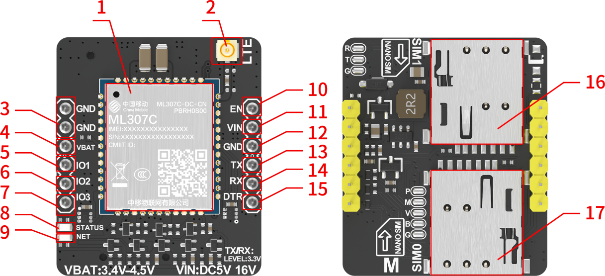

<figure>
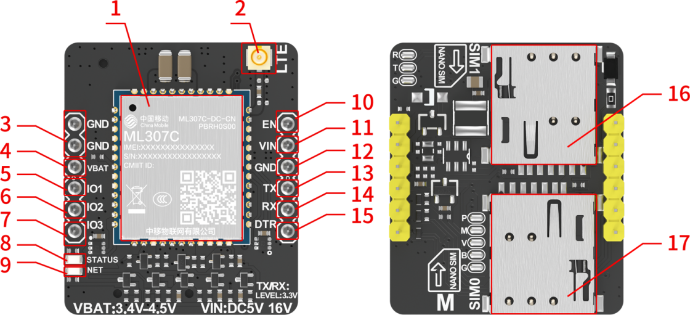
<figcaption>
<strong>图 3</strong><strong>：底板定义(CT11-B)</strong>
</figcaption>
</figure>

**图 4****：底板定义(CT11-C)**

4.  **底板版块定义说明**

<table style="width:99%;">
<caption><blockquote>

<strong>表 4</strong><strong>：底板版块定义说明表</strong>

</blockquote></caption>
<colgroup>
<col style="width: 12%" />
<col style="width: 16%" />
<col style="width: 33%" />
<col style="width: 37%" />
</colgroup>
<tbody>
<tr>
<td style="text-align: center;"><strong>版块序号</strong></td>
<td style="text-align: center;"><strong>版块名称</strong></td>
<td style="text-align: center;"><strong>版块功能</strong></td>
<td style="text-align: center;"><strong>说明</strong></td>
</tr>
<tr>
<td style="text-align: center;">1</td>
<td style="text-align: center;">4G模块</td>
<td style="text-align: center;">ML307C-DC-CN</td>
<td style="text-align: center;">-</td>
</tr>
<tr>
<td style="text-align: center;">2</td>
<td style="text-align: center;">LTE天线座子</td>
<td style="text-align: center;">LTE天线座子</td>
<td style="text-align: center;">-</td>
</tr>
<tr>
<td style="text-align: center;">3/12</td>
<td style="text-align: center;">GND</td>
<td style="text-align: center;">电源地</td>
<td style="text-align: center;">-</td>
</tr>
<tr>
<td style="text-align: center;">4</td>
<td style="text-align: center;">VBAT (CT11-C)</td>
<td style="text-align: center;">电源输入</td>
<td style="text-align: center;">工作范围：3.4~4.5V</td>
</tr>
<tr>
<td style="text-align: center;">5/6/7</td>
<td style="text-align: center;">IO拓展口</td>
<td style="text-align: center;">支持输入输出功能</td>
<td style="text-align: center;">输出电压：3.3V 
输入检查：高/低电平</td>
</tr>
<tr>
<td style="text-align: center;">8</td>
<td style="text-align: center;">工作状态灯</td>
<td style="text-align: center;">工作状态脚</td>
<td style="text-align: center;">常亮</td>
</tr>
<tr>
<td style="text-align: center;">9</td>
<td style="text-align: center;">网络状态灯</td>
<td style="text-align: center;">网络状态输出脚</td>
<td style="text-align: center;">
未连接网络：1000ms亮/1000ms熄灭

连接网络：3000ms亮/50ms熄灭
</td>
</tr>
<tr>
<td style="text-align: center;">10</td>
<td style="text-align: center;">EN</td>
<td style="text-align: center;">模块使能引脚</td>
<td style="text-align: center;">默认高电平（跟随输入电压）</td>
</tr>
<tr>
<td style="text-align: center;">11</td>
<td style="text-align: center;">VIN (CT11-B)</td>
<td style="text-align: center;">电源输入</td>
<td style="text-align: center;">工作范围：5~16V</td>
</tr>
<tr>
<td style="text-align: center;">13</td>
<td style="text-align: center;">TX</td>
<td style="text-align: center;">串口数据输出</td>
<td style="text-align: center;">3.3V</td>
</tr>
<tr>
<td style="text-align: center;">14</td>
<td style="text-align: center;">RX</td>
<td style="text-align: center;">串口数据输入</td>
<td style="text-align: center;">3.3V</td>
</tr>
<tr>
<td style="text-align: center;">15</td>
<td style="text-align: center;">DTR</td>
<td style="text-align: center;">模块休眠唤醒引脚</td>
<td style="text-align: center;">默认高电平(1.8V)</td>
</tr>
<tr>
<td style="text-align: center;">16/17</td>
<td style="text-align: center;">SIM卡槽</td>
<td style="text-align: center;">插卡上网</td>
<td style="text-align: center;">NANO SIM</td>
</tr>
</tbody>
</table>

5.  **电源设计**

    1.  **电源稳定性要求**

        VIN (CT11-B)为模块的主电源，其电压输入范围是5V到16V，推荐电压为5V。在网络较差环境下，天线会以最大功率发射，为了保证模块工作稳定，必须选择至少能够提供1.2A电流能力的电源。

        如下图采用DC/DC开关电源，辅以大容量电容，来保证射频PA（功放）的正常工作。该参考设计优点是可以提供比较好的瞬态电流响应，在弱信号下可满足模块工作要求，防止因供电不足而造成的掉网或者端口重启现象。

        

**图 5****：DC/DC供电参考电路( CT11-B模块 )**

VBAT (CT11-C)为模块的电池供电，其电压输入范围是3.4V到4.5V，推荐电压为3.8V。在网络较差环境下，天线会以最大功率发射，为了保证模块工作稳定，必须选择至少能够提供1.2A电流能力的电源。

如下图使用电池供电参考电路设计。

**图 6****：电池供电参考电路( CT11-C模块 )**

2.  **硬件使能**

    模块EN引脚为硬件使能输入端，低电平有效。拉低EN引脚持续1s后释放可使模块使能重启。EN信号对干扰比较敏感，因此建议在模块接口板上的走线应尽量的短，且需包地处理。

> 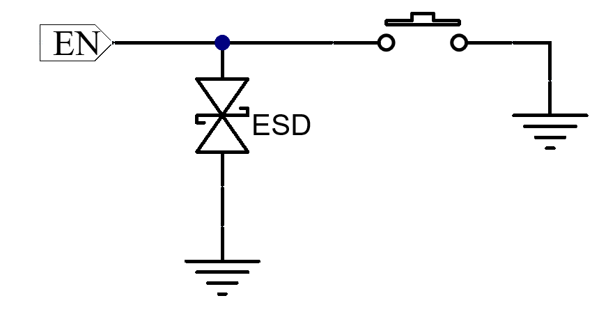

**图 7****：使能参考电路**

**备注**

<table style="width:99%;">
<colgroup>
<col style="width: 99%" />
</colgroup>
<tbody>
<tr>
<td><ol type="1">
<li>
CT11-C无此功能。
</li>
</ol>

2. 建议仅在紧急情况下，比如模块无响应时，再使用EN引脚。此外，模块关机状态下EN引脚是无效的。
</td>
</tr>
</tbody>
</table>

1.  **交互应用**

    1.  **网络指示引脚状态描述**

网络指示灯在不同网络状态下的逻辑电平变化如表所示。

|                     |              |
|:-------------------:|:------------:|
|     **LED状态**     | **模块状态** |
| 1000ms亮/1000ms熄灭 |  未连接网络  |
|  3000ms亮/50ms熄灭  |   连接网络   |
|        熄灭         |  低功耗状态  |

**表 5****：网络状态指示引脚的工作状态**

2.  **休眠管脚描述**

下表所示的接口主要是与应用处理器交互的接口，唤醒包括：唤醒模块。

|          |              |             |                    |
|:--------:|:------------:|:-----------:|:------------------:|
| **管脚** | **信号名称** | **I/O类型** |    **功能描述**    |
|          |     DTR      |     DIN     | 默认高电平（1.8V） |

**表 6****：休眠控制引脚的工作状态**

<table style="width:100%;">
<caption><blockquote>

<strong>表 7</strong><strong>：休眠功耗表</strong>

</blockquote></caption>
<colgroup>
<col style="width: 15%" />
<col style="width: 56%" />
<col style="width: 14%" />
<col style="width: 13%" />
</colgroup>
<tbody>
<tr>
<td style="text-align: center;"><strong>工作电压</strong></td>
<td style="text-align: center;"><strong>状态</strong></td>
<td style="text-align: center;"><strong>电流</strong></td>
<td style="text-align: center;"><strong>Unit</strong></td>
</tr>
<tr>
<td rowspan="2" style="text-align: center;">
CT11-B

5V
</td>
<td style="text-align: center;">模块正常供电，软件控制进入低功耗。（AT+SYSSLEEP=1）</td>
<td style="text-align: center;">2.23</td>
<td style="text-align: center;">mA</td>
</tr>
<tr>
<td style="text-align: center;">模块正常供电，硬件控制进入低功耗。（AT+CSCLK=1）</td>
<td style="text-align: center;">2.48</td>
<td style="text-align: center;">mA</td>
</tr>
<tr>
<td rowspan="2" style="text-align: center;">
CT11-C

3.8V
</td>
<td style="text-align: center;">模块正常供电，软件控制进入低功耗。（AT+SYSSLEEP=1）</td>
<td style="text-align: center;">1.88</td>
<td style="text-align: center;">mA</td>
</tr>
<tr>
<td style="text-align: center;">模块正常供电，硬件控制进入低功耗。（AT+CSCLK=1）</td>
<td style="text-align: center;">2.85</td>
<td style="text-align: center;">mA</td>
</tr>
</tbody>
</table>

**备注**

<table style="width:99%;">
<colgroup>
<col style="width: 99%" />
</colgroup>
<tbody>
<tr>
<td style="text-align: left;">
软件控制低功耗：

待机时，进入休眠模式，串口使用时会唤醒模块，串口使用结束后，重新进入休眠模式

硬件控制进入低功耗：

<ol type="1">
<li>
&lt;n&gt;=0，无法通过硬件控制模块休眠
</li>
<li>
&lt;n&gt;=1，DTR为低电平时，模块进入休眠模式；DTR为高电平时，模块退出休眠模式
</li>
<li>
设置硬件控制休眠时，需先发送指令AT+SYSSLEEP=0将模块设为不休眠模式，否则设置失败
</li>
<li>
待机时，进入休眠模式，串口使用时会唤醒模块，串口使用结束后，重新进入休眠模式
</li>
</ol></td>
</tr>
</tbody>
</table>

1.  **GPIO拓展口**

模组提供3路GPIO接口，可通过AT命令配置输入输出，不用则悬空。GPIO接口定义如下所示。

<table>
<caption><blockquote>

<strong>表 8</strong><strong>：GPIO接口描述</strong>

</blockquote></caption>
<colgroup>
<col style="width: 11%" />
<col style="width: 11%" />
<col style="width: 14%" />
<col style="width: 8%" />
<col style="width: 12%" />
<col style="width: 14%" />
<col style="width: 12%" />
<col style="width: 14%" />
</colgroup>
<tbody>
<tr>
<td style="text-align: center;"><strong>引脚名</strong></td>
<td style="text-align: center;"><strong>类型</strong></td>
<td style="text-align: center;"><strong>描述</strong></td>
<td style="text-align: center;"><strong>参数</strong></td>
<td style="text-align: center;"><strong>最小值（V）</strong></td>
<td style="text-align: center;"><strong>典型值（V）</strong></td>
<td style="text-align: center;"><strong>最大值（V）</strong></td>
<td style="text-align: center;"><strong>备注</strong></td>
</tr>
<tr>
<td rowspan="4" style="text-align: center;">IO1</td>
<td rowspan="4" style="text-align: center;">DIO</td>
<td rowspan="4" style="text-align: center;">通用输入输出</td>
<td style="text-align: center;">VIL</td>
<td style="text-align: center;">-</td>
<td style="text-align: center;">0</td>
<td style="text-align: center;">-</td>
<td rowspan="12" style="text-align: center;">不用则悬空</td>
</tr>
<tr>
<td style="text-align: center;">VIH</td>
<td style="text-align: center;">3.3</td>
<td style="text-align: center;">-</td>
<td style="text-align: center;">5</td>
</tr>
<tr>
<td style="text-align: center;">VOL</td>
<td style="text-align: center;">-</td>
<td style="text-align: center;">0</td>
<td style="text-align: center;">-</td>
</tr>
<tr>
<td style="text-align: center;">VOH</td>
<td style="text-align: center;">-</td>
<td style="text-align: center;">3.3</td>
<td style="text-align: center;">-</td>
</tr>
<tr>
<td rowspan="4" style="text-align: center;">IO2</td>
<td rowspan="4" style="text-align: center;">DIO</td>
<td rowspan="4" style="text-align: center;">通用输入输出</td>
<td style="text-align: center;">VIL</td>
<td style="text-align: center;">-</td>
<td style="text-align: center;">0</td>
<td style="text-align: center;">-</td>
</tr>
<tr>
<td style="text-align: center;">VIH</td>
<td style="text-align: center;">3.3</td>
<td style="text-align: center;">-</td>
<td style="text-align: center;">5</td>
</tr>
<tr>
<td style="text-align: center;">VOL</td>
<td style="text-align: center;">-</td>
<td style="text-align: center;">0</td>
<td style="text-align: center;">-</td>
</tr>
<tr>
<td style="text-align: center;">VOH</td>
<td style="text-align: center;">-</td>
<td style="text-align: center;">3.3</td>
<td style="text-align: center;">-</td>
</tr>
<tr>
<td rowspan="4" style="text-align: center;">IO3</td>
<td rowspan="4" style="text-align: center;">DIO</td>
<td rowspan="4" style="text-align: center;">通用输入输出</td>
<td style="text-align: center;">VIL</td>
<td style="text-align: center;">-</td>
<td style="text-align: center;">0</td>
<td style="text-align: center;">-</td>
</tr>
<tr>
<td style="text-align: center;">VIH</td>
<td style="text-align: center;">3.3</td>
<td style="text-align: center;">-</td>
<td style="text-align: center;">5</td>
</tr>
<tr>
<td style="text-align: center;">VOL</td>
<td style="text-align: center;">-</td>
<td style="text-align: center;">0</td>
<td style="text-align: center;">-</td>
</tr>
<tr>
<td style="text-align: center;">VOH</td>
<td style="text-align: center;">-</td>
<td style="text-align: center;">3.3</td>
<td style="text-align: center;">-</td>
</tr>
</tbody>
</table>

1.  **(U)SIM卡**

    1.  **管脚描述**

        模组提供2路USIM接口，符合ISO7816标准，SIM0支持1.8V/3V SIM卡，SIM1支持1.8V SIM卡,支持热插拔功能。

        (U)SIM卡接口信号如下表所示。

|          |              |                    |                                |
|:--------:|:-------------|:-------------------|:-------------------------------|
| **管脚** | **信号名称** | **信号定义**       | **信号说明**                   |
|    11    | USIM_DATA    | (U)SIM卡数据管脚   | (U)SIM卡数据信号，双向信号     |
|    12    | USIM_RST     | (U)SIM卡复位管脚   | (U)SIM卡复位信号，由模块输出   |
|    13    | USIM_CLK     | (U)SIM卡时钟管脚   | (U)SIM卡时钟信号，由模块输出   |
|    14    | USIM_VDD     | (U)SIM卡电源       | (U)SIM卡电源，由模块输出       |
|    79    | USIM_DET     | (U)SIM卡热插检测脚 | (U)SIM卡热插检测信号，输入信号 |

**表 9****：(U)SIM0卡信号定义及说明**

|          |              |                    |                                |
|:--------:|:-------------|:-------------------|:-------------------------------|
| **管脚** | **信号名称** | **信号定义**       | **信号说明**                   |
|    64    | USIM_DATA    | (U)SIM卡数据管脚   | (U)SIM卡数据信号，双向信号     |
|    63    | USIM_RST     | (U)SIM卡复位管脚   | (U)SIM卡复位信号，由模块输出   |
|    62    | USIM_CLK     | (U)SIM卡时钟管脚   | (U)SIM卡时钟信号，由模块输出   |
|    65    | USIM_VDD     | (U)SIM卡电源       | (U)SIM卡电源，由模块输出       |
|    77    | USIM_DET     | (U)SIM卡热插检测脚 | (U)SIM卡热插检测信号，输入信号 |

**表 10****：(U)SIM1卡信号定义及说明**

2.  **(U)SIM卡接口应用**

    (U)SIM 卡信号组，在靠近(U)SIM 卡卡座的线路上，设计时需要增加 ESD 保护器件。

    为了满足 3GPP TS 31.101 协议以及 EMC 认证要求，建议(U)SIM 卡座布置在靠近模块(U)SIM 卡接口的位置，避免因走线过长，导致波形严重变形，影响信号完整性。USIM_CLK 和 USIM_DATA 信号线走线必须包地保护。在 USIM_VDD 和 GND 之间并联一个 1uF 的电容，滤除射频信号的干扰。(U)SIM 外围电路如图所示。

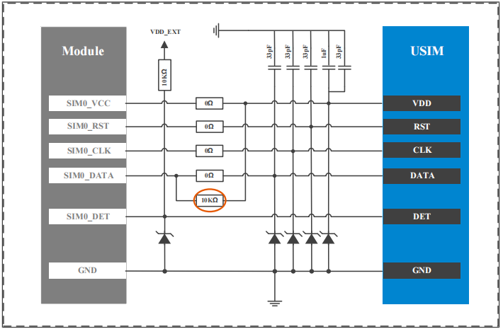

**图 8****：USIM接口示意图**

**备注**

<table style="width:99%;">
<colgroup>
<col style="width: 99%" />
</colgroup>
<tbody>
<tr>
<td style="text-align: left;">
ESD器件容值建议小于22pF。如果要使用(U)SIM卡热插拔功能需要选用带热插拔检测PIN的(U)SIM卡座。

强烈建议SIM_CLK、SIM_DATA和SIM_RST上并联33pF到地，防止射频信号干扰；

建议SIM卡座布局靠近模组SIM接口，走线过长会影响信号质量；

SIM_CLK和SIM_DATA走线包地；

SIM_VCC并联33pF和 1uF电容到地，如果SIM_VCC走线过长，必要的时候也可以使用4.7uF；

建议在SIM卡座附近设计ESD保护，TVS管选型Vrms为5V，寄生电容小于10pF，布局位置尽量靠近 卡座引脚；
</td>
</tr>
</tbody>
</table>

2.  **USB接口**

    模组支持USB2.0高速接口，兼容USB2.0/USB1.1协议，接口速率最大支持480Mbps，只支持从模式，USB输入/输出信号兼容USB2.0接口规范。该接口可用于AT命令传送、数据传输、软件调试和固件升级。 接口定义如下表所示。

|  |  |  |  |  |  |  |  |  |
|:--:|:--:|:--:|:--:|:--:|:--:|:--:|:--:|:--:|
| **引脚名** | **引脚号** | **类型** | **描述** | **参数** | **最小值（V）** | **典型值（V）** | **最大值（V）** | **备注** |
| USB_DP | 59 | AIO | USB差分数据D+ | \- | \- | \- | \- | \- |
| USB_DM | 60 | AIO | USB差分数据D- | \- | \- | \- | \- | \- |
| USB_VBUS | 61 | PI | USB电源输入 | \- | 3 | 5 | 5.25 | \- |

**表 11****：USB接口管脚定义**

USB接口参考设计如下图所示。

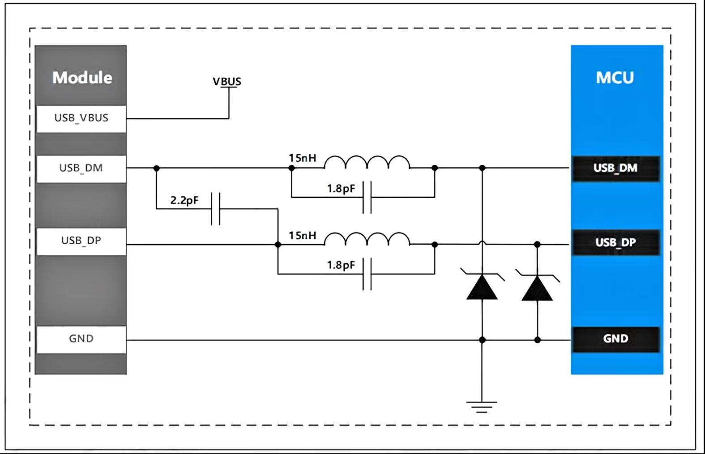

**图 9****：USB接口参考设计**

**备注：**

<table style="width:99%;">
<colgroup>
<col style="width: 99%" />
</colgroup>
<tbody>
<tr>
<td style="text-align: left;">
USB_DM和USB_DP布线在关键信号层，按照差分走线要求控制，需要上下左右包地保护，差分阻抗控制在90Ω，各层走线保持阻抗连续；USB差分信号线必须越短越好，并且尽可能远离高速信号和其他同频信号；

最大限度减少USB信号线上的过孔和转角以减少信号反射和阻抗变化；

USB信号线上避免留有短的分支线，以免产生反射影响信号质量；

为防止信号辐射，USB信号线必须远离板边缘；

推荐使用15nH电感和1.8pF电容并联滤出USB线上的共模干扰，2.2pF用于滤除USB线上的差模干扰。具体的值需要根据走线微调；USB数据线上的ESD防护器件的寄生电容不能超过2pF。

预留的USB接口可用于模块固件升级和抓取AP LOG以排查故障，强烈建议预留。
</td>
</tr>
</tbody>
</table>

3.  **UART接口**

    1.  **管脚描述**

        模组提供两路UART通信接口：主串口UART0、辅串口UART1（待开发）。

        主要有以下特性：

- UART0用作AT命令接口，支持4800bps / 9600bps / 19200bps / 38400bps / 57600bps / 115200bps / 230400bps/ 460800bps / 921600bps波特率。

- UART1可用于与串口设备通信；

  接口管脚定义如下表所示。

<table style="width:100%;">
<caption><blockquote>

<strong>表 12</strong><strong>：UART接口管脚定义</strong>

</blockquote></caption>
<colgroup>
<col style="width: 14%" />
<col style="width: 7%" />
<col style="width: 6%" />
<col style="width: 13%" />
<col style="width: 8%" />
<col style="width: 10%" />
<col style="width: 10%" />
<col style="width: 11%" />
<col style="width: 16%" />
</colgroup>
<tbody>
<tr>
<td style="text-align: center;"><strong>引脚名</strong></td>
<td style="text-align: center;"><strong>引脚号</strong></td>
<td style="text-align: center;"><strong>类型</strong></td>
<td style="text-align: center;"><strong>描述</strong></td>
<td style="text-align: center;"><strong>参数</strong></td>
<td style="text-align: center;"><strong>最小值（V）</strong></td>
<td style="text-align: center;"><strong>典型值（V）</strong></td>
<td style="text-align: center;"><strong>最大值（V）</strong></td>
<td style="text-align: center;"><strong>备注</strong></td>
</tr>
<tr>
<td rowspan="2" style="text-align: left;">UART0_RXD</td>
<td rowspan="2" style="text-align: center;">17</td>
<td rowspan="2" style="text-align: center;">DI</td>
<td rowspan="2" style="text-align: left;">接收数据</td>
<td style="text-align: center;">VIH</td>
<td style="text-align: center;">1.2</td>
<td style="text-align: center;">-</td>
<td style="text-align: center;">1.98</td>
<td rowspan="2" style="text-align: center;">-</td>
</tr>
<tr>
<td style="text-align: center;">VIL</td>
<td style="text-align: center;">-0.3</td>
<td style="text-align: center;">-</td>
<td style="text-align: center;">0.6</td>
</tr>
<tr>
<td rowspan="2" style="text-align: left;">UART0_TXD</td>
<td rowspan="2" style="text-align: center;">18</td>
<td rowspan="2" style="text-align: center;">DO</td>
<td rowspan="2" style="text-align: left;">发送数据</td>
<td style="text-align: center;">VOH</td>
<td style="text-align: center;">1.35</td>
<td style="text-align: center;">-</td>
<td style="text-align: center;">-</td>
<td rowspan="2" style="text-align: center;">-</td>
</tr>
<tr>
<td style="text-align: center;">VOL</td>
<td style="text-align: center;">0</td>
<td style="text-align: center;">-</td>
<td style="text-align: center;">0.45</td>
</tr>
<tr>
<td rowspan="2" style="text-align: left;">UART0_DTR</td>
<td rowspan="2" style="text-align: center;">19</td>
<td rowspan="2" style="text-align: center;">DI</td>
<td rowspan="2" style="text-align: left;">数据终端准备就绪</td>
<td style="text-align: center;">VIH</td>
<td style="text-align: center;">1.2</td>
<td style="text-align: center;">-</td>
<td style="text-align: center;">1.98</td>
<td rowspan="2" style="text-align: center;">
正常使用时请勿

输入0.9V电压。
</td>
</tr>
<tr>
<td style="text-align: center;">VIL</td>
<td style="text-align: center;">-0.3</td>
<td style="text-align: center;">-</td>
<td style="text-align: center;">0.6</td>
</tr>
<tr>
<td rowspan="2" style="text-align: left;">UART0_RI</td>
<td rowspan="2" style="text-align: center;">20</td>
<td rowspan="2" style="text-align: center;">DO</td>
<td rowspan="2" style="text-align: left;">串口振铃</td>
<td style="text-align: center;">VOH</td>
<td style="text-align: center;">1.35</td>
<td style="text-align: center;">-</td>
<td style="text-align: center;">-</td>
<td rowspan="2" style="text-align: center;">-</td>
</tr>
<tr>
<td style="text-align: center;">VOL</td>
<td style="text-align: center;">0</td>
<td style="text-align: center;">-</td>
<td style="text-align: center;">0.45</td>
</tr>
<tr>
<td rowspan="2" style="text-align: left;">UART0_DCD</td>
<td rowspan="2" style="text-align: center;">21</td>
<td rowspan="2" style="text-align: center;">DO</td>
<td rowspan="2" style="text-align: left;">载波检测</td>
<td style="text-align: center;">VOH</td>
<td style="text-align: center;">1.35</td>
<td style="text-align: center;">-</td>
<td style="text-align: center;">-</td>
<td rowspan="2" style="text-align: center;">-</td>
</tr>
<tr>
<td style="text-align: center;">VOL</td>
<td style="text-align: center;">0</td>
<td style="text-align: center;">-</td>
<td style="text-align: center;">0.45</td>
</tr>
<tr>
<td rowspan="2" style="text-align: left;">UART0_CTS</td>
<td rowspan="2" style="text-align: center;">22</td>
<td rowspan="2" style="text-align: center;">DO</td>
<td rowspan="2" style="text-align: left;">清除发送</td>
<td style="text-align: center;">VOH</td>
<td style="text-align: center;">1.35</td>
<td style="text-align: center;">-</td>
<td style="text-align: center;">-</td>
<td rowspan="2" style="text-align: center;">-</td>
</tr>
<tr>
<td style="text-align: center;">VOL</td>
<td style="text-align: center;">0</td>
<td style="text-align: center;">-</td>
<td style="text-align: center;">0.45</td>
</tr>
<tr>
<td rowspan="2" style="text-align: left;">UART0_RTS</td>
<td rowspan="2" style="text-align: center;">23</td>
<td rowspan="2" style="text-align: center;">DI</td>
<td rowspan="2" style="text-align: left;">请求发送</td>
<td style="text-align: center;">VIH</td>
<td style="text-align: center;">1.2</td>
<td style="text-align: center;">-</td>
<td style="text-align: center;">1.98</td>
<td rowspan="2" style="text-align: center;">-</td>
</tr>
<tr>
<td style="text-align: center;">VIL</td>
<td style="text-align: center;">-0.3</td>
<td style="text-align: center;">-</td>
<td style="text-align: center;">0.6</td>
</tr>
<tr>
<td rowspan="2" style="text-align: left;">UART1_RXD</td>
<td rowspan="2" style="text-align: center;">28</td>
<td rowspan="2" style="text-align: center;">DI</td>
<td rowspan="2" style="text-align: left;">接收数据</td>
<td style="text-align: center;">VIH</td>
<td style="text-align: center;">1.2</td>
<td style="text-align: center;">-</td>
<td style="text-align: center;">1.98</td>
<td rowspan="2" style="text-align: center;">-</td>
</tr>
<tr>
<td style="text-align: center;">VIL</td>
<td style="text-align: center;">-0.3</td>
<td style="text-align: center;">-</td>
<td style="text-align: center;">0.6</td>
</tr>
<tr>
<td rowspan="3" style="text-align: left;">UART1_TXD</td>
<td rowspan="3" style="text-align: center;">29</td>
<td rowspan="3" style="text-align: center;">DO</td>
<td rowspan="3" style="text-align: left;">发送数据</td>
<td style="text-align: center;">VOH</td>
<td style="text-align: center;">1.35</td>
<td style="text-align: center;">-</td>
<td style="text-align: center;">-</td>
<td rowspan="3" style="text-align: center;">-</td>
</tr>
<tr>
<td style="text-align: center;">VOL</td>
<td style="text-align: center;">0</td>
<td style="text-align: center;">-</td>
<td style="text-align: center;">0.45</td>
</tr>
<tr>
<td style="text-align: center;">VOL</td>
<td style="text-align: center;">0</td>
<td style="text-align: center;">-</td>
<td style="text-align: center;">0.45</td>
</tr>
</tbody>
</table>

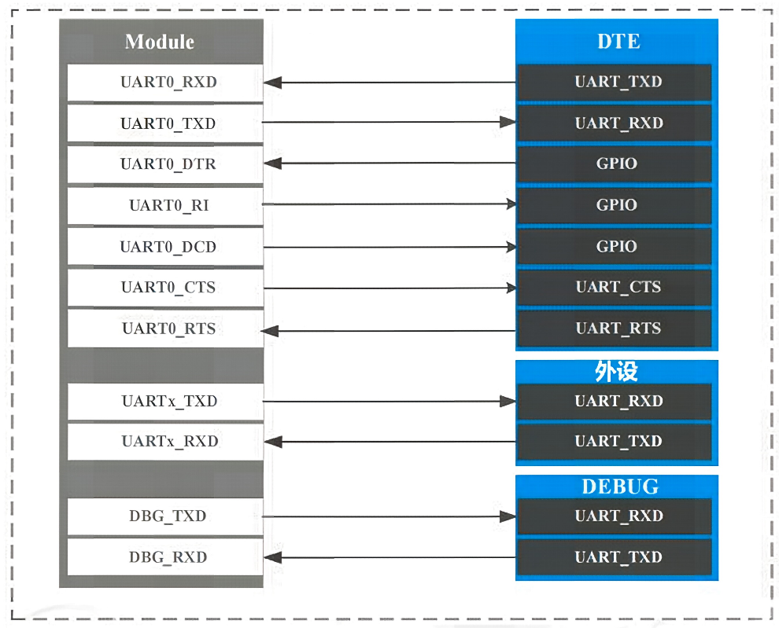

**图 10****：UART接口示意图**

1.  **UART接口应用**

    MAIN_UART如果使用在模块与应用处理器通讯的时候，且电平在1.8V匹配时，连接方式如图11和图12所示，可以采用完整的RS232模式，4线模式或者2线模式连接。由于该模块的串口电压域是1.8V，若客户的应用系统的电压域是3.3V，则需要在模块和客户应用系统的串口连接中增加电平转换芯片。建议参考使用德州仪器的TXB0108RGYR，如图13所示。

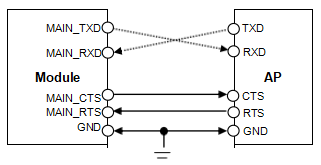

<figure>
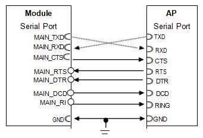
<figcaption>
<strong>图 11</strong><strong>：模块串口与AP应用处理器4线接法</strong>
</figcaption>
</figure>

<figure>
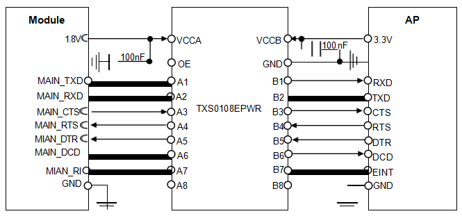
<figcaption>
<strong>图 12</strong><strong>：模块串口与 AP 应用处理器完整接法</strong>
</figcaption>
</figure>

**图 13****：电平转换参考电路**

1.  **RF接口**

    模组提供一路RF接口，主天线接口（ANT_MAIN）。

    模组支持WIFI_SCAN功能，WIFI功能同样使用此天线。

|  |  |  |  |  |  |  |  |  |
|:--:|:--:|:--:|:--:|:--:|:--:|:--:|:--:|:--:|
| **引脚名** | **引脚号** | **类型** | **描述** | **参数** | **最小值（V）** | **典型值（V）** | **最大值（V）** | **备注** |
| ANT_MAIN | 35 | RF | 射频主集天线 | \- | \- | \- | \- | \- |

**表 13****：RF接口描述**

RF接口参考电路如下图所示。

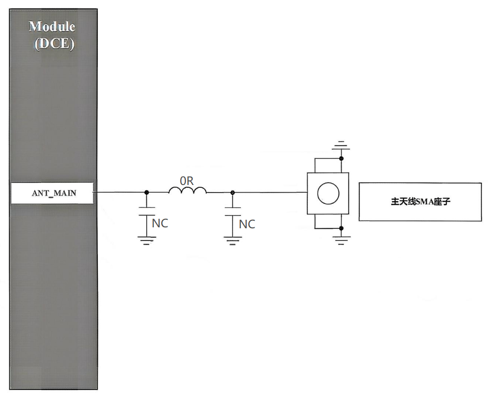

**图 14****：射频参考电路**

# 电气特性和可靠性

1.  **电气特性**

|              |            |          |            |          |
|:------------:|:----------:|:--------:|:----------:|:--------:|
|   **参数**   | **最小值** | **典型** | **最大值** | **单位** |
| VIN(CT11-B)  |     5      |    5     |     16     |    V     |
| VBAT(CT11-C) |    3.4     |   3.8    |    4.5     |    V     |

**表 14****：电气特性**

**备注**

|  |
|:---|
| 电压过低可能导致模块无法正常开机；电压过高或者开机过冲也可能对模块造成永久性损坏。 |

2.  **温度特性**

|              |            |          |            |          |
|:------------:|:----------:|:--------:|:----------:|:--------:|
|   **参数**   | **最小值** | **典型** | **最大值** | **单位** |
| 正常工作温度 |    -30     |   +25    |    +75     |    ºC    |
|   存储温度   |    -45     |    \-    |    +90     |    ºC    |

**表 15****：温度特性**

**备注**

|  |
|:---|
| 当工作温度超过模块工作温度时，模块的一些射频性能可能会恶化，也可能会引起关机、重启等故障。 |

3.  **电源功耗**

<table style="width:100%;">
<caption><blockquote>

<strong>表 16</strong><strong>：电源功耗表</strong>

</blockquote></caption>
<colgroup>
<col style="width: 15%" />
<col style="width: 56%" />
<col style="width: 14%" />
<col style="width: 13%" />
</colgroup>
<tbody>
<tr>
<td style="text-align: center;"><strong>工作电压</strong></td>
<td style="text-align: center;"><strong>状态</strong></td>
<td style="text-align: center;"><strong>电流</strong></td>
<td style="text-align: center;"><strong>Unit</strong></td>
</tr>
<tr>
<td rowspan="6" style="text-align: center;">
CT11-B

5V
</td>
<td style="text-align: center;">模块上电的瞬间功耗电流</td>
<td style="text-align: center;">0.57</td>
<td style="text-align: center;">A</td>
</tr>
<tr>
<td style="text-align: center;">模块正常供电，连接上网络，待机</td>
<td style="text-align: center;">10.25</td>
<td style="text-align: center;">mA</td>
</tr>
<tr>
<td style="text-align: center;">模块正常供电，连接上网络，连接上TCP服务器时</td>
<td style="text-align: center;">10.48</td>
<td style="text-align: center;">mA</td>
</tr>
<tr>
<td style="text-align: center;">模块正常供电，连接上网络，连接上MQTT服务器时</td>
<td style="text-align: center;">11.79</td>
<td style="text-align: center;">mA</td>
</tr>
<tr>
<td style="text-align: center;">指令控制进入休眠（AT+SYSSLEEP=1）</td>
<td style="text-align: center;">2.23</td>
<td style="text-align: center;">mA</td>
</tr>
<tr>
<td style="text-align: center;">硬件控制进入休眠（AT+CSCLK=1）</td>
<td style="text-align: center;">2.48</td>
<td style="text-align: center;">mA</td>
</tr>
<tr>
<td rowspan="6" style="text-align: center;">
CT11-C

3.8V
</td>
<td style="text-align: center;">模块上电的瞬间功耗电流</td>
<td style="text-align: center;">0.67</td>
<td style="text-align: center;">A</td>
</tr>
<tr>
<td style="text-align: center;">模块正常供电，连接上网络，待机</td>
<td style="text-align: center;">11.39</td>
<td style="text-align: center;">mA</td>
</tr>
<tr>
<td style="text-align: center;">模块正常供电，连接上网络，连接上TCP服务器时</td>
<td style="text-align: center;">11.55</td>
<td style="text-align: center;">mA</td>
</tr>
<tr>
<td style="text-align: center;">模块正常供电，连接上网络，连接上MQTT服务器时</td>
<td style="text-align: center;">12.55</td>
<td style="text-align: center;">mA</td>
</tr>
<tr>
<td style="text-align: center;">指令控制进入休眠（AT+SYSSLEEP=1）</td>
<td style="text-align: center;">1.88</td>
<td style="text-align: center;">mA</td>
</tr>
<tr>
<td style="text-align: center;">硬件控制进入休眠（AT+CSCLK=1）</td>
<td style="text-align: center;">2.85</td>
<td style="text-align: center;">mA</td>
</tr>
</tbody>
</table>

**备注**

|                          |
|:-------------------------|
| 功耗为实验室仪表测得值。 |

4.  **静电防护**

    在模块应用中，静电可能会对模块造成一定的损坏,因此在生产，装配和操作模块时必须注意静电防护。模块测试的性能参数如下表：

    ESD性能参数（温度：25℃，湿度：45%）

|              |              |              |          |
|:------------:|:------------:|:------------:|:--------:|
| **测试接口** | **接触放电** | **空气放电** | **单位** |
|  VIN 和 GND  |      +5      |     +10      |    kV    |
|  主天线接口  |      +5      |     +10      |    kV    |

**表 17****：模块引脚的ESD耐受电压情况表**

# 射频功能介绍

1.  **4G频段特性**

- 支持 FDD/TDD LTE Rel-13 Cat.1bis；

- 支持 LTE 频段 B1/B3/B5/B8/B34/B38/B39/B40/B41。

本产品的收发射机的工作频段范围如下表所示。

|                |                 |                 |
|:--------------:|:---------------:|:---------------:|
|    **频段**    |  **发射频率**   |  **接收频率**   |
| FDD LTE Band1  | 1920MHz~1980MHz | 2110MHz~2170MHz |
| FDD LTE Band3  | 1710MHz~1785MHz | 1805MHz~1880MHz |
| FDD LTE Band5  |  824MHz~849MHz  |  869MHz~894MHz  |
| FDD LTE Band8  |  880MHz~915MHz  |  925MHz~960MHz  |
| TDD LTE Band34 | 2010MHz~2025MHz | 2010MHz~2025MHz |
| TDD LTE Band38 | 2570MHz~2620MHz | 2570MHz~2620MHz |
| TDD LTE Band39 | 1880MHz~1920MHz | 1880MHz~1920MHz |
| TDD LTE Band40 | 2300MHz~2400MHz | 2300MHz~2400MHz |
| TDD LTE Band41 | 2535MHz~2675MHz | 2535MHz~2675MHz |

**表 18****：射频频段**

|                |              |              |
|:--------------:|:------------:|:------------:|
|    **频段**    | **最大功率** | **最小功率** |
| FDD LTE Band1  |  23dBm±2dB   |   \<-39dBm   |
| FDD LTE Band3  |  23dBm±2dB   |   \<-39dBm   |
| FDD LTE Band5  |  23dBm±2dB   |   \<-39dBm   |
| FDD LTE Band8  |  23dBm±2dB   |   \<-39dBm   |
| TDD LTE Band34 |  23dBm±2dB   |   \<-39dBm   |
| TDD LTE Band38 |  23dBm±2dB   |   \<-39dBm   |
| TDD LTE Band39 |  23dBm±2dB   |   \<-39dBm   |
| TDD LTE Band40 |  23dBm±2dB   |   \<-39dBm   |
| TDD LTE Band41 |  23dBm±2dB   |   \<-39dBm   |

**表 19****：发射功率**

<table style="width:99%;">
<caption><blockquote>

<strong>表 20</strong><strong>：接收灵敏度</strong>

</blockquote></caption>
<colgroup>
<col style="width: 24%" />
<col style="width: 15%" />
<col style="width: 16%" />
<col style="width: 42%" />
</colgroup>
<tbody>
<tr>
<td rowspan="2" style="text-align: center;"><strong>频段</strong></td>
<td colspan="2" style="text-align: center;"><strong>主集测试值（单位：dBm）</strong></td>
<td rowspan="2" style="text-align: center;"><strong>备注</strong></td>
</tr>
<tr>
<td style="text-align: center;"><strong>典型值</strong></td>
<td style="text-align: center;"><strong>极差值</strong></td>
</tr>
<tr>
<td style="text-align: center;">LTE Band1</td>
<td style="text-align: center;">-100</td>
<td style="text-align: center;">-98.3</td>
<td style="text-align: center;">FDD QPSK throughput &gt; 95%，10M</td>
</tr>
<tr>
<td style="text-align: center;">LTE Band3</td>
<td style="text-align: center;">-100.5</td>
<td style="text-align: center;">-95.3</td>
<td style="text-align: center;">FDD QPSK throughput &gt; 95%，10M</td>
</tr>
<tr>
<td style="text-align: center;">LTE Band5</td>
<td style="text-align: center;">-100</td>
<td style="text-align: center;">-96.3</td>
<td style="text-align: center;">FDD QPSK throughput &gt; 95%，10M</td>
</tr>
<tr>
<td style="text-align: center;">LTE Band8</td>
<td style="text-align: center;">-100.5</td>
<td style="text-align: center;">-95.3</td>
<td style="text-align: center;">FDD QPSK throughput &gt; 95%，10M</td>
</tr>
<tr>
<td style="text-align: center;">LTE Band34</td>
<td style="text-align: center;">-100.6</td>
<td style="text-align: center;">-98.3</td>
<td style="text-align: center;">TDD QPSK throughput &gt; 95%，10M</td>
</tr>
<tr>
<td style="text-align: center;">LTE Band38</td>
<td style="text-align: center;">-101.3</td>
<td style="text-align: center;">-98.3</td>
<td style="text-align: center;">TDD QPSK throughput &gt; 95%，10M</td>
</tr>
<tr>
<td style="text-align: center;">LTE Band39</td>
<td style="text-align: center;">-101</td>
<td style="text-align: center;">-98.3</td>
<td style="text-align: center;">TDD QPSK throughput &gt; 95%，10M</td>
</tr>
<tr>
<td style="text-align: center;">LTE Band40</td>
<td style="text-align: center;">-101.5</td>
<td style="text-align: center;">-98.3</td>
<td style="text-align: center;">TDD QPSK throughput &gt; 95%，10M</td>
</tr>
<tr>
<td style="text-align: center;">LTE Band41</td>
<td style="text-align: center;">-101</td>
<td style="text-align: center;">-96.3</td>
<td style="text-align: center;">TDD QPSK throughput &gt; 95%，10M</td>
</tr>
</tbody>
</table>

1.  **天线电路设计**

本产品射频天线的接入部分采用PAD焊盘形式。模块天线焊盘与客户母板天线接口之间需要通过焊盘焊接并通过微带线或带状线来连接。其中微带线或带状线按特性阻抗按50欧姆设计，走线长度小于10mm，同时预留Π型匹配电路。

产品天线外围电路设计时建议射频电路的Layout方案：射频线走第一层，参考二层地平面。用户在设计PCB走线时需要注意：射频路径需要完整参考地平面。

**图 15****：天线匹配网络**

图中R1,C1,C2和R2组成天线匹配网络用作天线调试，默认R1,R2贴0欧姆电阻 C1,C2 空贴，待天线厂调试天线后确定值。

图中RF connector留作测试传导测试使用（如认证 CE,FCC 等），需尽量靠近模块摆放，从模块焊盘至天线馈点的射频路径需保持50欧姆阻抗控制。

在 layout 设计中，天线射频传输线必须要保证特性阻抗=50欧姆，这个特性阻抗由基板板材，走线宽度和离地平面距离共同决定。下图所示的是layout中天线路径的参考设计。

**图 16****：天线路径参考设计**

2.  **天线接口**

模块安装有射频连接器（IPEX），便于4G外置天线连接，将 IPEX 天线头插入模块的LTE天线座(模块顶部天线接口)

3.  **4G-FPC天线基础参数**

|              |                |              |                      |
|:------------:|:--------------:|:------------:|:--------------------:|
| **参数名称** |    **详情**    | **参数名称** |       **详情**       |
|   天线形式   | 4G-FPC天线-LTE |   工作频率   | 700-960/1700-2700MHZ |
|     增益     |      5DBi      |   天线效率   |        35~80%        |
|  电压驻波比  |     \<1.8      |   馈电阻抗   |        50ohm         |
|   天线尺寸   |    40\*15mm    |   天线接口   |        IPEX-1        |

**表 21****：基础参数表**

# 机械尺寸及标签

本节描述了模块的机械尺寸，所有的尺寸单位为毫米；所有未标注公差的尺寸，公差为±0.3 mm

1.  **模块结构尺寸**

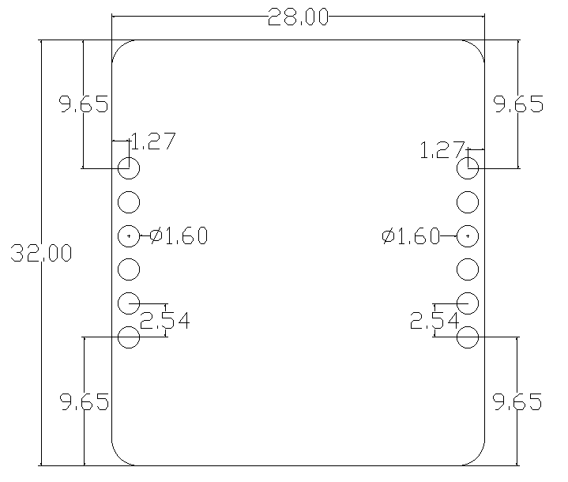

**图 17****：模块尺寸**

2.  **产品标签**

    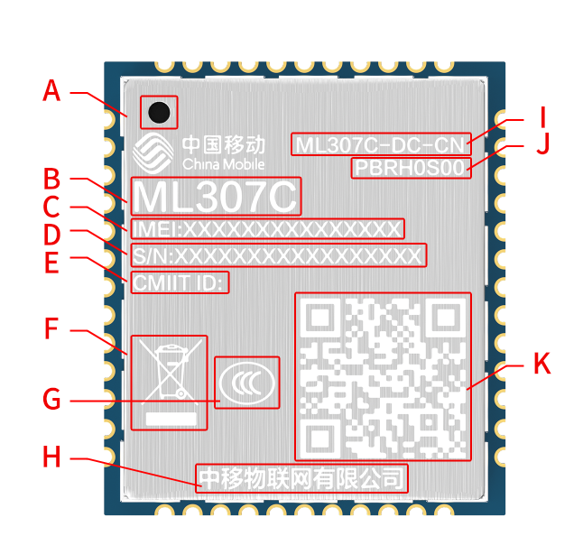

**图 18****：DX-CT11-B&C系列标签**

|          |                                     |
|:--------:|:-----------------------------------:|
| **编码** |              **描述**               |
|    A     |               Pin1脚                |
|    B     |              模块名字               |
|    C     |             IMEI number             |
|    D     |              SN number              |
|    E     |           CMIIT ID number           |
|    F     |                WEEE                 |
|    G     |               3C认证                |
|    H     |              公司Logo               |
|    I     |              模块型号               |
|    J     |      模块的成品料号和模块配置       |
|    K     | 二维码---包括IMEI number和SN number |

**表 22****：标签描述**

# 储存、生产

1.  **存储条件**

    模块的湿度敏感等级为 3（MSL 3），其存储需遵循如下条件：

    1\. 推荐存储条件：温度23±5°C，且相对湿度为35~60%。

    2\. 在推荐存储条件下，模块可在真空密封袋中存放12个月。

    3\. 在温度为23±5°C、相对湿度低于60%的车间条件下，模块拆封后的车间寿命为168小时。在此条件下，可直接对模块进行回流生产或其他高温操作。否则，需要将模块存储于相对湿度小于10 %的环境中（例如，防潮柜）以保持模块的干燥。

    4\. 若模块处于如下条件，需要对模块进行预烘烤处理以防止模块吸湿受潮再高温焊接后出现的 PCB 起泡、裂痕和分层：

- 存储温湿度不符合推荐存储条件；

- 模块拆封后未能根据以上第3条完成生产或存放；

- 真空包装漏气、物料散装；

- 模块返修前；

# 安全警告和注意事项

为保证模块功能更合理的得到利用，请注意在模块二次开发、使用及返修等过程中，需要遵照本章节的所有安全警告和注意事项。最终的产品集成方必须将如下的安全信息传递给用户、操作人员或集成产品的使用手册中。

|  |  |
|:---|:---|
|  | 在使用包括模块在内的射频设备时，可能会对一些屏蔽性能不好的电子设备造成干扰，请尽可能在远离普通电话、电视、收音机和办公自动化的地方使用，以免这些设备和模块相互影响。 |
|  | 登机前请关闭移动终端设备，或改为飞行模式。移动终端的无线功能在飞机上禁止开启使用，以防止对飞机通讯系统的干扰。忽略该提示项可能会导致飞行安全，甚至触犯法律。 |
|  | 当在医院或健康看护场所时，请注意是否有移动终端设备使用限制。射频干扰可能会导致医疗设备运行失常，可能需要关闭移动终端设备。例如助听器、植入耳蜗和心脏起搏器等，请先向该设备生产厂家咨询了解。 |
|  | 移动终端设备并不保障在任何情况下都能进行有效连接，例如在移动终端设备没有话费或(U)SIM无效时。当在紧急情况下遇见以上情况，请记住使用紧急呼叫，同时保证您的设备开机并且处于信号强度足够的区域。 |
|  | 请将移动终端设备远离易燃气体。当靠近加油站、油库、化工厂或爆炸作业场所时，请关闭移动终端设备。在任何有潜在爆炸危险的场所操作电子设备都有安全隐患。 |
|  | 本产品没有防水性能，请避免各种液体进入模块内部，请勿在浴室等高湿度的地方使用，以免造成物理性能下降、绝缘电阻降低、机械强度下降、以及产生腐蚀、生锈等损坏。 |
|  | 非专业人员，请勿自行拆开模块，以免造成人员及设备损伤。请参照本产品的使用说明，联系相关服务人员进行保养和维修。 |
|  | 清洁模块时，请先关机，清洁人员需配备防静电设备，例如穿戴防静电服、防静电手套等，并使用干净的防静电布，以免造成元件被击穿损坏。 |

用户或产品集成方有责任遵循国家关于无线通信模块及设备的相关规定和具体的使用环境法规， 我司不承担因产品集成方或用户未能遵循这些规定导致的相关损失。
