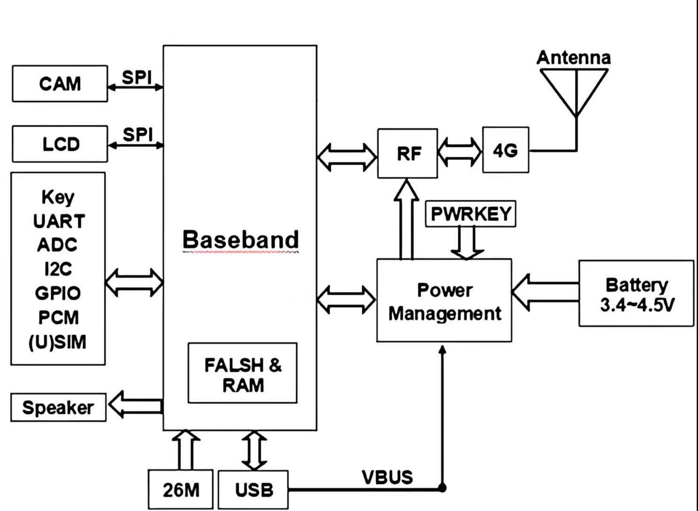

**DX-CT12-B&C**

**串口应用指导**

> 版本：2.1
>
> 日期：2026-03-24

**更新记录**

|          |            |                  |          |
|:--------:|:----------:|:----------------:|:--------:|
| **版本** |  **日期**  |     **说明**     | **作者** |
|   V1.0   | 2025/08/20 |     初始版本     |   YXR    |
|   V1.1   | 2025/10/12 |     增加示例     |   YXR    |
|   V2.0   | 2025/12/16 | 增加AT指令一览表 |   YXR    |
|   V2.1   | 2026/03/24 | 增加通讯操作示例 |   YXR    |

**联系我们**

**深圳大夏龙雀科技有限公司**

邮箱：sales@szdx-smart.com

电话：0755-2997 8125

网址：[www.szdx-smart.com](http://www.szdx-smart.com)

地址：深圳市宝安区航城街道航空路庄边工业园厂房A栋4层

**目录**

[1. 引言 [- 5 -](#引言)](#引言)

[1.1. 串口基本参数 [- 5 -](#_Toc22859)](#_Toc22859)

[2. PC端测试工具 [- 6 -](#pc端测试工具)](#pc端测试工具)

[2.1. 电脑端测试软件 [- 6 -](#_Toc29807)](#_Toc29807)

[3. 串口使用 [- 7 -](#串口使用)](#串口使用)

[3.1. 使用串口读写AT命令 [- 7 -](#_Toc29096)](#_Toc29096)

[3.1.1. 模块测试最小系统 [- 7 -](#_Toc23463)](#_Toc23463)

[4. 通讯操作示例 [- 8 -](#通讯操作示例)](#通讯操作示例)

[4.1. 正常模式示例 [- 8 -](#_Toc2200)](#_Toc2200)

[4.1.1. TCP/UDP：AT透传 [- 8 -](#_Toc2526)](#_Toc2526)

[4.1.2. TCP/UDP：直接透传 [- 8 -](#_Toc16475)](#_Toc16475)

[4.1.3. MQTT [- 8 -](#_Toc12450)](#_Toc12450)

[4.2. 简易配对：TCP/MQTT透传模式示例 [- 9 -](#_Toc19932)](#_Toc19932)

[4.2.1. TCP透传模式 [- 9 -](#_Toc31454)](#_Toc31454)

[4.2.2. MQTT透传模式：单发通讯 [- 9 -](#_Toc11189)](#_Toc11189)

[4.2.3. MQTT透传模式：连发通讯 [- 9 -](#_Toc16315)](#_Toc16315)

[5. 相关AT命令详解 [- 11 -](#相关at命令详解)](#相关at命令详解)

[5.1. 命令格式说明 [- 11 -](#_Toc8323)](#_Toc8323)

[5.2. 回应格式说明 [- 11 -](#_Toc27749)](#_Toc27749)

[5.3. AT命令一览表 [- 11 -](#_Toc27419)](#_Toc27419)

[6. AT命令详解 [- 14 -](#at命令详解)](#at命令详解)

[6.1. 基础指令 [- 14 -](#_Toc22890)](#_Toc22890)

[6.1.1. 测试指令 [- 14 -](#_Toc20210)](#_Toc20210)

[6.1.2. 查询软件版本 [- 14 -](#_Toc28427)](#_Toc28427)

[6.1.3. 查询国际移动设备识别码 [- 14 -](#_Toc13189)](#_Toc13189)

[6.1.4. 设置指令回显 [- 15 -](#_Toc3323)](#_Toc3323)

[6.1.5. 重启模块 [- 15 -](#_Toc3160)](#_Toc3160)

[6.1.6. 恢复出厂设置 [- 15 -](#_Toc10673)](#_Toc10673)

[6.1.7. 查询SIM卡ICCID [- 16 -](#_Toc839)](#_Toc839)

[6.1.8. 查询/设置串口波特率 [- 16 -](#_Toc5591)](#_Toc5591)

[6.1.9. 查询/设置SIM双卡切换 [- 17 -](#_Toc9121)](#_Toc9121)

[6.1.10. 空中升级 [- 18 -](#_Toc32646)](#_Toc32646)

[6.1.11. 查询/设置GPIO [- 18 -](#_Toc6911)](#_Toc6911)

[6.2. 网络服务指令 [- 19 -](#_Toc15950)](#_Toc15950)

[6.2.1. 查询/设置网络注册状态 [- 19 -](#_Toc10655)](#_Toc10655)

[6.2.2. 查询信号质量 [- 20 -](#_Toc1182)](#_Toc1182)

[6.2.3. 同步服务器时间 [- 21 -](#_Toc1723)](#_Toc1723)

[6.2.4. 查询时间 [- 21 -](#_Toc18758)](#_Toc18758)

[6.2.5. Ping目标地址 [- 22 -](#_Toc24693)](#_Toc24693)

[6.2.6. 基站定位 [- 23 -](#_Toc4644)](#_Toc4644)

[6.3. 功耗指令 [- 23 -](#_Toc7251)](#_Toc7251)

[6.3.1. 指令控制休眠设置 [- 23 -](#_Toc21980)](#_Toc21980)

[6.3.2. 硬件控制休眠设置 [- 24 -](#_Toc25690)](#_Toc25690)

[6.4. TCP/UDP相关指令 [- 25 -](#_Toc20484)](#_Toc20484)

[6.4.1. 建立TCP/UDP连接 [- 25 -](#_Toc11852)](#_Toc11852)

[6.4.2. TCP/UDP发送数据 [- 25 -](#_Toc16337)](#_Toc16337)

[6.4.3. 进入TCP/UDP透传模式 [- 26 -](#_Toc5529)](#_Toc5529)

[6.4.4. 退出TCP/UDP透传模式 [- 26 -](#_Toc1767)](#_Toc1767)

[6.4.5. 关闭TCP/UDP连接 [- 27 -](#_Toc26108)](#_Toc26108)

[6.4.6. 查询TCP/UDP状态 [- 27 -](#_Toc20211)](#_Toc20211)

[6.5. 简易配对相关指令 [- 28 -](#_Toc25564)](#_Toc25564)

[6.5.1. 查询/设置简易配对模式 [- 28 -](#_Toc20068)](#_Toc20068)

[6.5.2. 查询/设置保存客户端配置数据 [- 29 -](#_Toc2287)](#_Toc2287)

[6.6. MQTT相关命令 [- 29 -](#_Toc18713)](#_Toc18713)

[6.6.1. 查询/配置MQTT客户端信息 [- 29 -](#_Toc24235)](#_Toc24235)

[6.6.2. 查询/配置MQTT服务器信息 [- 30 -](#_Toc27508)](#_Toc27508)

[6.6.3. 查询/配置MQTT会话心跳 [- 31 -](#_Toc11658)](#_Toc11658)

[6.6.4. 订阅主题 [- 32 -](#_Toc31526)](#_Toc31526)

[6.6.5. 发布消息 [- 32 -](#_Toc12080)](#_Toc12080)

[6.6.6. 取消订阅 [- 33 -](#_Toc29479)](#_Toc29479)

[6.6.7. 查询MQTT连接状态 [- 33 -](#_Toc8942)](#_Toc8942)

[6.6.8. 断开MQTT连接 [- 34 -](#_Toc3266)](#_Toc3266)

[7. 错误码一览表 [- 35 -](#错误码一览表)](#错误码一览表)

**图片索引**

[图 1 ：电脑端串口软件图 [- 6 -](#_Toc27674)](#_Toc27674)

[图 2 ：模块最小系统图 [- 7 -](#_Toc30552)](#_Toc30552)

# 引言

DX-CT12-B&C是深圳大夏龙雀科技有限公司的一款4G模块，是为IoT行业研发的一款CAT1通信模组，采用LCC+LGA封装，尺寸为17.7mm×15.8mm×2.3mm。具备多种接口和丰富协议，多版本USB驱动，应用简单便捷。能很好满足客户对高性价比、低功耗的应用要求。该模组主要应用于POS、POC、共享经济、追踪器、IPC、智慧城市和智慧农业等场景。

1.  **串口基本参数**

- 模块串口默认参数：115200bps/8/n/1（波特率/数据位/无校验/停止位）

- 模块的三种模式：AT指令模式、数据传输模式、休眠模式

- 默认模式：AT指令模式

# PC端测试工具

1.  **电脑端测试软件**

> 电脑端测试软件请在资料包中下载安装sscom5.13.1电脑串口软件进行测试，串口软件界面如下图：

<figure>

<figcaption>
<strong>图 1</strong><strong>：电脑端串口软件图</strong>
</figcaption>
</figure>

# 串口使用

1.  **使用串口读写AT命令**

    1.  **模块测试最小系统**

**图 2****：模块最小系统图**

# **通讯操作示例**

1.  **正常模式示例**

    正常模式下，TCP、UDP分别有两种数据传输模式：AT透传模式，直接透传模式。通过指令AT+QIOPEN可设置模块模式，两种模式具体区别可参考6.4.1备注

    1.  **TCP/UDP：AT透传**

<!-- -->

1.  建立TCP/UDP连接：AT+QIOPEN="TCP","112.125.89.8",33124,0,0

    注：模块返回CONNECT，ID\<link_num\>，即连接成功；

    该指令可重复发送，创建多个连接；

    建立UDP连接时，将指令中的TCP替换为UDP即可；

2.  TCP/UDP发送数据：AT+QISEND=3,10

    注：返回提示符\>，即可发送数据；

    创建多个连接时，可根据连接标识\<link_num\>向指定连接发送数据；

    数据长度需与该指令\<length\>参数一致，结束符亦计入长度，即数据结尾无回车换行；

3.  关闭TCP/UDP连接：AT+QICLOSE=3

    1.  **TCP/UDP：直接透传**

<!-- -->

1.  TCP/UDP连接：AT+QIOPEN="TCP","112.125.89.8",33124,0,1

    注：模块返回CONNECT，ID\<link_num\>，即连接成功；

    该指令无法创建多个连接；

    建立UDP连接时，将指令中的TCP替换为UDP即可；

2.  发送数据：连接成功后，模块进入透传模式，可直接发送数据

    注：取消回车换行，发送+++，模块退出透传模式，此时模块可以正常响应指令

    取消回车换行，发送ATO，模块重新进入透传模式

3.  关闭TCP/UDP连接：AT+QICLOSE=3

    1.  **MQTT**

<!-- -->

1.  配置MQTT客户端信息：AT+QMTCFG="0566542kkscmkks1"

    注：如需配置用户名密码等参数，参考该手册6.6.1部分

2.  配置MQTT服务器信息：AT+QMTCONNCFG="broker.emqx.io",1883,0

    注：配置完成后模块自动连接服务器；

3.  订阅主题：AT+QMTSUB="TTT",0

4.  发布消息：AT+QMTPUB="TTT",0,0,"12345678"

5.  发布长消息：AT+QMTPUB="TTT",0,0,1

    注：消息长度任意设置；

    返回提示符\>，即可发送数据，该模式下可持续发送数据；

    退出透传模式：发送+++，该指令结尾无结束符，即指令结尾无回车换行；

    进入透传模式：发送ATO，该指令结尾无结束符，即指令结尾无回车换行；

6.  取消订阅：AT+QMTUNSUB="TTT"

7.  断开MQTT连接：AT+QMTDISC

    1.  **简易配对：TCP/MQTT透传模式示例**

        TCP透传模式/MQTT透传模式：通过指令AT+SIMPLEMODE可设置此模式，该模式下断电可保存通讯相关指令，两种模式具体区别可参考6.5.1备注

        1.  **TCP透传模式**

<!-- -->

1.  将模块设置为TCP透传模式：AT+SIMPLEMODE=1,0

    注：设置完成后，模块自动重启，未配置客户端信息时，模块持续输出ERROR=104

2.  设置TCP客户端信息：AT+SIMPLECLIENT="TCP","8.111.222.111",1234,0,0

    注：模块返回CONNECT，ID\<link_num\>，即连接成功；

3.  设置发送数据长度：AT+QISEND=3,10

    注：返回提示符\>，即可发送数据；

    数据长度需与该指令\<length\>参数一致，结束符亦计入长度，即数据结尾无回车换行；

4.  关闭TCP连接：AT+QICLOSE=3

    1.  **MQTT透传模式：单发通讯**

<!-- -->

1.  将模块设置为MQTT单发通讯透传模式：AT+SIMPLEMODE=2,1

    注：设置完成后，模块自动重启

2.  配置MQTT客户端参数：AT+QMTCFG="CT11","MQTT1","123456",0,1,QQQ,123456

3.  配置服务器信息：AT+QMTCONNCFG="broker.emqx.io",1883,1

4.  订阅主题：AT+QMTSUB="TTT",0

5.  发布消息：AT+QMTPUB="TTT",0,0,"1234567890"

6.  断开MQTT连接：AT+QMTDISC

    1.  **MQTT透传模式：连发通讯**

<!-- -->

1.  将模块设置为MQTT单发通讯透传模式：AT+SIMPLEMODE=2,2

    注：设置完成后，模块自动重启

2.  配置MQTT客户端参数：AT+QMTCFG="CT11","MQTT1","123456",0,1,QQQ,123456

3.  配置服务器信息：AT+QMTCONNCFG="broker.emqx.io",1883,1

4.  订阅主题：AT+QMTSUB="TTT",0

5.  发布长消息：AT+QMTPUBEX="TTT",0,0,1

    注：消息长度任意设置；

    返回提示符\>，即可发送数据，该模式下可持续发送数据；

    退出透传模式：发送+++，该指令结尾无结束符，即指令结尾无回车换行

    进入透传模式：发送ATO，该指令结尾无结束符，即指令结尾无回车换行

6.  断开MQTT连接：AT+QMTDISC

# 相关AT命令详解

1.   **命令格式说明**

**AT+Command=\<param1，param2，param3\>\[,\<param\>\] \<CR\>\<LF\>**

- 所有的指令以AT开头，\<CR\>\<LF\>结束，在本文档中表现命令和响应的表格中，省略了 \<CR\>\<LF\>，仅显示命令和响应。

- 所有AT命令字符都为大写。

- \<\>内为可选内容，如果命令中有多个参数，以逗号“，”隔开，实际命令中不包含尖括号。

- \<CR\>为回车字符\r，十六进制为0X0D。

- \<LF\>为换行字符\n，十六进制为0X0A。

- 指令执行成功，返回相应命令以OK结束，失败返回ERROR或者+CME ERROR:\<err\>，“\<err\>”内容为对应错误码（错误码请参考5.10）。

- \[,\<param\>\]，中括号\[\]为可选参数，可根据需求选择发送。

  1.  **回应格式说明**

**+Indication:\<param1，param2，param3\>\<CR\>\<LF\>**

- 回应指令以加号“+”开头，\<CR\>\<LF\>结束

- “ : ”后面为回应参数

- 如果回应参数中有多个参数，会以逗号“，”隔开

  1.  **AT命令一览表**

<table style="width:99%;">
<colgroup>
<col style="width: 25%" />
<col style="width: 35%" />
<col style="width: 37%" />
</colgroup>
<tbody>
<tr>
<td style="text-align: center;"><strong>指令</strong></td>
<td style="text-align: center;"><strong>功能</strong></td>
<td style="text-align: center;"><strong>说明</strong></td>
</tr>
<tr>
<td colspan="3" style="text-align: center;"><strong>基础指令</strong></td>
</tr>
<tr>
<td style="text-align: center;">AT</td>
<td style="text-align: center;">测试指令</td>
<td style="text-align: center;">用于测试串口</td>
</tr>
<tr>
<td style="text-align: center;">AT+GMR</td>
<td style="text-align: center;">查看版本信息</td>
<td style="text-align: center;"></td>
</tr>
<tr>
<td style="text-align: center;">AT+GSN</td>
<td style="text-align: center;">查询国际移动设备识别码</td>
<td style="text-align: center;"></td>
</tr>
<tr>
<td style="text-align: center;">ATE&lt;mode&gt;</td>
<td style="text-align: center;">设置指令回显</td>
<td style="text-align: center;">默认：1，开启指令回显</td>
</tr>
<tr>
<td style="text-align: center;">AT+RST</td>
<td style="text-align: center;">重启模块</td>
<td style="text-align: center;"></td>
</tr>
<tr>
<td style="text-align: center;">AT+RESTORE</td>
<td style="text-align: center;">恢复出厂设置</td>
<td style="text-align: center;"></td>
</tr>
<tr>
<td style="text-align: center;">AT+QCCID</td>
<td style="text-align: center;">查询ICCID</td>
<td style="text-align: center;"></td>
</tr>
<tr>
<td style="text-align: center;">AT+IPR？</td>
<td style="text-align: center;">查询/设置串口波特率</td>
<td style="text-align: left;">默认：115200</td>
</tr>
<tr>
<td style="text-align: center;">AT+SINGLESIM？</td>
<td style="text-align: center;">查询/设置SIM双卡切换</td>
<td style="text-align: center;">默认：0</td>
</tr>
<tr>
<td style="text-align: center;">AT+OTA</td>
<td style="text-align: center;">空中升级</td>
<td style="text-align: center;">该命令需要我司工程师发布升级链接，方可使用，切勿随意使用</td>
</tr>
<tr>
<td style="text-align: center;">AT+GPIO</td>
<td style="text-align: center;">查询/设置GPIO</td>
<td style="text-align: center;"></td>
</tr>
<tr>
<td colspan="3" style="text-align: center;"><strong>功耗指令</strong></td>
</tr>
<tr>
<td style="text-align: center;">AT+SYSSLEEP?</td>
<td style="text-align: center;">查询/设置指令控制休眠</td>
<td style="text-align: center;">默认：0，不休眠</td>
</tr>
<tr>
<td style="text-align: center;">AT+CSCLK?</td>
<td style="text-align: center;">查询/设置硬件控制休眠</td>
<td style="text-align: center;">默认：0，禁用DTR控制</td>
</tr>
<tr>
<td colspan="3" style="text-align: center;"><strong>网络服务指令</strong></td>
</tr>
<tr>
<td style="text-align: center;">AT+CREG?</td>
<td style="text-align: center;">查询/设置网络注册状态</td>
<td style="text-align: center;"></td>
</tr>
<tr>
<td style="text-align: center;">AT+CSQ</td>
<td style="text-align: center;">查询信号质量</td>
<td style="text-align: center;"></td>
</tr>
<tr>
<td style="text-align: center;">AT+QNTP?</td>
<td style="text-align: center;">同步服务器时间</td>
<td style="text-align: center;"></td>
</tr>
<tr>
<td style="text-align: center;">AT+QLTS？</td>
<td style="text-align: center;">查询时间</td>
<td style="text-align: center;"></td>
</tr>
<tr>
<td style="text-align: center;">AT+QPING</td>
<td style="text-align: center;">Ping目标地址</td>
<td style="text-align: center;"></td>
</tr>
<tr>
<td style="text-align: center;">AT+CPSI</td>
<td style="text-align: center;">基站定位</td>
<td style="text-align: center;"></td>
</tr>
<tr>
<td colspan="3" style="text-align: center;"><strong>TCP/UDP指令</strong></td>
</tr>
<tr>
<td style="text-align: center;">AT+QIOPEN</td>
<td style="text-align: center;">建立TCP/UDP连接</td>
<td style="text-align: center;"></td>
</tr>
<tr>
<td style="text-align: center;">AT+QISEND</td>
<td style="text-align: center;">TCP/UDP发送数据</td>
<td style="text-align: center;"></td>
</tr>
<tr>
<td style="text-align: center;">ATO</td>
<td style="text-align: center;">进入TCP/UDP透传模式</td>
<td style="text-align: center;"></td>
</tr>
<tr>
<td style="text-align: center;">+++</td>
<td style="text-align: center;">退出TCP/UDP透传模式</td>
<td style="text-align: center;"></td>
</tr>
<tr>
<td style="text-align: center;">AT+QICLOSE</td>
<td style="text-align: center;">关闭TCP/UDP连接</td>
<td style="text-align: center;"></td>
</tr>
<tr>
<td style="text-align: center;">AT+QISTATE</td>
<td style="text-align: center;">查询TCP/UDP状态</td>
<td style="text-align: center;"></td>
</tr>
<tr>
<td colspan="3" style="text-align: center;"><strong>简易配对指令</strong></td>
</tr>
<tr>
<td style="text-align: center;">AT+SIMPLEMODE?</td>
<td style="text-align: center;">查询/设置简易配对模式</td>
<td style="text-align: center;">默认：0，0</td>
</tr>
<tr>
<td style="text-align: center;">AT+SIMPLECLIENT?</td>
<td style="text-align: center;">查询/设置保存客户端配置数据</td>
<td style="text-align: center;"></td>
</tr>
<tr>
<td colspan="3" style="text-align: center;"><strong>MQTT指令</strong></td>
</tr>
<tr>
<td style="text-align: center;">AT+QMTCFG？</td>
<td style="text-align: center;">查询/配置MQTT客户端信息</td>
<td style="text-align: center;"></td>
</tr>
<tr>
<td style="text-align: center;">AT+QMTCONNCFG?</td>
<td style="text-align: center;">查询/配置MQTT服务器信息</td>
<td style="text-align: center;">0：MQTT 不自动重连 (默认)</td>
</tr>
<tr>
<td style="text-align: center;">AT+QMTSTART?</td>
<td style="text-align: center;">查询/配置MQTT会话心跳</td>
<td style="text-align: center;"></td>
</tr>
<tr>
<td style="text-align: center;">AT+QMTSUB</td>
<td style="text-align: center;">订阅主题</td>
<td style="text-align: center;"></td>
</tr>
<tr>
<td style="text-align: center;">AT+QMTPUB</td>
<td style="text-align: center;">发布消息</td>
<td style="text-align: center;"></td>
</tr>
<tr>
<td style="text-align: center;">AT+QMTPUBEX</td>
<td style="text-align: center;">发布长消息</td>
<td style="text-align: center;"></td>
</tr>
<tr>
<td style="text-align: center;">AT+QMTUNSUB</td>
<td style="text-align: center;">取消订阅</td>
<td style="text-align: center;"></td>
</tr>
<tr>
<td style="text-align: center;">AT+QMTSTATU</td>
<td style="text-align: center;">查询MQTT连接状态</td>
<td style="text-align: center;"></td>
</tr>
<tr>
<td style="text-align: center;">AT+QMTDISC</td>
<td style="text-align: center;">断开MQTT连接</td>
<td style="text-align: center;"></td>
</tr>
</tbody>
</table>

# AT命令详解

1.  **基础指令**

    1.  **测试指令**

|          |          |          |          |
|:--------:|:--------:|:--------:|:--------:|
| **功能** | **指令** | **响应** | **说明** |
| 测试指令 |    AT    |    OK    |          |

2.  **查询软件版本**

<table style="width:100%;">
<colgroup>
<col style="width: 17%" />
<col style="width: 17%" />
<col style="width: 23%" />
<col style="width: 40%" />
</colgroup>
<tbody>
<tr>
<td style="text-align: center;"><strong>功能</strong></td>
<td style="text-align: center;"><strong>指令</strong></td>
<td style="text-align: center;"><strong>响应</strong></td>
<td style="text-align: center;"><strong>说明</strong></td>
</tr>
<tr>
<td style="text-align: center;">查询版本号</td>
<td style="text-align: center;">AT+GMR</td>
<td style="text-align: center;">
+VERSION=&lt;version&gt;

OK
</td>
<td style="text-align: center;">
&lt;version &gt;软件版本号

依据不同的模块与定制需求版本会有区别
</td>
</tr>
</tbody>
</table>

**举例：**

<table style="width:99%;">
<colgroup>
<col style="width: 99%" />
</colgroup>
<tbody>
<tr>
<td style="text-align: left;">
发送：AT+GMR

返回：AT+GMR

+VERSION=CT12_V1.0.1

OK
</td>
</tr>
</tbody>
</table>

3.  **查询国际移动设备识别码**

|                        |          |          |                              |
|:----------------------:|:--------:|:--------:|:----------------------------:|
|        **功能**        | **指令** | **响应** |           **说明**           |
| 查询国际移动设备识别码 |  AT+GSN  | \<IMEI\> | \<IMEI\>：国际移动设备识别码 |

**备注：**

|                                                      |
|:-----------------------------------------------------|
| 国际移动设备识别码：是每部移动通信设备的唯一标识码。 |

**举例：**

<table style="width:99%;">
<colgroup>
<col style="width: 99%" />
</colgroup>
<tbody>
<tr>
<td style="text-align: left;">
发送：AT+GSN

返回：AT+GSN

860720087453595

OK
</td>
</tr>
</tbody>
</table>

4.  **设置指令回显**

<table style="width:100%;">
<colgroup>
<col style="width: 17%" />
<col style="width: 21%" />
<col style="width: 17%" />
<col style="width: 42%" />
</colgroup>
<tbody>
<tr>
<td style="text-align: center;"><strong>功能</strong></td>
<td style="text-align: center;"><strong>指令</strong></td>
<td style="text-align: center;"><strong>响应</strong></td>
<td style="text-align: center;"><strong>说明</strong></td>
</tr>
<tr>
<td style="text-align: center;">设置指令回显</td>
<td style="text-align: center;">ATE&lt;mode&gt;</td>
<td style="text-align: center;">OK</td>
<td style="text-align: center;">
&lt;mode&gt;：

0：关闭指令回显

1：开启指令回显

默认：1
</td>
</tr>
</tbody>
</table>

**备注：**

<table>
<colgroup>
<col style="width: 100%" />
</colgroup>
<tbody>
<tr>
<td><ol type="1">
<li>
开启回显：先返回输入的指令，再输出响应
</li>
<li>
关闭回显：模块直接输出响应
</li>
</ol></td>
</tr>
</tbody>
</table>

**举例：**

<table>
<colgroup>
<col style="width: 100%" />
</colgroup>
<tbody>
<tr>
<td style="text-align: left;">
发送：ATE0

返回：

OK
</td>
</tr>
</tbody>
</table>

1.  **重启模块**

<table style="width:100%;">
<colgroup>
<col style="width: 17%" />
<col style="width: 27%" />
<col style="width: 23%" />
<col style="width: 31%" />
</colgroup>
<tbody>
<tr>
<td style="text-align: center;"><strong>功能</strong></td>
<td style="text-align: center;"><strong>指令</strong></td>
<td style="text-align: center;"><strong>响应</strong></td>
<td style="text-align: center;"><strong>说明</strong></td>
</tr>
<tr>
<td style="text-align: center;">重启模块</td>
<td style="text-align: center;">AT+RST</td>
<td style="text-align: center;">
OK

RDY
</td>
<td style="text-align: center;"></td>
</tr>
</tbody>
</table>

2.  **恢复出厂设置**

<table style="width:100%;">
<colgroup>
<col style="width: 17%" />
<col style="width: 27%" />
<col style="width: 23%" />
<col style="width: 31%" />
</colgroup>
<tbody>
<tr>
<td style="text-align: center;"><strong>功能</strong></td>
<td style="text-align: center;"><strong>指令</strong></td>
<td style="text-align: center;"><strong>响应</strong></td>
<td style="text-align: center;"><strong>说明</strong></td>
</tr>
<tr>
<td style="text-align: center;">恢复出厂设置</td>
<td style="text-align: center;">AT+RESTORE</td>
<td style="text-align: center;">
OK

RDY
</td>
<td style="text-align: center;"></td>
</tr>
</tbody>
</table>

**备注：**

|  |
|:---|
| 该命令将擦除所有保存到 flash 的参数，并恢复为默认参数，运行该命令会重启设备 |

3.  **查询SIM卡ICCID**

<table>
<colgroup>
<col style="width: 17%" />
<col style="width: 22%" />
<col style="width: 26%" />
<col style="width: 34%" />
</colgroup>
<tbody>
<tr>
<td style="text-align: center;"><strong>功能</strong></td>
<td style="text-align: center;"><strong>指令</strong></td>
<td style="text-align: center;"><strong>响应</strong></td>
<td style="text-align: center;"><strong>说明</strong></td>
</tr>
<tr>
<td style="text-align: center;">查询ICCID</td>
<td style="text-align: center;">AT+QCCID</td>
<td style="text-align: center;">
+QICCID: &lt;iccid&gt;

OK
</td>
<td style="text-align: center;">&lt;iccid&gt;：ICCID</td>
</tr>
</tbody>
</table>

**备注：**

<table>
<colgroup>
<col style="width: 100%" />
</colgroup>
<tbody>
<tr>
<td style="text-align: left;"><blockquote>

此指令用于读取SIM卡的ICCID。如返回+QICCID: ，则说明模块未识别到SIM卡

</blockquote></td>
</tr>
</tbody>
</table>

**举例：**

<table>
<colgroup>
<col style="width: 100%" />
</colgroup>
<tbody>
<tr>
<td style="text-align: left;">
发送：AT+QCCID

返回：AT+QCCID

+QCCID:898604E6192391620488

OK
</td>
</tr>
</tbody>
</table>

4.  **查询/设置串口波特率**

<table style="width:100%;">
<colgroup>
<col style="width: 10%" />
<col style="width: 29%" />
<col style="width: 31%" />
<col style="width: 28%" />
</colgroup>
<tbody>
<tr>
<td style="text-align: center;"><strong>功能</strong></td>
<td style="text-align: center;"><strong>指令</strong></td>
<td style="text-align: center;"><strong>响应</strong></td>
<td style="text-align: center;"><strong>说明</strong></td>
</tr>
<tr>
<td style="text-align: center;">查询参数</td>
<td style="text-align: center;">AT+IPR?</td>
<td style="text-align: center;">
+IPR:

&lt;baudrate&gt;,&lt;databits&gt;,

&lt;stopbits&gt;,&lt;parity&gt;

OK
</td>
<td rowspan="2" style="text-align: center;">
&lt;baudrate&gt;：UART 波特率

支持范围：

4800，9600 
19200，38400

57600，115200

230400，460800

921600

&lt;databits&gt;：数据位

7： 7 bit 数据位

8： 8 bit 数据位

&lt;stopbits&gt;：停止位

0： 1 bit 停止位

1： 1.5 bit 停止位

2： 2 bit 停止位

&lt;parity&gt;：校验位

0： None

1： Odd

2： Even
</td>
</tr>
<tr>
<td style="text-align: center;">设置参数</td>
<td style="text-align: center;">
AT+IPR=

&lt;baudrate&gt;,&lt;databits&gt;,

&lt;stopbits&gt;,&lt;parity&gt;
</td>
<td style="text-align: center;">
OK

RDY
</td>
</tr>
</tbody>
</table>

**备注：**

<table>
<colgroup>
<col style="width: 100%" />
</colgroup>
<tbody>
<tr>
<td style="text-align: left;"><blockquote>

设置完该指令后自动重启生效

</blockquote></td>
</tr>
</tbody>
</table>

**举例：**

<table style="width:99%;">
<colgroup>
<col style="width: 99%" />
</colgroup>
<tbody>
<tr>
<td style="text-align: left;">
发送：AT+IPR=115200,8,1,0

返回：AT+IPR=115200,8,1,0

OK

RDY

SIM_SUCCESS

NETWORK_ACTIVATE_SUCCESS
</td>
</tr>
</tbody>
</table>

5.  **查询/设置SIM双卡切换**

<table style="width:100%;">
<colgroup>
<col style="width: 17%" />
<col style="width: 22%" />
<col style="width: 26%" />
<col style="width: 33%" />
</colgroup>
<tbody>
<tr>
<td style="text-align: center;"><strong>功能</strong></td>
<td style="text-align: center;"><strong>指令</strong></td>
<td style="text-align: center;"><strong>响应</strong></td>
<td style="text-align: center;"><strong>说明</strong></td>
</tr>
<tr>
<td style="text-align: center;">查询SIM卡槽</td>
<td style="text-align: center;">AT+SINGLESIM?</td>
<td style="text-align: center;">
+SINGLESIM:&lt;slot&gt;

OK
</td>
<td rowspan="2" style="text-align: center;">
&lt;slot&gt;：SIM卡卡槽

&lt;id&gt;：SIM卡的序号 
0：USIM0 
1：USIM1

默认：0
</td>
</tr>
<tr>
<td style="text-align: left;">设置SIM卡槽</td>
<td style="text-align: center;">AT+SINGLESIM=&lt;id&gt;</td>
<td style="text-align: center;">OK</td>
</tr>
</tbody>
</table>

**备注：**

<table style="width:99%;">
<colgroup>
<col style="width: 99%" />
</colgroup>
<tbody>
<tr>
<td><ol type="1">
<li>
该指令只能在初始化成功，获取网络状态后使用。
</li>
<li>
该指令设置后会重新启动。
</li>
<li>
恢复出厂设置无法恢复该指令。
</li>
</ol></td>
</tr>
</tbody>
</table>

**举例：**

<table style="width:99%;">
<colgroup>
<col style="width: 99%" />
</colgroup>
<tbody>
<tr>
<td style="text-align: left;">
发送：AT+SINGLESIM=0

返回：AT+SINGLESIM=0

OK

RDY

SIM_SUCCESS

NETWORK_ACTIVATE_SUCCESS
</td>
</tr>
</tbody>
</table>

1.  **空中升级**

<table style="width:100%;">
<colgroup>
<col style="width: 17%" />
<col style="width: 27%" />
<col style="width: 23%" />
<col style="width: 31%" />
</colgroup>
<tbody>
<tr>
<td style="text-align: center;"><strong>功能</strong></td>
<td style="text-align: center;"><strong>指令</strong></td>
<td style="text-align: center;"><strong>响应</strong></td>
<td style="text-align: center;"><strong>说明</strong></td>
</tr>
<tr>
<td style="text-align: center;">设置URL</td>
<td style="text-align: center;">
AT+OTA=

&lt;mode&gt;,&lt;url&gt;
</td>
<td style="text-align: center;">RDY</td>
<td style="text-align: center;">&lt;mode&gt;：升级模式 
&lt;url&gt;：升级连接</td>
</tr>
</tbody>
</table>

**备注：**

|                                                          |
|:---------------------------------------------------------|
| 该命令需要我司工程师发布升级链接，方可使用，切勿随意使用 |

2.  **查询/设置GPIO**

<table style="width:100%;">
<colgroup>
<col style="width: 17%" />
<col style="width: 27%" />
<col style="width: 23%" />
<col style="width: 31%" />
</colgroup>
<tbody>
<tr>
<td style="text-align: center;"><strong>功能</strong></td>
<td style="text-align: center;"><strong>指令</strong></td>
<td style="text-align: center;"><strong>响应</strong></td>
<td style="text-align: center;"><strong>说明</strong></td>
</tr>
<tr>
<td style="text-align: center;">查询GPIO状态</td>
<td style="text-align: center;">
AT+GPIO=

&lt;pin&gt;
</td>
<td style="text-align: center;">
+GPIO:&lt;pin&gt;,&lt;value&gt;

OK
</td>
<td rowspan="2" style="text-align: center;">
&lt;pin&gt;：对应的io口 
0：IO1

1：IO2 
2：IO3

&lt;dir&gt;：引脚输入输出状态

0：输出低电平

1：输出高电平

2：输入

3：高阻态 
&lt;pull&gt;：引脚模式

0：浮空

1：下拉

2：上拉

&lt;value&gt;：读取的电平值

0：低电平

1：高电平
</td>
</tr>
<tr>
<td style="text-align: center;">设置GPIO状态</td>
<td style="text-align: center;">
AT+GPIO=

&lt;pin&gt;,&lt;dir&gt;,&lt;

pull&gt;]]
</td>
<td style="text-align: center;">OK</td>
</tr>
</tbody>
</table>

**备注：**

<table style="width:99%;">
<colgroup>
<col style="width: 99%" />
</colgroup>
<tbody>
<tr>
<td><ol type="1">
<li>
当只设置&lt;pin&gt;时，用于查询指定GPIO配置；
</li>
<li>
当&lt;dir&gt;设置为2时，用于设置输入引脚模式，并可设置参数&lt;pull&gt;，&lt;dir&gt;设置其他参数时，设置参数&lt;pull&gt;无效;
</li>
<li>
当作为模组使用时，无法设置为输入下拉。
</li>
</ol></td>
</tr>
</tbody>
</table>

**举例：**

<table style="width:99%;">
<colgroup>
<col style="width: 99%" />
</colgroup>
<tbody>
<tr>
<td style="text-align: left;">
设置下拉输入

发送：AT+GPIO=0,2,1

返回：AT+GPIO=0,2,1

+GPIO:0,1

<blockquote>

OK

设置输出高电平

发送：AT+GPIO=0,1

返回：AT+GPIO=0,1

OK

</blockquote></td>
</tr>
</tbody>
</table>

1.  **网络服务指令**

    1.  **查询/设置网络注册状态**

<table style="width:100%;">
<colgroup>
<col style="width: 15%" />
<col style="width: 18%" />
<col style="width: 24%" />
<col style="width: 41%" />
</colgroup>
<tbody>
<tr>
<td style="text-align: center;"><strong>功能</strong></td>
<td style="text-align: center;"><strong>指令</strong></td>
<td style="text-align: center;"><strong>响应</strong></td>
<td style="text-align: center;"><strong>说明</strong></td>
</tr>
<tr>
<td style="text-align: center;">查询注册状态</td>
<td style="text-align: center;">AT+CREG?</td>
<td style="text-align: center;">
+CREG: &lt;n&gt;,&lt;stat&gt;[,&lt;other&gt;]

OK
</td>
<td style="text-align: center;">
&lt;n&gt;：主动通知类型

0：禁用网络注册通知

1：启用网络注册通知

2：禁用网络注册通知
</td>
</tr>
<tr>
<td style="text-align: center;">设置通知类型</td>
<td style="text-align: center;">AT+CREG=&lt;n&gt;</td>
<td style="text-align: center;">OK</td>
<td style="text-align: center;">
&lt;stat&gt;：注册状态

0：未注册, 不尝试搜索新运营商注册

1：已注册，本地网络

2：未注册, 尝试搜索新运营商注册

3：注册被拒绝

4：未知状态

5：已注册，漫游中
</td>
</tr>
</tbody>
</table>

**备注：**

<table style="width:99%;">
<colgroup>
<col style="width: 99%" />
</colgroup>
<tbody>
<tr>
<td><ol type="1">
<li>
&lt;n&gt;=0时，关闭主动通知，手动查询时，注册状态返回 +CREG:&lt;n&gt;,&lt;stat&gt;
</li>
<li>
&lt;n&gt;=1时，开启主动通知，手动查询时，注册状态返回 +CREG:&lt;n&gt;,&lt;stat&gt;[,&lt;other&gt;]
</li>
<li>
&lt;n&gt;=2时，关闭主动通知，手动查询时，注册状态返回 +CREG:&lt;n&gt;,&lt;stat&gt;[,&lt;other&gt;]
</li>
<li>
&lt;stat&gt;=1或5时，模块可正常接入网络
</li>
</ol></td>
</tr>
</tbody>
</table>

**举例：**

<table>
<colgroup>
<col style="width: 100%" />
</colgroup>
<tbody>
<tr>
<td style="text-align: left;">
查询是否可以上网

发送：AT+CREG?

返回：AT+CREG?

返回：+CREG=0,0（未连接网络）/+CREG=0,1（已连接网络）

OK
</td>
</tr>
</tbody>
</table>

1.  **查询信号质量**

<table style="width:100%;">
<colgroup>
<col style="width: 17%" />
<col style="width: 17%" />
<col style="width: 30%" />
<col style="width: 33%" />
</colgroup>
<tbody>
<tr>
<td style="text-align: center;"><strong>功能</strong></td>
<td style="text-align: center;"><strong>指令</strong></td>
<td style="text-align: center;"><strong>响应</strong></td>
<td style="text-align: center;"><strong>说明</strong></td>
</tr>
<tr>
<td rowspan="2" style="text-align: center;">查询</td>
<td rowspan="2" style="text-align: center;">AT+CSQ</td>
<td rowspan="2" style="text-align: center;">
+CSQ: &lt;rssi&gt;,&lt;ber&gt;

OK
</td>
<td style="text-align: center;">
&lt;rssi&gt;：信号强度

0：&lt;= (-113) dBm

1：(-111) dBm

2~30： (-109)~(-53) dBm

31：&gt;= (-51) dBm

99：未知或无信号
</td>
</tr>
<tr>
<td style="text-align: center;">
&lt;ber&gt;：信道误码率

0~7：RXQUAL值

99：未知或无检测到误码率
</td>
</tr>
</tbody>
</table>

**举例：**

<table>
<colgroup>
<col style="width: 100%" />
</colgroup>
<tbody>
<tr>
<td style="text-align: left;">
查询当前信号值

发送：AT+CSQ

返回：AT+CSQ

+CSQ: 15,99

OK
</td>
</tr>
</tbody>
</table>

2.  **同步服务器时间**

<table style="width:100%;">
<colgroup>
<col style="width: 17%" />
<col style="width: 27%" />
<col style="width: 25%" />
<col style="width: 28%" />
</colgroup>
<tbody>
<tr>
<td style="text-align: center;"><strong>功能</strong></td>
<td style="text-align: center;"><strong>指令</strong></td>
<td style="text-align: center;"><strong>响应</strong></td>
<td style="text-align: center;"><strong>说明</strong></td>
</tr>
<tr>
<td style="text-align: center;">查询NTP服务器</td>
<td style="text-align: center;">AT+QNTP?</td>
<td style="text-align: center;">
+QNTP:

&lt;serverAddr&gt;,&lt;port&gt;

OK
</td>
<td style="text-align: center;">
&lt;serverAddr&gt;：

NTP服务器的IP或域名
</td>
</tr>
<tr>
<td rowspan="2" style="text-align: center;">同步服务器时间</td>
<td rowspan="2" style="text-align: center;">
AT+QNTP=&lt;serverAddr&gt;,

&lt;port&gt;
</td>
<td rowspan="2" style="text-align: center;">+QNTP:&lt;time&gt; 
OK</td>
<td style="text-align: center;">
&lt;port&gt;：NTP服务器端口

范围：0-65535
</td>
</tr>
<tr>
<td style="text-align: center;">
&lt;time&gt;：时间

yy/MM/dd,hh:mm:ss
</td>
</tr>
</tbody>
</table>

**备注：**

|                                |
|--------------------------------|
| 该指令需要在开启数据网络后使用 |

**举例：**

<table style="width:99%;">
<colgroup>
<col style="width: 99%" />
</colgroup>
<tbody>
<tr>
<td style="text-align: left;">
发送：AT+QNTP="cn.pool.ntp.org",123

返回：AT+QNTP="cn.pool.ntp.org",123

+QNTP:2025-10-27 21:53:20

OK
</td>
</tr>
</tbody>
</table>

3.  **查询时间**

<table style="width:100%;">
<colgroup>
<col style="width: 17%" />
<col style="width: 22%" />
<col style="width: 22%" />
<col style="width: 37%" />
</colgroup>
<tbody>
<tr>
<td style="text-align: center;"><strong>功能</strong></td>
<td style="text-align: center;"><strong>指令</strong></td>
<td style="text-align: center;"><strong>响应</strong></td>
<td style="text-align: center;"><strong>说明</strong></td>
</tr>
<tr>
<td style="text-align: center;">查询时间</td>
<td style="text-align: center;">AT+QLTS?</td>
<td style="text-align: center;">
+QLTS: &lt;time&gt;

OK
</td>
<td style="text-align: center;">
&lt;time&gt;：时间

yy/MM/dd,hh:mm:ss
</td>
</tr>
</tbody>
</table>

**备注：**

<table style="width:99%;">
<colgroup>
<col style="width: 99%" />
</colgroup>
<tbody>
<tr>
<td><ol type="1">
<li>
该指令查询的时间默认为UTC时间，对应时区是北京时间
</li>
<li>
AT+QNTP同步服务器时间后，该指令查询的时间为服务器提供的时间
</li>
</ol></td>
</tr>
</tbody>
</table>

**举例：**

<table style="width:99%;">
<colgroup>
<col style="width: 99%" />
</colgroup>
<tbody>
<tr>
<td style="text-align: left;">
发送：AT+QLTS?

返回：AT+QLTS?

+QLTS:2025-10-27 21:55:56

OK
</td>
</tr>
</tbody>
</table>

1.  **Ping目标地址**

<table style="width:100%;">
<colgroup>
<col style="width: 14%" />
<col style="width: 23%" />
<col style="width: 25%" />
<col style="width: 35%" />
</colgroup>
<tbody>
<tr>
<td style="text-align: center;"><strong>功能</strong></td>
<td style="text-align: center;"><strong>指令</strong></td>
<td style="text-align: center;"><strong>响应</strong></td>
<td style="text-align: center;"><strong>说明</strong></td>
</tr>
<tr>
<td rowspan="5" style="text-align: center;">Ping目标地址</td>
<td rowspan="5" style="text-align: center;">
AT+QPING=

&lt;addr&gt;,

&lt;num_pings&gt;
</td>
<td rowspan="5" style="text-align: center;">
+QPING:

&lt;ip_addr&gt;,&lt;wait_time&gt;,&lt;TTL&gt;
</td>
<td style="text-align: center;">&lt;addr&gt;：目标域名/IP</td>
</tr>
<tr>
<td style="text-align: center;">
&lt;num_pings&gt;：ping请求次数

范围：1 - 10（默认：4）
</td>
</tr>
<tr>
<td style="text-align: center;">&lt;ip_addr&gt;：解析的IP地址</td>
</tr>
<tr>
<td style="text-align: center;">
&lt;wait_time&gt;：响应等待时间

单位：ms
</td>
</tr>
<tr>
<td style="text-align: center;">&lt;TTL&gt;：TTL</td>
</tr>
</tbody>
</table>

**举例：**

<table style="width:99%;">
<colgroup>
<col style="width: 99%" />
</colgroup>
<tbody>
<tr>
<td style="text-align: left;">
发送：AT+QPING="www.baidu.com",10

返回：AT+QPING="www.baidu.com",10

+CIPPING:"2409:8C54:870:310:0:FF:B0ED:40AC",30,52

+CIPPING:"2409:8C54:870:310:0:FF:B0ED:40AC",45,52

+CIPPING:"2409:8C54:870:310:0:FF:B0ED:40AC",35,52

+CIPPING:"2409:8C54:870:310:0:FF:B0ED:40AC",35,52

+CIPPING:"2409:8C54:870:310:0:FF:B0ED:40AC",45,52

+CIPPING:"2409:8C54:870:310:0:FF:B0ED:40AC",40,52

+CIPPING:"2409:8C54:870:310:0:FF:B0ED:40AC",40,52

+CIPPING:"2409:8C54:870:310:0:FF:B0ED:40AC",40,52

+CIPPING:"2409:8C54:870:310:0:FF:B0ED:40AC",85,52

+CIPPING:"2409:8C54:870:310:0:FF:B0ED:40AC",35,52

OK
</td>
</tr>
</tbody>
</table>

2.  **基站定位**

<table style="width:100%;">
<colgroup>
<col style="width: 17%" />
<col style="width: 11%" />
<col style="width: 36%" />
<col style="width: 35%" />
</colgroup>
<tbody>
<tr>
<td style="text-align: center;"><strong>功能</strong></td>
<td style="text-align: center;"><strong>指令</strong></td>
<td style="text-align: center;"><strong>响应</strong></td>
<td style="text-align: center;"><strong>说明</strong></td>
</tr>
<tr>
<td style="text-align: center;">基站定位</td>
<td style="text-align: center;">AT+CPSI</td>
<td style="text-align: center;">
+CPSI:&lt;MCC&gt;-&lt;MNC&gt;,&lt;TAC&gt;,

&lt;SCell ID&gt;,&lt;PCell ID&gt;,

,&lt;dlbw&gt;,&lt;ulbw&gt;,

&lt;RSRP&gt;,&lt;RSRQ&gt;,&lt;RSSI&gt;,&lt;SINR&gt;

OK
</td>
<td style="text-align: center;">
&lt;MCC&gt;：移动国家代码

&lt;MNC&gt;：移动网络代码 
&lt;TAC&gt;：追踪区码

&lt;SCell ID&gt;：小区识别码

&lt;PCell ID&gt;：物理小区 ID

&lt;dlbw&gt;：

下行链路上服务小区的传输带宽配置

&lt;ulbw&gt;：

上行链路上服务小区的传输带宽配置

&lt;RSRP&gt;：信号接收功率

&lt;RSRQ&gt;：信号接收质量

&lt;RSSI&gt;：接收信号强度

&lt;SINR&gt;：服务小区 SINR 信息
</td>
</tr>
</tbody>
</table>

**备注：**

|                                        |
|----------------------------------------|
| 当前基站信息用于网络定位或信号状态判断 |

**举例：**

<table>
<colgroup>
<col style="width: 100%" />
</colgroup>
<tbody>
<tr>
<td style="text-align: left;"><blockquote>

发送：AT+CPSI

返回：AT+CPSI

+CPSI:460-0,0x25ef,47198990,411,5,5,-19,-82,-69,0

OK

</blockquote></td>
</tr>
</tbody>
</table>

1.  **功耗指令**

    1.  **指令控制休眠设置**

<table>
<colgroup>
<col style="width: 17%" />
<col style="width: 23%" />
<col style="width: 28%" />
<col style="width: 30%" />
</colgroup>
<tbody>
<tr>
<td style="text-align: center;"><strong>功能</strong></td>
<td style="text-align: center;"><strong>指令</strong></td>
<td style="text-align: center;"><strong>响应</strong></td>
<td style="text-align: center;"><strong>说明</strong></td>
</tr>
<tr>
<td style="text-align: center;">查询</td>
<td style="text-align: center;">AT+SYSSLEEP?</td>
<td style="text-align: center;">
+SYSSLEEP:&lt;n&gt;

OK
</td>
<td rowspan="2" style="text-align: center;">
&lt;n&gt;：模式

0：不休眠

1：休眠

默认：0
</td>
</tr>
<tr>
<td style="text-align: center;">设置</td>
<td style="text-align: center;">AT+SYSSLEEP=&lt;n&gt;</td>
<td style="text-align: center;">OK</td>
</tr>
</tbody>
</table>

**备注：**

<table>
<colgroup>
<col style="width: 100%" />
</colgroup>
<tbody>
<tr>
<td><ol type="1">
<li>
该指令可用于降低功耗
</li>
<li>
设置指令控制休眠时，需要先发送指令AT+CSCLK=0将模块设为禁用DTR控制，否则设置失败
</li>
<li>
待机时，进入休眠模式，串口使用时会唤醒模块，串口使用结束后，重新进入休眠模式
</li>
</ol></td>
</tr>
</tbody>
</table>

**举例：**

<table>
<colgroup>
<col style="width: 100%" />
</colgroup>
<tbody>
<tr>
<td style="text-align: left;"><blockquote>

发送：AT+SYSSLEEP=0

返回：AT+SYSSLEEP=0

OK

</blockquote></td>
</tr>
</tbody>
</table>

1.  **硬件控制休眠设置**

<table>
<colgroup>
<col style="width: 17%" />
<col style="width: 20%" />
<col style="width: 27%" />
<col style="width: 34%" />
</colgroup>
<tbody>
<tr>
<td style="text-align: center;"><strong>功能</strong></td>
<td style="text-align: center;"><strong>指令</strong></td>
<td style="text-align: center;"><strong>响应</strong></td>
<td style="text-align: center;"><strong>说明</strong></td>
</tr>
<tr>
<td style="text-align: center;">查询</td>
<td style="text-align: center;">AT+CSCLK?</td>
<td style="text-align: center;">
+CSCLK:&lt;n&gt;

OK
</td>
<td rowspan="2" style="text-align: center;">
&lt;n&gt;：模式

0：禁用DTR控制

1：启用DTR控制

默认：0
</td>
</tr>
<tr>
<td style="text-align: center;">设置</td>
<td style="text-align: center;">AT+CSCLK=&lt;n&gt;</td>
<td style="text-align: center;">OK</td>
</tr>
</tbody>
</table>

**备注：**

<table style="width:99%;">
<colgroup>
<col style="width: 99%" />
</colgroup>
<tbody>
<tr>
<td><ol type="1">
<li>
&lt;n&gt;=0，无法通过硬件控制模块休眠
</li>
<li>
&lt;n&gt;=1，DTR为低电平时，模块进入休眠模式；DTR为高电平时，模块退出休眠模式
</li>
<li>
设置硬件控制休眠时，需先发送指令AT+SYSSLEEP=0将模块设为不休眠模式，否则设置失败
</li>
<li>
待机时，进入休眠模式，串口使用时会唤醒模块，串口使用结束后，重新进入休眠模式
</li>
</ol></td>
</tr>
</tbody>
</table>

**举例：**

<table>
<colgroup>
<col style="width: 100%" />
</colgroup>
<tbody>
<tr>
<td style="text-align: left;"><blockquote>

发送：AT+CSCLK=0

返回：AT+CSCLK=0

OK

</blockquote></td>
</tr>
</tbody>
</table>

1.  **TCP/UDP相关指令**

    1.  **建立TCP/UDP连接**

<table style="width:100%;">
<colgroup>
<col style="width: 12%" />
<col style="width: 28%" />
<col style="width: 29%" />
<col style="width: 28%" />
</colgroup>
<tbody>
<tr>
<td style="text-align: center;"><strong>功能</strong></td>
<td style="text-align: center;"><strong>指令</strong></td>
<td style="text-align: center;"><strong>响应</strong></td>
<td style="text-align: center;"><strong>说明</strong></td>
</tr>
<tr>
<td rowspan="5" style="text-align: center;">连接</td>
<td rowspan="5" style="text-align: center;">
AT+QIOPEN=

&lt;type&gt;,

&lt;serverIP&gt;,&lt;serverPort&gt;,

&lt;localPort&gt;,&lt;mode&gt;
</td>
<td rowspan="5" style="text-align: left;">+QIOPEN,ID:&lt;link_num&gt;</td>
<td style="text-align: center;">
&lt;link_num&gt;：连接标识

范围：3-20
</td>
</tr>
<tr>
<td style="text-align: center;">
&lt;type&gt;：传输协议类型

范围：TCP、UDP
</td>
</tr>
<tr>
<td style="text-align: center;">
&lt;serverIP&gt;：服务器IP地址

&lt;serverPort&gt;：服务器端口号

范围：0-65535
</td>
</tr>
<tr>
<td style="text-align: center;">
&lt;localPort&gt;：本地端口号

范围：0-65535
</td>
</tr>
<tr>
<td style="text-align: center;">
&lt;mode&gt;：传输模式 
0：AT透传模式

1：直接透传模式
</td>
</tr>
</tbody>
</table>

**备注：**

<table style="width:99%;">
<colgroup>
<col style="width: 99%" />
</colgroup>
<tbody>
<tr>
<td><ol type="1">
<li>
在TCP模式下设置本地端口，如果服务器有占用这个端口，设置本地端口会失败。
</li>
<li>
传输模式：

AT透传模式下，模块通过指令中携带数据完成传输，传输完成后，仍可正常响应指令

直接透传模式下，模块切换透传模式，直接传输数据，如需发送指令需先通过指定格式退出透传
</li>
</ol></td>
</tr>
</tbody>
</table>

**举例：**

<table style="width:99%;">
<colgroup>
<col style="width: 99%" />
</colgroup>
<tbody>
<tr>
<td style="text-align: left;">
发送：AT+QIOPEN="TCP","112.125.89.8",33124,0,0

返回：AT+QIOPEN="TCP","112.125.89.8",33124,0,0

CONNECT,ID:3
</td>
</tr>
</tbody>
</table>

1.  **TCP/UDP发送数据**

<table style="width:100%;">
<colgroup>
<col style="width: 17%" />
<col style="width: 30%" />
<col style="width: 22%" />
<col style="width: 28%" />
</colgroup>
<tbody>
<tr>
<td style="text-align: center;"><strong>功能</strong></td>
<td style="text-align: center;"><strong>指令</strong></td>
<td style="text-align: center;"><strong>响应</strong></td>
<td style="text-align: center;"><strong>说明</strong></td>
</tr>
<tr>
<td style="text-align: center;">TCP数据发送</td>
<td style="text-align: center;">
AT+QISEND=

&lt;link_num&gt;,&lt;length&gt;
</td>
<td rowspan="2" style="text-align: left;">
OK

&gt;
</td>
<td style="text-align: center;">
&lt;link_num&gt;：连接标识

范围：3-20
</td>
</tr>
<tr>
<td style="text-align: center;">UDP数据发送</td>
<td style="text-align: center;">
AT+QISEND=

&lt;link_num&gt;,[&lt;length&gt;]
</td>
<td style="text-align: center;">
&lt;length&gt;：数据长度

范围：1-1024字节
</td>
</tr>
</tbody>
</table>

**备注：**

|                                |
|--------------------------------|
| 该指令，只能在AT透传模式下使用 |

**举例：**

<table style="width:99%;">
<colgroup>
<col style="width: 99%" />
</colgroup>
<tbody>
<tr>
<td style="text-align: left;">
发送：AT+QISEND=3,10

返回：AT+QISEND=3,10

OK

&gt;

发送：1234567890

返回：SEND OK
</td>
</tr>
</tbody>
</table>

2.  **进入TCP/UDP透传模式**

|          |          |          |          |
|:--------:|:--------:|:--------:|:--------:|
| **功能** | **指令** | **响应** | **说明** |
| 进入透传 |   ATO    |          |          |

**备注：**

<table style="width:99%;">
<colgroup>
<col style="width: 99%" />
</colgroup>
<tbody>
<tr>
<td><ol type="1">
<li>
该指令只能在数据传输模式下，
</li>
<li>
该指令结尾无结束符，即指令结尾无回车换行
</li>
</ol></td>
</tr>
</tbody>
</table>

1.  **退出TCP/UDP透传模式**

|          |          |          |          |
|:--------:|:--------:|:--------:|:--------:|
| **功能** | **指令** | **响应** | **说明** |
| 退出透传 |   +++    |          |          |

**备注：**

|                                          |
|------------------------------------------|
| 该指令结尾无结束符，即指令结尾无回车换行 |

2.  **关闭TCP/UDP连接**

<table style="width:100%;">
<colgroup>
<col style="width: 17%" />
<col style="width: 21%" />
<col style="width: 32%" />
<col style="width: 28%" />
</colgroup>
<tbody>
<tr>
<td style="text-align: center;"><strong>功能</strong></td>
<td style="text-align: center;"><strong>指令</strong></td>
<td style="text-align: center;"><strong>响应</strong></td>
<td style="text-align: center;"><strong>说明</strong></td>
</tr>
<tr>
<td style="text-align: center;">关闭连接</td>
<td style="text-align: center;">
AT+QICLOSE=

&lt;link_num&gt;
</td>
<td style="text-align: center;">OK</td>
<td style="text-align: center;"></td>
</tr>
</tbody>
</table>

**举例：**

<table style="width:99%;">
<colgroup>
<col style="width: 99%" />
</colgroup>
<tbody>
<tr>
<td style="text-align: left;">
关闭TCP连接

发送：AT+QICLOSE=3

返回：AT+QICLOSE=3

OK

DISCONNECT

关闭UDP连接

发送：AT+QICLOSE=3

返回：AT+QICLOSE=3

OK

UDP_CLOSE
</td>
</tr>
</tbody>
</table>

3.  **查询TCP/UDP状态**

<table style="width:100%;">
<colgroup>
<col style="width: 12%" />
<col style="width: 26%" />
<col style="width: 31%" />
<col style="width: 28%" />
</colgroup>
<tbody>
<tr>
<td style="text-align: center;"><strong>功能</strong></td>
<td style="text-align: center;"><strong>指令</strong></td>
<td style="text-align: center;"><strong>响应</strong></td>
<td style="text-align: center;"><strong>说明</strong></td>
</tr>
<tr>
<td rowspan="4" style="text-align: center;">查询</td>
<td rowspan="4" style="text-align: center;">AT+QISTATE</td>
<td rowspan="4" style="text-align: center;">
+CIPOPEN: &lt;link_num&gt;,&lt;type&gt;,

&lt;serverIP&gt;,&lt;serverPort&gt;,

OK
</td>
<td style="text-align: center;">
&lt;link_num&gt;：连接标识

范围：3-20
</td>
</tr>
<tr>
<td style="text-align: center;">
&lt;type&gt;：传输协议类型

范围：TCP、UDP
</td>
</tr>
<tr>
<td style="text-align: center;">
&lt;serverIP&gt;：服务器IP地址

&lt;serverPort&gt;：服务器端口号

范围：0-65535
</td>
</tr>
<tr>
<td style="text-align: center;">
&lt;localPort&gt;：本地端口号

范围：0-65535
</td>
</tr>
</tbody>
</table>

**举例：**

<table style="width:99%;">
<colgroup>
<col style="width: 99%" />
</colgroup>
<tbody>
<tr>
<td style="text-align: left;">
发送：AT+QISTATE

返回：AT+QISTATE

+QISTATE:3,"TCP","112.125.89.8",34287,61563

OK
</td>
</tr>
</tbody>
</table>

1.  **简易配对相关指令**

    1.  **查询/设置简易配对模式**

<table style="width:100%;">
<colgroup>
<col style="width: 17%" />
<col style="width: 23%" />
<col style="width: 29%" />
<col style="width: 28%" />
</colgroup>
<tbody>
<tr>
<td style="text-align: center;"><strong>功能</strong></td>
<td style="text-align: center;"><strong>指令</strong></td>
<td style="text-align: center;"><strong>响应</strong></td>
<td style="text-align: center;"><strong>说明</strong></td>
</tr>
<tr>
<td style="text-align: center;">查询简易配对模式</td>
<td style="text-align: center;">AT+SIMPLEMODE?</td>
<td style="text-align: center;">
+SIMPLEMODE:&lt;mode&gt;,

&lt;stata&gt;

OK
</td>
<td rowspan="2" style="text-align: center;">
&lt;mode&gt;：

0：正常模式

1：TCP透传模式

2：MQTT透传模式

&lt;stata&gt;：

0：TCP客户端

1：MQTT单发通讯

2：MQTT连发通讯

默认：0，0
</td>
</tr>
<tr>
<td style="text-align: center;">设置简易配对模式</td>
<td style="text-align: center;">
AT+SIMPLEMODE=

&lt;mode&gt;,&lt;stata&gt;
</td>
<td style="text-align: center;">OK</td>
</tr>
</tbody>
</table>

**备注：**

<table style="width:99%;">
<colgroup>
<col style="width: 99%" />
</colgroup>
<tbody>
<tr>
<td><ol type="1">
<li>
&lt;mode&gt;=0，正常模式：模块默认为此模式，该模式断电不保存通讯相关指令。
</li>
<li>
&lt;mode&gt;=1，TCP透传模式：断电保存TCP相关指令，可快速进行TCP透传收发数据，且&lt;stata&gt;只能为0。
</li>
<li>
&lt;mode&gt;=2，MQTT透传模式：断电保存 MQTT 相关指令，可断电自动重连MQTT服务器，且&lt;stata&gt;只能为1或2，&lt;stata&gt;=2时，设置发布长消息指令后，模块进入透传模式，取消回车换行，发送+++可退出透传。
</li>
<li>
具体操作请查看操作示例
</li>
<li>
该指令只能在单连接模式下使用，设置完该指令后模块会重启。
</li>
</ol></td>
</tr>
</tbody>
</table>

1.  **查询/设置保存客户端配置数据**

<table style="width:99%;">
<colgroup>
<col style="width: 14%" />
<col style="width: 24%" />
<col style="width: 26%" />
<col style="width: 33%" />
</colgroup>
<tbody>
<tr>
<td style="text-align: center;"><strong> 
功能</strong></td>
<td style="text-align: center;"><strong>指令</strong></td>
<td style="text-align: center;"><strong>响应</strong></td>
<td style="text-align: center;"><strong>说明</strong></td>
</tr>
<tr>
<td style="text-align: center;">查询客户端配置数据</td>
<td style="text-align: center;">AT+SIMPLECLIENT?</td>
<td style="text-align: center;">
+SIMPLECLIENT:

&lt;type&gt;,

&lt;serverIP&gt;,&lt;serverPort&gt;

&lt;localPort&gt;,&lt;mode&gt;

OK
</td>
<td rowspan="2" style="text-align: center;">
&lt;link_num&gt;：连接标识

范围：3-20

&lt;type&gt;：传输协议类型

<blockquote>

范围：TCP、UDP

</blockquote>

&lt;serverIP&gt;：服务器IP地址

&lt;serverPort&gt;：服务器端口号

范围：0-65535

&lt;localPort&gt;：本地端口号

范围：0-65535

&lt;mode&gt;：传输模式 
0：AT透传模式

<blockquote>

1：进入透传模式

</blockquote></td>
</tr>
<tr>
<td style="text-align: center;">设置客户端配置数据</td>
<td style="text-align: center;">
AT+SIMPLECLIENT=

&lt;data&gt;
</td>
<td style="text-align: left;">OK</td>
</tr>
</tbody>
</table>

**举例：**

<table style="width:99%;">
<colgroup>
<col style="width: 99%" />
</colgroup>
<tbody>
<tr>
<td style="text-align: left;"><blockquote>

发送：AT+SIMPLECLIENT="TCP","8.137.154.246",2057,0,0 
返回：AT+SIMPLECLIENT="TCP","8.137.154.246",2057,0,0

</blockquote>

OK
</td>
</tr>
</tbody>
</table>

**备注：**

<table style="width:99%;">
<colgroup>
<col style="width: 99%" />
</colgroup>
<tbody>
<tr>
<td><ol type="1">
<li>
该指令只能在TCP透传模式下使用。
</li>
<li>
该指令只能在单连接模式下使用。
</li>
<li>
客户端配置数据最大长度为60
</li>
</ol></td>
</tr>
</tbody>
</table>

1.  **MQTT相关命令**

    1.  **查询/配置MQTT客户端信息**

<table style="width:100%;">
<colgroup>
<col style="width: 11%" />
<col style="width: 30%" />
<col style="width: 29%" />
<col style="width: 28%" />
</colgroup>
<tbody>
<tr>
<td style="text-align: center;"><strong>功能</strong></td>
<td style="text-align: center;"><strong>指令</strong></td>
<td style="text-align: center;"><strong>响应</strong></td>
<td style="text-align: center;"><strong>说明</strong></td>
</tr>
<tr>
<td rowspan="2" style="text-align: center;">查询</td>
<td rowspan="2" style="text-align: center;">AT+QMTCFG?</td>
<td rowspan="2" style="text-align: center;">
+QMTCFG:

&lt;clientid&gt;,

&lt;username&gt;,&lt;password&gt;,

&lt;will_qos&gt;,

&lt;will_retain&gt;,&lt;will_topic&gt;,

&lt;will_message&gt;

OK
</td>
<td style="text-align: center;">
&lt;clientid&gt;：客户端ID

&lt;username&gt;：用户名

&lt;password&gt;：密码

最大长度为256
</td>
</tr>
<tr>
<td style="text-align: center;">
&lt;will_qos&gt;：遗嘱Qos

0：最多一次

1：至少一次

2：只有一次
</td>
</tr>
<tr>
<td rowspan="3" style="text-align: center;">配置参数</td>
<td rowspan="3" style="text-align: center;">
AT+QMTCFG=

&lt;clientid&gt;

,&lt;username&gt;,&lt;password&gt;

[,&lt;will_qos&gt;,

&lt;will_retain&gt;,&lt;will_topic&gt;,

&lt;will_message&gt;]
</td>
<td rowspan="3" style="text-align: center;">OK</td>
<td style="text-align: center;">
&lt;will_retain&gt;：保留标志

0：不保留

1：保留
</td>
</tr>
<tr>
<td style="text-align: center;">
&lt;will_topic&gt;：遗嘱主题

最大长度256
</td>
</tr>
<tr>
<td style="text-align: center;">
&lt;will_message&gt;：遗嘱内容

最大长度256
</td>
</tr>
</tbody>
</table>

**举例：**

<table style="width:99%;">
<colgroup>
<col style="width: 99%" />
</colgroup>
<tbody>
<tr>
<td style="text-align: left;">
配置MQTT参数

发送：AT+QMTCFG="CT12","MQTT1","123456",0,1,QQQ,123456

返回：AT+QMTCFG="CT12","MQTT1","123456",0,1,QQQ,123456

OK

查询MQTT参数

发送：AT+QMTCFG?

返回：AT+QMTCFG?

+QMTCFG:CT12-9999,MQTT1,123456,1,1,QQQ,123456

OK
</td>
</tr>
</tbody>
</table>

2.  **查询/配置MQTT服务器信息**

<table style="width:100%;">
<colgroup>
<col style="width: 12%" />
<col style="width: 24%" />
<col style="width: 30%" />
<col style="width: 31%" />
</colgroup>
<tbody>
<tr>
<td style="text-align: center;"><strong>功能</strong></td>
<td style="text-align: center;"><strong>指令</strong></td>
<td style="text-align: center;"><strong>响应</strong></td>
<td style="text-align: center;"><strong>说明</strong></td>
</tr>
<tr>
<td style="text-align: center;">查询</td>
<td style="text-align: center;">AT+QMTCONNCFG?</td>
<td style="text-align: center;">
+QMTCONNCFG:&lt;address&gt;,&lt;port&gt;,&lt;reconnect&gt;

OK
</td>
<td style="text-align: center;">
&lt;address&gt;：服务器IP/域名

最大长度256

&lt;port&gt;：服务器端口号

范围：0-65535
</td>
</tr>
<tr>
<td style="text-align: center;">配置参数</td>
<td style="text-align: center;">
AT+QMTCONNCFG=

&lt;address&gt;,&lt;port&gt;，&lt;reconnect&gt;
</td>
<td style="text-align: center;">OK</td>
<td style="text-align: center;">
&lt;reconnect&gt;：自动重连

0：MQTT 不自动重连 (默认)

1：MQTT 自动重连
</td>
</tr>
</tbody>
</table>

**举例：**

<table style="width:99%;">
<colgroup>
<col style="width: 99%" />
</colgroup>
<tbody>
<tr>
<td style="text-align: left;">
查询MQTT服务器参数

发送：AT+QMTCONNCFG?

返回：AT+QMTCONNCFG?

+QMTCONNCFG:NOT SET

OK

配置MQTT服务器

发送：AT+QMTCONNCFG="broker.emqx.io",1883,0

返回：AT+QMTCONNCFG="broker.emqx.io",1883,0

OK

MQTTCONNECT
</td>
</tr>
</tbody>
</table>

3.  **查询/配置MQTT会话心跳**

<table style="width:100%;">
<colgroup>
<col style="width: 12%" />
<col style="width: 24%" />
<col style="width: 33%" />
<col style="width: 29%" />
</colgroup>
<tbody>
<tr>
<td style="text-align: center;"><strong>功能</strong></td>
<td style="text-align: center;"><strong>指令</strong></td>
<td style="text-align: center;"><strong>响应</strong></td>
<td style="text-align: center;"><strong>说明</strong></td>
</tr>
<tr>
<td style="text-align: center;">查询</td>
<td style="text-align: center;">AT+QMTSTART?</td>
<td style="text-align: center;">
+QMTSTART:&lt;clean_session&gt;,&lt;keepalive&gt;

OK
</td>
<td style="text-align: center;">
&lt;clean_session&gt;：会话模式

0：持久会话模式

1：临时会话模式
</td>
</tr>
<tr>
<td style="text-align: center;">连接</td>
<td style="text-align: center;">
AT+QMTSTART=

&lt;clean_session&gt;,

&lt;keepalive&gt;
</td>
<td style="text-align: center;">OK</td>
<td style="text-align: center;">
&lt;keepalive&gt;：心跳间隔

范围：0-7200S 
默认：60S
</td>
</tr>
</tbody>
</table>

**举例：**

<table style="width:99%;">
<colgroup>
<col style="width: 99%" />
</colgroup>
<tbody>
<tr>
<td style="text-align: left;">
查询MQTT会话心跳

发送：AT+QMTSTART?

返回：AT+QMTSTART?

+QMTSTART:1,60

OK

配置MQTT会话心跳

发送：AT+QMTSTART=1,30

返回：AT+QMTSTART=1,30

OK
</td>
</tr>
</tbody>
</table>

4.  **订阅主题**

<table style="width:100%;">
<colgroup>
<col style="width: 10%" />
<col style="width: 23%" />
<col style="width: 34%" />
<col style="width: 30%" />
</colgroup>
<tbody>
<tr>
<td style="text-align: center;"><strong>功能</strong></td>
<td style="text-align: center;"><strong>指令</strong></td>
<td style="text-align: center;"><strong>响应</strong></td>
<td style="text-align: center;"><strong>说明</strong></td>
</tr>
<tr>
<td style="text-align: center;">查询</td>
<td style="text-align: center;">AT+QMTSUB?</td>
<td style="text-align: center;">
+QMTSUB:&lt;topic&gt;,&lt;qos&gt;

OK
</td>
<td style="text-align: center;">
&lt;topic&gt;：主题

最大长度256

最多订阅50个主题
</td>
</tr>
<tr>
<td style="text-align: center;">订阅主题</td>
<td style="text-align: center;">
AT+QMTSUB=

&lt;topic&gt;,&lt;qos&gt;
</td>
<td style="text-align: center;">OK</td>
<td style="text-align: center;">
&lt;qos&gt;：服务质量等级

0：最多一次

1：至少一次

2：只有一次
</td>
</tr>
</tbody>
</table>

**举例：**

<table style="width:99%;">
<colgroup>
<col style="width: 99%" />
</colgroup>
<tbody>
<tr>
<td style="text-align: left;">
发送：AT+QMTSUB="TTT",0

返回：AT+QMTSUB="TTT",0

OK
</td>
</tr>
</tbody>
</table>

5.  **发布消息**

<table style="width:100%;">
<colgroup>
<col style="width: 12%" />
<col style="width: 23%" />
<col style="width: 34%" />
<col style="width: 29%" />
</colgroup>
<tbody>
<tr>
<td style="text-align: center;"><strong>功能</strong></td>
<td style="text-align: center;"><strong>指令</strong></td>
<td style="text-align: center;"><strong>响应</strong></td>
<td style="text-align: center;"><strong>说明</strong></td>
</tr>
<tr>
<td rowspan="3" style="text-align: center;">发布消息</td>
<td rowspan="3" style="text-align: center;">
AT+QMTPUB=

&lt;topic&gt;,&lt;qos&gt;,

&lt;retain&gt;,&lt;message&gt;
</td>
<td rowspan="3" style="text-align: center;">OK</td>
<td style="text-align: center;">
&lt;topic&gt;：主题

最大长度256
</td>
</tr>
<tr>
<td style="text-align: center;">
&lt;qos&gt;：服务质量等级

0：最多一次

1：至少一次

2：只有一次
</td>
</tr>
<tr>
<td style="text-align: center;">
&lt;retain&gt;：保留标志

0：不保留

1：保留
</td>
</tr>
<tr>
<td rowspan="2" style="text-align: center;">发布长消息</td>
<td rowspan="2" style="text-align: center;">
AT+QMTPUBEX=

&lt;topic&gt;,&lt;qos&gt;,

&lt;retain&gt;,&lt;msgLen&gt;
</td>
<td rowspan="2" style="text-align: center;">OK</td>
<td style="text-align: center;">
&lt;message&gt;：消息内容

最大长度512
</td>
</tr>
<tr>
<td style="text-align: center;">&lt;msgLen&gt;：消息长度 
最大长度2048</td>
</tr>
</tbody>
</table>

**举例：**

<table style="width:99%;">
<colgroup>
<col style="width: 99%" />
</colgroup>
<tbody>
<tr>
<td style="text-align: left;">
发送：AT+QMTPUB="TTT",0,0,"12345678"

返回：AT+QMTPUB="TTT",0,0,"12345678"

OK
</td>
</tr>
</tbody>
</table>

**备注：**

<table style="width:99%;">
<colgroup>
<col style="width: 99%" />
</colgroup>
<tbody>
<tr>
<td>
发布长消息，AT+QMTPUBEX指令说明：

<ol type="1">
<li>
指令发送后进入数据传输模式，返回提示符 &gt;，即可发送数据，发送成功后自动退出数据传输模式
</li>
<li>
发送的数据长度需要与&lt;msgLen&gt;参数一致，数据长度错误会报错并且退出数据传输模式
</li>
</ol></td>
</tr>
</tbody>
</table>

1.  **取消订阅**

<table style="width:100%;">
<colgroup>
<col style="width: 11%" />
<col style="width: 28%" />
<col style="width: 27%" />
<col style="width: 31%" />
</colgroup>
<tbody>
<tr>
<td style="text-align: center;"><strong>功能</strong></td>
<td style="text-align: center;"><strong>指令</strong></td>
<td style="text-align: center;"><strong>响应</strong></td>
<td style="text-align: center;"><strong>说明</strong></td>
</tr>
<tr>
<td style="text-align: center;">取消订阅</td>
<td style="text-align: center;">AT+QMTUNSUB=&lt;topic&gt;</td>
<td style="text-align: center;">OK</td>
<td style="text-align: center;">
&lt;topic&gt;：主题

最大长度256
</td>
</tr>
</tbody>
</table>

**举例：**

<table style="width:99%;">
<colgroup>
<col style="width: 99%" />
</colgroup>
<tbody>
<tr>
<td style="text-align: left;">
发送：AT+QMTUNSUB="TTT"

返回：AT+QMTUNSUB="TTT"

OK
</td>
</tr>
</tbody>
</table>

2.  **查询MQTT连接状态**

<table style="width:100%;">
<colgroup>
<col style="width: 10%" />
<col style="width: 23%" />
<col style="width: 34%" />
<col style="width: 30%" />
</colgroup>
<tbody>
<tr>
<td style="text-align: center;"><strong>功能</strong></td>
<td style="text-align: center;"><strong>指令</strong></td>
<td style="text-align: center;"><strong>响应</strong></td>
<td style="text-align: center;"><strong>说明</strong></td>
</tr>
<tr>
<td style="text-align: center;">查询</td>
<td style="text-align: center;">AT+QMTSTATU</td>
<td style="text-align: center;">
+QMTSTATU:&lt;statu&gt;

OK
</td>
<td style="text-align: center;">
&lt;statu&gt;：状态

0：未建立连接

1：已建立连接

2：连接中
</td>
</tr>
</tbody>
</table>

**举例：**

<table style="width:99%;">
<colgroup>
<col style="width: 99%" />
</colgroup>
<tbody>
<tr>
<td style="text-align: left;">
发送：AT+QMTSTATU

返回：AT+QMTSTATU

+QMTSTATU:0

OK

发送：AT+QMTSTATU

返回：AT+QMTSTATU

+QMTSTATU:1

OK

发送：AT+QMTSTATU

返回：AT+QMTSTATU

+QMTSTATU:2

OK
</td>
</tr>
</tbody>
</table>

3.  **断开MQTT连接**

<table style="width:100%;">
<colgroup>
<col style="width: 10%" />
<col style="width: 23%" />
<col style="width: 34%" />
<col style="width: 30%" />
</colgroup>
<tbody>
<tr>
<td style="text-align: center;"><strong>功能</strong></td>
<td style="text-align: center;"><strong>指令</strong></td>
<td style="text-align: center;"><strong>响应</strong></td>
<td style="text-align: center;"><strong>说明</strong></td>
</tr>
<tr>
<td style="text-align: center;">断开连接</td>
<td style="text-align: center;">AT+QMTDISC</td>
<td style="text-align: center;">
OK

MQTTDISCONNECT
</td>
<td style="text-align: center;"></td>
</tr>
</tbody>
</table>

**举例：**

<table style="width:99%;">
<colgroup>
<col style="width: 99%" />
</colgroup>
<tbody>
<tr>
<td style="text-align: left;">
发送：AT+QMTDISC

返回：AT+QMTDISC

OK

MQTTDISCONNECT
</td>
</tr>
</tbody>
</table>

# 错误码一览表

EEROR=\<\>中错误码的详细信息列举如下：

|            |                                          |
|:----------:|:----------------------------------------:|
| **错误码** |                 **说明**                 |
|    101     |               参数长度错误               |
|    102     |              状态或模式错误              |
|    103     |               参数数据异常               |
|    104     |                 指令错误                 |
|    201     | 当前网络没有符合的服务器，客户端连接失败 |
|    202     |   已经有一个服务器存在，服务器创建失败   |
|    203     |           MQTT 连接服务器失败            |
