**DX-CT511/DX-CT511N**

**4G模块技术手册**

> 版本：2.3
>
> 日期：2026-7-1

**更新记录**

|          |            |                              |          |
|:--------:|:----------:|:----------------------------:|:--------:|
| **版本** |  **日期**  |           **说明**           | **作者** |
|   V1.0   | 2023/10/19 |           初始版本           |   SML    |
|   V1.1   | 2023/12/05 |         增加GPS资料          |   SML    |
|   V1.2   | 2024/01/01 |         增加引脚说明         |   SML    |
|   V2.0   | 2024/04/05 |         增加底板资料         |   SML    |
|   V2.1   | 2024/08/20 |       增加mini底板资料       |   SML    |
|   V2.2   | 2026/06/12 |     增加底板名称说明资料     |   SML    |
|   V2.3   | 2026/07/01 | 修改表21，表22的工作频段名称 |   SML    |

**联系我们**

**深圳大夏龙雀科技有限公司**

邮箱：sales@szdx-smart.com

电话：0755-2997 8125

网址：[www.szdx-smart.com](http://www.szdx-smart.com)

地址：深圳市宝安区航城街道航空路庄边工业园厂房A栋4层

**目录**

[1. 模块介绍 [- 7 -](#模块介绍)](#模块介绍)

[1.1. 概述 [- 7 -](#_Toc1922)](#_Toc1922)

[1.2. 特点 [- 7 -](#_Toc19331)](#_Toc19331)

[1.3. 应用 [- 8 -](#_Toc8786)](#_Toc8786)

[1.4. 功能框图 [- 9 -](#_Toc2903)](#_Toc2903)

[1.5. 基础参数 [- 9 -](#_Toc18705)](#_Toc18705)

[2. 应用接口 [- 11 -](#_Toc28959)](#_Toc28959)

[2.1. 模块引脚定义 [- 11 -](#_Toc16584)](#_Toc16584)

[2.2. 模块引脚描述 [- 12 -](#_Toc26465)](#_Toc26465)

[2.3. CT511-A/CT511N-A底板版块定义 [- 16 -](#_Toc374)](#_Toc374)

[2.4. CT511-A/CT511N-A底板版块定义说明 [- 16 -](#_Toc26645)](#_Toc26645)

[2.5. CT511-B/CT511N-B Mini底板版块定义 [- 17 -](#_Toc22323)](#_Toc22323)

[2.6. CT511-B/CT511N-B Mini底板版块定义说明 [- 18 -](#_Toc11060)](#_Toc11060)

[2.7. 电源设计 [- 18 -](#_Toc12371)](#_Toc12371)

[2.7.1. 电源稳定性要求 [- 18 -](#_Toc16306)](#_Toc16306)

[2.7.2. 硬件开机 [- 20 -](#_Toc30837)](#_Toc30837)

[2.7.3. 硬件复位 [- 20 -](#_Toc32134)](#_Toc32134)

[2.8. (U)SIM卡 [- 21 -](#_Toc29786)](#_Toc29786)

[2.8.1. 管脚描述 [- 21 -](#_Toc7608)](#_Toc7608)

[2.8.2. (U)SIM卡接口应用 [- 21 -](#_Toc22592)](#_Toc22592)

[2.9. USB接口 [- 22 -](#_Toc9268)](#_Toc9268)

[2.9.1. 管脚描述 [- 22 -](#_Toc12130)](#_Toc12130)

[2.10. UART接口 [- 23 -](#_Toc23465)](#_Toc23465)

[2.10.1. 管脚描述 [- 23 -](#_Toc23694)](#_Toc23694)

[2.10.2. UART接口应用 [- 24 -](#_Toc15138)](#_Toc15138)

[2.11. I2C接口 [- 25 -](#_Toc25678)](#_Toc25678)

[2.12. 状态指示接口 [- 26 -](#_Toc8192)](#_Toc8192)

[2.12.1. 网络指示灯控制电路 [- 26 -](#_Toc30072)](#_Toc30072)

[2.12.2. 网络指示引脚状态描述 [- 26 -](#_Toc4309)](#_Toc4309)

[2.13. 交互应用接口 [- 27 -](#_Toc2851)](#_Toc2851)

[2.13.1. 管脚描述 [- 27 -](#_Toc6142)](#_Toc6142)

[2.13.2. 接口应用 [- 27 -](#_Toc6988)](#_Toc6988)

[2.14. ADC接口 [- 27 -](#_Toc31794)](#_Toc31794)

[3. 电气特性和可靠性 [- 28 -](#_Toc23597)](#_Toc23597)

[3.1. 电气特性 [- 28 -](#_Toc3679)](#_Toc3679)

[3.2. 温度特性 [- 28 -](#_Toc29409)](#_Toc29409)

[3.3. 绝对最大额度参数 [- 28 -](#_Toc16264)](#_Toc16264)

[3.4. 推荐操作条件 [- 29 -](#_Toc2239)](#_Toc2239)

[3.5. 电源功耗 [- 29 -](#_Toc22742)](#_Toc22742)

[3.6. 数字接口特性 [- 29 -](#_Toc3111)](#_Toc3111)

[3.7. 上电时序 [- 30 -](#_Toc7377)](#_Toc7377)

[3.8. 静电防护 [- 30 -](#_Toc27343)](#_Toc27343)

[4. 射频功能介绍 [- 32 -](#_Toc4818)](#_Toc4818)

[4.1. 射频主要特性 [- 32 -](#_Toc28418)](#_Toc28418)

[4.2. 天线电路设计 [- 33 -](#_Toc32565)](#_Toc32565)

[4.3. 天线设计 [- 34 -](#_Toc15363)](#_Toc15363)

[4.4. GNSS介绍 [- 35 -](#_Toc27222)](#_Toc27222)

[4.4.1. GNSS天线选择和天线设计 [- 35 -](#_Toc27225)](#_Toc27225)

[4.4.2. 无源天线 [- 35 -](#_Toc24016)](#_Toc24016)

[4.4.3. 有源天线 [- 36 -](#_Toc11159)](#_Toc11159)

[5. 机械尺寸及布局建议 [- 37 -](#机械尺寸及布局建议)](#机械尺寸及布局建议)

[5.1. 模块结构尺寸 [- 37 -](#_Toc24272)](#_Toc24272)

[5.2. CT511-A/CT511N-A底板结构尺寸 [- 37 -](#_Toc15285)](#_Toc15285)

[5.3. CT511-B/CT511N-B Mini底板结构尺寸 [- 38 -](#_Toc12770)](#_Toc12770)

[5.4. 产品标签 [- 38 -](#_Toc11035)](#_Toc11035)

[5.5. 模块封装尺寸 [- 39 -](#_Toc21344)](#_Toc21344)

[5.6. 模块封装推荐焊盘 [- 40 -](#_Toc11356)](#_Toc11356)

[6. 储存、生产和包装 [- 41 -](#_Toc11960)](#_Toc11960)

[6.1. 物料存储 [- 41 -](#_Toc7950)](#_Toc7950)

[6.2. 生产贴片 [- 41 -](#_Toc31015)](#_Toc31015)

[6.2.1. 模块来料确认与防潮 [- 42 -](#_Toc27223)](#_Toc27223)

[6.2.1.1. 烘烤需求确认 [- 42 -](#_Toc10993)](#_Toc10993)

[6.2.1.2. 烘烤条件确认 [- 42 -](#_Toc9621)](#_Toc9621)

[6.2.1.3. 客户产品维修 [- 42 -](#_Toc21887)](#_Toc21887)

[6.2.2. SMT回流焊注意事项 [- 43 -](#_Toc9905)](#_Toc9905)

[6.2.3. SMT钢网设计与少锡假焊问题的改善建议 [- 43 -](#_Toc3834)](#_Toc3834)

[6.2.4. SMT贴片焊接注意事项 [- 43 -](#_Toc1648)](#_Toc1648)

[6.3. 包装信息 [- 44 -](#_Toc847)](#_Toc847)

[7. 安全警告和注意事项 [- 45 -](#安全警告和注意事项)](#安全警告和注意事项)

**表格索引**

[表 1 ：基础参数表 [- 9 -](#_Toc29478)](#_Toc29478)

[表 2 ：常用引脚描述表 [- 12 -](#_Toc32636)](#_Toc32636)

[表 3 ：不常用引脚描述表 [- 13 -](#_Toc26342)](#_Toc26342)

[表 4 ：引脚类型说明 [- 15 -](#_Toc2946)](#_Toc2946)

[表 5 ：CT511-A/CT511N-A底板版块定义说明表 [- 16 -](#_Toc24669)](#_Toc24669)

[表 6 ：CT511-B/CT511N-B mini底板版块定义说明表 [- 18 -](#_Toc4385)](#_Toc4385)

[表 7 ：(U)SIM卡信号定义及说明 [- 21 -](#_Toc26621)](#_Toc26621)

[表 8 ：USB接口管脚定义 [- 22 -](#_Toc27650)](#_Toc27650)

[表 9 ：UART信号定义 [- 24 -](#_Toc17237)](#_Toc17237)

[表 10 ：I2C接口描述 [- 25 -](#_Toc32727)](#_Toc32727)

[表 11 ：网络状态指示引脚的工作状态 [- 26 -](#_Toc29240)](#_Toc29240)

[表 12 ：休眠唤醒指示引脚的工作状态 [- 27 -](#_Toc16025)](#_Toc16025)

[表 13 ：ADC特性 [- 27 -](#_Toc1820)](#_Toc1820)

[表 14 ：电气特性 [- 28 -](#_Toc25620)](#_Toc25620)

[表 15 ：温度特性 [- 28 -](#_Toc24256)](#_Toc24256)

[表 16 ：电源绝对最大额定值表 [- 28 -](#_Toc20834)](#_Toc20834)

[表 17 ：电源的推荐操作范围 [- 29 -](#_Toc31506)](#_Toc31506)

[表 18 ：功耗表 [- 29 -](#_Toc29246)](#_Toc29246)

[表 19 ：模块数字接口特性 [- 29 -](#_Toc1359)](#_Toc1359)

[表 20 ：模块引脚的ESD耐受电压情况表 [- 30 -](#_Toc27325)](#_Toc27325)

[表 21 ：工作频段 [- 32 -](#_Toc15212)](#_Toc15212)

[表 22 ：输出功率 [- 32 -](#_Toc24131)](#_Toc24131)

[表 23 ：接收灵敏度 [- 33 -](#_Toc19637)](#_Toc19637)

[表 24 ：天线参数 [- 34 -](#_Toc8487)](#_Toc8487)

[表 25 ：天线技术参数 [- 35 -](#_Toc27060)](#_Toc27060)

[表 26 ：标签描述 [- 38 -](#_Toc27108)](#_Toc27108)

[表 27 ：湿度灵敏度等级 [- 41 -](#_Toc2900)](#_Toc2900)

[表 28 ：输出功率 [- 42 -](#_Toc31839)](#_Toc31839)

**图片索引**

[图 1 ：功能框图 [- 9 -](#_Toc935)](#_Toc935)

[图 2 ：模块引脚定义 [- 11 -](#_Toc13496)](#_Toc13496)

[图 3 ：CT511-A/CT511N-A底板定义 [- 16 -](#_Toc22094)](#_Toc22094)

[图 4 ：CT511-B/CT511N-Bmini底板定义 [- 17 -](#_Toc17713)](#_Toc17713)

[图 5 ：电源接口电路 [- 19 -](#_Toc19770)](#_Toc19770)

[图 6 ：LDO供电电路 [- 19 -](#_Toc13117)](#_Toc13117)

[图 7 ：DC/DC供电电路 [- 20 -](#_Toc27832)](#_Toc27832)

[图 8 ：开机按键 [- 20 -](#_Toc8538)](#_Toc8538)

[图 9 ：复位参考电路 [- 21 -](#_Toc19103)](#_Toc19103)

[图 10 ：(U)SIM卡信号连接电路 [- 22 -](#_Toc6793)](#_Toc6793)

[图 11 ：(U)SIM卡信号连接电路 [- 23 -](#_Toc16074)](#_Toc16074)

[图 12 ：模块串口与AP应用处理器4线接法 [- 24 -](#_Toc15068)](#_Toc15068)

[图 13 ：模块串口与 AP 应用处理器完整接法 [- 25 -](#_Toc30668)](#_Toc30668)

[图 14 ：电平转换参考电路 [- 25 -](#_Toc24465)](#_Toc24465)

[图 15 ：NET_STATUS电路 [- 26 -](#_Toc18400)](#_Toc18400)

[图 16 ：上电时序图 [- 30 -](#_Toc20702)](#_Toc20702)

[图 17 ：天线匹配网络 [- 33 -](#_Toc15903)](#_Toc15903)

[图 18 ：天线路径参考设计 [- 34 -](#_Toc17613)](#_Toc17613)

[图 19 ：GNSS无源天线设计 [- 36 -](#_Toc24566)](#_Toc24566)

[图 20 ：GNSS有源天线设计 [- 36 -](#_Toc1098)](#_Toc1098)

[图 21 ：模块外围尺寸（正视图，背视图和侧视图） [- 37 -](#_Toc1272)](#_Toc1272)

[图 22 ：CT511-A/CT511N-A底板尺寸图 [- 37 -](#_Toc26234)](#_Toc26234)

[图 23 ：CT511-B/CT511N-B mini底板尺寸图 [- 38 -](#_Toc9773)](#_Toc9773)

[图 24 ：DX-CT511/DX-CT511N系列标签 [- 38 -](#_Toc5711)](#_Toc5711)

[图 25 ：模块封装尺寸（单位：mm） [- 39 -](#_Toc264)](#_Toc264)

[图 26 ：模块推荐焊盘（Top view 单位：mm） [- 40 -](#_Toc27843)](#_Toc27843)

[图 27 ：炉温曲线 [- 44 -](#_Toc31564)](#_Toc31564)

[图 28 ：卷料带信息（单位：mm） [- 44 -](#_Toc14048)](#_Toc14048)

# 模块介绍

1.  **概述**

    DX-CT511/DX-CT511N（模块名称带N的支持GNSS功能）是深圳大夏龙雀科技有限公司的一款4G贴片模块，是为IoT行业研发的一款CAT1通信模组，采用LCC+LGA封装，尺寸为17.7mm×15.8mm×2.3mm。具备多种接口和丰富协议，多版本USB驱动，应用简单便捷。能很好满足客户对高性价比、低功耗的应用要求。该模组主要应用于POS、POC、共享经济、追踪器、IPC、智慧城市和智慧农业等场景。

2.  **特点**

- 模块型号区分：

  贴片款：DX-CT511/DX-CT511N

  底板款：DX-CT511-A/DX-CT511N-A

  Mini底板款：DX-CT511-B/DX-CT511N-B

  手册内容除部分章节外，均以DX-CT511/DX-CT511N为准。

- 处理器

  ARM Cortex-R5@614MHz

- 内存

  2MB Flash

- 支持频段

  TDD-LTE：B34/B38/B39/B40/B41

  FDD-LTE：B1/B3/B5/B8

- 输出功率

  LTE：23dBm±2dB

- 内置GNSS（模块名称带N的支持GNSS功能）

  支持GPS/BeiDou/GLONASS

  支持NMEA 0183协议，NMEA 语句默认不输出，可通过AT命令设置从USB接口或UART接口输出NMEA语句

  GNSS功能默认关闭，需通过AT命令开启

  接收通道：64通道

  跟踪灵敏度：-165dBm

  热启捕获灵敏度：-155dBm

  冷启捕获灵敏度：-148dBm

  冷启动TTFF：28S

  热启动TTFF：1S

  GNSS精度：2.0 CEP50

  速度精度：0.1m/s

  最大更新速率：1Hz

  支持1PPS

- 数据传输

  Cat.1bis LTE-FDD：最大下行速率10Mbps，最大上行速率5Mbps

  Cat.1bis LTE-TDD：最大下行速率8.96Mbps，最大上行速率3.1Mbps

- CT511N-B Mini底板款功耗

  空闲模式：13mA@3.8V

  休眠模式：0.7mA@3.8V

  关机模式：6uA@3.8V

- CT511N贴片款产品规格

  工作电压：3.3~4.5V(推荐3.8V)

  尺寸：17.7mm×15.8mm×2.3mm

  封装形式：109-pin LCC+LGA

  工作温度：-40℃~+85℃

  存储温度：-45℃~+90℃

  重量：约2.3g

- 接口

  I2C/GPIO/USB2.0接口/ADC/(U)SIM卡(1.8V/3.0V)/UART/PCM/Key/Speaker 接口/天线接口

- 认证

  CCC/SRRC

- 支持协议

  支持TCP/UDP/HTTP/MQTT/NMEA-0813等

  1.  **应用**

<!-- -->

- DTU

- POS

- POC

- 共享经济

- 追踪器

- IPC

- 智慧城市

- 智慧农业

  1.  **功能框图**

下图为DX-CT511/DX-CT511N模块的功能框图，阐述了其如下主要功能：

- 电源部分

- 基带部分

- 存储器

- 射频部分

- 外围接口

<figure>
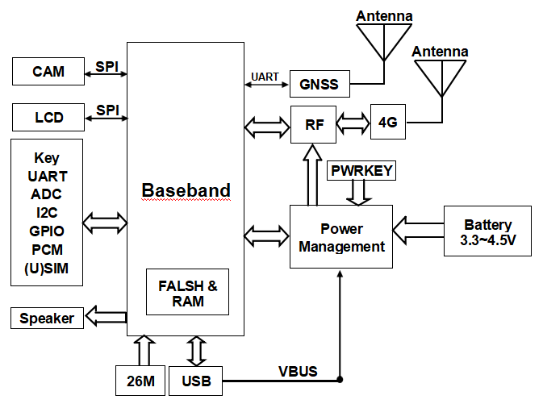
<figcaption><blockquote>

<strong>图 1</strong><strong>：功能框图</strong>

</blockquote></figcaption>
</figure>

1.  **基础参数**

|  |  |  |  |
|:--:|:--:|:--:|:--:|
| **参数名称** | **详情** | **参数名称** | **详情** |
| 模块型号 | DX-CT511/DX-CT511N | 模块尺寸 | 17.7mm×15.8mm×2.3mm |
| 工作电压 | 3.3V-4.5V | 工作电流 | 13mA@3.8V |
| 射频输入阻抗 | 50Ω | 发射功率 | 23dBm±2dB |
| 协议 | TCP UDP HTTP MQTT NMEA-0813 | 硬件接口 | USB ADC UART I2C SPI GPIO |
| 频段 | TDD-LTE，FDD-LTE | 频道 | 见备注 |
| 工作温度 | MIN:-40℃ - MAX:+85℃ | 湿度 | 10%-95% 非冷凝 |

**表 1****：基础参数表**

**备注**

|  |
|:---|
| 频道：FDD Band1，FDD Band3，FDD Band5，FDD Band8，FDD Band34，FDD Band38，FDD Band39，FDD Band40，FDD Band41。 |

# 应用接口

1.  **模块引脚定义**

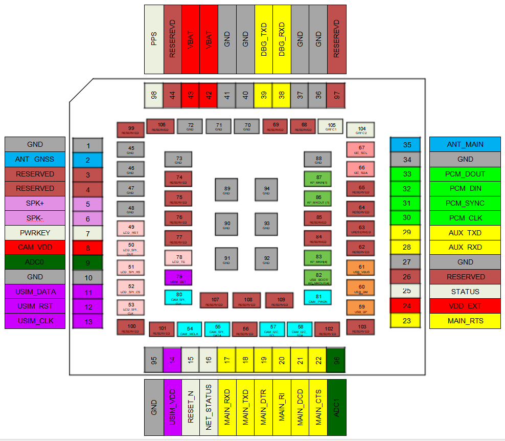

<figure>
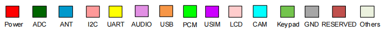
<figcaption>
<strong>图 2</strong><strong>：模块引脚定义</strong>
</figcaption>
</figure>

2.  **模块引脚描述**

> DX-CT511/DX-CT511N共有109个引脚，接口具体功能如下。

<table style="width:100%;">
<caption><blockquote>

<strong>表 2</strong><strong>：常用引脚描述表</strong>

</blockquote></caption>
<colgroup>
<col style="width: 7%" />
<col style="width: 16%" />
<col style="width: 9%" />
<col style="width: 36%" />
<col style="width: 15%" />
<col style="width: 13%" />
</colgroup>
<tbody>
<tr>
<td style="text-align: center;"><strong>引脚</strong></td>
<td style="text-align: center;"><strong>引脚名称</strong></td>
<td style="text-align: center;"><strong>模式</strong></td>
<td style="text-align: center;"><strong>功能描述</strong></td>
<td style="text-align: center;"><strong>电压域</strong></td>
<td style="text-align: center;"><strong>状态（1）</strong></td>
</tr>
<tr>
<td colspan="6" style="text-align: center;">LCC PIN</td>
</tr>
<tr>
<td style="text-align: center;">1</td>
<td style="text-align: center;">GND</td>
<td style="text-align: center;">G</td>
<td style="text-align: center;">地</td>
<td style="text-align: center;">-</td>
<td style="text-align: center;">GND</td>
</tr>
<tr>
<td style="text-align: center;">2#</td>
<td style="text-align: center;">ANT-GNSS</td>
<td style="text-align: center;">ANT</td>
<td style="text-align: center;">GNSS天线</td>
<td style="text-align: center;">-</td>
<td style="text-align: center;">Open</td>
</tr>
<tr>
<td style="text-align: center;">7</td>
<td style="text-align: center;">PWRKEY</td>
<td style="text-align: center;">DI</td>
<td style="text-align: center;">电源键</td>
<td style="text-align: center;">0~VBAT</td>
<td style="text-align: center;">Open</td>
</tr>
<tr>
<td style="text-align: center;">10</td>
<td style="text-align: center;">GND</td>
<td style="text-align: center;">G</td>
<td style="text-align: center;">地</td>
<td style="text-align: center;">-</td>
<td style="text-align: center;">GND</td>
</tr>
<tr>
<td style="text-align: center;">11</td>
<td style="text-align: center;">USIM_DATA</td>
<td style="text-align: center;">DIO</td>
<td style="text-align: center;">USIM数据</td>
<td style="text-align: center;">1.8V/3.0V</td>
<td style="text-align: center;">Open</td>
</tr>
<tr>
<td style="text-align: center;">12</td>
<td style="text-align: center;">USIM_RST</td>
<td style="text-align: center;">DO</td>
<td style="text-align: center;">USIM复位</td>
<td style="text-align: center;">1.8V/3.0V</td>
<td style="text-align: center;">Open</td>
</tr>
<tr>
<td style="text-align: center;">13</td>
<td style="text-align: center;">USIM_CLK</td>
<td style="text-align: center;">DO</td>
<td style="text-align: center;">USIM时钟</td>
<td style="text-align: center;">1.8V/3.0V</td>
<td style="text-align: center;">Open</td>
</tr>
<tr>
<td style="text-align: center;">95</td>
<td style="text-align: center;">GND</td>
<td style="text-align: center;">G</td>
<td style="text-align: center;">地</td>
<td style="text-align: center;">-</td>
<td style="text-align: center;">GND</td>
</tr>
<tr>
<td style="text-align: center;">14</td>
<td style="text-align: center;">USIM_VDD</td>
<td style="text-align: center;">PO</td>
<td style="text-align: center;">USIM输出电压</td>
<td style="text-align: center;">1.8V/3.0V</td>
<td style="text-align: center;">Open</td>
</tr>
<tr>
<td style="text-align: center;">15</td>
<td style="text-align: center;">RESET_N</td>
<td style="text-align: center;">DI</td>
<td style="text-align: center;">系统复位信号</td>
<td style="text-align: center;">1.8V</td>
<td style="text-align: center;">Open</td>
</tr>
<tr>
<td style="text-align: center;">16</td>
<td style="text-align: center;">NET_STATUS</td>
<td style="text-align: center;">DO</td>
<td style="text-align: center;">输出PIN作为LED控制网络状态</td>
<td style="text-align: center;">1.8V</td>
<td style="text-align: center;">Open</td>
</tr>
<tr>
<td style="text-align: center;">17</td>
<td style="text-align: center;">MAIN_RXD</td>
<td style="text-align: center;">DI</td>
<td style="text-align: center;">Main UART接收数据输入</td>
<td style="text-align: center;">1.8V</td>
<td style="text-align: center;">Open</td>
</tr>
<tr>
<td style="text-align: center;">18</td>
<td style="text-align: center;">MAIN_TXD</td>
<td style="text-align: center;">DO</td>
<td style="text-align: center;">Main UART传输数据输出</td>
<td style="text-align: center;">1.8V</td>
<td style="text-align: center;">Open</td>
</tr>
<tr>
<td style="text-align: center;">19</td>
<td style="text-align: center;">MAIN_DTR</td>
<td style="text-align: center;">DI</td>
<td style="text-align: center;">Main UART数据终端</td>
<td style="text-align: center;">1.8V</td>
<td style="text-align: center;">Open</td>
</tr>
<tr>
<td style="text-align: center;">24</td>
<td style="text-align: center;">VDD_EXT</td>
<td style="text-align: center;">PO</td>
<td style="text-align: center;">1.8V输出电压，输出电流可达50mA</td>
<td style="text-align: center;">1.8V</td>
<td style="text-align: center;">Open</td>
</tr>
<tr>
<td style="text-align: center;">25</td>
<td style="text-align: center;">STATUS</td>
<td style="text-align: center;">DO</td>
<td style="text-align: center;">输出PIN作为模块的工作状态指示</td>
<td style="text-align: center;">1.8V</td>
<td style="text-align: center;">Open</td>
</tr>
<tr>
<td style="text-align: center;">27</td>
<td style="text-align: center;">GND</td>
<td style="text-align: center;">G</td>
<td style="text-align: center;">地</td>
<td style="text-align: center;">-</td>
<td style="text-align: center;">GND</td>
</tr>
<tr>
<td style="text-align: center;">30</td>
<td style="text-align: center;">PCM_CLK</td>
<td style="text-align: center;">DO</td>
<td style="text-align: center;">PCM接口时钟</td>
<td style="text-align: center;">1.8V</td>
<td style="text-align: center;">Open</td>
</tr>
<tr>
<td style="text-align: center;">34</td>
<td style="text-align: center;">GND</td>
<td style="text-align: center;">G</td>
<td style="text-align: center;">地</td>
<td style="text-align: center;">-</td>
<td style="text-align: center;">GND</td>
</tr>
<tr>
<td style="text-align: center;">35</td>
<td style="text-align: center;">ANT_MAIN</td>
<td style="text-align: center;">ANT</td>
<td style="text-align: center;">主天线</td>
<td style="text-align: center;">-</td>
<td style="text-align: center;">Open</td>
</tr>
<tr>
<td style="text-align: center;">36</td>
<td style="text-align: center;">GND</td>
<td style="text-align: center;">G</td>
<td style="text-align: center;">地</td>
<td style="text-align: center;">-</td>
<td style="text-align: center;">GND</td>
</tr>
<tr>
<td style="text-align: center;">37</td>
<td style="text-align: center;">GND</td>
<td style="text-align: center;">G</td>
<td style="text-align: center;">地</td>
<td style="text-align: center;">-</td>
<td style="text-align: center;">GND</td>
</tr>
<tr>
<td style="text-align: center;">40</td>
<td style="text-align: center;">GND</td>
<td style="text-align: center;">G</td>
<td style="text-align: center;">地</td>
<td style="text-align: center;">-</td>
<td style="text-align: center;">GND</td>
</tr>
<tr>
<td style="text-align: center;">41</td>
<td style="text-align: center;">GND</td>
<td style="text-align: center;">G</td>
<td style="text-align: center;">地</td>
<td style="text-align: center;">-</td>
<td style="text-align: center;">GND</td>
</tr>
<tr>
<td style="text-align: center;">42</td>
<td style="text-align: center;">VBAT</td>
<td style="text-align: center;">PI</td>
<td rowspan="2" style="text-align: center;">供电</td>
<td style="text-align: center;">-</td>
<td style="text-align: center;">VBAT</td>
</tr>
<tr>
<td style="text-align: center;">43</td>
<td style="text-align: center;">VBAT</td>
<td style="text-align: center;">PI</td>
<td style="text-align: center;">-</td>
<td style="text-align: center;">VBAT</td>
</tr>
<tr>
<td colspan="6" style="text-align: center;">LGA PIN</td>
</tr>
<tr>
<td style="text-align: center;">45</td>
<td style="text-align: center;">GND</td>
<td style="text-align: center;">G</td>
<td style="text-align: center;">地</td>
<td style="text-align: center;">-</td>
<td style="text-align: center;">GND</td>
</tr>
<tr>
<td style="text-align: center;">46</td>
<td style="text-align: center;">GND</td>
<td style="text-align: center;">G</td>
<td style="text-align: center;">地</td>
<td style="text-align: center;">-</td>
<td style="text-align: center;">GND</td>
</tr>
<tr>
<td style="text-align: center;">47</td>
<td style="text-align: center;">GND</td>
<td style="text-align: center;">G</td>
<td style="text-align: center;">地</td>
<td style="text-align: center;">-</td>
<td style="text-align: center;">GND</td>
</tr>
<tr>
<td style="text-align: center;">48</td>
<td style="text-align: center;">GND</td>
<td style="text-align: center;">G</td>
<td style="text-align: center;">地</td>
<td style="text-align: center;">-</td>
<td style="text-align: center;">GND</td>
</tr>
<tr>
<td style="text-align: center;">59</td>
<td style="text-align: center;">USB_DP</td>
<td style="text-align: center;">IO</td>
<td style="text-align: center;">USB端口差分数据线</td>
<td style="text-align: center;">-</td>
<td style="text-align: center;">Open</td>
</tr>
<tr>
<td style="text-align: center;">60</td>
<td style="text-align: center;">USB_DM</td>
<td style="text-align: center;">IO</td>
<td style="text-align: center;">USB端口差分数据线</td>
<td style="text-align: center;">-</td>
<td style="text-align: center;">Open</td>
</tr>
<tr>
<td style="text-align: center;">61</td>
<td style="text-align: center;">USB_VBUS</td>
<td style="text-align: center;">PI</td>
<td style="text-align: center;">USB 5V电压输入</td>
<td style="text-align: center;">5V</td>
<td style="text-align: center;">Open</td>
</tr>
<tr>
<td style="text-align: center;">70</td>
<td style="text-align: center;">GND</td>
<td style="text-align: center;">G</td>
<td style="text-align: center;">地</td>
<td style="text-align: center;">-</td>
<td style="text-align: center;">GND</td>
</tr>
<tr>
<td style="text-align: center;">71</td>
<td style="text-align: center;">GND</td>
<td style="text-align: center;">G</td>
<td style="text-align: center;">地</td>
<td style="text-align: center;">-</td>
<td style="text-align: center;">GND</td>
</tr>
<tr>
<td style="text-align: center;">72</td>
<td style="text-align: center;">GND</td>
<td style="text-align: center;">G</td>
<td style="text-align: center;">地</td>
<td style="text-align: center;">-</td>
<td style="text-align: center;">GND</td>
</tr>
<tr>
<td style="text-align: center;">73</td>
<td style="text-align: center;">GND</td>
<td style="text-align: center;">G</td>
<td style="text-align: center;">地</td>
<td style="text-align: center;">-</td>
<td style="text-align: center;">GND</td>
</tr>
<tr>
<td style="text-align: center;">82#</td>
<td style="text-align: center;">
USB_BOOT/

KP_MKOUT[4]
</td>
<td style="text-align: center;">DI/DO</td>
<td style="text-align: center;">强制软件下载/键盘矩阵键输出[4]</td>
<td style="text-align: center;">1.8V</td>
<td style="text-align: center;">Open</td>
</tr>
<tr>
<td style="text-align: center;">88</td>
<td style="text-align: center;">GND</td>
<td style="text-align: center;">G</td>
<td style="text-align: center;">地</td>
<td style="text-align: center;">-</td>
<td style="text-align: center;">GND</td>
</tr>
<tr>
<td style="text-align: center;">89</td>
<td style="text-align: center;">GND</td>
<td style="text-align: center;">G</td>
<td style="text-align: center;">地</td>
<td style="text-align: center;">-</td>
<td style="text-align: center;">GND</td>
</tr>
<tr>
<td style="text-align: center;">90</td>
<td style="text-align: center;">GND</td>
<td style="text-align: center;">G</td>
<td style="text-align: center;">地</td>
<td style="text-align: center;">-</td>
<td style="text-align: center;">GND</td>
</tr>
<tr>
<td style="text-align: center;">91</td>
<td style="text-align: center;">GND</td>
<td style="text-align: center;">G</td>
<td style="text-align: center;">地</td>
<td style="text-align: center;">-</td>
<td style="text-align: center;">GND</td>
</tr>
<tr>
<td style="text-align: center;">92</td>
<td style="text-align: center;">GND</td>
<td style="text-align: center;">G</td>
<td style="text-align: center;">地</td>
<td style="text-align: center;">-</td>
<td style="text-align: center;">GND</td>
</tr>
<tr>
<td style="text-align: center;">93</td>
<td style="text-align: center;">GND</td>
<td style="text-align: center;">G</td>
<td style="text-align: center;">地</td>
<td style="text-align: center;">-</td>
<td style="text-align: center;">GND</td>
</tr>
<tr>
<td style="text-align: center;">94</td>
<td style="text-align: center;">GND</td>
<td style="text-align: center;">G</td>
<td style="text-align: center;">地</td>
<td style="text-align: center;">-</td>
<td style="text-align: center;">GND</td>
</tr>
</tbody>
</table>

<table style="width:100%;">
<caption><blockquote>

<strong>表 3</strong><strong>：不常用引脚描述表</strong>

</blockquote></caption>
<colgroup>
<col style="width: 7%" />
<col style="width: 16%" />
<col style="width: 9%" />
<col style="width: 36%" />
<col style="width: 15%" />
<col style="width: 13%" />
</colgroup>
<tbody>
<tr>
<td style="text-align: center;"><strong>引脚</strong></td>
<td style="text-align: center;"><strong>引脚名称</strong></td>
<td style="text-align: center;"><strong>模式</strong></td>
<td style="text-align: center;"><strong>功能描述</strong></td>
<td style="text-align: center;"><strong>电压域</strong></td>
<td style="text-align: center;"><strong>状态（1）</strong></td>
</tr>
<tr>
<td colspan="6" style="text-align: center;">LCC PIN</td>
</tr>
<tr>
<td style="text-align: center;">3</td>
<td style="text-align: center;">RESERVED</td>
<td style="text-align: center;">-</td>
<td style="text-align: center;">不连接</td>
<td style="text-align: center;">-</td>
<td style="text-align: center;">-</td>
</tr>
<tr>
<td style="text-align: center;">4</td>
<td style="text-align: center;">RESERVED</td>
<td style="text-align: center;">-</td>
<td style="text-align: center;">不连接</td>
<td style="text-align: center;">-</td>
<td style="text-align: center;">-</td>
</tr>
<tr>
<td style="text-align: center;">5</td>
<td style="text-align: center;">SPK+</td>
<td style="text-align: center;">AO</td>
<td style="text-align: center;">扬声器输出</td>
<td style="text-align: center;">0~1.8V</td>
<td style="text-align: center;">Open</td>
</tr>
<tr>
<td style="text-align: center;">6</td>
<td style="text-align: center;">SPK-</td>
<td style="text-align: center;">AO</td>
<td style="text-align: center;">扬声器输出</td>
<td style="text-align: center;">0V</td>
<td style="text-align: center;">Open</td>
</tr>
<tr>
<td style="text-align: center;">8</td>
<td style="text-align: center;">CAM_VDD</td>
<td style="text-align: center;">PO</td>
<td style="text-align: center;">2.8V输出电压，输出电流可达50mA</td>
<td style="text-align: center;">2.8V</td>
<td style="text-align: center;">Open</td>
</tr>
<tr>
<td style="text-align: center;">9</td>
<td style="text-align: center;">ADC0</td>
<td style="text-align: center;">AI</td>
<td style="text-align: center;">ADC外部输入通道0，12位</td>
<td style="text-align: center;">0.05~1.2V</td>
<td style="text-align: center;">Open</td>
</tr>
<tr>
<td style="text-align: center;">20</td>
<td style="text-align: center;">MAIN_RI</td>
<td style="text-align: center;">DO</td>
<td style="text-align: center;">UART主环指示灯</td>
<td style="text-align: center;">1.8V</td>
<td style="text-align: center;">Open</td>
</tr>
<tr>
<td style="text-align: center;">21</td>
<td style="text-align: center;">MAIN_DCD</td>
<td style="text-align: center;">DO</td>
<td style="text-align: center;">主要UART数据载波检测</td>
<td style="text-align: center;">1.8V</td>
<td style="text-align: center;">Open</td>
</tr>
<tr>
<td style="text-align: center;">22</td>
<td style="text-align: center;">MAIN_CTS</td>
<td style="text-align: center;">DO</td>
<td style="text-align: center;">主要UART发送数据</td>
<td style="text-align: center;">1.8V</td>
<td style="text-align: center;">Open</td>
</tr>
<tr>
<td style="text-align: center;">96</td>
<td style="text-align: center;">ADC1</td>
<td style="text-align: center;">AI</td>
<td style="text-align: center;">ADC外部输入通道1，12位</td>
<td style="text-align: center;">0.05～1.2V</td>
<td style="text-align: center;">Open</td>
</tr>
<tr>
<td style="text-align: center;">23</td>
<td style="text-align: center;">MAIN_RTS</td>
<td style="text-align: center;">DI</td>
<td style="text-align: center;">发送主要UART请求</td>
<td style="text-align: center;">1.8V</td>
<td style="text-align: center;">Open</td>
</tr>
<tr>
<td style="text-align: center;">26</td>
<td style="text-align: center;">RESERVED</td>
<td style="text-align: center;">-</td>
<td style="text-align: center;">不连接</td>
<td style="text-align: center;">-</td>
<td style="text-align: center;"></td>
</tr>
<tr>
<td style="text-align: center;">28#</td>
<td style="text-align: center;">AUX_RXD</td>
<td style="text-align: center;">DI</td>
<td style="text-align: center;">Auxiliary UART接收数据输入</td>
<td style="text-align: center;">1.8V</td>
<td style="text-align: center;">Open</td>
</tr>
<tr>
<td style="text-align: center;">29#</td>
<td style="text-align: center;">AUX_TXD</td>
<td style="text-align: center;">DO</td>
<td style="text-align: center;">Auxiliary UART传输数据输出</td>
<td style="text-align: center;">1.8V</td>
<td style="text-align: center;">Open</td>
</tr>
<tr>
<td style="text-align: center;">31</td>
<td style="text-align: center;">PCM_SYNC</td>
<td style="text-align: center;">DO</td>
<td style="text-align: center;">PCM接口同步</td>
<td style="text-align: center;">1.8V</td>
<td style="text-align: center;">Open</td>
</tr>
<tr>
<td style="text-align: center;">32</td>
<td style="text-align: center;">PCM_DIN</td>
<td style="text-align: center;">DI</td>
<td style="text-align: center;">PCM I/F数据输入</td>
<td style="text-align: center;">1.8V</td>
<td style="text-align: center;">Open</td>
</tr>
<tr>
<td style="text-align: center;">33</td>
<td style="text-align: center;">PCM_DOUT</td>
<td style="text-align: center;">DO</td>
<td style="text-align: center;">PCM I/F数据输出</td>
<td style="text-align: center;">1.8V</td>
<td style="text-align: center;">Open</td>
</tr>
<tr>
<td style="text-align: center;">97</td>
<td style="text-align: center;">RESERVED</td>
<td style="text-align: center;">-</td>
<td style="text-align: center;">不连接</td>
<td style="text-align: center;">-</td>
<td style="text-align: center;"></td>
</tr>
<tr>
<td style="text-align: center;">38</td>
<td style="text-align: center;">DBG_RXD</td>
<td style="text-align: center;">DI</td>
<td style="text-align: center;">Debug UART接收数据输入</td>
<td style="text-align: center;">1.8V</td>
<td style="text-align: center;">Open</td>
</tr>
<tr>
<td style="text-align: center;">39</td>
<td style="text-align: center;">DBG_TXD</td>
<td style="text-align: center;">DO</td>
<td style="text-align: center;">Debug UART传输数据输出</td>
<td style="text-align: center;">1.8V</td>
<td style="text-align: center;">Open</td>
</tr>
<tr>
<td style="text-align: center;">44</td>
<td style="text-align: center;">RESERVED</td>
<td style="text-align: center;">-</td>
<td style="text-align: center;">不连接</td>
<td style="text-align: center;">-</td>
<td style="text-align: center;">-</td>
</tr>
<tr>
<td style="text-align: center;">98#</td>
<td style="text-align: center;">PPS</td>
<td style="text-align: center;">DO</td>
<td style="text-align: center;">-</td>
<td style="text-align: center;">1.8V</td>
<td style="text-align: center;">Open</td>
</tr>
<tr>
<td colspan="6" style="text-align: center;">LGA PIN</td>
</tr>
<tr>
<td style="text-align: center;">49</td>
<td style="text-align: center;">LCD_RST</td>
<td style="text-align: center;">DO</td>
<td style="text-align: center;">LCD复位信号</td>
<td style="text-align: center;">1.8V</td>
<td style="text-align: center;">Open</td>
</tr>
<tr>
<td style="text-align: center;">50</td>
<td style="text-align: center;">LCD_SPI_OUT</td>
<td style="text-align: center;">DO</td>
<td style="text-align: center;">LCD SPI数据输出</td>
<td style="text-align: center;">1.8V</td>
<td style="text-align: center;">Open</td>
</tr>
<tr>
<td style="text-align: center;">51</td>
<td style="text-align: center;">LCD_SPI_RS</td>
<td style="text-align: center;">DO</td>
<td style="text-align: center;">LCD SPI数据/命令选择</td>
<td style="text-align: center;">1.8V</td>
<td style="text-align: center;">Open</td>
</tr>
<tr>
<td style="text-align: center;">52</td>
<td style="text-align: center;">LCD_SPI_CS</td>
<td style="text-align: center;">DO</td>
<td style="text-align: center;">LCD SPI芯片选择</td>
<td style="text-align: center;">1.8V</td>
<td style="text-align: center;">Open</td>
</tr>
<tr>
<td style="text-align: center;">53</td>
<td style="text-align: center;">LCD_SPI_CLK</td>
<td style="text-align: center;">DO</td>
<td style="text-align: center;">LCD SPI时钟</td>
<td style="text-align: center;">1.8V</td>
<td style="text-align: center;">Open</td>
</tr>
<tr>
<td style="text-align: center;">54</td>
<td style="text-align: center;">CAM_MCLK</td>
<td style="text-align: center;">DO</td>
<td style="text-align: center;">摄像头主时钟</td>
<td style="text-align: center;">1.8V</td>
<td style="text-align: center;">Open</td>
</tr>
<tr>
<td style="text-align: center;">55</td>
<td style="text-align: center;">CAM_SPI_DATA</td>
<td style="text-align: center;">DI</td>
<td style="text-align: center;">摄像头SPI数据输入</td>
<td style="text-align: center;">1.8V</td>
<td style="text-align: center;">Open</td>
</tr>
<tr>
<td style="text-align: center;">56</td>
<td style="text-align: center;">RESERVED</td>
<td style="text-align: center;">-</td>
<td style="text-align: center;">不连接</td>
<td style="text-align: center;">-</td>
<td style="text-align: center;">-</td>
</tr>
<tr>
<td style="text-align: center;">57</td>
<td style="text-align: center;">CAM_I2C_SCL</td>
<td style="text-align: center;">O</td>
<td style="text-align: center;">摄像头I2C时钟</td>
<td style="text-align: center;">1.8V</td>
<td style="text-align: center;">Open</td>
</tr>
<tr>
<td style="text-align: center;">58</td>
<td style="text-align: center;">CAM_I2C_SDA</td>
<td style="text-align: center;">I/O</td>
<td style="text-align: center;">摄像头I2C数据</td>
<td style="text-align: center;">1.8V</td>
<td style="text-align: center;">Open</td>
</tr>
<tr>
<td style="text-align: center;">62</td>
<td style="text-align: center;">RESERVED</td>
<td style="text-align: center;">-</td>
<td style="text-align: center;">不连接</td>
<td style="text-align: center;">-</td>
<td style="text-align: center;">-</td>
</tr>
<tr>
<td style="text-align: center;">63</td>
<td style="text-align: center;">RESERVED</td>
<td style="text-align: center;">-</td>
<td style="text-align: center;">不连接</td>
<td style="text-align: center;">-</td>
<td style="text-align: center;">-</td>
</tr>
<tr>
<td style="text-align: center;">64</td>
<td style="text-align: center;">RESERVED</td>
<td style="text-align: center;">-</td>
<td style="text-align: center;">不连接</td>
<td style="text-align: center;">-</td>
<td style="text-align: center;">-</td>
</tr>
<tr>
<td style="text-align: center;">65</td>
<td style="text-align: center;">RESERVED</td>
<td style="text-align: center;">-</td>
<td style="text-align: center;">不连接</td>
<td style="text-align: center;">-</td>
<td style="text-align: center;">-</td>
</tr>
<tr>
<td style="text-align: center;">66</td>
<td style="text-align: center;">I2C_SDA</td>
<td style="text-align: center;">I/O</td>
<td style="text-align: center;">I2C数据</td>
<td style="text-align: center;">1.8V</td>
<td style="text-align: center;">Open</td>
</tr>
<tr>
<td style="text-align: center;">67</td>
<td style="text-align: center;">I2C_SCL</td>
<td style="text-align: center;">O</td>
<td style="text-align: center;">I2C时钟</td>
<td style="text-align: center;">1.8V</td>
<td style="text-align: center;">Open</td>
</tr>
<tr>
<td style="text-align: center;">68</td>
<td style="text-align: center;">RESERVED</td>
<td style="text-align: center;">-</td>
<td style="text-align: center;">不连接</td>
<td style="text-align: center;">-</td>
<td style="text-align: center;">-</td>
</tr>
<tr>
<td style="text-align: center;">69</td>
<td style="text-align: center;">RESERVED</td>
<td style="text-align: center;">-</td>
<td style="text-align: center;">不连接</td>
<td style="text-align: center;">-</td>
<td style="text-align: center;">-</td>
</tr>
<tr>
<td style="text-align: center;">74</td>
<td style="text-align: center;">RESERVED</td>
<td style="text-align: center;">-</td>
<td style="text-align: center;">不连接</td>
<td style="text-align: center;">-</td>
<td style="text-align: center;">-</td>
</tr>
<tr>
<td style="text-align: center;">75</td>
<td style="text-align: center;">RESERVED</td>
<td style="text-align: center;">-</td>
<td style="text-align: center;">不连接</td>
<td style="text-align: center;">-</td>
<td style="text-align: center;">-</td>
</tr>
<tr>
<td style="text-align: center;">76</td>
<td style="text-align: center;">RESERVED</td>
<td style="text-align: center;">-</td>
<td style="text-align: center;">不连接</td>
<td style="text-align: center;">-</td>
<td style="text-align: center;">-</td>
</tr>
<tr>
<td style="text-align: center;">77</td>
<td style="text-align: center;">RESERVED</td>
<td style="text-align: center;">-</td>
<td style="text-align: center;">不连接</td>
<td style="text-align: center;">-</td>
<td style="text-align: center;">-</td>
</tr>
<tr>
<td style="text-align: center;">78</td>
<td style="text-align: center;">LCD_TE</td>
<td style="text-align: center;">DO</td>
<td style="text-align: center;">LCD撕裂效应</td>
<td style="text-align: center;">1.8V</td>
<td style="text-align: center;">Open</td>
</tr>
<tr>
<td style="text-align: center;">79</td>
<td style="text-align: center;">USIM_DET</td>
<td style="text-align: center;">DI</td>
<td style="text-align: center;"> USIM检测引脚</td>
<td style="text-align: center;">1.8V</td>
<td style="text-align: center;">Open</td>
</tr>
<tr>
<td style="text-align: center;">80</td>
<td style="text-align: center;">CAM_SPI_CLK</td>
<td style="text-align: center;">DO</td>
<td style="text-align: center;">摄像头SPI时钟</td>
<td style="text-align: center;">1.8V</td>
<td style="text-align: center;">Open</td>
</tr>
<tr>
<td style="text-align: center;">81</td>
<td style="text-align: center;">CAM_PWDN</td>
<td style="text-align: center;">I/O</td>
<td style="text-align: center;">通用输入摄像头下电输出</td>
<td style="text-align: center;">1.8V</td>
<td style="text-align: center;">Open</td>
</tr>
<tr>
<td style="text-align: center;">83</td>
<td style="text-align: center;">KP_MKIN[4]</td>
<td style="text-align: center;">DI</td>
<td style="text-align: center;">键盘矩阵键输入[4]</td>
<td style="text-align: center;">1.8V</td>
<td style="text-align: center;">Open</td>
</tr>
<tr>
<td style="text-align: center;">84</td>
<td style="text-align: center;">RESERVED</td>
<td style="text-align: center;">-</td>
<td style="text-align: center;">不连接</td>
<td style="text-align: center;">-</td>
<td style="text-align: center;">-</td>
</tr>
<tr>
<td style="text-align: center;">85</td>
<td style="text-align: center;">RESERVED</td>
<td style="text-align: center;">-</td>
<td style="text-align: center;">不连接</td>
<td style="text-align: center;">-</td>
<td style="text-align: center;">-</td>
</tr>
<tr>
<td style="text-align: center;">86</td>
<td style="text-align: center;">KP_MKOUT[1]</td>
<td style="text-align: center;">DO</td>
<td style="text-align: center;">键盘矩阵键输出[1]</td>
<td style="text-align: center;">1.8V</td>
<td style="text-align: center;">Open</td>
</tr>
<tr>
<td style="text-align: center;">87</td>
<td style="text-align: center;">KP_MKIN[1]</td>
<td style="text-align: center;">DI</td>
<td style="text-align: center;">键盘矩阵键输入[1]</td>
<td style="text-align: center;">1.8V</td>
<td style="text-align: center;">Open</td>
</tr>
<tr>
<td style="text-align: center;">99</td>
<td style="text-align: center;">RESERVED</td>
<td style="text-align: center;">-</td>
<td style="text-align: center;">不连接</td>
<td style="text-align: center;">-</td>
<td style="text-align: center;">-</td>
</tr>
<tr>
<td style="text-align: center;">100</td>
<td style="text-align: center;">RESERVED</td>
<td style="text-align: center;">-</td>
<td style="text-align: center;">不连接</td>
<td style="text-align: center;">-</td>
<td style="text-align: center;">-</td>
</tr>
<tr>
<td style="text-align: center;">101</td>
<td style="text-align: center;">RESERVED</td>
<td style="text-align: center;">-</td>
<td style="text-align: center;">不连接</td>
<td style="text-align: center;">-</td>
<td style="text-align: center;">-</td>
</tr>
<tr>
<td style="text-align: center;">102</td>
<td style="text-align: center;">RESERVED</td>
<td style="text-align: center;">-</td>
<td style="text-align: center;">不连接</td>
<td style="text-align: center;">-</td>
<td style="text-align: center;">-</td>
</tr>
<tr>
<td style="text-align: center;">103</td>
<td style="text-align: center;">RESERVED</td>
<td style="text-align: center;">-</td>
<td style="text-align: center;">不连接</td>
<td style="text-align: center;">-</td>
<td style="text-align: center;">-</td>
</tr>
<tr>
<td style="text-align: center;">104</td>
<td style="text-align: center;">GRFC2</td>
<td style="text-align: center;">DO</td>
<td style="text-align: center;">通用射频控制2</td>
<td style="text-align: center;">1.8V</td>
<td style="text-align: center;">Open</td>
</tr>
<tr>
<td style="text-align: center;">105</td>
<td style="text-align: center;">GRFC1</td>
<td style="text-align: center;">DO</td>
<td style="text-align: center;">通用射频控制1</td>
<td style="text-align: center;">1.8V</td>
<td style="text-align: center;">Open</td>
</tr>
<tr>
<td style="text-align: center;">106</td>
<td style="text-align: center;">RESERVED</td>
<td style="text-align: center;">-</td>
<td style="text-align: center;">不连接</td>
<td style="text-align: center;">-</td>
<td style="text-align: center;">-</td>
</tr>
<tr>
<td style="text-align: center;">107</td>
<td style="text-align: center;">RESERVED</td>
<td style="text-align: center;">-</td>
<td style="text-align: center;">不连接</td>
<td style="text-align: center;">-</td>
<td style="text-align: center;">-</td>
</tr>
<tr>
<td style="text-align: center;">108</td>
<td style="text-align: center;">RESERVED</td>
<td style="text-align: center;">-</td>
<td style="text-align: center;">不连接</td>
<td style="text-align: center;">-</td>
<td style="text-align: center;">-</td>
</tr>
<tr>
<td style="text-align: center;">109</td>
<td style="text-align: center;">RESERVED</td>
<td style="text-align: center;">-</td>
<td style="text-align: center;">不连接</td>
<td style="text-align: center;">-</td>
<td style="text-align: center;">-</td>
</tr>
</tbody>
</table>

注：状态（1）：未使用时的建议状态。表2部分接口做如下说明。

- \#号标记管脚 PIN2（ANT_GNSS），模块配置支持GNSS功能才需要此接口。

- \#号标记管脚 PIN28 和 PIN29，如果模块配置支持GNSS功能，这些接口外部不可以使用，如果模块内部不支持 GNSS 功能，这些接口就可以用来接外设。

- \#号标记管脚 PIN82（USB_BOOT/KP_MKOUT\[4\]），模块开机成功前禁止下拉到低电平。

- \#号标记管脚 PIN98（PPS），模块配置支持GNSS功能才支持此功能。

|          |              |          |              |
|:--------:|:------------:|:--------:|:------------:|
| **引脚** | **引脚说明** | **引脚** | **引脚说明** |
|    PI    |   电源输入   |    PO    |   功率输出   |
|    DI    |   数字输入   |    DO    |   数字输出   |
|    IO    |   输入输出   |    AI    |   模拟输入   |
|    AO    |   模拟输出   |   I/O    |  输入或输出  |
|   ANT    |     天线     |    G     |      地      |

**表 4****：引脚类型说明**

1.  **CT511-A/CT511N-A底板版块定义**

<figure>
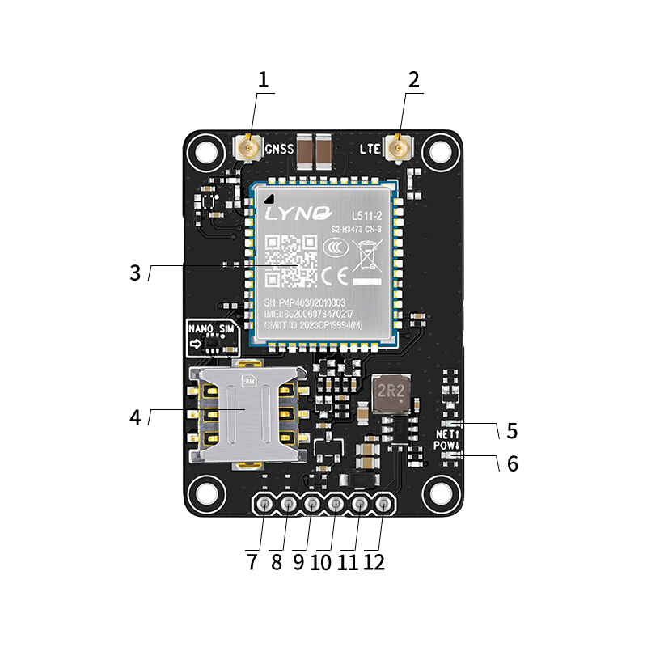
<figcaption>
<strong>图 3</strong><strong>：CT511-A/CT511N-A底板定义</strong>
</figcaption>
</figure>

2.  **CT511-A/CT511N-A底板版块定义说明**

<table style="width:99%;">
<caption><blockquote>

<strong>表 5</strong><strong>：CT511-A/CT511N-A底板版块定义说明表</strong>

</blockquote></caption>
<colgroup>
<col style="width: 12%" />
<col style="width: 16%" />
<col style="width: 33%" />
<col style="width: 37%" />
</colgroup>
<tbody>
<tr>
<td style="text-align: center;"><strong>版块序号</strong></td>
<td style="text-align: center;"><strong>版块名称</strong></td>
<td style="text-align: center;"><strong>版块功能</strong></td>
<td style="text-align: center;"><strong>说明</strong></td>
</tr>
<tr>
<td style="text-align: center;">1</td>
<td style="text-align: center;">GNSS天线座子</td>
<td style="text-align: center;">GPS定位天线座子</td>
<td style="text-align: center;">仅模块名称带N的支持GNSS功能</td>
</tr>
<tr>
<td style="text-align: center;">2</td>
<td style="text-align: center;">LTE天线座子</td>
<td style="text-align: center;">LTE天线座子</td>
<td style="text-align: center;">-</td>
</tr>
<tr>
<td style="text-align: center;">3</td>
<td style="text-align: center;">4G模块</td>
<td style="text-align: center;">DX-CT511/DX-CT511N（模块名称带N的支持GNSS功能）</td>
<td style="text-align: center;">-</td>
</tr>
<tr>
<td style="text-align: center;">4</td>
<td style="text-align: center;">SIM卡槽</td>
<td style="text-align: center;">插卡上网</td>
<td style="text-align: center;">NANO SIM</td>
</tr>
<tr>
<td style="text-align: center;">5</td>
<td style="text-align: center;">网络状态灯</td>
<td style="text-align: center;">网络状态输出脚</td>
<td style="text-align: center;">
关机：熄灭

未注册网络：64ms亮/800ms熄灭

注册网络：64ms亮/3000ms熄灭
</td>
</tr>
<tr>
<td style="text-align: center;">6</td>
<td style="text-align: center;">工作状态灯</td>
<td style="text-align: center;">模块工作状态输出脚</td>
<td style="text-align: center;">上电长亮</td>
</tr>
<tr>
<td style="text-align: center;">7</td>
<td style="text-align: center;">DTR</td>
<td style="text-align: center;">模块休眠唤醒引脚</td>
<td style="text-align: center;">详情见2.13.</td>
</tr>
<tr>
<td style="text-align: center;">8</td>
<td style="text-align: center;">RX</td>
<td style="text-align: center;">串口数据输入</td>
<td style="text-align: center;">-</td>
</tr>
<tr>
<td style="text-align: center;">9</td>
<td style="text-align: center;">TX</td>
<td style="text-align: center;">串口数据输出</td>
<td style="text-align: center;">-</td>
</tr>
<tr>
<td style="text-align: center;">10</td>
<td style="text-align: center;">GND</td>
<td style="text-align: center;">电源地</td>
<td style="text-align: center;">-</td>
</tr>
<tr>
<td style="text-align: center;">11</td>
<td style="text-align: center;">VIN</td>
<td style="text-align: center;">电源输入</td>
<td style="text-align: center;">工作范围：5V-16V，10W</td>
</tr>
<tr>
<td style="text-align: center;">12</td>
<td style="text-align: center;">EN</td>
<td style="text-align: center;">高使能</td>
<td style="text-align: center;">默认高</td>
</tr>
</tbody>
</table>

3.  **CT511-B/CT511N-B Mini底板版块定义**

|  |  |
|:--:|:--:|
| 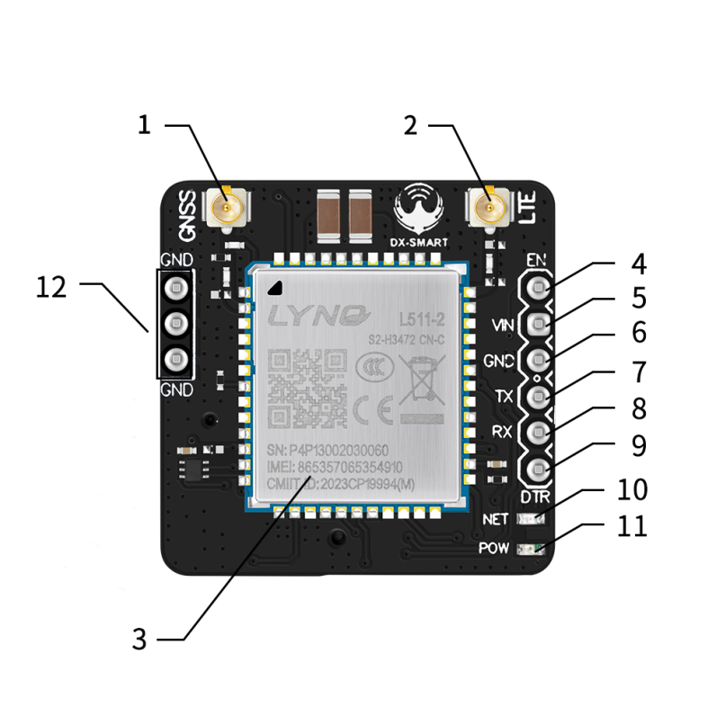 | 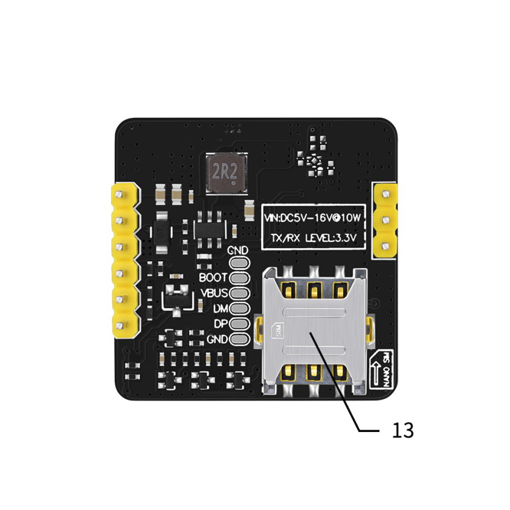 |

**图 4****：CT511-B/CT511N-Bmini底板定义**

**\**

4.  **CT511-B/CT511N-B Mini底板版块定义说明**

<table style="width:99%;">
<caption><blockquote>

<strong>表 6</strong><strong>：CT511-B/CT511N-B mini底板版块定义说明表</strong>

</blockquote></caption>
<colgroup>
<col style="width: 12%" />
<col style="width: 16%" />
<col style="width: 33%" />
<col style="width: 37%" />
</colgroup>
<tbody>
<tr>
<td style="text-align: center;"><strong>版块序号</strong></td>
<td style="text-align: center;"><strong>版块名称</strong></td>
<td style="text-align: center;"><strong>版块功能</strong></td>
<td style="text-align: center;"><strong>说明</strong></td>
</tr>
<tr>
<td style="text-align: center;">1</td>
<td style="text-align: center;">GNSS天线座子</td>
<td style="text-align: center;">GPS定位天线座子</td>
<td style="text-align: center;">仅模块名称带N的支持GNSS功能</td>
</tr>
<tr>
<td style="text-align: center;">2</td>
<td style="text-align: center;">LTE天线座子</td>
<td style="text-align: center;">LTE天线座子</td>
<td style="text-align: center;">-</td>
</tr>
<tr>
<td style="text-align: center;">3</td>
<td style="text-align: center;">4G模块</td>
<td style="text-align: center;">DX-CT511/DX-CT511N（模块名称带N的支持GNSS功能）</td>
<td style="text-align: center;">-</td>
</tr>
<tr>
<td style="text-align: center;">4</td>
<td style="text-align: center;">EN</td>
<td style="text-align: center;">高使能</td>
<td style="text-align: center;">默认高</td>
</tr>
<tr>
<td style="text-align: center;">5</td>
<td style="text-align: center;">VIN</td>
<td style="text-align: center;">电源输入</td>
<td style="text-align: center;">工作范围：5V-16V，10W</td>
</tr>
<tr>
<td style="text-align: center;">6/12</td>
<td style="text-align: center;">GND</td>
<td style="text-align: center;">电源地</td>
<td style="text-align: center;">-</td>
</tr>
<tr>
<td style="text-align: center;">7</td>
<td style="text-align: center;">TX</td>
<td style="text-align: center;">串口数据输出</td>
<td style="text-align: center;">-</td>
</tr>
<tr>
<td style="text-align: center;">8</td>
<td style="text-align: center;">RX</td>
<td style="text-align: center;">串口数据输入</td>
<td style="text-align: center;">-</td>
</tr>
<tr>
<td style="text-align: center;">9</td>
<td style="text-align: center;">DTR</td>
<td style="text-align: center;">模块休眠唤醒引脚</td>
<td style="text-align: center;">详情见2.13.</td>
</tr>
<tr>
<td style="text-align: center;">10</td>
<td style="text-align: center;">网络状态灯</td>
<td style="text-align: center;">网络状态输出脚</td>
<td style="text-align: center;">
关机：熄灭

未注册网络：64ms亮/800ms熄灭

注册网络：64ms亮/3000ms熄灭
</td>
</tr>
<tr>
<td style="text-align: center;">11</td>
<td style="text-align: center;">工作状态灯</td>
<td style="text-align: center;">模块工作状态输出脚</td>
<td style="text-align: center;">上电长亮</td>
</tr>
<tr>
<td style="text-align: center;">13</td>
<td style="text-align: center;">SIM卡槽</td>
<td style="text-align: center;">插卡上网</td>
<td style="text-align: center;">NANO SIM</td>
</tr>
</tbody>
</table>

5.  **电源设计**

    1.  **电源稳定性要求**

        VBAT为模块的主电源，其电压输入范围是3.3V到4.5V，推荐电压为3.8V。在网络较差环境下，天线会以最大功率发射，为了保证电源的稳定，模块必须选择至少能够提供1.2A电流能力的电源。靠近模块的VBAT引脚建议使用低ESR（ESR=0.7欧姆）的100uF滤波电容，同时建议给VBAT加至少3个（100nF、33pF、10pF）具有最佳ESR性能的片层多层陶瓷电容（MLOC）且电容靠近VBAT引脚放置。外部供电电源连接模块时，VBAT需要采用星型走线。VBAT走线宽度应不小于1.2mm，原则上VBAT走线越长需要的线宽越宽。另外，为了保证电源稳定，建议在电源前端加VR=4.7V且低钳位电压和高反向脉冲电流IPP的TVS管。

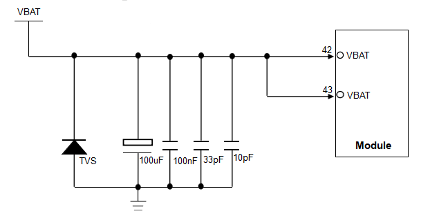

**图 5****：电源接口电路**

如果电压差不是很大，可采用LDO供电方案，如下图，使用LDO供电的电源电路做参考，LDO要求过流能力达到1.2A以上，但由于LDO属于线性降压，其瞬态响应能力较差，并且前后端需要配备海量电容，防止大功率发射时电压波动过大可能出现的复位或关机，输出电压需控制在3.8V。

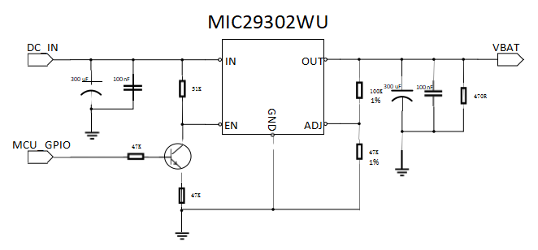

**图 6****：LDO供电电路**

如果电压差比较大，建议采用DC/DC，输出电流要求达到1.2A以上的，如下图采用DC/DC开关电源，辅以大容量电容（330uF以上），来保证射频PA（功放）的正常工作。该参考设计优点是可以提供比较好的瞬态电流响应，在弱信号下可满足模块工作要求，防止因供电不足而造成的掉网或者端口重启现象。

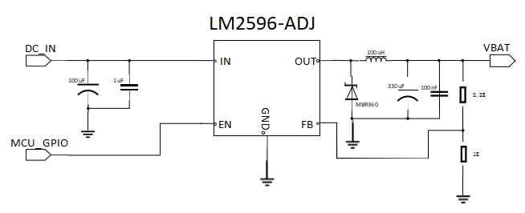

**图 7****：DC/DC供电电路**

2.  **硬件开机**

    模块第7引脚为硬件开机输入端，当模块上电后可通过PWRKEY引脚开机。即拉低PWRKEY引脚超过1s然后释放，使模块开机。模块的PWRKEY内部上拉到VBAT。

    模块关机有两种方式：

- 使用AT命令AT+POWEROFF实现，关机流程需要约3s才能完成；

- 拉低PWRKEY超过3s然后释放实现关机。

<figure>
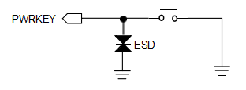
<figcaption>
<strong>图 8</strong><strong>：开机按键</strong>
</figcaption>
</figure>

**备注**

|                                                    |
|----------------------------------------------------|
| 如果需要上电开机，建议将PWRKEY通过1K电阻下拉到地。 |

1.  **硬件复位**

    模块第15引脚为硬件复位输入端，低电平有效。RESET_N内部上拉到1.8V，拉低RESET_N引脚持续1s后释放可使模块复位重启。RESET_N信号对干扰比较敏感，因此建议在模块接口板上的走线应尽量的短，且需包地处理。

<figure>
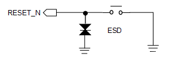
<figcaption>
<strong>图 9</strong><strong>：复位参考电路</strong>
</figcaption>
</figure>

**备注**

|  |
|:---|
| 建议仅在紧急情况下，比如模块无响应时，再使用RESET_N引脚。此外，模块关机状态下RESET_N引脚是无效的。 |

1.  **(U)SIM卡**

    1.  **管脚描述**

DX-CT511/DX-CT511N模块支持并能自动检测1.8V和3.0V的(U)SIM卡。(U)SIM卡接口信号如下表所示。

|          |              |                    |                                |
|:--------:|:-------------|:-------------------|:-------------------------------|
| **管脚** | **信号名称** | **信号定义**       | **信号说明**                   |
|    11    | USIM_DATA    | (U)SIM卡数据管脚   | (U)SIM卡数据信号，双向信号     |
|    12    | USIM_RST     | (U)SIM卡复位管脚   | (U)SIM卡复位信号，由模块输出   |
|    13    | USIM_CLK     | (U)SIM卡时钟管脚   | (U)SIM卡时钟信号，由模块输出   |
|    14    | USIM_VDD     | (U)SIM卡电源       | (U)SIM卡电源，由模块输出       |
|    79    | USIM_DET     | (U)SIM卡热插检测脚 | (U)SIM卡热插检测信号，输入信号 |

**表 7****：(U)SIM卡信号定义及说明**

2.  **(U)SIM卡接口应用**

(U)SIM卡信号组（管脚号：11，12，13，14），在靠近(U)SIM卡卡座的线路上，设计时需要增加ESD保护器件。

为了满足3GPP TS 31.101协议以及EMC认证要求，建议(U)SIM卡座布置在靠近模块(U)SIM卡接口的位置，避免因走线过长，导致波形严重变形，影响信号完整性。USIM_CLK和USIM_DATA信号线走线必须包地保护。在USIM_VDD和GND之间并联一个1uF的电容，滤除射频信号的干扰。(U)SIM外围电路如图所示。

<figure>
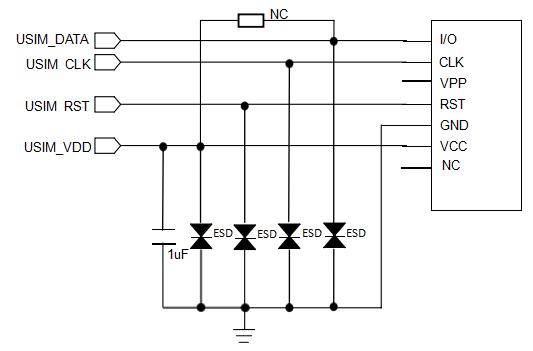
<figcaption>
<strong>图 10</strong><strong>：(U)SIM卡信号连接电路</strong>
</figcaption>
</figure>

**备注**

|  |
|:---|
| ESD器件容值建议小于22pF。如果要使用(U)SIM卡热插拔功能需要选用带热插拔检测PIN的(U)SIM卡座。 |

2.  **USB接口**

    1.  **管脚描述**

        模块的USB接口符合USB2.0 规范和电气特性。支持low-speed ,full-speed和high-speed三种工作模式。主处理器（AP）与模块之间的数据交互主要通过USB接口完成。模块的USB只支持从模式。

        USB总线主要用于数据传输、固件升级、模块程序检测以及可以虚拟成串口模式发送AT命令。USB 的DM/DP数据线上外部需要加ESD器件，ESD器件的负载电容必须小于3pF。差分数据线的差分阻抗需控制在90ohm±10%，上下左右包地，不能与其它走线交叉。USB连接电路如下图。

<table style="width:100%;">
<caption><blockquote>

<strong>表 8</strong><strong>：USB接口管脚定义</strong>

</blockquote></caption>
<colgroup>
<col style="width: 15%" />
<col style="width: 20%" />
<col style="width: 27%" />
<col style="width: 12%" />
<col style="width: 12%" />
<col style="width: 12%" />
</colgroup>
<tbody>
<tr>
<td rowspan="2" style="text-align: center;"><strong>管脚</strong></td>
<td rowspan="2" style="text-align: center;"><strong>信号名称</strong></td>
<td rowspan="2" style="text-align: center;"><strong>信号定义</strong></td>
<td colspan="3" style="text-align: center;"><strong>直流特性</strong></td>
</tr>
<tr>
<td style="text-align: center;"><strong>最小值</strong></td>
<td style="text-align: center;"><strong>典型值</strong></td>
<td style="text-align: center;"><strong>最大值</strong></td>
</tr>
<tr>
<td style="text-align: center;">59</td>
<td style="text-align: center;">USB_DP</td>
<td style="text-align: center;">USB2.0 数据信号 D+</td>
<td style="text-align: center;">-</td>
<td style="text-align: center;">-</td>
<td style="text-align: center;">-</td>
</tr>
<tr>
<td style="text-align: center;">60</td>
<td style="text-align: center;">USB_DM</td>
<td style="text-align: center;">USB2.0 数据信号 D-</td>
<td style="text-align: center;">-</td>
<td style="text-align: center;">-</td>
<td style="text-align: center;">-</td>
</tr>
<tr>
<td style="text-align: center;">61</td>
<td style="text-align: center;">USB_VBUS</td>
<td style="text-align: center;">USB 电源检测</td>
<td style="text-align: center;">4.5V</td>
<td style="text-align: center;">5V</td>
<td style="text-align: center;">5.5V</td>
</tr>
</tbody>
</table>

<figure>
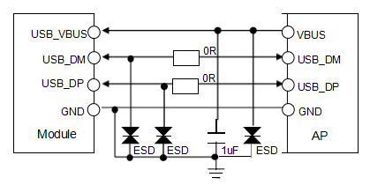
<figcaption>
<strong>图 11</strong><strong>：(U)SIM卡信号连接电路</strong>
</figcaption>
</figure>

**备注**

<table style="width:99%;">
<colgroup>
<col style="width: 99%" />
</colgroup>
<tbody>
<tr>
<td style="text-align: left;">
1、如果使用串口通信，模块的USB_VBUS，USB_DM/DP信号需要分别预留一个测试点方便调试过程中升级软件；

2、如果使用USB_DM/DP与MCU通信，靠近模块的USB_DM/DP信号的位置需要分别预留一个测试点并且USB_DM/DP的信号线上需要串联0R电阻，电阻靠近模块摆放，测试点的位置放在模块与电阻之间。
</td>
</tr>
</tbody>
</table>

3.  **UART接口**

    1.  **管脚描述**

DX-CT511/DX-CT511N模块提供三路串行通信接口UART：其中MAIN_UART作为模块全功能的串行异步通讯接口，支持标准调制解调器握手信号的信号控制，符合RS-232接口协议，也支持4线串行总线接口或者2线串行总线接口模式，模块可以通过MAIN_UART接口与外界进行串行通信和AT指令输入等；DBG_UART作为L511C-2系列模块的调试串口，为2线UART接口；AUX_UART跟模块内部的GNSS的串口复用，如果模块配置没有GNSS的功能，这组串口可以用来接外设。

这三组UART口支持可编程的数据宽度，可编程的数据停止位，可编程的奇偶校验位，具有独立的TX和RX FIFOs。MAIN_UART支持2400，4800，9600bps，14400bps，19200bps，38400bps，57600bps，76800bps，115200bps和230400bps波特率，默认波特率为115200bps，用于数据传输和AT命令传送。DBG_UART支持115200bps波特率，用于部分日志输出。

管脚信号定义如下表所示。

|  |  |  |  |
|:--:|:---|:---|:---|
| **管脚** | **信号名称** | **I/O类型** | **功能描述** |
| 17 | MAIN_RXD | DI | Main UART receive data input |
| 18 | MAIN_TXD | DO | Main UART transmit data output |
| 19 | MAIN_DTR | DI | Main UART data terminalready（wake up module） |
| 20 | MAIN_RI | DO | Main UART ring indicator |
| 21 | MAIN_DCD | DO | Main UART data carrier detect |
| 22 | MAIN_CTS | DO | Main UART clear to send |
| 23 | MAIN_RTS | DI | Main UART request to send |
| 28 | AUX_RXD | DI | Auxiliary UART receive data input |
| 29 | AUX_TXD | DO | Auxiliary UART transmit data output |
| 38 | DBG_RXD | DI | Debug UART receive data input |
| 39 | DBG_TXD | DO | Debug UART transmit data output |

**表 9****：UART信号定义**

**备注**

|                                                        |
|:-------------------------------------------------------|
| 只有模块配置不支持GNSS功能，AUX_UART才可以用来接外设。 |

2.  **UART接口应用**

MAIN_UART如果使用在模块与应用处理器通讯的时候，且电平在1.8V匹配时，连接方式如图12和图13所示，可以采用完整的RS232模式，4线模式或者2线模式连接。由于该模块的串口电压域是1.8V，若客户的应用系统的电压域是3.3V，则需要在模块和客户应用系统的串口连接中增加电平转换芯片。建议使用德州仪器的TXB0108RGYR，如图14所示。

<figure>

<figcaption>
<strong>图 12</strong><strong>：模块串口与AP应用处理器4线接法</strong>
</figcaption>
</figure>

<figure>

<figcaption>
<strong>图 13</strong><strong>：模块串口与 AP 应用处理器完整接法</strong>
</figcaption>
</figure>

<figure>

<figcaption>
<strong>图 14</strong><strong>：电平转换参考电路</strong>
</figcaption>
</figure>

4.  **I2C接口**

DX-CT511/DX-CT511N模块提供2组I2C接口，其中1组I2C可以连接需要用到I2C接口进行通信的外设（例如sensor、Codec等），CAM_I2C建议只用来外接camera的I2C接口。

<table style="width:99%;">
<caption><blockquote>

<strong>表 10</strong><strong>：I2C接口描述</strong>

</blockquote></caption>
<colgroup>
<col style="width: 17%" />
<col style="width: 27%" />
<col style="width: 23%" />
<col style="width: 30%" />
</colgroup>
<tbody>
<tr>
<td style="text-align: center;"><strong>管脚</strong></td>
<td style="text-align: center;"><strong>信号名称</strong></td>
<td style="text-align: center;"><strong>Mode</strong></td>
<td style="text-align: center;"><strong>备注</strong></td>
</tr>
<tr>
<td style="text-align: center;">57</td>
<td style="text-align: center;">CAM_I2C_SCL</td>
<td rowspan="4" style="text-align: center;">100KHz/400KHz</td>
<td rowspan="4" style="text-align: center;">需要外部加4.7K上拉电阻到1.8V</td>
</tr>
<tr>
<td style="text-align: center;">58</td>
<td style="text-align: center;">CAM_2C_SDA</td>
</tr>
<tr>
<td style="text-align: center;">66</td>
<td style="text-align: center;">I2C_SDA</td>
</tr>
<tr>
<td style="text-align: center;">67</td>
<td style="text-align: center;">I2C_SCL</td>
</tr>
</tbody>
</table>

5.  **状态指示接口**

    1.  **网络指示灯控制电路**

模块有NET_STATUS一个网络状态引脚。参考电路如图所示。

<figure>
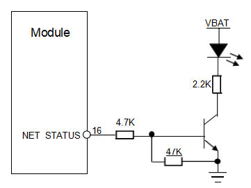
<figcaption>
<strong>图 15</strong><strong>：NET_STATUS电路</strong>
</figcaption>
</figure>

2.  **网络指示引脚状态描述**

NET_STATUS（PIN16）在不同网络状态下的逻辑电平变化如表所示。

|                   |              |
|:-----------------:|:------------:|
|    **LED状态**    | **模块状态** |
|       熄灭        |     关机     |
| 64ms亮/800ms熄灭  |  未注册网络  |
| 64ms亮/3000ms熄灭 |   注册网络   |

**表 11****：网络状态指示引脚的工作状态**

**备注**

|                                                              |
|:-------------------------------------------------------------|
| 在非休眠模式下，网络状态指示灯常亮时，说明模块处于异常状态。 |

**\**

6.  **交互应用接口**

    1.  **管脚描述**

下表所示的接口主要是与应用处理器交互的接口，包括唤醒（唤醒包括唤醒模块和模块唤醒外设）和状态查询两种类型接口。

|          |              |             |                        |
|:--------:|:------------:|:-----------:|:----------------------:|
| **管脚** | **信号名称** | **I/O类型** |      **功能描述**      |
|    19    |   MAIN_DTR   |     DI      | 模块休眠唤醒的输入信号 |

**表 12****：休眠唤醒指示引脚的工作状态**

2.  **接口应用**

DX-CT511/DX-CT511N模块提供了与应用处理器通信的直接交互信号。

- MAIN_DTR：模块进入睡眠后，主机可以通过置低该信号唤醒模块，主机置高电平后，模块允许进入睡眠。

  1.  **ADC接口**

模块提供两路ADC，用于检测光敏电阻或者其它需要ADC检测的设备等。ADC支持12bit精度且ADC最大值为1.2V。如下表所示。

|              |            |            |            |          |
|:------------:|:----------:|:----------:|:----------:|:--------:|
|   **特性**   | **最小值** | **典型值** | **最大值** | **单位** |
| 输入电压范围 |    0.05    |     \-     |    1.2     |    V     |

**表 13****：ADC特性**

# 电气特性和可靠性

1.  **电气特性**

|          |            |          |            |          |
|:--------:|:----------:|:--------:|:----------:|:--------:|
| **参数** | **最小值** | **典型** | **最大值** | **单位** |
|   VBAT   |    3.3     |   3.8    |    4.5     |    V     |
| 峰值电流 |    -0.3    |    \-    |    1.2     |    V     |

**表 14****：电气特性**

**备注**

|  |
|:---|
| 电压过低可能导致模块无法正常开机；电压过高或者开机过冲也可能对模块造成永久性损坏。 |

2.  **温度特性**

|              |            |          |            |          |
|:------------:|:----------:|:--------:|:----------:|:--------:|
|   **参数**   | **最小值** | **典型** | **最大值** | **单位** |
| 正常工作温度 |    -40     |    25    |     85     |    ºC    |
|   存储温度   |    -45     |    25    |     90     |    ºC    |

**表 15****：温度特性**

**备注**

|  |
|:---|
| 当工作温度超过模块工作温度时，模块的一些射频性能可能会恶化，也可能会引起关机、重启等故障。 |

3.  **绝对最大额度参数**

|              |                      |            |            |            |          |
|:------------:|:--------------------:|:----------:|:----------:|:----------:|:--------:|
| **引脚名称** |       **描述**       | **最小值** | **典型值** | **最大值** | **单位** |
|   VDD_EXT    | Digital power for IO |    -0.3    |     \-     |     +2     |    V     |
|     VBAT     |     Power supply     |    -0.3    |     \-     |     +5     |    V     |

**表 16****：电源绝对最大额定值表**

**\**

4.  **推荐操作条件**

|              |                      |            |          |            |          |
|:------------:|:--------------------:|:----------:|:--------:|:----------:|:--------:|
| **引脚名称** |       **描述**       | **最小值** | **典型** | **最大值** | **单位** |
|   USB_VBUS   |     USB电源检测      |    4.5     |    5     |    5.5     |    V     |
|   VDD_EXT    | Digital power for IO |    1.7     |   1.8    |    1.98    |    V     |

**表 17****：电源的推荐操作范围**

5.  **电源功耗**

<table style="width:100%;">
<caption><blockquote>

<strong>表 18</strong><strong>：功耗表</strong>

</blockquote></caption>
<colgroup>
<col style="width: 19%" />
<col style="width: 35%" />
<col style="width: 12%" />
<col style="width: 12%" />
<col style="width: 11%" />
<col style="width: 8%" />
</colgroup>
<tbody>
<tr>
<td style="text-align: center;"><strong>模式</strong></td>
<td style="text-align: center;"><strong>测试场景</strong></td>
<td style="text-align: center;"><strong>最小值</strong></td>
<td style="text-align: center;"><strong>平均值</strong></td>
<td style="text-align: center;"><strong>最大值</strong></td>
<td style="text-align: center;"><strong>Unit</strong></td>
</tr>
<tr>
<td style="text-align: center;">Power off mode</td>
<td style="text-align: center;">VBAT=3.8V</td>
<td style="text-align: center;">-</td>
<td style="text-align: center;">7</td>
<td style="text-align: center;">-</td>
<td style="text-align: center;">uA</td>
</tr>
<tr>
<td rowspan="2" style="text-align: center;">Flight mode</td>
<td style="text-align: center;">VBAT=3.8V(DX-CT511)</td>
<td style="text-align: center;">-</td>
<td style="text-align: center;">0.55</td>
<td style="text-align: center;">-</td>
<td style="text-align: center;">mA</td>
</tr>
<tr>
<td style="text-align: center;">VBAT=3.8V(DX-CT511N)</td>
<td style="text-align: center;">-</td>
<td style="text-align: center;">0.77</td>
<td style="text-align: center;">-</td>
<td style="text-align: center;">mA</td>
</tr>
<tr>
<td rowspan="2" style="text-align: center;">LTE Standby</td>
<td style="text-align: center;">VBAT=3.8V(DX-CT511)</td>
<td style="text-align: center;">-</td>
<td style="text-align: center;">0.75</td>
<td style="text-align: center;">-</td>
<td style="text-align: center;">mA</td>
</tr>
<tr>
<td style="text-align: center;">VBAT=3.8V(DX-CT511NN)</td>
<td style="text-align: center;">-</td>
<td style="text-align: center;">0.96</td>
<td style="text-align: center;">-</td>
<td style="text-align: center;">mA</td>
</tr>
<tr>
<td style="text-align: center;">Peak current</td>
<td style="text-align: center;">VBAT=3.8V</td>
<td style="text-align: center;">-</td>
<td style="text-align: center;">-</td>
<td style="text-align: center;">1.2</td>
<td style="text-align: center;">A</td>
</tr>
</tbody>
</table>

**备注**

|                          |
|:-------------------------|
| 功耗为实验室仪表测得值。 |

6.  **数字接口特性**

|          |            |              |            |              |          |
|:--------:|:----------:|:------------:|:----------:|:------------:|:--------:|
| **参数** |  **描述**  |  **最小值**  | **典型值** |  **最大值**  | **Unit** |
|   VIH    | 输入高电平 | 0.7\*VDD_EXT |    1.8     |     1.98     |    V     |
|   VIL    | 输入低电平 |      0       |     \-     | 0.3\*VDD_EXT |    V     |
|   VOH    | 输入高电平 | 0.8\*VDD_EXT |    1.8     |     1.98     |    V     |
|   VOL    | 输入低电平 |      0       |     \-     | 0.2\*VDD_EXT |    V     |

**表 19****：模块数字接口特性**

**备注**

|                                    |
|:-----------------------------------|
| 适用于GPIO，UART，I2C，PCM等接口。 |

7.  **上电时序**

    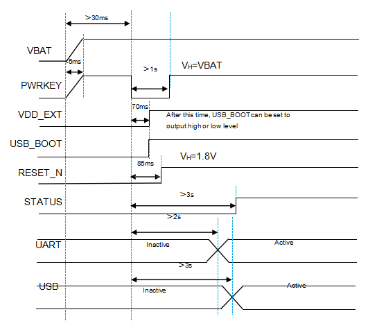

**图 16****：上电时序图**

8.  **静电防护**

    在模块应用中，静电可能会对模块造成一定的损坏,因此在生产，装配和操作模块时必须意静电防护。模块测试的性能参数如下表：

    ESD性能参数（温度：25℃，湿度：45%）

|              |              |              |          |
|:------------:|:------------:|:------------:|:--------:|
| **测试接口** | **接触放电** | **空气放电** | **单位** |
| VBAT 和 GND  |      +5      |     +10      |    kV    |
|  主天线接口  |      +5      |     +10      |    kV    |

**表 20****：模块引脚的ESD耐受电压情况表**

加强ESD性能方法：

- 如果客户带转接板，转接板的地脚尽量多，并且均匀分布，地导通路径宽；

- 按键（包括开机键，强制下载键和复位键）需要加ESD器件；复位键走线不要靠板边；

- UART以及其它插接线需要加ESD器件，从模块外拉出来的控制线也需要加ESD器件；

- 用户插取(U)SIM卡会触摸的地方也需要加ESD器件；

- 外置天线请加ESD器件，ESD器件负载电容小于0.1pF。

  **备注**

<table style="width:99%;">
<colgroup>
<col style="width: 99%" />
</colgroup>
<tbody>
<tr>
<td style="text-align: left;">
1、为了保证ESD性能，请依照以上措施加强ESD性能；

2、ESD器件可用压敏电阻和TVS管，如果性能要求更高，请用TVS管；

3、电源上ESD器件请注意电压范围选择。
</td>
</tr>
</tbody>
</table>

# 射频功能介绍

1.  **射频主要特性**

- 支持 FDD/TDD LTE Rel-13 Cat.1bis；

- 支持 WIFI SCAN 功能；

- 支持 LTE 频段 B1/B3/B5/B8/B34/B38/B39/B40/B41。

本产品的收发射机的工作频段范围如下表所示。

|              |                        |                          |
|:------------:|:----------------------:|:------------------------:|
| **工作频段** | **上行频段（Uplink）** | **下行频段（Downlink）** |
|  FDD Band1   |    1920MHz~1980MHz     |     2110MHz~2170MHz      |
|  FDD Band3   |    1710MHz~1785MHz     |     1805MHz~1880MHz      |
|  FDD Band5   |     824MHz~849MHz      |      869MHz~894MHz       |
|  FDD Band8   |     880MHz~915MHz      |      925MHz~960MHz       |
|  TDD Band34  |    2010MHz~2025MHz     |     2010MHz~2025MHz      |
|  TDD Band38  |    2570MHz~2620MHz     |     2570MHz~2620MHz      |
|  TDD Band39  |    1880MHz~1920MHz     |     1880MHz~1920MHz      |
|  TDD Band40  |    2300MHz~2400MHz     |     2300MHz~2400MHz      |
|  TDD Band41  |    2496MHz~2690MHz     |     2496MHz~2690MHz      |

**表 21****：工作频段**

|            |              |              |
|:----------:|:------------:|:------------:|
|  **频段**  | **最大功率** | **最小功率** |
| FDD Band1  |  23dBm±2dB   |   \<-40dBm   |
| FDD Band3  |  23dBm±2dB   |   \<-40dBm   |
| FDD Band5  |  23dBm±2dB   |   \<-40dBm   |
| FDD Band8  |  23dBm±2dB   |   \<-40dBm   |
| TDD Band34 |  23dBm±2dB   |   \<-40dBm   |
| TDD Band38 |  23dBm±2dB   |   \<-40dBm   |
| TDD Band39 |  23dBm±2dB   |   \<-40dBm   |
| TDD Band40 |  23dBm±2dB   |   \<-40dBm   |
| TDD Band41 |  23dBm±2dB   |   \<-40dBm   |

**表 22****：输出功率**

|              |                           |
|:------------:|:-------------------------:|
| **工作频段** | **REF SENS@10MHz(Total)** |
|  FDD Band1   |         ≦-96.3dBm         |
|  FDD Band3   |         ≦-93.3dBm         |
|  FDD Band5   |         ≦-94.3dBm         |
|  FDD Band8   |         ≦-93.3dBm         |
|  FDD Band34  |         ≦-96.3dBm         |
|  FDD Band38  |         ≦-96.3dBm         |
|  FDD Band39  |         ≦-96.3dBm         |
|  FDD Band40  |         ≦-96.3dBm         |
|  FDD Band41  |         ≦-94.3dBm         |

**表 23****：接收灵敏度**

1.  **天线电路设计**

本产品射频天线的接入部分采用PAD焊盘形式。模块天线焊盘与客户母板天线接口之间需要通过焊盘焊接并通过微带线或带状线来连接。其中微带线或带状线按特性阻抗按50欧姆设计，走线长度小于10mm，同时预留Π型匹配电路。

产品天线外围电路设计时建议射频电路的Layout方案：射频线走第一层，参考二层地平面。用户在设计PCB走线时需要注意：射频路径需要完整参考地平面。

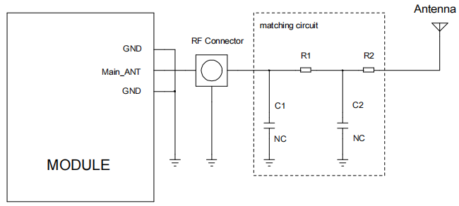

**图 17****：天线匹配网络**

图中R1,C1,C2和R2组成天线匹配网络用作天线调试，默认R1,R2贴0欧姆电阻 C1,C2 空贴，待天线厂调试天线后确定值。

图中RF connector留作测试传导测试使用（如认证 CE,FCC 等），需尽量靠近模块摆放，从模块焊盘至天线馈点的射频路径需保持50欧姆阻抗控制。

在 layout 设计中，天线射频传输线必须要保证特性阻抗=50欧姆，这个特性阻抗由基板板材，走线宽度和离地平面距离共同决定。下图所示的是layout中天线路径的参考设计。

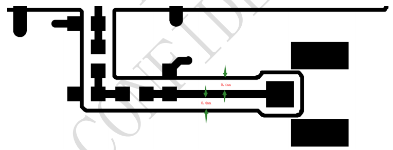

**图 18****：天线路径参考设计**

2.  **天线设计**

内置天线建议采用PIFA或者IFA天线；外置天线采用鞭状天线。天线增益建议在3dBi 左右。内置天线面积建议：100mm\*10mm\*6mm (长\*宽\*高)，PCBA长度大于90mm。天线周边5cm内避开Speaker，马达，MIC，camera FPC，camera 本体，LCD FPC，开关电源，高速信号线，Memory，CPU等易产生EMI的器件和模块。

<table style="width:99%;">
<caption><blockquote>

<strong>表 24</strong><strong>：天线参数</strong>

</blockquote></caption>
<colgroup>
<col style="width: 16%" />
<col style="width: 19%" />
<col style="width: 63%" />
</colgroup>
<tbody>
<tr>
<td colspan="2" style="text-align: center;"><strong>天线参数</strong></td>
<td style="text-align: center;"><strong>参数要求</strong></td>
</tr>
<tr>
<td colspan="2" style="text-align: center;">天线效率</td>
<td style="text-align: center;">&gt;40%</td>
</tr>
<tr>
<td colspan="2" style="text-align: center;">S11/VSWR</td>
<td style="text-align: center;">&lt;-10dB</td>
</tr>
<tr>
<td colspan="2" style="text-align: center;">极化方式</td>
<td style="text-align: center;">线极化</td>
</tr>
<tr>
<td rowspan="3" style="text-align: center;">TRP</td>
<td style="text-align: center;">Low Band</td>
<td style="text-align: center;">&gt;18dBm</td>
</tr>
<tr>
<td style="text-align: center;">Middle Band</td>
<td style="text-align: center;">&gt;18dBm</td>
</tr>
<tr>
<td style="text-align: center;">High Band</td>
<td style="text-align: center;">&gt;18dBm</td>
</tr>
<tr>
<td rowspan="3" style="text-align: center;">TIS</td>
<td style="text-align: center;">Low Band</td>
<td style="text-align: center;">&lt;-92dBm（@10MHz）</td>
</tr>
<tr>
<td style="text-align: center;">Middle Band</td>
<td style="text-align: center;">&lt;-92dBm（@10MHz）</td>
</tr>
<tr>
<td style="text-align: center;">High Band</td>
<td style="text-align: center;">&lt;-92dBm（@10MHz）</td>
</tr>
<tr>
<td colspan="2" style="text-align: center;">Low Band</td>
<td style="text-align: center;">Band 5/8</td>
</tr>
<tr>
<td colspan="2" style="text-align: center;">Middle Band</td>
<td style="text-align: center;">Band 1/3/34/39</td>
</tr>
<tr>
<td colspan="2" style="text-align: center;">High Band</td>
<td style="text-align: center;">Band 38/40/41</td>
</tr>
</tbody>
</table>

3.  **GNSS介绍**

    1.  **GNSS天线选择和天线设计**

        为了获得良好的GNSS接收性能，需要选择一个良好的天线。正确的天线选择和放置可以确保接收到所有高度的卫星信号，从而获得快速精确的定位。

        模块内置的GNSS有两种天线选择：

- 无源天线

- 有源天线

  推荐的有源天线和无源天线技术参数如表所示。

<table style="width:99%;">
<caption><blockquote>

<strong>表 25</strong><strong>：天线技术参数</strong>

</blockquote></caption>
<colgroup>
<col style="width: 27%" />
<col style="width: 41%" />
<col style="width: 30%" />
</colgroup>
<tbody>
<tr>
<td style="text-align: center;"><strong>天线类型</strong></td>
<td colspan="2" style="text-align: center;"><strong>参数</strong></td>
</tr>
<tr>
<td rowspan="3" style="text-align: center;">无源天线</td>
<td style="text-align: center;">Frequency range</td>
<td style="text-align: center;">1558-1607MHz</td>
</tr>
<tr>
<td style="text-align: center;">Polarization</td>
<td style="text-align: center;">RHCP &amp; Linear</td>
</tr>
<tr>
<td style="text-align: center;">Gain</td>
<td style="text-align: center;">&gt;0dBi</td>
</tr>
<tr>
<td rowspan="4" style="text-align: center;">有源天线</td>
<td style="text-align: center;">Frequency range</td>
<td style="text-align: center;">1558-1607MHz</td>
</tr>
<tr>
<td style="text-align: center;">Polarization</td>
<td style="text-align: center;">RHCP &amp; Linear</td>
</tr>
<tr>
<td style="text-align: center;">Noise Figure</td>
<td style="text-align: center;">&lt;1.5dB</td>
</tr>
<tr>
<td style="text-align: center;">Gain</td>
<td style="text-align: center;">&gt;10dBi</td>
</tr>
</tbody>
</table>

1.  **无源天线**

    无源天线是只有辐射原件的天线，比如陶瓷天线、螺旋天线、贴片天线。无源天线有时还包含匹配器件，用来做50欧姆的匹配。

    GNSS应用中最常用的是贴片天线，贴片天线是平面的结构，包含陶瓷体和金属天线本体，并且安装在一个金属底板上。

    DX-CT511/DX-CT511N模块的GNSS天线最简化的无源天线设计电路如图所示。

    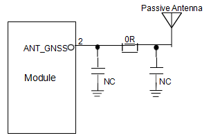

**图 19****：GNSS无源天线设计**

2.  **有源天线**

    有源天线具有集成的低噪声放大器LNA,需要外部供电，这有助于GNSS系统的功耗。有源天线推荐电路如图所示。电感L1是隔离有源天线端射频信号导入电源，推荐值不小于27nH。R1的作用是当有源天线端对地短路时保护整个电路。

    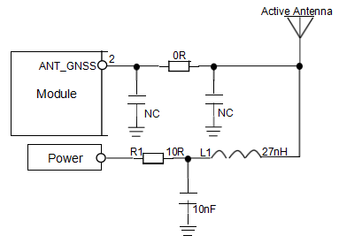

**图 20****：GNSS有源天线设计**

# 机械尺寸及布局建议

本节描述了模块的机械尺寸，所有的尺寸单位为毫米；所有未标注公差的尺寸，公差为±0.3 mm

1.  **模块结构尺寸**

    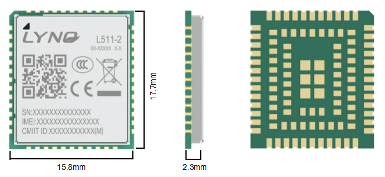

**图 21****：模块外围尺寸（正视图，背视图和侧视图）**

2.  **CT511-A/CT511N-A底板结构尺寸**

    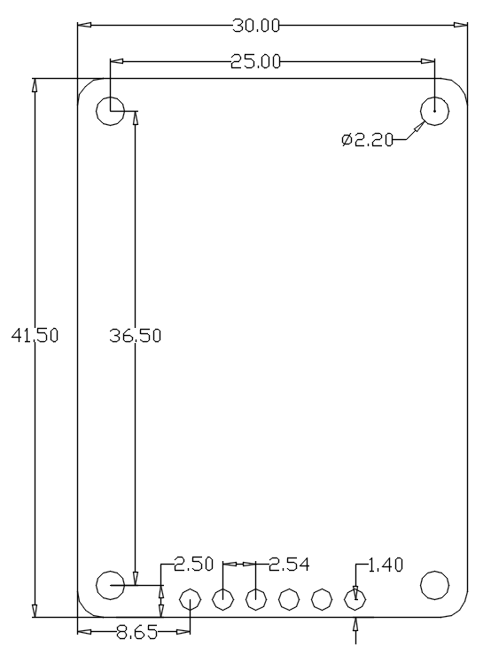

**图 22****：CT511-A/CT511N-A底板尺寸图**

3.  **CT511-B/CT511N-B Mini底板结构尺寸**

    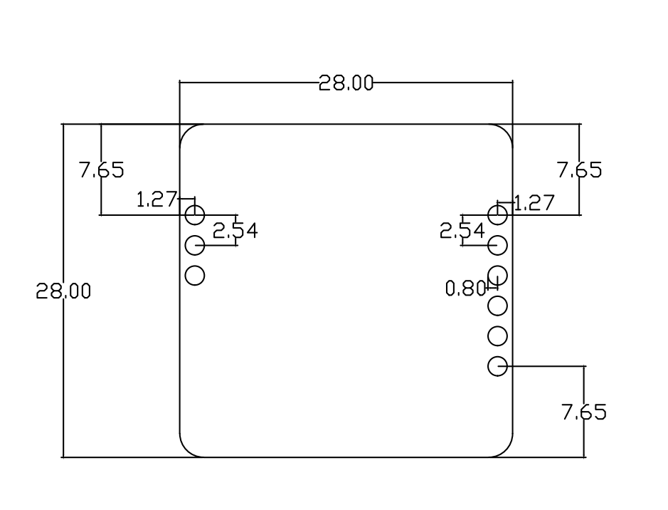

**图 23****：CT511-B/CT511N-B mini底板尺寸图**

4.  **产品标签**

    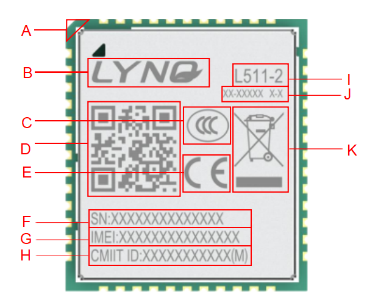

**图 24****：DX-CT511/DX-CT511N系列标签**

|          |                                     |
|:--------:|:-----------------------------------:|
| **编码** |              **描述**               |
|    A     |               Pin1脚                |
|    B     |              公司Logo               |
|    C     |               3C认证                |
|    D     | 二维码---包括IMEI number和SN number |
|    E     |               CE认证                |
|    F     |              SN number              |
|    G     |             IMEI number             |
|    H     |           CMIIT ID number           |
|    I     |              模块名字               |
|    J     |      模块的成品料号和模块配置       |
|    K     |                WEEE                 |

**表 26****：标签描述**

5.  **模块封装尺寸**

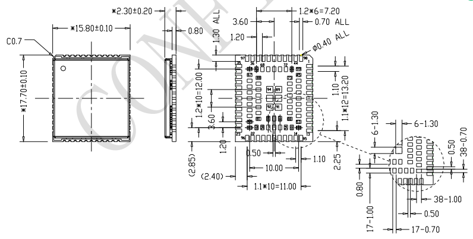

**图 25****：模块封装尺寸（单位：mm）**

**\**

6.  **模块封装推荐焊盘**

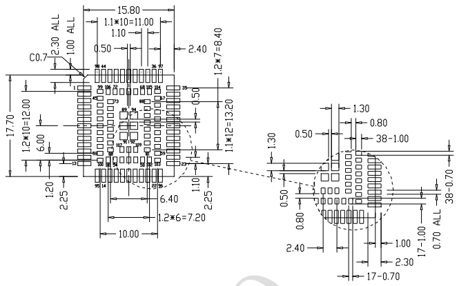

**图 26****：模块推荐焊盘（Top view 单位：mm）**

# 储存、生产和包装

1.  **物料存储**

模块防潮等级为三级，在成品的外包装箱和内包装袋的标贴上，都有明显的湿度敏感提示信息。

原始真空包装完整情况下（无破损、漏气），存储期限为12个月，存储环境要求为温度低于 40℃ ,湿度低于 90%且空气流通良好的情况下。

下表列出了不同的湿敏等级对应的模块保质期的时间。

|          |                                          |
|:--------:|:----------------------------------------:|
| **等级** |    **工厂环境23±5℃，相对湿度\<60%RH**    |
|    1     |           不做管控\<30℃/85%RH            |
|    2     |                   一年                   |
|    2a    |                   4周                    |
|    3     |                 168小时                  |
|    4     |                  72小时                  |
|    5     |                  48小时                  |
|    5a    |                  24小时                  |
|    6     | 使用前必须烘烤，并在标签规定的时间内过炉 |

**表 27****：湿度灵敏度等级**

**备注**

|                                                               |
|:--------------------------------------------------------------|
| 模块产品的搬运、储存、加工必须遵循IPC/JEDEC J-STD-033的要求。 |

2.  **生产贴片**

贴片模块是湿度敏感器件，如果要进行回流焊生产、后续拆卸维修，在成品存储、生产和维修工艺上，都要严格遵守湿敏器件要求。如果模块受潮后过回流焊或者用热风枪维修， 会导致模块内部的IC或者模块PCB，由于水汽的急剧膨胀而爆裂，造成器件物理损伤等不良，典型故障是PCB板起泡，BGA器件、射频模组爆裂失效等不良。所以，客户在使用模块时请参考下面的建议。

1.  **模块来料确认与防潮**

模块在生产和包装过程严格按照湿度敏感器件流程操作，出厂包装为真空袋+干燥剂+湿度指示卡包装，严格进行湿度管控。请客户在贴片前注意防潮管控，并对来料进行如下各个环节的确认。

1.  **烘烤需求确认**

模块统一采用真空包装出货，能够在包装没有损坏的情况下能够储存12个月，环境温度要求低于40℃且相对湿度小于90%。若满足下列之一的条件，在进行回流焊前应该进行充分的烘烤，否则模块可能在回流焊的过程中造成永久性的损坏:

- 存储时间超期；

- 看包装破损，真空包装漏气等；

- 湿度指示卡在10%处变色；

- 模块裸露静止在空气中放置168小时及以上；

- 模块裸露在空气168小时以内，不满足温度＜30℃和相对湿度＜60%的环境条件。

  1.  **烘烤条件确认**

模块的防潮等级为三级，烘烤条件如下。

|              |                 |                |
|:------------:|:---------------:|:--------------:|
| **烘烤条件** | **125±5℃/5%RH** | **45±5℃/5%RH** |
|   烘烤时间   |      8小时      |    192小时     |
|     说明     | 不能用原装托盘  | 可以用原装托盘 |

**表 28****：输出功率**

**备注**

<table style="width:99%;">
<colgroup>
<col style="width: 99%" />
</colgroup>
<tbody>
<tr>
<td>
1.原装的防静电托盘的耐温不超过50℃,否则托盘会变形。

2.原包装的防静电托盘仅用于包装使用，不能作为贴片托盘使用。

3.在取、放的过程中，要做好防静电措施，同时注意不可叠放。
</td>
</tr>
</tbody>
</table>

2.  **客户产品维修**

如果是炉后维修拆卸模块，受潮的模块很容易在拆卸时损坏，所以模块拆卸等相关维修操作，请在SMT后48小时内完成，否则需要烘烤后再拆卸模块。

从现场工程返回的客退品维修拆卸，因为模块无法确保干燥状态，必须要按照烘烤条件先烘烤，再对模块进行拆装维修。如果已经长时间暴露在潮湿环境中，请适当延长烘烤时间， 比如125℃/36小时。

1.  **SMT回流焊注意事项**

因模块内部为BGA芯片、贴片阻容等贴片物料，与PCB之间也是用焊锡连接，在高温下同样会融化。若在模块过炉时炉温过高，模块内部的焊锡也会完全融化，若在完全融锡状态下模块遇到较大的震动，比如回流焊炉内传送带的过度震动或者撞板，则模块内部的BGA 等器件很容易移位或假焊。所以，在使用智能模块过炉时需注意：

- 模块不能在过炉时产生较大震动，即要求客户尽量在有轨道（链条）的炉子里过炉，避免在铁丝网上过炉，以保证平顺过炉。

- 实际生产时最高炉温不能过高，在能满足客户母板和模块焊盘焊接质量的前提下，炉温越低，最高温度持续时间越短越好。

部分客户在上线时，炉温曲线不合适，炉温偏高，客户母板融锡情况很好，但炉后导致的模块不良率偏高，经分析原因为BGA芯片再次融锡后导致器件偏移、短路。所以请客户依照自己工厂的实际条件进行必要的调整。

1.  **SMT钢网设计与少锡假焊问题的改善建议**

模块在回流焊接时，有少部分客户出现了模块假焊或短路问题，主要原因是模块焊盘少锡和PCB板翘曲变形或者锡膏量太大等引起的，建议客户从如下几个方面进行验证改善：

- 建议采用阶梯钢网，模块区域建议钢网厚度大于周边器件钢网厚度，请根据锡膏实测厚度、和各公司实际条件与经验值验证调整，产品需严格经历试产、产能爬坡、量产等过程。

- 钢网网孔方式。参照模块封装，用户可根据各自公司经验值进行调整。模块四周焊盘外边的钢网向外扩。

  1.  **SMT贴片焊接注意事项**

如果客户母板较薄、细长等有过炉有变形、翘曲等风险，可能导致虚焊、少锡等，建议制作“过炉载具”来保证焊接质量。其他生产建议如下：

- 锡膏采用阿尔法等品牌的活性锡膏；

- 模块必须使用SMT机贴装（重要），不建议手工摆放或手工焊接；

- 为保证贴片质量,请依照贴片工厂的实际情况，在正常量产前，进行必要的工艺条件确认，如: SMT 中的贴片压力、速度（非常重要）、钢网的开孔方式等；

- 必须使用8温区以上的回流焊炉，并严格控制炉温曲线。

  炉温建议：

  B.恒温区：温度140-210°C，时间：60s-120s

  E.回流区：PEAK温度220-245 °C，时间：45s-75s

  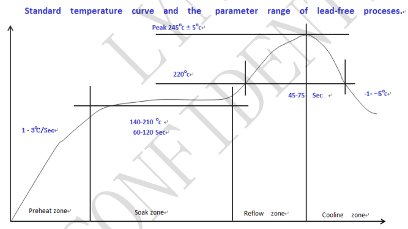

**图 27****：炉温曲线**

**备注**

<table style="width:99%;">
<colgroup>
<col style="width: 99%" />
</colgroup>
<tbody>
<tr>
<td>
客户的底板过炉后的形变必须做好控制；可以通过减少拼版数量或增加贴片夹具来减少形变。

模块的钢网厚度建议增厚，其余位置可以维持0.1mm。
</td>
</tr>
</tbody>
</table>

1.  **包装信息**

DX-CT511/DX-CT511N模块采用卷料带包装，并用真空密封防静电袋将其密封包装。

一个卷料带装500个模块，具体如下图所示。

<figure>
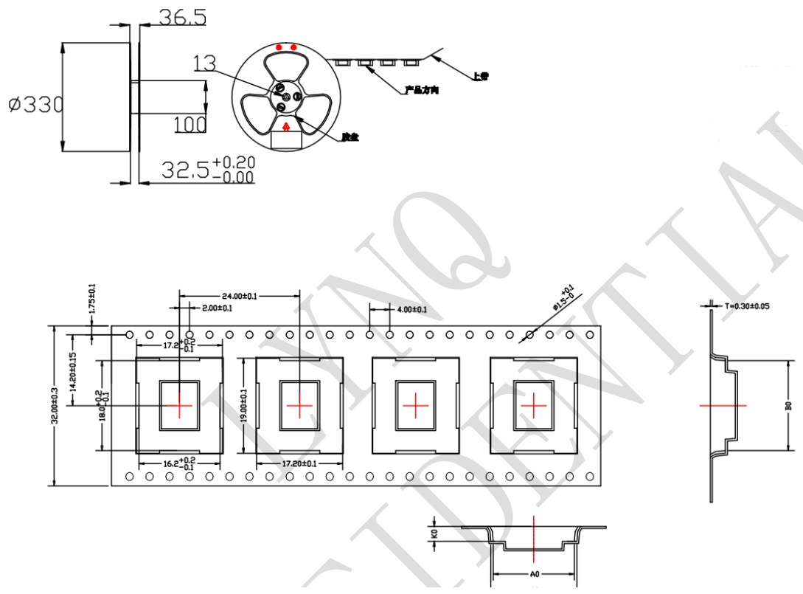
<figcaption>
<strong>图 28</strong><strong>：卷料带信息（单位：mm）</strong>
</figcaption>
</figure>

# 安全警告和注意事项

为保证模块功能更合理的得到利用，请注意在模块二次开发、使用及返修等过程中，需要遵照本章节的所有安全警告和注意事项。最终的产品集成方必须将如下的安全信息传递给用户、操作人员或集成产品的使用手册中。

|  |  |
|:---|:---|
|  | 在使用包括模块在内的射频设备时，可能会对一些屏蔽性能不好的电子设备造成干扰，请尽可能在远离普通电话、电视、收音机和办公自动化的地方使用，以免这些设备和模块相互影响。 |
|  | 登机前请关闭移动终端设备，或改为飞行模式。移动终端的无线功能在飞机上禁止开启使用，以防止对飞机通讯系统的干扰。忽略该提示项可能会导致飞行安全，甚至触犯法律。 |
|  | 当在医院或健康看护场所时，请注意是否有移动终端设备使用限制。射频干扰可能会导致医疗设备运行失常，可能需要关闭移动终端设备。例如助听器、植入耳蜗和心脏起搏器等，请先向该设备生产厂家咨询了解。 |
|  | 移动终端设备并不保障在任何情况下都能进行有效连接，例如在移动终端设备没有话费或(U)SIM无效时。当在紧急情况下遇见以上情况，请记住使用紧急呼叫，同时保证您的设备开机并且处于信号强度足够的区域。 |
|  | 请将移动终端设备远离易燃气体。当靠近加油站、油库、化工厂或爆炸作业场所时，请关闭移动终端设备。在任何有潜在爆炸危险的场所操作电子设备都有安全隐患。 |
|  | 本产品没有防水性能，请避免各种液体进入模块内部，请勿在浴室等高湿度的地方使用，以免造成物理性能下降、绝缘电阻降低、机械强度下降、以及产生腐蚀、生锈等损坏。 |
|  | 非专业人员，请勿自行拆开模块，以免造成人员及设备损伤。请参照本产品的使用说明，联系相关服务人员进行保养和维修。 |
|  | 清洁模块时，请先关机，清洁人员需配备防静电设备，例如穿戴防静电服、防静电手套等，并使用干净的防静电布，以免造成元件被击穿损坏。 |

用户或产品集成方有责任遵循国家关于无线通信模块及设备的相关规定和具体的使用环境法规， 我司不承担因产品集成方或用户未能遵循这些规定导致的相关损失。
