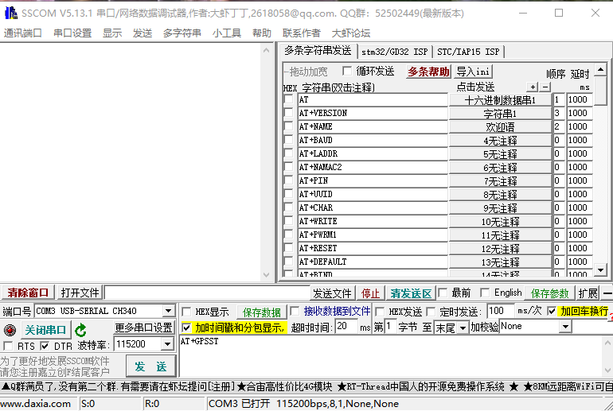

**DX-CT511/DX-CT511N**

**4G串口应用指导**

> 版本：2.2
>
> 日期：2026-6-12

**更新记录**

|          |            |                          |          |
|:--------:|:----------:|:------------------------:|:--------:|
| **版本** |  **日期**  |         **说明**         | **作者** |
|   V1.0   | 2023/10/10 |         初始版本         |   SML    |
|   V1.1   | 2023/12/20 |         增加示例         |   SML    |
|   V2.0   | 2024/02/18 |       增加GPS指令        |   SML    |
|   V2.1   | 2024/04/16 |     增加AT指令一览表     |   SML    |
|   V2.2   | 2026/06/12 | 更改查询定位信息指令错误 |   SML    |

**联系我们**

**深圳大夏龙雀科技有限公司**

邮箱：sales@szdx-smart.com

电话：0755-2997 8125

网址：[www.szdx-smart.com](http://www.szdx-smart.com)

地址：深圳市宝安区航城街道航空路庄边工业园厂房A栋4层

**目录**

[1. 引言 [- 5 -](#引言)](#引言)

[1.1. 串口基本参数 [- 5 -](#_Toc5020)](#_Toc5020)

[2. PC端测试工具 [- 5 -](#pc端测试工具)](#pc端测试工具)

[2.1. 电脑端测试软件 [- 5 -](#_Toc239)](#_Toc239)

[3. 串口使用 [- 6 -](#串口使用)](#串口使用)

[3.1. 使用串口读写AT命令 [- 6 -](#_Toc25258)](#_Toc25258)

[3.1.1. 模块测试最小系统 [- 6 -](#_Toc23463)](#_Toc23463)

[3.1.2. 模块指令示例 [- 7 -](#_Toc9918)](#_Toc9918)

[3.1.2.1. TCP示例 [- 7 -](#_Toc15382)](#_Toc15382)

[3.1.2.2. UDP示例 [- 8 -](#_Toc2529)](#_Toc2529)

[3.1.2.3. MQTT示例 [- 9 -](#_Toc24826)](#_Toc24826)

[3.1.2.4. HTTP示例 [- 9 -](#_Toc7280)](#_Toc7280)

[3.1.2.5. GNSS示例 [- 10 -](#_Toc24895)](#_Toc24895)

[4. 相关AT命令详解 [- 10 -](#相关at命令详解)](#相关at命令详解)

[4.1. 命令格式说明 [- 10 -](#_Toc7294)](#_Toc7294)

[4.2. 回应格式说明 [- 11 -](#_Toc27749)](#_Toc27749)

[4.3. AT命令一览表 [- 11 -](#_Toc10097)](#_Toc10097)

[5. AT命令详解 [- 13 -](#at命令详解)](#at命令详解)

[5.1. 基础指令 [- 13 -](#_Toc19371)](#_Toc19371)

[5.1.1. 测试指令 [- 13 -](#_Toc32020)](#_Toc32020)

[5.1.2. 设置指令回显 [- 13 -](#_Toc9061)](#_Toc9061)

[5.1.3. 查询模块信息 [- 14 -](#_Toc12948)](#_Toc12948)

[5.1.4. 查询/设置串口波特率 [- 14 -](#_Toc3198)](#_Toc3198)

[5.1.5. 查询SIM卡ICCID [- 15 -](#_Toc32470)](#_Toc32470)

[5.1.6. 重启模块 [- 15 -](#_Toc2556)](#_Toc2556)

[5.2. 网络服务指令 [- 15 -](#_Toc23213)](#_Toc23213)

[5.2.1. 查询/设置网络注册状态 [- 15 -](#_Toc2075)](#_Toc2075)

[5.2.2. 查询信号质量 [- 16 -](#_Toc32637)](#_Toc32637)

[5.2.3. 配置APN [- 17 -](#_Toc16326)](#_Toc16326)

[5.2.4. 数据网络开关 [- 17 -](#_Toc23372)](#_Toc23372)

[5.2.5. 关闭数据网络 [- 18 -](#_Toc17546)](#_Toc17546)

[5.2.6. 同步服务器时间 [- 18 -](#_Toc8846)](#_Toc8846)

[5.2.7. 查询时间 [- 19 -](#_Toc5056)](#_Toc5056)

[5.2.8. 查询给定域名的IP地址 [- 19 -](#_Toc21792)](#_Toc21792)

[5.2.9. Ping目标地址 [- 20 -](#_Toc28172)](#_Toc28172)

[5.3. 功耗指令 [- 21 -](#_Toc30800)](#_Toc30800)

[5.3.1. 指令控制休眠设置 [- 21 -](#_Toc21980)](#_Toc21980)

[5.3.2. 硬件控制休眠设置 [- 21 -](#_Toc5601)](#_Toc5601)

[5.4. TCP/UDP相关指令 [- 22 -](#_Toc8901)](#_Toc8901)

[5.4.1. 配置TCP/UDP传输模式 [- 22 -](#_Toc20587)](#_Toc20587)

[5.4.2. 配置TCP/UDP心跳间隔 [- 22 -](#_Toc22776)](#_Toc22776)

[5.4.3. 建立TCP/UDP连接 [- 23 -](#_Toc8073)](#_Toc8073)

[5.4.4. TCP/UDP发送数据 [- 24 -](#_Toc11550)](#_Toc11550)

[5.4.5. 进入TCP/UDP透传模式 [- 25 -](#_Toc6836)](#_Toc6836)

[5.4.6. 退出TCP/UDP透传模式 [- 25 -](#_Toc8288)](#_Toc8288)

[5.4.7. 关闭TCP/UDP连接 [- 25 -](#_Toc12224)](#_Toc12224)

[5.5. MQTT相关命令 [- 26 -](#_Toc15720)](#_Toc15720)

[5.5.1. 配置MQTT客户端信息 [- 26 -](#_Toc19016)](#_Toc19016)

[5.5.2. 配置MQTT服务器信息 [- 26 -](#_Toc1684)](#_Toc1684)

[5.5.3. 连接MQTT服务器 [- 27 -](#_Toc23448)](#_Toc23448)

[5.5.4. 发布主题 [- 27 -](#_Toc26306)](#_Toc26306)

[5.5.5. 订阅主题 [- 28 -](#_Toc28376)](#_Toc28376)

[5.5.6. 取消订阅 [- 28 -](#_Toc16716)](#_Toc16716)

[5.5.7. 查询MQTT连接状态 [- 29 -](#_Toc4986)](#_Toc4986)

[5.5.8. 断开MQTT连接 [- 29 -](#_Toc25404)](#_Toc25404)

[5.5.9. 释放MQTT资源 [- 29 -](#_Toc30787)](#_Toc30787)

[5.6. HTTP相关指令 [- 29 -](#_Toc26298)](#_Toc26298)

[5.6.1. 开启HTTP服务 [- 29 -](#_Toc27753)](#_Toc27753)

[5.6.2. 关闭HTTP服务 [- 30 -](#_Toc22634)](#_Toc22634)

[5.6.3. 配置HTTP的URL信息 [- 30 -](#_Toc22543)](#_Toc22543)

[5.6.4. 发送HTTP请求 [- 30 -](#_Toc837)](#_Toc837)

[5.6.5. 设置请求头字段 [- 31 -](#_Toc27681)](#_Toc27681)

[5.6.6. 设置请求体数据 [- 31 -](#_Toc30528)](#_Toc30528)

[5.6.7. 提交请求体数据 [- 32 -](#_Toc13632)](#_Toc13632)

[5.6.8. HTTP错误码 [- 32 -](#_Toc3035)](#_Toc3035)

[5.7. GPS相关指令（模块名称带N的支持GNSS功能） [- 33 -](#_Toc2599)](#_Toc2599)

[5.7.1. GPS开关 [- 33 -](#_Toc11552)](#_Toc11552)

[5.7.2. 设置GPS模式 [- 33 -](#_Toc15882)](#_Toc15882)

[5.7.3. 设置NMEA数据输出 [- 34 -](#_Toc25467)](#_Toc25467)

[5.7.4. 查询定位信息 [- 34 -](#_Toc22922)](#_Toc22922)

[5.7.5. AGNSS辅助数据下载 [- 34 -](#_Toc14180)](#_Toc14180)

[5.7.6. AGNSS辅助数据应用 [- 35 -](#_Toc17460)](#_Toc17460)

[5.8. 错误码 [- 36 -](#_Toc14177)](#_Toc14177)

[6. 增值服务 [- 37 -](#增值服务)](#增值服务)

**图片索引**

[图 1 ：电脑端串口软件图 [- 6 -](#_Toc15038)](#_Toc15038)

[图 2 ：模块最小系统图 [- 7 -](#_Toc5152)](#_Toc5152)

# 引言

DX-CT511/DX-CT511N（模块名称带N的支持GNSS功能）是深圳大夏龙雀科技有限公司的一款4G模块，是为IoT行业研发的一款CAT1通信模组，采用LCC+LGA封装，尺寸为17.7mm×15.8mm×2.3mm。具备多种接口和丰富协议，多版本USB驱动，应用简单便捷。能很好满足客户对高性价比、低功耗的应用要求。该模组主要应用于POS、POC、共享经济、追踪器、IPC、智慧城市和智慧农业等场景。

1.  **串口基本参数**

- 模块串口默认参数：115200bps/8/n/1（波特率/数据位/无校验/停止位）

- 模块的三种模式：AT指令模式；数据传输模式；休眠模式

- 默认模式：AT指令模式

# PC端测试工具

1.  **电脑端测试软件**

> 电脑端测试软件请在资料包中下载安装sscom5.13.1电脑串口软件进行测试，串口软件界面如下图：

<figure>

<figcaption>
<strong>图 1</strong><strong>：电脑端串口软件图</strong>
</figcaption>
</figure>

# 串口使用

1.  **使用串口读写AT命令**

    1.  **模块测试最小系统**

**图 2****：模块最小系统图**

2.  **模块指令示例**

    1.  **TCP示例**

<!-- -->

1.  **TCP单连接**

<!-- -->

1.  配置APN：AT+QICSGP=1,1,"","",""

2.  开启移动网络：AT+NETOPEN

3.  建立连接会话：AT+CIPOPEN=1,"TCP","122.114.122.174",41017

4.  发送数据 (未指定长度)：AT+CIPSEND=1

    *注*：返回提示符 \> ，即可发送数据；数据发送完毕后需要以HEX格式发送1A作为结束符

5.  发送数据 (指定长度)：AT+CIPSEND=1,5

    *注*：返回提示符 \> ，即可发送数据；数据的长度需与\<length\>参数一致，不足则会等待数据输入

6.  关闭指定会话：AT+CIPCLOSE=1

<!-- -->

2.  **TCP多连接**

<!-- -->

1.  配置APN：AT+QICSGP=1,1,"","",""

2.  开启移动网络：AT+NETOPEN

3.  创建 会话0：AT+CIPOPEN=0,"TCP","122.114.122.174",41017

4.  创建 会话1：AT+CIPOPEN=1,"TCP","122.114.122.174",41017

5.  会话0发送数据 (未指定长度)：AT+CIPSEND=0

6.  会话1发送数据 (未指定长度)：AT+CIPSEND=1

    *注*：返回提示符 \> ，即可发送数据；数据发送完毕后需要以HEX格式发送1A作为结束符

7.  关闭 会话0：AT+CIPCLOSE=0

8.  关闭 会话1：AT+CIPCLOSE=1

<!-- -->

3.  **TCP透传**

<!-- -->

1.  配置APN：AT+QICSGP=1,1,"","",""

2.  设置为透传模式：AT+CIPMODE=1

3.  开启移动网络：AT+NETOPEN

4.  建立连接会话：AT+CIPOPEN=0,"TCP","122.114.122.174",41017

    *注*：1. 返回提示符 \> ，即可发送数据，该模式下可一直收发数据

<!-- -->

2.  退出透传模式：发送+++，该指令无结束符，即指令结尾无回车换行

3.  进入透传模式：ATO

<!-- -->

5.  关闭会话：AT+CIPCLOSE=0

    1.  **UDP示例**

<!-- -->

1.  **UDP单连接**

<!-- -->

1.  配置APN：AT+QICSGP=1,1,"","",""

2.  开启移动网络：AT+NETOPEN

3.  建立UDP连接会话：AT+CIPOPEN=1,"UDP",,

4.  发送数据 (指定长度)：AT+CIPSEND=1,5,"182.148.114.87",6600

    *注*：返回提示符 \> ，即可发送数据；数据的长度需与\<length\>参数一致，不足则会等待数据输入

5.  关闭指定会话：AT+CIPCLOSE=1

<!-- -->

2.  **UDP多连接**

<!-- -->

1.  配置APN：AT+QICSGP=1,1,"","",""

2.  开启移动网络：AT+NETOPEN

3.  建立UDP会话0：AT+CIPOPEN=0,"UDP",,

4.  会话0发送数据 (指定长度)：AT+CIPSEND=0,5,"182.148.114.87",6600

    *注*：返回提示符 \> ，即可发送数据；数据的长度需与\<length\>参数一致，不足则会等待数据输入

5.  建立UDP会话1：AT+CIPOPEN=1,"UDP",,

6.  会话1发送数据 (指定长度)：AT+CIPSEND=1,5,"182.148.114.87",6600

    *注*：返回提示符 \> ，即可发送数据；数据的长度需与\<length\>参数一致，不足则会等待数据输入

7.  关闭 会话0：AT+CIPCLOSE=0

8.  关闭 会话1：AT+CIPCLOSE=1

<!-- -->

3.  **UDP透传**

<!-- -->

1.  配置APN：AT+QICSGP=1,1,"","",""

2.  设置为透传模式：AT+CIPMODE=1

3.  开启移动网络：AT+NETOPEN

4.  建立连接会话：AT+CIPOPEN=0,"UDP","122.114.122.174",41017

    *注*：1. 返回提示符 \> ，即可发送数据，该模式下可一直收发数据

<!-- -->

2.  退出透传模式：发送+++，该指令无结束符，即指令结尾无回车换行

3.  进入透传模式：ATO

<!-- -->

5.  关闭会话：AT+CIPCLOSE=0

    1.  **MQTT示例**

<!-- -->

1.  配置APN：AT+QICSGP=1,1,"","",""

2.  开启移动网络：AT+NETOPEN

3.  配置MQTT客户端信息：AT+MCONFIG="4G_TEST"

    *注*：如需配置用户名和密码等参数，可参考该手册5.5.1指令部分

4.  配置MQTT服务器信息：AT+MIPSTART="broker.emqx.io",1883

5.  连接MQTT服务器：AT+MCONNECT=1,60

6.  订阅主题：AT+MSUB="phone",0

7.  发布消息 ：AT+MPUB="4G",0,0,"hello world"

8.  发布长消息：AT+MPUBEX="4G",0,0,20

    *注*：1. 返回提示符 \> ，即可发送数据，发送成功后自动退出数据传输模式

<!-- -->

2.  发送的数据长度需要与\<msgLen\>参数一致，长度不足则会等待输入

    3\. 超过10秒未成功发送，则自动退出数据传输模式，返回ERROR

<!-- -->

9.  取消订阅：AT+MUNSUB="phone"

10. 断开MQTT连接：AT+MDISCONNECT

11. 释放MQTT资源：AT+MIPCLOSE

    1.  **HTTP示例**

<!-- -->

1.  **GET请求**

<!-- -->

1.  配置APN：AT+QICSGP=1,1,"","",""

2.  开启HTTP服务：AT\$HTTPOPEN

3.  配置URL信息：AT\$HTTPPARA=http://httpbin.org/get,80

4.  发送HTTP请求：AT\$HTTPACTION=0

5.  关闭HTTP服务：AT\$HTTPCLOSE

<!-- -->

2.  **POST请求 (小数据)**

<!-- -->

1.  配置APN：AT+QICSGP=1,1,"","",""

2.  开启HTTP服务：AT\$HTTPOPEN

3.  配置URL信息：AT\$HTTPPARA=http://httpbin.org/post,80

4.  设置请求头字段：AT\$HTTPRQH=Content-Length,10

5.  设置请求体数据：AT\$HTTPDATAEX=10,"ABCDE12345"

6.  发送HTTP请求：AT\$HTTPACTION=3

7.  关闭HTTP服务：AT\$HTTPCLOSE

<!-- -->

3.  **POST请求 (大数据)**

<!-- -->

1.  配置APN：AT+QICSGP=1,1,"","",""

2.  开启HTTP服务：AT\$HTTPOPEN

3.  配置URL信息：AT\$HTTPPARA=http://httpbin.org/post,80

4.  设置请求头字段：AT\$HTTPRQH=Content-Length,10

    设置请求头字段：AT\$HTTPRQH=Connection,keep-alive

5.  发送HTTP请求：AT\$HTTPACTION=1

6.  设置请求体数据：(1) 设置数据长度：AT\$HTTPDATA=5

    \(2\) 数据输入：ABCDE

    \(3\) 提交数据：AT\$HTTPSEND

    设置请求体数据：(1) 设置数据长度：AT\$HTTPDATA=5

    \(2\) 数据输入：12345

    \(3\) 提交数据：AT\$HTTPSEND

    *注*：请求体数据长度之和，需要与请求体字段Content-Length设置的一致

7.  结束请求体数据提交：(1) 设置数据长度：AT\$HTTPDATA=0

    \(2\) 提交数据：AT\$HTTPSEND

<!-- -->

8.  关闭HTTP服务：AT\$HTTPCLOSE

    1.  **GNSS示例**

<!-- -->

1.  打开GPS：AT+MGPSC=1

2.  等待一分钟，搜索定位

3.  查询定位信息：AT+GPSST

4.  返回：+GPSST: 1, 1, 113.83, 23.33, 22.61; 0, 119; 0, 77; 0, 76; 0, 37; 0, 72; 0, 71;

    OK

5.  关闭GPS：AT+MGPSC=0

# 相关AT命令详解

1.   **命令格式说明**

**AT+Command=\<param1，param2，param3\>\[,\<param\>\] \<CR\>\<LF\>**

- 所有的指令以AT开头，\<CR\>\<LF\>结束，在本文档中表现命令和响应的表格中，省略了 \<CR\>\<LF\>，仅显示命令和响应。

- 所有AT命令字符都为大写。

- \<\>内为可选内容，如果命令中有多个参数，以逗号“，”隔开，实际命令中不包含尖括号。

- \<CR\>为回车字符\r，十六进制为0X0D。

- \<LF\>为换行字符\n，十六进制为0X0A。

- 指令执行成功，返回相应命令以OK结束，失败返回ERROR或者+CME ERROR:\<err\>，“\<err\>”内容为对应错误码（错误码请参考5.10）。

- \[,\<param\>\]，中括号\[\]为可选参数，可根据需求选择发送。

  1.  **回应格式说明**

**+Indication:\<param1，param2，param3\>\<CR\>\<LF\>**

- 回应指令以加号“+”开头，\<CR\>\<LF\>结束

- “ : ”后面为回应参数

- 如果回应参数中有多个参数，会以逗号“，”隔开

  1.  **AT****命令一览表**

**备注：以下AT命令为最简版，具体格式及说明请参考5.AT命令详解。**

<table style="width:99%;">
<colgroup>
<col style="width: 21%" />
<col style="width: 33%" />
<col style="width: 44%" />
</colgroup>
<tbody>
<tr>
<td style="text-align: center;"><strong>指令</strong></td>
<td style="text-align: center;"><strong>功能</strong></td>
<td style="text-align: center;"><strong>说明</strong></td>
</tr>
<tr>
<td style="text-align: center;">AT</td>
<td style="text-align: center;">测试指令</td>
<td style="text-align: center;">用于测试串口</td>
</tr>
<tr>
<td style="text-align: center;">ATE&lt;mode&gt;</td>
<td style="text-align: center;">设置指令回显</td>
<td style="text-align: center;">默认：1，开启指令回显</td>
</tr>
<tr>
<td style="text-align: center;">ATI</td>
<td style="text-align: center;">查询模块信息</td>
<td style="text-align: center;">制造商，模块型号，版本信息，国际移动设备识别码</td>
</tr>
<tr>
<td style="text-align: center;">AT+IPR</td>
<td style="text-align: center;">查询/设置波特率</td>
<td style="text-align: center;">-</td>
</tr>
<tr>
<td style="text-align: center;">AT+ICCID</td>
<td style="text-align: center;">查询ICCID</td>
<td style="text-align: center;">用于查询SIM卡是否处于正常工作状态，返回ICCID值则正常</td>
</tr>
<tr>
<td style="text-align: center;">AT+RESET</td>
<td style="text-align: center;">重启模块</td>
<td style="text-align: center;">-</td>
</tr>
<tr>
<td style="text-align: center;">AT+CEREG</td>
<td style="text-align: center;">查询注册状态</td>
<td style="text-align: center;">查询是否可以上网</td>
</tr>
<tr>
<td style="text-align: center;">AT+CSQ</td>
<td style="text-align: center;">查询信号质量</td>
<td style="text-align: center;">-</td>
</tr>
<tr>
<td style="text-align: center;">AT+QICSGP</td>
<td style="text-align: center;">查询/配置APN</td>
<td style="text-align: center;">不同的厂家的物联卡会有不同的访问点名称。</td>
</tr>
<tr>
<td style="text-align: center;">AT+NETOPEN</td>
<td style="text-align: center;">查询/开启数据网络</td>
<td style="text-align: center;">-</td>
</tr>
<tr>
<td style="text-align: center;">AT+NETCLOSE</td>
<td style="text-align: center;">关闭数据网络</td>
<td style="text-align: center;">-</td>
</tr>
<tr>
<td style="text-align: center;">AT+QNTP</td>
<td style="text-align: center;">查询/设置NTP服务器</td>
<td style="text-align: center;">用于同步服务器时间</td>
</tr>
<tr>
<td style="text-align: center;">AT+CCLK</td>
<td style="text-align: center;">查询时间</td>
<td style="text-align: center;">-</td>
</tr>
<tr>
<td style="text-align: center;">AT+MDNSGIP</td>
<td style="text-align: center;">查询给定域名的IP地址</td>
<td style="text-align: center;">-</td>
</tr>
<tr>
<td style="text-align: center;">AT+MPING</td>
<td style="text-align: center;">Ping目标地址</td>
<td style="text-align: center;">-</td>
</tr>
<tr>
<td style="text-align: center;">AT+SYSSLEEP</td>
<td style="text-align: center;">指令控制休眠设置</td>
<td style="text-align: center;">该指令可用于降低功耗；DX-CT511N模块GPS开启后该指令无效。</td>
</tr>
<tr>
<td style="text-align: center;">AT+CSCLK</td>
<td style="text-align: center;">硬件控制休眠设置</td>
<td style="text-align: center;">-</td>
</tr>
<tr>
<td style="text-align: center;">AT+CIPMODE</td>
<td style="text-align: center;">查询/设置TCP/UDP传输模式</td>
<td style="text-align: center;">
需要建立连接前使用该指令

默认：0，AT指令
</td>
</tr>
<tr>
<td style="text-align: center;">AT+MCIPCFG</td>
<td style="text-align: center;">查询/设置TCP/UDP心跳间隔</td>
<td style="text-align: center;">
使用该指令前，需要断开所有通信连接

默认：0秒
</td>
</tr>
<tr>
<td style="text-align: center;">AT+CIPOPEN</td>
<td style="text-align: center;">查询/建立连接</td>
<td style="text-align: center;">-</td>
</tr>
<tr>
<td style="text-align: center;">AT+CIPSEND</td>
<td style="text-align: center;">TCP/UDP发送数据</td>
<td style="text-align: center;">-</td>
</tr>
<tr>
<td style="text-align: center;">ATO</td>
<td style="text-align: center;">进入TCP/UDP透传模式</td>
<td style="text-align: center;">该指令只能在数据传输模式下，即AT+CIPMODE=1时才可以使用。</td>
</tr>
<tr>
<td style="text-align: center;">+++</td>
<td style="text-align: center;">退出TCP/UDP透传模式</td>
<td style="text-align: center;">该指令只能在数据传输模式下，即AT+CIPMODE=1时才可以使用；该指令结尾无结束符，即指令结尾无回车换行。</td>
</tr>
<tr>
<td style="text-align: center;">AT+CIPCLOSE</td>
<td style="text-align: center;">查询/关闭连接</td>
<td style="text-align: center;">-</td>
</tr>
<tr>
<td style="text-align: center;">AT+MCONFIG</td>
<td style="text-align: center;">查询/配置MQTT客户端信息</td>
<td style="text-align: center;">-</td>
</tr>
<tr>
<td style="text-align: center;">AT+MIPSTART</td>
<td style="text-align: center;">查询/配置MQTT服务器信息</td>
<td style="text-align: center;">-</td>
</tr>
<tr>
<td style="text-align: center;">AT+MCONNECT</td>
<td style="text-align: center;">查询/连接MQTT服务器</td>
<td style="text-align: center;">-</td>
</tr>
<tr>
<td style="text-align: center;">AT+MPUB</td>
<td style="text-align: center;">发布消息</td>
<td style="text-align: center;">-</td>
</tr>
<tr>
<td style="text-align: center;">AT+MPUBEX</td>
<td style="text-align: center;">发布长消息</td>
<td style="text-align: center;">-</td>
</tr>
<tr>
<td style="text-align: center;">AT+MSUB</td>
<td style="text-align: center;">查询/订阅主题</td>
<td style="text-align: center;">-</td>
</tr>
<tr>
<td style="text-align: center;">AT+MUNSUB</td>
<td style="text-align: center;">取消订阅</td>
<td style="text-align: center;">-</td>
</tr>
<tr>
<td style="text-align: center;">AT+MQTTSTATU</td>
<td style="text-align: center;">查询MQTT连接状态</td>
<td style="text-align: center;">-</td>
</tr>
<tr>
<td style="text-align: center;">AT+MDISCONNECT</td>
<td style="text-align: center;">断开MQTT连接</td>
<td style="text-align: center;">-</td>
</tr>
<tr>
<td style="text-align: center;">AT+MIPCLOSE</td>
<td style="text-align: center;">释放MQTT资源</td>
<td style="text-align: center;">-</td>
</tr>
<tr>
<td style="text-align: center;">AT$HTTPOPEN</td>
<td style="text-align: center;">查询/开启HTTP服务</td>
<td style="text-align: center;">-</td>
</tr>
<tr>
<td style="text-align: center;">AT$HTTPCLOSE</td>
<td style="text-align: center;">查询/关闭HTTP服务</td>
<td style="text-align: center;">-</td>
</tr>
<tr>
<td style="text-align: center;">AT$HTTPPARA</td>
<td style="text-align: center;">查询/配置HTTP的URL信息</td>
<td style="text-align: center;">-</td>
</tr>
<tr>
<td style="text-align: center;">AT$HTTPACTION</td>
<td style="text-align: center;">发送HTTP请求</td>
<td style="text-align: center;">-</td>
</tr>
<tr>
<td style="text-align: center;">AT$HTTPRQH</td>
<td style="text-align: center;">查询/设置请求头字段</td>
<td style="text-align: center;">-</td>
</tr>
<tr>
<td style="text-align: center;">AT$HTTPDATAEX</td>
<td style="text-align: center;">设置请求体数据</td>
<td style="text-align: center;">适用于AT$HTTPACTION=3的情况</td>
</tr>
<tr>
<td style="text-align: center;">AT$HTTPDATA</td>
<td style="text-align: center;">设置请求体数据</td>
<td style="text-align: center;">适用于AT$HTTPACTION=1的情况</td>
</tr>
<tr>
<td style="text-align: center;">AT$HTTPSEND</td>
<td style="text-align: center;">提交请求体数据</td>
<td style="text-align: center;">-</td>
</tr>
<tr>
<td style="text-align: center;">AT+MGPSC</td>
<td style="text-align: center;">查询/设置GPS开关</td>
<td style="text-align: center;">-</td>
</tr>
<tr>
<td style="text-align: center;">AT+GPSMODE</td>
<td style="text-align: center;">查询/设置GPS模式</td>
<td style="text-align: center;">-</td>
</tr>
<tr>
<td style="text-align: center;">AT+MGPSGET</td>
<td style="text-align: center;">设置NMEA数据输出</td>
<td style="text-align: center;">关闭输出：0，开启输出：1</td>
</tr>
<tr>
<td style="text-align: center;">AT+GPSST</td>
<td style="text-align: center;">查询定位信息</td>
<td style="text-align: center;">-</td>
</tr>
<tr>
<td style="text-align: center;">AT+AGNSSGET</td>
<td style="text-align: center;">AGNSS辅助数据下载</td>
<td style="text-align: center;">-</td>
</tr>
<tr>
<td style="text-align: center;">AT+AGNSSSET</td>
<td style="text-align: center;">AGNSS辅助数据应用</td>
<td style="text-align: center;">-</td>
</tr>
</tbody>
</table>

# AT命令详解

1.  **基础指令**

    1.  **测试指令**

|          |          |          |          |
|:--------:|:--------:|:--------:|:--------:|
| **功能** | **指令** | **响应** | **说明** |
| 测试指令 |    AT    |    OK    |          |

2.  **设置指令回显**

<table style="width:100%;">
<colgroup>
<col style="width: 17%" />
<col style="width: 21%" />
<col style="width: 17%" />
<col style="width: 42%" />
</colgroup>
<tbody>
<tr>
<td style="text-align: center;"><strong>功能</strong></td>
<td style="text-align: center;"><strong>指令</strong></td>
<td style="text-align: center;"><strong>响应</strong></td>
<td style="text-align: center;"><strong>说明</strong></td>
</tr>
<tr>
<td style="text-align: center;">设置指令回显</td>
<td style="text-align: center;">ATE&lt;mode&gt;</td>
<td style="text-align: center;">OK</td>
<td style="text-align: center;">
&lt;mode&gt;：

0：关闭指令回显

1：开启指令回显

默认：1
</td>
</tr>
</tbody>
</table>

**备注：**

<table style="width:99%;">
<colgroup>
<col style="width: 99%" />
</colgroup>
<tbody>
<tr>
<td style="text-align: left;">
1. 开启回显：先返回输入的指令，再输出响应

2. 关闭回显：模块直接输出响应
</td>
</tr>
</tbody>
</table>

3.  **查询模块信息**

<table style="width:100%;">
<colgroup>
<col style="width: 19%" />
<col style="width: 19%" />
<col style="width: 25%" />
<col style="width: 35%" />
</colgroup>
<tbody>
<tr>
<td style="text-align: center;"><strong>功能</strong></td>
<td style="text-align: center;"><strong>指令</strong></td>
<td style="text-align: center;"><strong>响应</strong></td>
<td style="text-align: center;"><strong>说明</strong></td>
</tr>
<tr>
<td style="text-align: center;">查询模块信息</td>
<td style="text-align: center;">ATI</td>
<td style="text-align: center;">
Manufacturer:&lt;mfr&gt;

Model:&lt;model&gt;

Revision:&lt;revision&gt;

IMEI: &lt;IMEI&gt;

OK
</td>
<td style="text-align: center;">
&lt;mfr&gt;：制造商

&lt;model&gt;：模块型号

&lt;revision&gt;：版本信息

&lt;IMEI&gt;：国际移动设备识别码
</td>
</tr>
</tbody>
</table>

**举例：**

<table style="width:100%;">
<colgroup>
<col style="width: 99%" />
</colgroup>
<tbody>
<tr>
<td style="text-align: left;">
发送：ATI

返回：ATI

Manufacturer:"LYNQ"

Model:"LYNQ_L511C_2C"

Revision:L511C_2Cv02.01b03.00

IMEI: 865357063779217

OK
</td>
</tr>
</tbody>
</table>

4.  **查询/设置串口波特率**

<table style="width:100%;">
<colgroup>
<col style="width: 17%" />
<col style="width: 23%" />
<col style="width: 22%" />
<col style="width: 35%" />
</colgroup>
<tbody>
<tr>
<td style="text-align: center;"><strong>功能</strong></td>
<td style="text-align: center;"><strong>指令</strong></td>
<td style="text-align: center;"><strong>响应</strong></td>
<td style="text-align: center;"><strong>说明</strong></td>
</tr>
<tr>
<td style="text-align: center;">查询波特率</td>
<td style="text-align: center;">AT+IPR?</td>
<td style="text-align: center;">
+IPR: &lt;baud&gt;

OK
</td>
<td rowspan="2" style="text-align: center;">
&lt;baud&gt;：波特率

范围：300,1200,2400,4800,

9600,14400,19200,28800,

38400,56000,57600,115200,

128000,230400,460800,921600

默认：115200
</td>
</tr>
<tr>
<td style="text-align: center;">设置波特率</td>
<td style="text-align: center;">AT+IPR=&lt;baud&gt;</td>
<td style="text-align: center;">OK</td>
</tr>
</tbody>
</table>

**备注：**

|                                    |
|:-----------------------------------|
| 设置指令立即生效，且该指令断电保存 |

**举例：**

<table style="width:99%;">
<colgroup>
<col style="width: 99%" />
</colgroup>
<tbody>
<tr>
<td style="text-align: left;">
发送：AT+IPR=115200

返回：AT+IPR=115200

OK
</td>
</tr>
</tbody>
</table>

5.  **查询SIM卡ICCID**

<table style="width:100%;">
<colgroup>
<col style="width: 17%" />
<col style="width: 22%" />
<col style="width: 26%" />
<col style="width: 34%" />
</colgroup>
<tbody>
<tr>
<td style="text-align: center;"><strong>功能</strong></td>
<td style="text-align: center;"><strong>指令</strong></td>
<td style="text-align: center;"><strong>响应</strong></td>
<td style="text-align: center;"><strong>说明</strong></td>
</tr>
<tr>
<td style="text-align: center;">查询ICCID</td>
<td style="text-align: center;">AT+ICCID</td>
<td style="text-align: center;">
+ICCID: &lt;iccid&gt;

OK
</td>
<td style="text-align: center;">&lt;iccid&gt;：ICCID</td>
</tr>
</tbody>
</table>

**备注：**

|  |
|:---|
| 此指令用于读取SIM卡的ICCID。如返回+CME ERROR: 10，则说明模块未识别到SIM卡 |

**举例：**

<table style="width:99%;">
<colgroup>
<col style="width: 99%" />
</colgroup>
<tbody>
<tr>
<td style="text-align: left;">
发送：AT+ICCID

返回：AT+ICCID

+ICCID:89860435192290069851

OK
</td>
</tr>
</tbody>
</table>

6.  **重启模块**

|          |          |          |          |
|:--------:|:--------:|:--------:|:--------:|
| **功能** | **指令** | **响应** | **说明** |
| 重启模块 | AT+RESET |    OK    |          |

2.  **网络服务指令**

    1.  **查询/设置网络注册状态**

<table style="width:100%;">
<colgroup>
<col style="width: 15%" />
<col style="width: 18%" />
<col style="width: 24%" />
<col style="width: 41%" />
</colgroup>
<tbody>
<tr>
<td style="text-align: center;"><strong>功能</strong></td>
<td style="text-align: center;"><strong>指令</strong></td>
<td style="text-align: center;"><strong>响应</strong></td>
<td style="text-align: center;"><strong>说明</strong></td>
</tr>
<tr>
<td style="text-align: center;">查询注册状态</td>
<td style="text-align: center;">AT+CEREG?</td>
<td style="text-align: center;">
+CEREG: &lt;n&gt;,&lt;stat&gt;[,&lt;other&gt;]

OK
</td>
<td style="text-align: center;">
&lt;n&gt;：主动通知类型

0：禁用网络注册通知

1~5：启用网络注册通知
</td>
</tr>
<tr>
<td style="text-align: center;">设置通知类型</td>
<td style="text-align: center;">AT+CEREG=&lt;n&gt;</td>
<td style="text-align: center;">OK</td>
<td style="text-align: center;">
&lt;stat&gt;：注册状态

0：未注册, 不尝试搜索新运营商注册

1：已注册，本地网络

2：未注册, 尝试搜索新运营商注册

3：注册被拒绝

4：未知状态

5：已注册，漫游中
</td>
</tr>
</tbody>
</table>

**备注：**

<table style="width:99%;">
<colgroup>
<col style="width: 99%" />
</colgroup>
<tbody>
<tr>
<td><ol type="1">
<li>
&lt;n&gt;=0时，关闭主动通知，手动查询时，注册状态返回 +CREG:&lt;n&gt;,&lt;stat&gt;
</li>
<li>
&lt;n&gt;=1~5时，开启主动通知，手动查询时，注册状态返回 +CREG:&lt;n&gt;,&lt;stat&gt;[,&lt;other&gt;]
</li>
<li>
&lt;other&gt;，该参数 根据 主动通知类型&lt;n&gt; 变化
</li>
<li>
&lt;stat&gt;=1或5时，模块可正常接入网络
</li>
</ol></td>
</tr>
</tbody>
</table>

**举例：**

<table style="width:99%;">
<colgroup>
<col style="width: 99%" />
</colgroup>
<tbody>
<tr>
<td style="text-align: left;">
查询是否可以上网

发送：AT+CEREG?

返回：AT+CEREG?

返回：+CEREG=0,0（未连接网络）

返回：+CEREG=0,1（已连接网络）
</td>
</tr>
</tbody>
</table>

1.  **查询信号质量**

<table style="width:100%;">
<colgroup>
<col style="width: 17%" />
<col style="width: 17%" />
<col style="width: 30%" />
<col style="width: 33%" />
</colgroup>
<tbody>
<tr>
<td style="text-align: center;"><strong>功能</strong></td>
<td style="text-align: center;"><strong>指令</strong></td>
<td style="text-align: center;"><strong>响应</strong></td>
<td style="text-align: center;"><strong>说明</strong></td>
</tr>
<tr>
<td rowspan="2" style="text-align: center;">查询</td>
<td rowspan="2" style="text-align: center;">AT+CSQ</td>
<td rowspan="2" style="text-align: center;">
+CSQ: &lt;rssi&gt;,&lt;ber&gt;

OK
</td>
<td style="text-align: center;">
&lt;rssi&gt;：信号强度

0：&lt;= (-113) dBm

1：(-111) dBm

2~30： (-109)~(-53) dBm

31：&gt;= (-51) dBm

99：未知或无信号
</td>
</tr>
<tr>
<td style="text-align: center;">
&lt;ber&gt;：信道误码率

0~7：RXQUAL值

99：未知或无检测到误码率
</td>
</tr>
</tbody>
</table>

**举例：**

<table style="width:99%;">
<colgroup>
<col style="width: 99%" />
</colgroup>
<tbody>
<tr>
<td style="text-align: left;">
查询当前信号值

发送：AT+CSQ

返回：AT+CSQ

+CSQ: 15,99

OK
</td>
</tr>
</tbody>
</table>

2.  **配置APN**

<table style="width:100%;">
<colgroup>
<col style="width: 11%" />
<col style="width: 23%" />
<col style="width: 28%" />
<col style="width: 36%" />
</colgroup>
<tbody>
<tr>
<td style="text-align: center;"><strong>功能</strong></td>
<td style="text-align: center;"><strong>指令</strong></td>
<td style="text-align: center;"><strong>响应</strong></td>
<td style="text-align: center;"><strong>说明</strong></td>
</tr>
<tr>
<td rowspan="3" style="text-align: center;">查询APN</td>
<td rowspan="3" style="text-align: center;">AT+QICSGP=1</td>
<td rowspan="3" style="text-align: center;">
+QICSGP:

&lt;contextType&gt;,&lt;APN&gt;,

&lt;username&gt;,&lt;password&gt;,

&lt;authentication&gt;

OK
</td>
<td style="text-align: center;">
&lt;cid&gt;: 连接标识符

范围：1-3
</td>
</tr>
<tr>
<td style="text-align: center;">
&lt;contextType&gt;: 连接类型

1：IPV4

2：IPV4 &amp; IPV6

3：IPV6
</td>
</tr>
<tr>
<td style="text-align: center;">&lt;APN&gt;: 访问点名称</td>
</tr>
<tr>
<td rowspan="2" style="text-align: center;">配置APN</td>
<td rowspan="2" style="text-align: center;">
AT+QICSGP=

&lt;cid&gt;,&lt;contextType&gt;,

&lt;APN&gt;,&lt;username&gt;,

&lt; password&gt;
</td>
<td rowspan="2" style="text-align: center;">OK</td>
<td style="text-align: center;">
&lt;username&gt;: 用户名

&lt;password&gt;: 密码
</td>
</tr>
<tr>
<td style="text-align: center;">
&lt;authentication&gt;：网络认证

0：None

1：PAP

2：CHAP
</td>
</tr>
</tbody>
</table>

**备注：**

<table style="width:99%;">
<colgroup>
<col style="width: 99%" />
</colgroup>
<tbody>
<tr>
<td style="text-align: left;">
&lt;APN&gt;: 用于访问不同网络服务，由SIM卡的运营商提供

配置APN 此步骤国内使用略过，如有需要请按照下方“举例”操作
</td>
</tr>
</tbody>
</table>

**举例：**

<table style="width:99%;">
<colgroup>
<col style="width: 99%" />
</colgroup>
<tbody>
<tr>
<td style="text-align: left;">
配置中国移动的APN

发送：AT+QICSGP=1,1,"CMIOT","",""

返回：AT+QICSGP=1,1,"CMIOT","",""

OK
</td>
</tr>
</tbody>
</table>

3.  **数据网络开关**

<table style="width:100%;">
<colgroup>
<col style="width: 15%" />
<col style="width: 23%" />
<col style="width: 26%" />
<col style="width: 34%" />
</colgroup>
<tbody>
<tr>
<td style="text-align: center;"><strong>功能</strong></td>
<td style="text-align: center;"><strong>指令</strong></td>
<td style="text-align: center;"><strong>响应</strong></td>
<td style="text-align: center;"><strong>说明</strong></td>
</tr>
<tr>
<td style="text-align: center;">查询</td>
<td style="text-align: center;">AT+NETOPEN?</td>
<td style="text-align: center;">
+ NETOPEN:&lt;net_state&gt;

OK
</td>
<td style="text-align: center;">
&lt;net_state&gt;：网络状态

0：关闭

1：打开
</td>
</tr>
<tr>
<td style="text-align: center;">开启数据网络</td>
<td style="text-align: center;">AT+NETOPEN</td>
<td style="text-align: center;">
OK

+NETOPEN:&lt;err&gt;
</td>
<td style="text-align: center;">
&lt;err&gt;：结果

SUCCESS：成功

ONGOING：正在开启

FAIL：失败

Error: 902：已激活
</td>
</tr>
</tbody>
</table>

**举例：**

<table style="width:99%;">
<colgroup>
<col style="width: 99%" />
</colgroup>
<tbody>
<tr>
<td style="text-align: left;">
发送：AT+NETOPEN

返回：AT+NETOPEN

OK

+NETOPEN:SUCCESS
</td>
</tr>
</tbody>
</table>

4.  **关闭数据网络**

<table style="width:100%;">
<colgroup>
<col style="width: 17%" />
<col style="width: 22%" />
<col style="width: 28%" />
<col style="width: 30%" />
</colgroup>
<tbody>
<tr>
<td style="text-align: center;"><strong>功能</strong></td>
<td style="text-align: center;"><strong>指令</strong></td>
<td style="text-align: center;"><strong>响应</strong></td>
<td style="text-align: center;"><strong>说明</strong></td>
</tr>
<tr>
<td style="text-align: center;">关闭数据网络</td>
<td style="text-align: center;">AT+NETCLOSE</td>
<td style="text-align: center;">
OK

+NETCLOSE:&lt;err&gt;
</td>
<td style="text-align: center;">
&lt;err&gt;：结果

SUCCESS：成功

ONGOING：正在关闭

FAIL：失败
</td>
</tr>
</tbody>
</table>

**举例：**

<table style="width:99%;">
<colgroup>
<col style="width: 99%" />
</colgroup>
<tbody>
<tr>
<td style="text-align: left;">
发送：AT+NETCLOSE

返回：AT+NETCLOSE

OK

+NETCLOSE:SUCCESS
</td>
</tr>
</tbody>
</table>

5.  **同步服务器时间**

<table style="width:100%;">
<colgroup>
<col style="width: 17%" />
<col style="width: 27%" />
<col style="width: 25%" />
<col style="width: 28%" />
</colgroup>
<tbody>
<tr>
<td style="text-align: center;"><strong>功能</strong></td>
<td style="text-align: center;"><strong>指令</strong></td>
<td style="text-align: center;"><strong>响应</strong></td>
<td style="text-align: center;"><strong>说明</strong></td>
</tr>
<tr>
<td rowspan="2" style="text-align: center;">查询NTP服务器</td>
<td rowspan="2" style="text-align: center;">AT+QNTP?</td>
<td rowspan="2" style="text-align: center;">
+QNTP:

&lt;serverAddr&gt;,&lt;port&gt;

OK
</td>
<td style="text-align: center;">
&lt;cid&gt;：连接标识符

范围：1-15
</td>
</tr>
<tr>
<td style="text-align: center;">
&lt;serverAddr&gt;：

NTP服务器的IP或域名
</td>
</tr>
<tr>
<td rowspan="2" style="text-align: center;">同步服务器时间</td>
<td rowspan="2" style="text-align: center;">
AT+QNTP=

&lt;cid&gt;,&lt;serverAddr&gt;,

&lt;port&gt;,1
</td>
<td rowspan="2" style="text-align: center;">
OK

+QNTP：0,&lt;time&gt;
</td>
<td style="text-align: center;">
&lt;port&gt;：NTP服务器端口

范围：1-65535
</td>
</tr>
<tr>
<td style="text-align: center;">
&lt;time&gt;：时间

yy/MM/dd,hh:mm:ss+32
</td>
</tr>
</tbody>
</table>

**备注：**

|                                |
|--------------------------------|
| 该指令需要在开启数据网络后使用 |

**举例：**

<table style="width:99%;">
<colgroup>
<col style="width: 99%" />
</colgroup>
<tbody>
<tr>
<td style="text-align: left;">
发送：AT+QNTP=1,"tms.dynamicode.com.cn",123,1

返回：AT+QNTP=1,"tms.dynamicode.com.cn",123,1

OK

+QNTP：0,"24/04/07,14:25:51+32"
</td>
</tr>
</tbody>
</table>

6.  **查询时间**

<table style="width:100%;">
<colgroup>
<col style="width: 17%" />
<col style="width: 22%" />
<col style="width: 22%" />
<col style="width: 37%" />
</colgroup>
<tbody>
<tr>
<td style="text-align: center;"><strong>功能</strong></td>
<td style="text-align: center;"><strong>指令</strong></td>
<td style="text-align: center;"><strong>响应</strong></td>
<td style="text-align: center;"><strong>说明</strong></td>
</tr>
<tr>
<td style="text-align: center;">查询时间</td>
<td style="text-align: center;">AT+CCLK?</td>
<td style="text-align: center;">
+CCLK: &lt;time&gt;

OK
</td>
<td style="text-align: center;">
&lt;time&gt;：时间

yy/MM/dd,hh:mm:ss+32
</td>
</tr>
</tbody>
</table>

**备注：**

<table style="width:99%;">
<colgroup>
<col style="width: 99%" />
</colgroup>
<tbody>
<tr>
<td><ol type="1">
<li>
该指令查询的时间默认为UTC时间，对应时区是0时区
</li>
<li>
AT+QNTP同步服务器时间后，该指令查询的时间为服务器提供的时间
</li>
</ol></td>
</tr>
</tbody>
</table>

**举例：**

<table style="width:99%;">
<colgroup>
<col style="width: 99%" />
</colgroup>
<tbody>
<tr>
<td style="text-align: left;">
发送：AT+CCLK?

返回：AT+CCLK?

+CCLK:"24/04/07,06:25:51+32"

OK
</td>
</tr>
</tbody>
</table>

1.  **查询给定域名的IP地址**

<table style="width:100%;">
<colgroup>
<col style="width: 13%" />
<col style="width: 25%" />
<col style="width: 33%" />
<col style="width: 26%" />
</colgroup>
<tbody>
<tr>
<td style="text-align: center;"><strong>功能</strong></td>
<td style="text-align: center;"><strong>指令</strong></td>
<td style="text-align: center;"><strong>响应</strong></td>
<td style="text-align: center;"><strong>说明</strong></td>
</tr>
<tr>
<td rowspan="2" style="text-align: center;">查询</td>
<td rowspan="2" style="text-align: center;">
AT+MDNSGIP=

&lt;domain name&gt;
</td>
<td rowspan="2" style="text-align: center;">
+MDNSGIP:

&lt;domain name&gt;,&lt;IP address&gt;

OK
</td>
<td style="text-align: center;">&lt;domain name&gt;：域名</td>
</tr>
<tr>
<td style="text-align: center;">
&lt;IP address&gt;：

域名对应的IP
</td>
</tr>
</tbody>
</table>

**举例：**

<table style="width:99%;">
<colgroup>
<col style="width: 99%" />
</colgroup>
<tbody>
<tr>
<td style="text-align: left;">
发送：AT+MDNSGIP=test.ranye-iot.net

返回：AT+MDNSGIP=test.ranye-iot.net

+MDNSGIP:test.ranye-iot.net,47.92.129.18

OK
</td>
</tr>
</tbody>
</table>

2.  **Ping目标地址**

<table style="width:100%;">
<colgroup>
<col style="width: 14%" />
<col style="width: 23%" />
<col style="width: 25%" />
<col style="width: 35%" />
</colgroup>
<tbody>
<tr>
<td style="text-align: center;"><strong>功能</strong></td>
<td style="text-align: center;"><strong>指令</strong></td>
<td style="text-align: center;"><strong>响应</strong></td>
<td style="text-align: center;"><strong>说明</strong></td>
</tr>
<tr>
<td rowspan="9" style="text-align: center;">Ping目标地址</td>
<td rowspan="9" style="text-align: center;">
AT+MPING=

&lt;addr&gt;,

&lt;addr_type&gt;

[,&lt;num_pings&gt;,

&lt;packet_size&gt;,

&lt;wait_time&gt;]
</td>
<td rowspan="2" style="text-align: center;">
&lt;result_type&gt;=1时：

+MPING:

&lt;result_type&gt;,

&lt;ip_addr&gt;,

&lt;packet_size&gt;,

&lt;rtt&gt;,&lt;TTL&gt;
</td>
<td style="text-align: center;">
&lt;addr&gt;：目标域名/IP

&lt;addr_type&gt;：地址类型

1：IPv4

2：IPv6 (保留)
</td>
</tr>
<tr>
<td style="text-align: center;">
&lt;num_pings&gt;：ping请求次数

范围：1 - 100（默认: 4）
</td>
</tr>
<tr>
<td rowspan="2" style="text-align: center;">
&lt;result_type&gt;=2时：

+MPING:

&lt;result_type&gt;
</td>
<td style="text-align: center;">
&lt;packet_size&gt;：ping数据包长度

范围：32 - 256字节 (默认: 32)
</td>
</tr>
<tr>
<td style="text-align: center;">
&lt;wait_time&gt;：响应等待时间

范围：1 - 255 秒 (默认: 3)
</td>
</tr>
<tr>
<td rowspan="5" style="text-align: center;">
&lt;result_type&gt;=3时：

+MPING:

&lt;result_type&gt;,

&lt;pkts_sent&gt;,

&lt;pkts_recvd&gt;,

&lt;pkts_lost&gt;,

&lt;min_rtt&gt;,&lt;max_rtt&gt;,

&lt;avg_rtt&gt;
</td>
<td style="text-align: center;">
&lt;result_type&gt;：结果

1：ping成功

2：ping超时

3：ping结果
</td>
</tr>
<tr>
<td style="text-align: center;">&lt;ip_addr&gt;：解析的IP地址</td>
</tr>
<tr>
<td style="text-align: center;">
&lt;pkts_sent&gt;：ping请求次数

&lt;pkts_recvd&gt;：ping响应次数

&lt;pkts_lost&gt;：未响应ping请求次数
</td>
</tr>
<tr>
<td style="text-align: center;">
&lt;rtt&gt;：RTT

&lt;min_rtt&gt;：最小RTT

&lt;max_rtt&gt;：最大RTT

&lt;avg_rtt&gt;：平均RTT
</td>
</tr>
<tr>
<td style="text-align: center;">&lt;TTL&gt;：TTL</td>
</tr>
</tbody>
</table>

**举例：**

<table style="width:99%;">
<colgroup>
<col style="width: 99%" />
</colgroup>
<tbody>
<tr>
<td style="text-align: left;">
发送：AT+MPING=test.ranye-iot.net,1

返回：AT+MPING=test.ranye-iot.net,1

+MPING:1,47.92.129.18,32,210,51

+MPING:1,47.92.129.18,32,100,51

+MPING:1,47.92.129.18,32,90,51

+MPING:1,47.92.129.18,32,90,51

+MPING:3,4,4,0,90,210,122

OK
</td>
</tr>
</tbody>
</table>

1.  **功耗指令**

    1.  **指令控制休眠设置**

<table style="width:100%;">
<colgroup>
<col style="width: 17%" />
<col style="width: 23%" />
<col style="width: 28%" />
<col style="width: 30%" />
</colgroup>
<tbody>
<tr>
<td style="text-align: center;"><strong>功能</strong></td>
<td style="text-align: center;"><strong>指令</strong></td>
<td style="text-align: center;"><strong>响应</strong></td>
<td style="text-align: center;"><strong>说明</strong></td>
</tr>
<tr>
<td style="text-align: center;">查询</td>
<td style="text-align: center;">AT+SYSSLEEP?</td>
<td style="text-align: center;">
+SYSSLEEP:&lt;n&gt;

OK
</td>
<td rowspan="2" style="text-align: center;">
&lt;n&gt;：模式

0：不休眠

1：休眠

默认：0
</td>
</tr>
<tr>
<td style="text-align: center;">设置</td>
<td style="text-align: center;">AT+SYSSLEEP=&lt;n&gt;</td>
<td style="text-align: center;">OK</td>
</tr>
</tbody>
</table>

**备注：**

<table style="width:99%;">
<colgroup>
<col style="width: 99%" />
</colgroup>
<tbody>
<tr>
<td><ol type="1">
<li>
该指令可用于降低功耗
</li>
<li>
待机时，进入休眠模式，串口使用时会唤醒模块，串口使用结束后，重新进入休眠模式
</li>
</ol></td>
</tr>
</tbody>
</table>

**举例：**

<table style="width:99%;">
<colgroup>
<col style="width: 99%" />
</colgroup>
<tbody>
<tr>
<td style="text-align: left;">
发送：AT+SYSSLEEP=0

返回：AT+SYSSLEEP=0

OK
</td>
</tr>
</tbody>
</table>

1.  **硬件控制休眠设置**

<table>
<colgroup>
<col style="width: 17%" />
<col style="width: 20%" />
<col style="width: 27%" />
<col style="width: 34%" />
</colgroup>
<tbody>
<tr>
<td style="text-align: center;"><strong>功能</strong></td>
<td style="text-align: center;"><strong>指令</strong></td>
<td style="text-align: center;"><strong>响应</strong></td>
<td style="text-align: center;"><strong>说明</strong></td>
</tr>
<tr>
<td style="text-align: center;">查询</td>
<td style="text-align: center;">AT+CSCLK?</td>
<td style="text-align: center;">
+CSCLK:&lt;n&gt;

OK
</td>
<td rowspan="2" style="text-align: center;">
&lt;n&gt;：模式

0：禁用DTR控制

1：启用DTR控制
</td>
</tr>
<tr>
<td style="text-align: center;">设置</td>
<td style="text-align: center;">AT+CSCLK=&lt;n&gt;</td>
<td style="text-align: center;">OK</td>
</tr>
</tbody>
</table>

**备注：**

<table style="width:99%;">
<colgroup>
<col style="width: 99%" />
</colgroup>
<tbody>
<tr>
<td><ol type="1">
<li>
&lt;n&gt;=0，模块不会进入休眠模式
</li>
<li>
&lt;n&gt;=1，DTR为高电平时，模块进入休眠模式；DTR为低电平时，模块退出休眠模式
</li>
<li>
启用DTR控制，网络状态灯会常亮，如需取消常亮模式，可通过AT+NETOPEN或AT+NETCLOSE控制
</li>
<li>
禁用DTR控制，需要先发送AT+SYSSLEEP=0，再发送AT+CSCLK=0
</li>
<li>
我司的底板，DTR脚默认高电平，初次进入休眠模式，需要先将DTR脚的电平拉低再拉高
</li>
<li>
待机时，进入休眠模式，串口使用时会唤醒模块，串口使用结束后，重新进入休眠模式
</li>
</ol></td>
</tr>
</tbody>
</table>

**举例：**

<table style="width:99%;">
<colgroup>
<col style="width: 99%" />
</colgroup>
<tbody>
<tr>
<td style="text-align: left;">
发送：AT+CSCLK=0

返回：AT+CSCLK=0

OK
</td>
</tr>
</tbody>
</table>

1.  **TCP/UDP相关指令**

    1.  **配置TCP/UDP传输模式**

<table style="width:100%;">
<colgroup>
<col style="width: 22%" />
<col style="width: 25%" />
<col style="width: 29%" />
<col style="width: 21%" />
</colgroup>
<tbody>
<tr>
<td style="text-align: center;"><strong>功能</strong></td>
<td style="text-align: center;"><strong>指令</strong></td>
<td style="text-align: center;"><strong>响应</strong></td>
<td style="text-align: center;"><strong>说明</strong></td>
</tr>
<tr>
<td style="text-align: center;">查询</td>
<td style="text-align: center;">AT+CIPMODE?</td>
<td style="text-align: center;">
+CIPMODE: &lt;mode&gt;

OK
</td>
<td rowspan="2" style="text-align: center;">
&lt;mode&gt;：模式

0：AT指令模式

1：透传模式

默认：0
</td>
</tr>
<tr>
<td style="text-align: center;">模式选择</td>
<td style="text-align: center;">AT+CIPMODE=&lt;mode&gt;</td>
<td style="text-align: center;">OK</td>
</tr>
</tbody>
</table>

**备注：**

<table style="width:99%;">
<colgroup>
<col style="width: 99%" />
</colgroup>
<tbody>
<tr>
<td><ol type="1">
<li>
该指令需要在开启数据网络前，以及建立连接前使用
</li>
<li>
AT指令模式：每次数据发送都需要用AT指令进行，具体参考5.4.4部分
</li>
<li>
透传模式：允许直接传输数据，可通过指令进入或退出透传模式，具体参考5.4.5和5.4.6部分
</li>
</ol></td>
</tr>
</tbody>
</table>

**举例：**

<table style="width:99%;">
<colgroup>
<col style="width: 99%" />
</colgroup>
<tbody>
<tr>
<td style="text-align: left;">
发送：AT+CIPMODE=1

返回：AT+CIPMODE=1

OK
</td>
</tr>
</tbody>
</table>

1.  **配置TCP/UDP心跳间隔**

<table style="width:100%;">
<colgroup>
<col style="width: 18%" />
<col style="width: 25%" />
<col style="width: 23%" />
<col style="width: 31%" />
</colgroup>
<tbody>
<tr>
<td style="text-align: center;"><strong>功能</strong></td>
<td style="text-align: center;"><strong>指令</strong></td>
<td style="text-align: center;"><strong>响应</strong></td>
<td style="text-align: center;"><strong>说明</strong></td>
</tr>
<tr>
<td style="text-align: center;">查询</td>
<td style="text-align: center;">AT+MCIPCFG?</td>
<td style="text-align: center;">
+MCIPCFG:

&lt;heartbeat_time&gt;

OK
</td>
<td rowspan="2" style="text-align: center;">
&lt;heartbeat_time&gt;：心跳间隔

范围：0 - 7200 秒

默认：0
</td>
</tr>
<tr>
<td style="text-align: center;">配置参数</td>
<td style="text-align: center;">
AT+MCIPCFG=

&lt;heartbeat_time&gt;
</td>
<td style="text-align: center;">OK</td>
</tr>
</tbody>
</table>

**备注：**

<table style="width:99%;">
<colgroup>
<col style="width: 99%" />
</colgroup>
<tbody>
<tr>
<td><ol type="1">
<li>
该指令需要在建立连接前使用
</li>
<li>
&lt;heartbeat_time&gt;=0时，关闭保持连接功能
</li>
</ol></td>
</tr>
</tbody>
</table>

**举例：**

<table style="width:99%;">
<colgroup>
<col style="width: 99%" />
</colgroup>
<tbody>
<tr>
<td style="text-align: left;">
发送：AT+MCIPCFG=0

返回：AT+MCIPCFG=0

OK
</td>
</tr>
</tbody>
</table>

1.  **建立TCP/UDP连接**

<table style="width:100%;">
<colgroup>
<col style="width: 12%" />
<col style="width: 26%" />
<col style="width: 31%" />
<col style="width: 28%" />
</colgroup>
<tbody>
<tr>
<td style="text-align: center;"><strong>功能</strong></td>
<td style="text-align: center;"><strong>指令</strong></td>
<td style="text-align: center;"><strong>响应</strong></td>
<td style="text-align: center;"><strong>说明</strong></td>
</tr>
<tr>
<td rowspan="3" style="text-align: center;">查询</td>
<td rowspan="3" style="text-align: center;">AT+CIPOPEN?</td>
<td rowspan="3" style="text-align: center;">
+CIPOPEN: &lt;link_num&gt;,&lt;type&gt;,

&lt;serverIP&gt;,&lt;serverPort&gt;,

&lt;index&gt;

OK
</td>
<td style="text-align: center;">
&lt;link_num&gt;：连接标识

范围：0 - 2
</td>
</tr>
<tr>
<td style="text-align: center;">
&lt;type&gt;：传输协议类型

范围：TCP、UDP
</td>
</tr>
<tr>
<td style="text-align: center;">
&lt;serverIP&gt;：服务器IP 地址

&lt;serverPort&gt;：服务器端口号

范围：0-65535
</td>
</tr>
<tr>
<td rowspan="2" style="text-align: center;">连接</td>
<td rowspan="2" style="text-align: center;">
AT+CIPOPEN=

&lt;link_num&gt;,&lt;type&gt;,

&lt;serverIP&gt;,&lt;serverPort&gt;

[,&lt;localPort&gt;]
</td>
<td rowspan="2" style="text-align: center;">
OK

+CIPOPEN:

&lt;err&gt;,&lt;link_num&gt;
</td>
<td style="text-align: center;">
&lt;localPort&gt;：本地端口号

范围：0-65535
</td>
</tr>
<tr>
<td style="text-align: center;">
&lt;err&gt;：操作结果

SUCCESS：成功

FAIL：失败
</td>
</tr>
</tbody>
</table>

**备注：**

<table style="width:99%;">
<colgroup>
<col style="width: 99%" />
</colgroup>
<tbody>
<tr>
<td><ol type="1">
<li>
AT+CIPMODE=0，且&lt;type&gt;为UDP时，&lt;serverIP&gt;和&lt;serverPort&gt;需设置为空
</li>
<li>
AT+CIPMODE=1时，&lt;link_num&gt;需要设置为0
</li>
</ol></td>
</tr>
</tbody>
</table>

**举例：**

<table style="width:99%;">
<colgroup>
<col style="width: 99%" />
</colgroup>
<tbody>
<tr>
<td style="text-align: left;">
发送：AT+CIPOPEN=1,"TCP","122.114.122.174",41017

返回：AT+CIPOPEN=1,"TCP","122.114.122.174",36733

OK

+CIPOPEN: SUCCESS,1
</td>
</tr>
</tbody>
</table>

1.  **TCP/UDP发送数据**

<table style="width:100%;">
<colgroup>
<col style="width: 17%" />
<col style="width: 30%" />
<col style="width: 22%" />
<col style="width: 28%" />
</colgroup>
<tbody>
<tr>
<td style="text-align: center;"><strong>功能</strong></td>
<td style="text-align: center;"><strong>指令</strong></td>
<td style="text-align: center;"><strong>响应</strong></td>
<td style="text-align: center;"><strong>说明</strong></td>
</tr>
<tr>
<td rowspan="2" style="text-align: center;">TCP数据发送</td>
<td rowspan="2" style="text-align: center;">
AT+CIPSEND=

&lt;link_num&gt;[,&lt;length&gt;]
</td>
<td rowspan="6" style="text-align: center;">
OK

+CIPSEND:

&lt;err&gt;,&lt;link_num&gt;,

&lt;reqLen&gt;,&lt;cnfLen&gt;
</td>
<td style="text-align: center;">
&lt;link_num&gt;：连接标识

范围：0 - 2
</td>
</tr>
<tr>
<td style="text-align: center;">
&lt;length&gt;：数据长度

范围：0 - 1500 字节
</td>
</tr>
<tr>
<td rowspan="2" style="text-align: center;">TCP数据直发模式</td>
<td rowspan="2" style="text-align: center;">
AT+CIPSEND=

&lt;link_num&gt;,,,,&lt;data&gt;
</td>
<td style="text-align: center;">
&lt;serverIP&gt;：服务器IP地址

&lt;serverPort&gt;：服务器端口号

范围：0-65535
</td>
</tr>
<tr>
<td style="text-align: center;">
&lt;data&gt;：数据内容

范围：0-512 字节
</td>
</tr>
<tr>
<td rowspan="2" style="text-align: center;">UDP数据发送</td>
<td rowspan="2" style="text-align: center;">
AT+CIPSEND=

&lt;link_num&gt;,[&lt;length&gt;],

&lt;serverIP&gt;,&lt;serverPort&gt;
</td>
<td style="text-align: center;">
&lt;reqLen&gt;：需传输的字节数

&lt;cnfLen&gt;：已传输的字节数
</td>
</tr>
<tr>
<td style="text-align: center;">
&lt;err&gt;：操作结果

SUCCESS：成功

FAIL：失败
</td>
</tr>
</tbody>
</table>

**备注：**

<table style="width:99%;">
<colgroup>
<col style="width: 99%" />
</colgroup>
<tbody>
<tr>
<td><ol type="1">
<li>
除TCP数据直发模式外，&lt;length&gt;参数忽略时，数据发送完毕后需要HEX格式发送1A作为结束符
</li>
<li>
设置&lt;length&gt;参数后，发送数据的长度需要与&lt;length&gt;一致，不足则会等待数据输入
</li>
</ol></td>
</tr>
</tbody>
</table>

**举例：**

<table style="width:99%;">
<colgroup>
<col style="width: 99%" />
</colgroup>
<tbody>
<tr>
<td style="text-align: left;">
发送：AT+CIPSEND=1

返回：AT+CIPSEND=1

&gt;

发送：222

返回：222

16进制：发送：1A

16进制：返回：1A

返回：OK

+CIPSEND:SUCCESS,1,5,5
</td>
</tr>
</tbody>
</table>

1.  **进入TCP/UDP透传模式**

|          |          |          |          |
|:--------:|:--------:|:--------:|:--------:|
| **功能** | **指令** | **响应** | **说明** |
| 进入透传 |   ATO    |          |          |

**备注：**

|                                                        |
|--------------------------------------------------------|
| 该指令只能在数据传输模式下，即AT+CIPMODE=1时才可以使用 |

2.  **退出TCP/UDP透传模式**

|          |          |          |          |
|:--------:|:--------:|:--------:|:--------:|
| **功能** | **指令** | **响应** | **说明** |
| 退出透传 |   +++    |          |          |

**备注：**

<table style="width:99%;">
<colgroup>
<col style="width: 99%" />
</colgroup>
<tbody>
<tr>
<td><ol type="1">
<li>
该指令只能在数据传输模式下，即AT+CIPMODE=1时才可以使用
</li>
<li>
该指令结尾无结束符，即指令结尾无回车换行
</li>
</ol></td>
</tr>
</tbody>
</table>

1.  **关闭TCP/UDP连接**

<table style="width:100%;">
<colgroup>
<col style="width: 17%" />
<col style="width: 21%" />
<col style="width: 32%" />
<col style="width: 28%" />
</colgroup>
<tbody>
<tr>
<td style="text-align: center;"><strong>功能</strong></td>
<td style="text-align: center;"><strong>指令</strong></td>
<td style="text-align: center;"><strong>响应</strong></td>
<td style="text-align: center;"><strong>说明</strong></td>
</tr>
<tr>
<td rowspan="2" style="text-align: center;">查询</td>
<td rowspan="2" style="text-align: center;">AT+CIPCLOSE?</td>
<td rowspan="2" style="text-align: center;">
+CIPCLOSE: &lt;link_num&gt;,&lt;status&gt;

OK
</td>
<td style="text-align: center;">
&lt;link_num&gt;：连接标识

范围：0-2
</td>
</tr>
<tr>
<td style="text-align: center;">
&lt;status&gt;：连接状态

0: 断开

1: 连接
</td>
</tr>
<tr>
<td style="text-align: center;">关闭连接</td>
<td style="text-align: center;">
AT+CIPCLOSE=

&lt;link_num&gt;
</td>
<td style="text-align: center;">
OK

+CIPCLOSE:

&lt;err&gt;,&lt;link_num&gt;
</td>
<td style="text-align: center;">
&lt;err&gt;：操作结果

SUCCESS：成功

FAIL：失败
</td>
</tr>
</tbody>
</table>

**举例：**

<table style="width:99%;">
<colgroup>
<col style="width: 99%" />
</colgroup>
<tbody>
<tr>
<td style="text-align: left;">
发送：AT+CIPCLOSE=1

返回：AT+CIPCLOSE=1

OK

+CIPCLOSE:SUCCESS,1
</td>
</tr>
</tbody>
</table>

1.  **MQTT相关命令**

    1.  **配置MQTT客户端信息**

<table style="width:100%;">
<colgroup>
<col style="width: 11%" />
<col style="width: 30%" />
<col style="width: 29%" />
<col style="width: 28%" />
</colgroup>
<tbody>
<tr>
<td style="text-align: center;"><strong>功能</strong></td>
<td style="text-align: center;"><strong>指令</strong></td>
<td style="text-align: center;"><strong>响应</strong></td>
<td style="text-align: center;"><strong>说明</strong></td>
</tr>
<tr>
<td rowspan="3" style="text-align: center;">查询</td>
<td rowspan="3" style="text-align: center;">AT+MCONFIG?</td>
<td rowspan="3" style="text-align: center;">
+MCONFIG:

&lt;clientid&gt;,

&lt;username&gt;,&lt;password&gt;,

&lt;will_flag&gt;,&lt;will_qos&gt;,

&lt;will_retain&gt;,&lt;will_topic&gt;,

&lt;will_message&gt;

OK
</td>
<td style="text-align: center;">
&lt;clientid&gt;：客户端ID

&lt;username&gt;：用户名

&lt;password&gt;：密码

最大长度为256
</td>
</tr>
<tr>
<td style="text-align: center;">
&lt;will_flag&gt;：遗嘱开关

0：关闭遗嘱

1：启用遗嘱
</td>
</tr>
<tr>
<td style="text-align: center;">
&lt;will_qos&gt;：遗嘱Qos

0：最多一次

1：至少一次

2：只有一次
</td>
</tr>
<tr>
<td rowspan="3" style="text-align: center;">配置参数</td>
<td rowspan="3" style="text-align: center;">
AT+MCONFIG=

&lt;clientid&gt;

[,&lt;username&gt;,&lt;password&gt;]

[,&lt;will_flag&gt;,&lt;will_qos&gt;,

&lt;will_retain&gt;,&lt;will_topic&gt;,

&lt;will_message&gt;]
</td>
<td rowspan="3" style="text-align: center;">OK</td>
<td style="text-align: center;">
&lt;will_retain&gt;：保留标志

0：不保留

1：保留
</td>
</tr>
<tr>
<td style="text-align: center;">
&lt;will_topic&gt;：遗嘱主题

最大长度256
</td>
</tr>
<tr>
<td style="text-align: center;">
&lt;will_message&gt;：遗嘱内容

最大长度1024
</td>
</tr>
</tbody>
</table>

2.  **配置MQTT服务器信息**

<table style="width:100%;">
<colgroup>
<col style="width: 12%" />
<col style="width: 24%" />
<col style="width: 25%" />
<col style="width: 36%" />
</colgroup>
<tbody>
<tr>
<td style="text-align: center;"><strong>功能</strong></td>
<td style="text-align: center;"><strong>指令</strong></td>
<td style="text-align: center;"><strong>响应</strong></td>
<td style="text-align: center;"><strong>说明</strong></td>
</tr>
<tr>
<td rowspan="2" style="text-align: center;">查询</td>
<td rowspan="2" style="text-align: center;">AT+MIPSTART?</td>
<td rowspan="2" style="text-align: center;">
+MIPSTART:&lt;address&gt;,

&lt;port&gt;,&lt;version&gt;

OK
</td>
<td style="text-align: center;">
&lt;address&gt;：服务器IP/域名

最大长度256

&lt;port&gt;：服务器端口号

范围：0-65535
</td>
</tr>
<tr>
<td style="text-align: center;">
&lt;version&gt;：MQTT协议版本

3：3.1版本

4：3.1.1版本
</td>
</tr>
</tbody>
</table>

<table style="width:100%;">
<colgroup>
<col style="width: 12%" />
<col style="width: 24%" />
<col style="width: 25%" />
<col style="width: 36%" />
</colgroup>
<tbody>
<tr>
<td style="text-align: center;">配置参数</td>
<td style="text-align: center;">
AT+MIPSTART=

&lt;address&gt;,&lt;port&gt;

[,&lt;version&gt;]
</td>
<td style="text-align: center;">
OK

+MIPSTART: &lt;result&gt;
</td>
<td style="text-align: center;">
&lt;result&gt;：

SUCCESS：成功

FAILURE：失败
</td>
</tr>
</tbody>
</table>

3.  **连接MQTT服务器**

<table style="width:100%;">
<colgroup>
<col style="width: 12%" />
<col style="width: 24%" />
<col style="width: 33%" />
<col style="width: 29%" />
</colgroup>
<tbody>
<tr>
<td style="text-align: center;"><strong>功能</strong></td>
<td style="text-align: center;"><strong>指令</strong></td>
<td style="text-align: center;"><strong>响应</strong></td>
<td style="text-align: center;"><strong>说明</strong></td>
</tr>
<tr>
<td rowspan="2" style="text-align: center;">查询</td>
<td rowspan="2" style="text-align: center;">AT+MCONNECT?</td>
<td rowspan="2" style="text-align: center;">
+MCONNECT:&lt;clean_session&gt;,&lt;keepalive&gt;

OK
</td>
<td style="text-align: center;">
&lt;clean_session&gt;：会话模式

0：持久会话模式

1：临时会话模式
</td>
</tr>
<tr>
<td style="text-align: center;">
&lt;keepalive&gt;：心跳间隔

范围：30-1800 S
</td>
</tr>
<tr>
<td style="text-align: center;">连接</td>
<td style="text-align: center;">
AT+MCONNECT=

&lt;clean_session&gt;,

&lt;keepalive&gt;
</td>
<td style="text-align: center;">
OK

+MCONNECT: &lt;result&gt;
</td>
<td style="text-align: center;">
&lt;result&gt;：

SUCCESS：成功

FAILURE：失败
</td>
</tr>
</tbody>
</table>

4.  **发布主题**

<table style="width:100%;">
<colgroup>
<col style="width: 12%" />
<col style="width: 23%" />
<col style="width: 34%" />
<col style="width: 29%" />
</colgroup>
<tbody>
<tr>
<td style="text-align: center;"><strong>功能</strong></td>
<td style="text-align: center;"><strong>指令</strong></td>
<td style="text-align: center;"><strong>响应</strong></td>
<td style="text-align: center;"><strong>说明</strong></td>
</tr>
<tr>
<td rowspan="3" style="text-align: center;">发布消息</td>
<td rowspan="3" style="text-align: center;">
AT+MPUB=

&lt;topic&gt;,&lt;qos&gt;,

&lt;retain&gt;,&lt;message&gt;
</td>
<td rowspan="3" style="text-align: center;">
OK

+MPUB:&lt;result&gt;
</td>
<td style="text-align: center;">
&lt;topic&gt;：主题

最大长度256
</td>
</tr>
<tr>
<td style="text-align: center;">
&lt;qos&gt;：服务质量等级

0：最多一次

1：至少一次

2：只有一次
</td>
</tr>
<tr>
<td style="text-align: center;">
&lt;retain&gt;：保留标志

0：不保留

1：保留
</td>
</tr>
<tr>
<td rowspan="3" style="text-align: center;">发布长消息</td>
<td rowspan="3" style="text-align: center;">
AT+MPUBEX=

&lt;topic&gt;,&lt;qos&gt;,

&lt;retain&gt;,&lt;msgLen&gt;
</td>
<td rowspan="3" style="text-align: center;">
OK

+MPUBEX:&lt;result&gt;
</td>
<td style="text-align: center;">
&lt;message&gt;：消息内容

最大长度512
</td>
</tr>
<tr>
<td style="text-align: center;">
&lt;msgLen&gt;：消息长度

最大长度4096
</td>
</tr>
<tr>
<td style="text-align: center;">
&lt;result&gt;：

SUCCESS：成功

FAILURE：失败
</td>
</tr>
</tbody>
</table>

**备注：**

<table style="width:99%;">
<colgroup>
<col style="width: 99%" />
</colgroup>
<tbody>
<tr>
<td>
发布长消息，AT+MPUBEX指令说明：

<ol type="1">
<li>
指令发送后进入数据传输模式，返回提示符 &gt;，即可发送数据，发送成功后自动退出数据传输模式
</li>
<li>
发送的数据长度需要与&lt;msgLen&gt;参数一致，数据长度不足则会等待继续输入
</li>
<li>
超过10秒未成功发送，则自动退出数据传输模式，返回ERROR
</li>
</ol></td>
</tr>
</tbody>
</table>

1.  **订阅主题**

<table style="width:100%;">
<colgroup>
<col style="width: 10%" />
<col style="width: 23%" />
<col style="width: 34%" />
<col style="width: 30%" />
</colgroup>
<tbody>
<tr>
<td style="text-align: center;"><strong>功能</strong></td>
<td style="text-align: center;"><strong>指令</strong></td>
<td style="text-align: center;"><strong>响应</strong></td>
<td style="text-align: center;"><strong>说明</strong></td>
</tr>
<tr>
<td rowspan="2" style="text-align: center;">查询</td>
<td rowspan="2" style="text-align: center;">AT+MSUB?</td>
<td rowspan="2" style="text-align: center;">
+MSUB:&lt;topic&gt;,&lt;qos&gt;

OK
</td>
<td style="text-align: center;">
&lt;topic&gt;：主题

最大长度256

最多订阅50个主题
</td>
</tr>
<tr>
<td style="text-align: center;">
&lt;qos&gt;：服务质量等级

0：最多一次

1：至少一次

2：只有一次
</td>
</tr>
<tr>
<td style="text-align: center;">订阅主题</td>
<td style="text-align: center;">
AT+MSUB=

&lt;topic&gt;,&lt;qos&gt;
</td>
<td style="text-align: center;">+MSUB:&lt;result&gt;</td>
<td style="text-align: center;">
&lt;result&gt;：

SUCCESS：成功

FAILURE：失败
</td>
</tr>
</tbody>
</table>

**备注：**

|                                      |
|--------------------------------------|
| 查询指令，只能查询最后一个订阅的主题 |

2.  **取消订阅**

<table style="width:100%;">
<colgroup>
<col style="width: 11%" />
<col style="width: 25%" />
<col style="width: 30%" />
<col style="width: 31%" />
</colgroup>
<tbody>
<tr>
<td style="text-align: center;"><strong>功能</strong></td>
<td style="text-align: center;"><strong>指令</strong></td>
<td style="text-align: center;"><strong>响应</strong></td>
<td style="text-align: center;"><strong>说明</strong></td>
</tr>
<tr>
<td rowspan="2" style="text-align: center;">取消订阅</td>
<td rowspan="2" style="text-align: center;">AT+MUNSUB=&lt;topic&gt;</td>
<td rowspan="2" style="text-align: center;">+MUNSUB:&lt;result&gt;</td>
<td style="text-align: center;">
&lt;topic&gt;：主题

最大长度256
</td>
</tr>
<tr>
<td style="text-align: center;">
&lt;result&gt;：

SUCCESS：成功

FAILURE：失败
</td>
</tr>
</tbody>
</table>

3.  **查询MQTT连接状态**

<table style="width:100%;">
<colgroup>
<col style="width: 10%" />
<col style="width: 23%" />
<col style="width: 34%" />
<col style="width: 30%" />
</colgroup>
<tbody>
<tr>
<td style="text-align: center;"><strong>功能</strong></td>
<td style="text-align: center;"><strong>指令</strong></td>
<td style="text-align: center;"><strong>响应</strong></td>
<td style="text-align: center;"><strong>说明</strong></td>
</tr>
<tr>
<td style="text-align: center;">查询</td>
<td style="text-align: center;">AT+MQTTSTATU</td>
<td style="text-align: center;">
+MQTTSTATU:&lt;statu&gt;

OK
</td>
<td style="text-align: center;">
&lt;statu&gt;：状态

0：未建立连接

1：已建立连接
</td>
</tr>
</tbody>
</table>

4.  **断开MQTT连接**

<table style="width:100%;">
<colgroup>
<col style="width: 10%" />
<col style="width: 23%" />
<col style="width: 34%" />
<col style="width: 30%" />
</colgroup>
<tbody>
<tr>
<td style="text-align: center;"><strong>功能</strong></td>
<td style="text-align: center;"><strong>指令</strong></td>
<td style="text-align: center;"><strong>响应</strong></td>
<td style="text-align: center;"><strong>说明</strong></td>
</tr>
<tr>
<td style="text-align: center;">断开连接</td>
<td style="text-align: center;">AT+MDISCONNECT</td>
<td style="text-align: center;">
OK

+MDISCONNECT:&lt;result&gt;
</td>
<td style="text-align: center;">
&lt;result&gt;：

SUCCESS：成功

FAILURE：失败
</td>
</tr>
</tbody>
</table>

**备注：**

|                                                   |
|---------------------------------------------------|
| 断开连接后，需要发送指令AT+MIPCLOSE，释放MQTT资源 |

5.  **释放MQTT资源**

<table style="width:100%;">
<colgroup>
<col style="width: 10%" />
<col style="width: 23%" />
<col style="width: 34%" />
<col style="width: 30%" />
</colgroup>
<tbody>
<tr>
<td style="text-align: center;"><strong>功能</strong></td>
<td style="text-align: center;"><strong>指令</strong></td>
<td style="text-align: center;"><strong>响应</strong></td>
<td style="text-align: center;"><strong>说明</strong></td>
</tr>
<tr>
<td style="text-align: center;">释放资源</td>
<td style="text-align: center;">AT+MIPCLOSE</td>
<td style="text-align: center;">
OK

+MIPCLOSE:&lt;result&gt;
</td>
<td style="text-align: center;">
&lt;result&gt;：

SUCCESS：成功

FAILURE：失败
</td>
</tr>
</tbody>
</table>

**备注：**

|                                                              |
|--------------------------------------------------------------|
| 释放MQTT资源前，需要需要发送指令AT+MDISCONNECT，断开MQTT连接 |

1.  **HTTP相关指令**

    1.  **开启HTTP服务**

<table style="width:100%;">
<colgroup>
<col style="width: 12%" />
<col style="width: 22%" />
<col style="width: 33%" />
<col style="width: 30%" />
</colgroup>
<tbody>
<tr>
<td style="text-align: center;"><strong>功能</strong></td>
<td style="text-align: center;"><strong>指令</strong></td>
<td style="text-align: center;"><strong>响应</strong></td>
<td style="text-align: center;"><strong>说明</strong></td>
</tr>
<tr>
<td style="text-align: center;">查询</td>
<td style="text-align: center;">AT$HTTPOPEN?</td>
<td style="text-align: center;">
$HTTPOPEN:&lt;stat&gt;

OK
</td>
<td rowspan="2" style="text-align: center;">
&lt;stat&gt;：状态

0: 未开启

1: 已开启
</td>
</tr>
<tr>
<td style="text-align: center;">开启服务</td>
<td style="text-align: center;">AT$HTTPOPEN</td>
<td style="text-align: center;">OK</td>
</tr>
</tbody>
</table>

2.  **关闭HTTP服务**

<table style="width:100%;">
<colgroup>
<col style="width: 13%" />
<col style="width: 24%" />
<col style="width: 32%" />
<col style="width: 29%" />
</colgroup>
<tbody>
<tr>
<td style="text-align: center;"><strong>功能</strong></td>
<td style="text-align: center;"><strong>指令</strong></td>
<td style="text-align: center;"><strong>响应</strong></td>
<td style="text-align: center;"><strong>说明</strong></td>
</tr>
<tr>
<td style="text-align: center;">查询</td>
<td style="text-align: center;">AT$HTTPCLOSE?</td>
<td style="text-align: center;">
$HTTPCLOSE:&lt;stat&gt;

OK
</td>
<td rowspan="2" style="text-align: center;">
&lt;stat&gt;: 状态

0: 未关闭

1: 已关闭
</td>
</tr>
<tr>
<td style="text-align: center;">关闭服务</td>
<td style="text-align: center;">AT$HTTPCLOSE</td>
<td style="text-align: center;">OK</td>
</tr>
</tbody>
</table>

3.  **配置HTTP的URL信息**

<table style="width:100%;">
<colgroup>
<col style="width: 14%" />
<col style="width: 24%" />
<col style="width: 21%" />
<col style="width: 38%" />
</colgroup>
<tbody>
<tr>
<td style="text-align: center;"><strong>功能</strong></td>
<td style="text-align: center;"><strong>指令</strong></td>
<td style="text-align: center;"><strong>响应</strong></td>
<td style="text-align: center;"><strong>说明</strong></td>
</tr>
<tr>
<td rowspan="2" style="text-align: center;">查询</td>
<td rowspan="2" style="text-align: center;">AT$HTTPPARA?</td>
<td rowspan="2" style="text-align: center;">
Host : "&lt;host&gt;"

URI : "&lt;uri&gt;"

Port : &lt;port&gt;

Cert : &lt;cert&gt;
</td>
<td style="text-align: center;">
&lt;url&gt;：URL

范围：0-255字节
</td>
</tr>
<tr>
<td style="text-align: center;">
&lt;port&gt;：URL端口号

默认：80 (HTTP)
</td>
</tr>
<tr>
<td style="text-align: center;">设置</td>
<td style="text-align: center;">
AT$HTTPPARA=

&lt;url&gt;,&lt;port&gt;
</td>
<td style="text-align: center;">OK</td>
<td style="text-align: center;">
&lt;host&gt;：主机域名/IP

&lt;uri&gt;：URI

&lt;cert&gt;：证书 (默认：0无证书)
</td>
</tr>
</tbody>
</table>

4.  **发送HTTP请求**

<table style="width:100%;">
<colgroup>
<col style="width: 14%" />
<col style="width: 24%" />
<col style="width: 21%" />
<col style="width: 38%" />
</colgroup>
<tbody>
<tr>
<td style="text-align: center;"><strong>功能</strong></td>
<td style="text-align: center;"></td>
<td style="text-align: center;"><strong>响应</strong></td>
<td style="text-align: center;"><strong>说明</strong></td>
</tr>
<tr>
<td rowspan="2" style="text-align: center;">发送请求</td>
<td rowspan="2" style="text-align: center;">
AT$HTTPACTION=

&lt;request&gt;
</td>
<td rowspan="2" style="text-align: center;">
$HTTPRECV: DATA,&lt;len&gt;

......
</td>
<td style="text-align: center;">
&lt;request&gt;：请求类型

0: GET

1: POST (大数据量)

2: HEAD

3: POST（小数据量）
</td>
</tr>
<tr>
<td style="text-align: center;">&lt;len&gt;：响应的数据长度</td>
</tr>
</tbody>
</table>

**备注：**

<table style="width:99%;">
<colgroup>
<col style="width: 99%" />
</colgroup>
<tbody>
<tr>
<td><ol type="1">
<li>
请求成功后，模块返回HTTP响应头或HTML文本等信息
</li>
<li>
发送POST请求，需要设置请求头和请求体，请求头需包含Content-Length字段
</li>
<li>
&lt;request&gt;=1时，请求体数据需要在该指令发送后提交
</li>
<li>
&lt;request&gt;=3时，请求体数据需要在该指令发送前提交
</li>
<li>
返回ERROR 202时，需先发送AT$HTTPCLOSE，再发送AT$HTTPOPEN，重启HTTP服务
</li>
</ol></td>
</tr>
</tbody>
</table>

1.  **设置请求头字段**

<table style="width:100%;">
<colgroup>
<col style="width: 17%" />
<col style="width: 27%" />
<col style="width: 23%" />
<col style="width: 30%" />
</colgroup>
<tbody>
<tr>
<td style="text-align: center;"><strong>功能</strong></td>
<td style="text-align: center;"><strong>指令</strong></td>
<td style="text-align: center;"><strong>响应</strong></td>
<td style="text-align: center;"><strong>说明</strong></td>
</tr>
<tr>
<td style="text-align: center;">查询</td>
<td style="text-align: center;">AT$HTTPRQH?</td>
<td style="text-align: center;">
List:{&lt;key&gt;:&lt;value&gt;}

OK
</td>
<td style="text-align: center;">
&lt;key&gt;：请求头字段的键

范围：0-50字节
</td>
</tr>
<tr>
<td style="text-align: center;">设置请求头字段</td>
<td style="text-align: center;">
AT$HTTPRQH=

&lt;key&gt;,&lt;value&gt;
</td>
<td style="text-align: center;">OK</td>
<td style="text-align: center;">
&lt;value&gt;：请求头字段的值

范围：0-255字节
</td>
</tr>
</tbody>
</table>

**备注：**

<table style="width:99%;">
<colgroup>
<col style="width: 99%" />
</colgroup>
<tbody>
<tr>
<td><ol type="1">
<li>
&lt;key&gt;和&lt;value&gt;参数，若存在特殊字符，需要加上引号
</li>
<li>
该指令需要在发送HTTP请求前，即指令AT$HTTPACTION前发送
</li>
</ol></td>
</tr>
</tbody>
</table>

1.  **设置请求体数据**

<table style="width:100%;">
<colgroup>
<col style="width: 14%" />
<col style="width: 34%" />
<col style="width: 20%" />
<col style="width: 29%" />
</colgroup>
<tbody>
<tr>
<td style="text-align: center;"><strong>功能</strong></td>
<td style="text-align: center;"><strong>指令</strong></td>
<td style="text-align: center;"><strong>响应</strong></td>
<td style="text-align: center;"><strong>说明</strong></td>
</tr>
<tr>
<td rowspan="2" style="text-align: center;">设置小数据量</td>
<td rowspan="2" style="text-align: center;">
AT$HTTPDATAEX=

&lt;short_data_len&gt;,&lt;data&gt;
</td>
<td rowspan="2" style="text-align: center;">OK</td>
<td style="text-align: center;">
&lt;short_data_len&gt;：数据长度

范围：0 - 500
</td>
</tr>
<tr>
<td style="text-align: center;">&lt;data&gt;：数据内容</td>
</tr>
<tr>
<td style="text-align: center;">设置大数据量</td>
<td style="text-align: center;">
AT$HTTPDATA=

&lt;long_data_len&gt;
</td>
<td style="text-align: center;">&gt;&gt;</td>
<td style="text-align: center;">
&lt;long_data_len&gt;：数据长度

范围：0 - 1024字节
</td>
</tr>
</tbody>
</table>

**备注：**

<table style="width:99%;">
<colgroup>
<col style="width: 99%" />
</colgroup>
<tbody>
<tr>
<td>
AT$HTTPDATAEX指令说明：

<ol type="1">
<li>
该指令只能在发送小数据量的POST请求，即AT$HTTPACTION=3时使用
</li>
<li>
&lt;short_data_len&gt;长度需要与请求头字段Content-Length的一致

AT$HTTPDATA指令说明：
</li>
</ol>
<ol type="1">
<li>
该指令只能在发送大数据量的POST请求，即AT$HTTPACTION=1时使用
</li>
<li>
该指令响应提示符&gt;&gt;后即可输入数据，数据长度不足则会等待输入
</li>
<li>
每次设置完请求体数据后，需要发送AT$HTTPSEND，提交请求体数据
</li>
<li>
该指令可多次发送，结束请求体数据提交时，会把多次设置的请求体数据整合到一起提交
</li>
<li>
结束请求体数据提交，需要发送AT$HTTPDATA=0和AT$HTTPSEND
</li>
<li>
&lt;long_data_len&gt;之和的长度需要与请求头字段Content-Length的一致
</li>
</ol></td>
</tr>
</tbody>
</table>

1.  **提交请求体数据**

|                |              |          |          |
|:--------------:|:------------:|:--------:|:--------:|
|    **功能**    |   **指令**   | **响应** | **说明** |
| 提交请求体数据 | AT\$HTTPSEND |    OK    |          |

2.  **HTTP错误码**

<table style="width:99%;">
<colgroup>
<col style="width: 99%" />
</colgroup>
<tbody>
<tr>
<td style="text-align: left;">
200：子系统已建立并可用

201：子系统建立正在进行中

202：网络子系统不可用

203：PPP正在关闭

204：已存在网络子系统资源

205：物理链路进入休眠状态

300：HTTP服务未开启

301：HTTP服务已开启

302：URL解析失败

303：DNS错误

304：操作错误

305：请求超时

306：文件下载中

307：URL未设置

308：请求头字段数量超过限制

309：请求头字段错误，如POST请求未设置"Content-Length"

310：响应头异常

311：正在发送POST数据

312：POST请求未启动，仅适用于$HTTPACTION=1

313："Content-Length"的值与内容长度不一致

314：请求失败，需关闭套接字

315：连接服务器失败

316：EFS空间不足

317：EFS操作失败

350：未知HTTP错误
</td>
</tr>
</tbody>
</table>

1.  **GPS相关指令（模块名称带N的支持GNSS功能）**

    1.  **GPS开关**

<table style="width:99%;">
<colgroup>
<col style="width: 14%" />
<col style="width: 26%" />
<col style="width: 27%" />
<col style="width: 30%" />
</colgroup>
<tbody>
<tr>
<td style="text-align: center;"><strong>功能</strong></td>
<td style="text-align: center;"><strong>指令</strong></td>
<td style="text-align: center;"><strong>响应</strong></td>
<td style="text-align: center;"><strong>说明</strong></td>
</tr>
<tr>
<td style="text-align: center;">查询</td>
<td style="text-align: center;">AT+MGPSC?</td>
<td style="text-align: center;">
+MGPSC:&lt;mode&gt;

OK
</td>
<td rowspan="2" style="text-align: center;">
&lt;mode&gt;：模式

0：关闭GPS

1：开启GPS
</td>
</tr>
<tr>
<td style="text-align: center;">设置</td>
<td style="text-align: center;">AT+MGPSC=&lt;mode&gt;</td>
<td style="text-align: center;">OK</td>
</tr>
</tbody>
</table>

**备注：**

<table style="width:99%;">
<colgroup>
<col style="width: 99%" />
</colgroup>
<tbody>
<tr>
<td><ol type="1">
<li>
GPS相关指令，需要开启定位功能后使用
</li>
<li>
我司的底板，若GNSS天线为有源天线时，开启定位功能前需要按顺序发送以下指令：
</li>
</ol>

AT+CGDRT=12,1

AT+CGSETV=12,1

AT+CGGETV=12
</td>
</tr>
</tbody>
</table>

**举例：**

<table style="width:99%;">
<colgroup>
<col style="width: 99%" />
</colgroup>
<tbody>
<tr>
<td style="text-align: left;">
发送：AT+MGPSC=1

返回：AT+MGPSC=1

OK

+GPS: start up success.
</td>
</tr>
</tbody>
</table>

1.  **设置GPS模式**

<table style="width:99%;">
<colgroup>
<col style="width: 14%" />
<col style="width: 28%" />
<col style="width: 26%" />
<col style="width: 29%" />
</colgroup>
<tbody>
<tr>
<td style="text-align: center;"><strong> 
功能</strong></td>
<td style="text-align: center;"><strong>指令</strong></td>
<td style="text-align: center;"><strong>响应</strong></td>
<td style="text-align: center;"><strong>说明</strong></td>
</tr>
<tr>
<td style="text-align: center;">查询</td>
<td style="text-align: center;">AT+GPSMODE?</td>
<td style="text-align: center;">
+GPSMODE: &lt;mode&gt;

OK
</td>
<td rowspan="2" style="text-align: center;">
&lt;mode&gt;：模式

1：热启动

2：温启动

3：冷启动
</td>
</tr>
<tr>
<td style="text-align: center;">设置</td>
<td style="text-align: center;">AT+GPSMODE=&lt;mode&gt;</td>
<td style="text-align: center;">OK</td>
</tr>
</tbody>
</table>

**备注：**

<table style="width:99%;">
<colgroup>
<col style="width: 99%" />
</colgroup>
<tbody>
<tr>
<td><ol type="1">
<li>
热启动：

GPS保存其最后计算的可视卫星的位置、历书和UTC时间。重启后，GPS基于该数据来获取和计算当前卫星的最新位置 (一般适用于距离上次定位时间小于两个小时的情况)
</li>
<li>
温启动：

GPS保存其最后计算的卫星位置、历书和UTC时间，但该数据不包含当前可视卫星数据。重启后，GPS尝试获取当前卫星信号并计算其新位置 (一般适用于距离上次定位时间超过两个小时的情况)
</li>
<li>
冷启动：

GPS清空所有历史信息，并重新开始定位锁定卫星。由于没有先前的数据支持，定位过程会非常缓慢。GPS采用类似于轮询的方式，从所有卫星中逐一锁定信号 (一般适用于电池耗尽导致星历信息丢失，或者设备在关机状态下移动超过1000公里的距离)
</li>
</ol></td>
</tr>
</tbody>
</table>

**举例：**

<table style="width:99%;">
<colgroup>
<col style="width: 99%" />
</colgroup>
<tbody>
<tr>
<td style="text-align: left;">
发送：AT+GPSMODE=1

返回：AT+GPSMODE=1

OK

$ACKOK,*61

$FW_VER:Jacana 1.065.033 Dec 21 2023 13:41:27
</td>
</tr>
</tbody>
</table>

1.  **设置NMEA数据输出**

<table style="width:100%;">
<colgroup>
<col style="width: 15%" />
<col style="width: 32%" />
<col style="width: 24%" />
<col style="width: 27%" />
</colgroup>
<tbody>
<tr>
<td style="text-align: center;"><strong>功能</strong></td>
<td style="text-align: center;"><strong>指令</strong></td>
<td style="text-align: center;"><strong>响应</strong></td>
<td style="text-align: center;"><strong>说明</strong></td>
</tr>
<tr>
<td style="text-align: center;">设置</td>
<td style="text-align: center;">AT+MGPSGET=ALL,&lt;stat&gt;</td>
<td style="text-align: center;">OK</td>
<td style="text-align: center;"><blockquote>

&lt;stat&gt;:状态

0：关闭输出

1：开启输出 (默认)

</blockquote></td>
</tr>
</tbody>
</table>

2.  **查询定位信息**

<table style="width:99%;">
<colgroup>
<col style="width: 14%" />
<col style="width: 18%" />
<col style="width: 33%" />
<col style="width: 33%" />
</colgroup>
<tbody>
<tr>
<td style="text-align: center;"><strong> 
功能</strong></td>
<td style="text-align: center;"><strong>指令</strong></td>
<td style="text-align: center;"><strong>响应</strong></td>
<td style="text-align: center;"><strong>说明</strong></td>
</tr>
<tr>
<td rowspan="4" style="text-align: center;">查询</td>
<td rowspan="4" style="text-align: center;">AT+GPSSTEX</td>
<td rowspan="4" style="text-align: center;">
&lt;fix_status&gt;,&lt;module_status&gt;,

&lt;longitude&gt;,&lt;high&gt;,

&lt;latitude&gt;,&lt;speed&gt;,

&lt;sta_num0&gt;,&lt;sta_num1&gt;

OK
</td>
<td style="text-align: center;">
&lt; fix_status&gt;: 定位状态

0: 未定位成功

1: 定位成功
</td>
</tr>
<tr>
<td style="text-align: center;">&lt;module_status&gt;：1</td>
</tr>
<tr>
<td style="text-align: center;">
&lt; longitude &gt;: 经度值

&lt;high&gt;：高度值

&lt; latitude &gt;: 纬度值

&lt;speed&gt;：GPS对地速度
</td>
</tr>
<tr>
<td style="text-align: center;">
&lt;sta_num0&gt;: 可见卫星数量

&lt;sta_num1&gt;：参与定位卫星数量
</td>
</tr>
</tbody>
</table>

**备注：**

|  |
|----|
| 该指令的经纬度值的坐标系为WGS-84，地图坐标系为其他坐标系时，需要做坐标系转换才能应用 |

**举例：**

<table style="width:99%;">
<colgroup>
<col style="width: 99%" />
</colgroup>
<tbody>
<tr>
<td style="text-align: left;">
发送：AT+GPSSTEX

返回：AT+GPSSTEX

+GPS5TEX：1, 1,113.831385, 12.166000, 22.606304, 0.013000, 15, 14

OK

数据解析：

<blockquote>

定位状态：1，&lt;module_status&gt;：1，经度值：113.831385，高度值：12.166000，纬度值：22.606304，GPS对地速度：0.013000，可见卫星数量：15，参与定位的卫星数量：14

</blockquote></td>
</tr>
</tbody>
</table>

3.  **AGNSS辅助数据下载**

<table style="width:99%;">
<colgroup>
<col style="width: 12%" />
<col style="width: 24%" />
<col style="width: 18%" />
<col style="width: 43%" />
</colgroup>
<tbody>
<tr>
<td style="text-align: center;"><strong> 
功能</strong></td>
<td style="text-align: center;"><strong>指令</strong></td>
<td style="text-align: center;"><strong>响应</strong></td>
<td style="text-align: center;"><strong>说明</strong></td>
</tr>
<tr>
<td style="text-align: center;">查询</td>
<td style="text-align: center;">AT+AGNSSGET?</td>
<td style="text-align: center;">
+AGNSSGET:

OK
</td>
<td rowspan="2" style="text-align: center;">&lt;agps_server_addr&gt;：AGPS服务器域名pos.asrmicro.com</td>
</tr>
<tr>
<td style="text-align: center;">设置</td>
<td style="text-align: center;">
AT+AGNSSGET=

&lt;agps_server_addr&gt;
</td>
<td style="text-align: center;">OK</td>
</tr>
</tbody>
</table>

**备注：**

<table style="width:99%;">
<colgroup>
<col style="width: 99%" />
</colgroup>
<tbody>
<tr>
<td><ol type="1">
<li>
该指令需要连接网络后使用，如未连接网络使用该指令，则提示下载失败
</li>
<li>
该指令通过网络下载星历等数据，用于实现快速定位，需要配合AT+AGNSSSET指令使用
</li>
</ol></td>
</tr>
</tbody>
</table>

**举例：**

<table style="width:99%;">
<colgroup>
<col style="width: 99%" />
</colgroup>
<tbody>
<tr>
<td style="text-align: left;">
发送：AT+AGNSSGET=pos.asrmicro.com

返回：AT+AGNSSGET=pos.asrmicro.com

OK
</td>
</tr>
</tbody>
</table>

1.  **AGNSS辅助数据应用**

<table style="width:100%;">
<colgroup>
<col style="width: 11%" />
<col style="width: 23%" />
<col style="width: 30%" />
<col style="width: 33%" />
</colgroup>
<tbody>
<tr>
<td style="text-align: center;"><strong>功能</strong></td>
<td style="text-align: center;"><strong>指令</strong></td>
<td style="text-align: center;"><strong>响应</strong></td>
<td style="text-align: center;"><strong>说明</strong></td>
</tr>
<tr>
<td style="text-align: center;">查询</td>
<td style="text-align: center;">AT+AGNSSSET</td>
<td style="text-align: center;">
+AGNSSSET:

OK
</td>
<td style="text-align: center;"></td>
</tr>
</tbody>
</table>

**备注：**

|                                                                        |
|:-----------------------------------------------------------------------|
| 将辅助数据下载到GPS芯片，用于实现快速定位，需要配合AT+AGNSSGET指令使用 |

**举例：**

<table style="width:99%;">
<colgroup>
<col style="width: 99%" />
</colgroup>
<tbody>
<tr>
<td style="text-align: left;">
发送：AT+AGNSSSET

返回：AT+AGNSSSET

OK
</td>
</tr>
</tbody>
</table>

1.  **错误码**

|            |                          |
|:----------:|:------------------------:|
| **错误码** |         **说明**         |
|     3      |        操作不允许        |
|     4      |        操作不支持        |
|     10     |       SIM卡未识别        |
|     13     |        SIM卡故障         |
|     14     |        SIM卡繁忙         |
|     15     |        SIM卡异常         |
|     20     |         内存已满         |
|     23     |         内存故障         |
|     24     |       文本长度过长       |
|     25     |     文本包含无效字符     |
|     30     |        无网络服务        |
|     31     |       网络注册超时       |
|     32     | 网络不允许，仅限紧急呼叫 |
|     50     |         无效参数         |
|    100     |         未知错误         |
|    103     |          MS非法          |
|    106     |          ME非法          |
|    107     |      GPRS服务不允许      |
|    111     |       PLMN禁止连接       |
|    112     |     当前区域禁止连接     |
|    113     |     当前区域禁止漫游     |
|    132     |      服务选项不支持      |
|    133     |      服务选择未订阅      |
|    134     |      服务选项不可用      |
|    148     |       未知GPRS错误       |
|    149     |       PDP认证失败        |
|    150     |         无效设备         |
|    151     |        AT指令超时        |
|    300     |          ME故障          |
|    302     |        操作不允许        |
|    303     |        操作不支持        |
|    304     |     PDU模式参数无效      |
|    305     |     文本模式参数无效     |
|    310     |      (U)SIM卡未识别      |
|    313     |       (U)SIM卡故障       |
|    314     |       (U)SIM卡繁忙       |
|    315     |       (U)SIM卡异常       |
|    320     |         内存故障         |
|    322     |         内存已满         |
|    331     |        无网络服务        |
|    332     |       网络注册超时       |
|    340     |       无+CNMA认证        |
|    500     |         未知错误         |
|    902     |        网络已开启        |

# 增值服务

为满足客户各种功能要求，我司可以提供以下技术增值服务：

- 模块程序定制，如：IO功能口定制，AT指令定制，广播包定制等。

- 模块PCB硬件定制，可定制成客户需要的硬件要求。

- 各种蓝牙方案定制，可以根据客户需要，定制全套蓝牙软硬件解决方案。

- 全套联网解决方案定制，可以根据客户需求，定制全套可联网，网关解决方案。

|                                              |
|----------------------------------------------|
| 如有以上定制需求，请直接跟我司业务人员联系。 |
