## 

## 

## 

## 

## 

## 

## 

## 

**DX-WF24**

## 

## 

## 

## 

**通讯操作示例技术手册**

> 版本：1.1
>
> 日期：2023-07-17

## 

## 

## 

## 

## 

## 

## 

## 

## 

## 

## 

## 

## 

## 

## 

## 

## 

## 

## 

## 

**更新记录**

|          |           |              |          |
|:--------:|:---------:|:------------:|:--------:|
| **版本** | **日期**  |   **说明**   | **作者** |
|   V1.0   | 2023/6/21 |   初始版本   |   LSL    |
|   V1.1   | 2023/7/17 | 新增附件示例 |   LSL    |

**联系我们**

**深圳大夏龙雀科技有限公司**

邮箱：sales@szdx-smart.com

电话：0755-2997 8125

网址：[www.szdx-smart.com](http://www.szdx-smart.com)

地址：深圳市宝安区航城街道航空路华丰智谷A1座601

## 

## 

目录

[深圳大夏龙雀科技有限公司 [2](#_Toc12584)](#_Toc12584)

[1. TCP示例 [4](#_Toc27734)](#_Toc27734)

[1.1. 路由器作为AP，模块与手机进行通讯 [4](#_Toc9328)](#_Toc9328)

[1.2. 模块作为AP，模块与手机进行通讯 [6](#_Toc16932)](#_Toc16932)

[1.3. 模块与模块进行通讯 [8](#_Toc20012)](#_Toc20012)

[2. UDP示例 [9](#udp示例)](#udp示例)

[2.1. 路由器作为AP，模块与手机进行通讯 [9](#_Toc28664)](#_Toc28664)

[2.2. 模块与模块通讯 [11](#_Toc15969)](#_Toc15969)

[3. MQTT示例 [12](#mqtt示例)](#mqtt示例)

[3.1. 使用公网MQTT服务器，手机和模块作客户端进行通讯 [12](#_Toc28630)](#_Toc28630)

[4. 简易通讯示例 [14](#简易通讯示例)](#简易通讯示例)

[4.1. TCP配对透传模式 [14](#_Toc15054)](#_Toc15054)

[4.2. TCP路由透传模式1 [14](#_Toc13594)](#_Toc13594)

[4.3. TCP路由透传模式2 [14](#_Toc1546)](#_Toc1546)

[4.4. MQTT透传模式 [15](#_Toc25200)](#_Toc25200)

[5. 附件 [16](#附件)](#附件)

[5.1. TCP多连接示例 [16](#tcp多连接示例)](#tcp多连接示例)

[5.2. UDP多连接示例 [17](#_Toc14266)](#_Toc14266)

[5.3. 本地MQTT服务器 (EMQX) 搭建 [18](#_Toc11005)](#_Toc11005)

# TCP示例

1.  **路由器作为AP，模块与手机进行通讯**

    (以手机作为服务端，模块作为客户端为例)

- 手机端操作：

1.  打开手机WiFi功能，连接上路由器，打开 “DX-SMART” APP，选择TCP服务端，点击 “添加服务器”

|  |  |  |
|----|----|----|
| 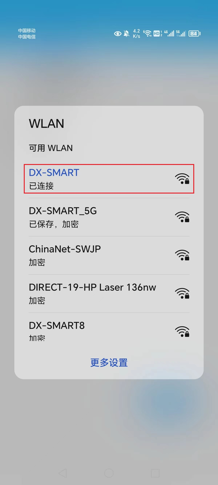 | 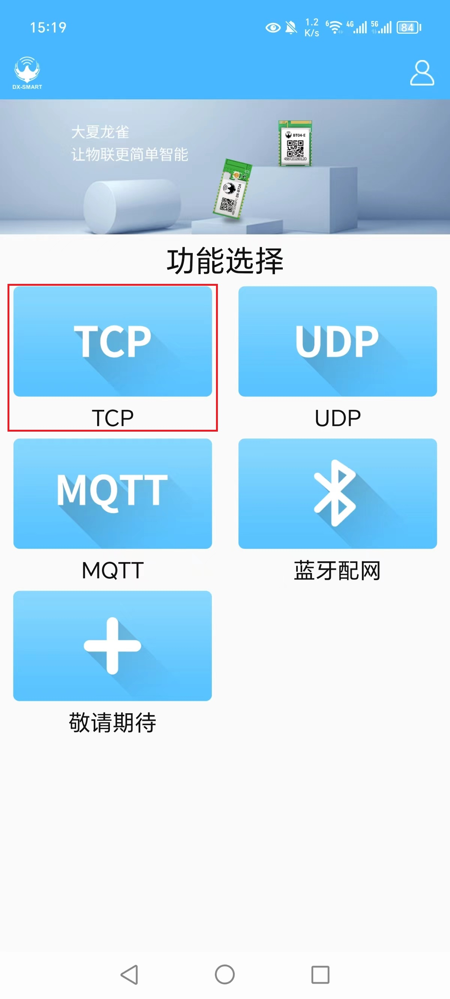 | 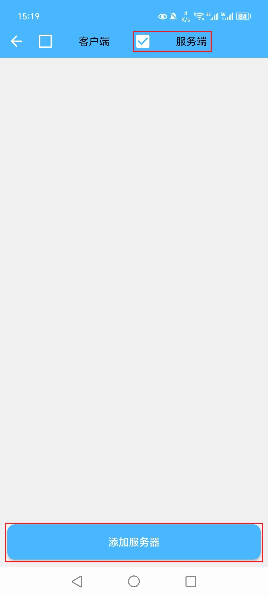 |

2.  设置服务器端口号，点击 “确定”，选择建立好的服务端，点击 “连接”，等待客户端接入

    **备注：**

|                                                          |
|----------------------------------------------------------|
| 手机重新连接或变更连接路由器，服务器的IP地址需要手动更新 |

|  |  |  |
|----|----|----|
| 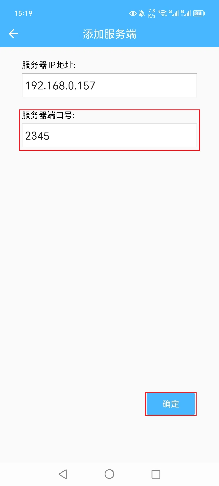 | 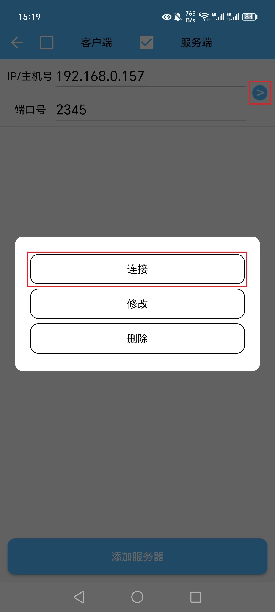 | 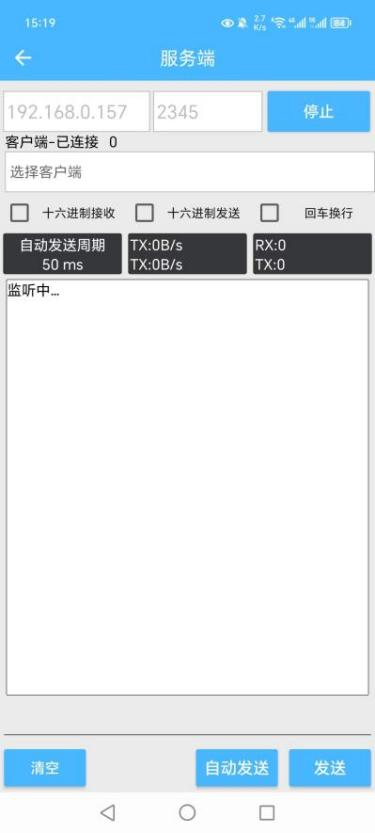 |

- 模块操作：

1.  设置为STA模式：AT+CWMODE=0

2.  连接与手机相同的路由器：AT+CWJAP=DX-SMART,SMART@601

    返回 +CWJAP:1,'DX-SMART',\<ip\> 说明模块成功连接路由器

3.  设置单连接模式：AT+CIPMODE=1

4.  接入手机的TCP服务端：AT+CIPSTART=TCP,192.168.0.157,2345

    返回 +CIPSTART:1 OK 说明模块成功接入手机TCP服务端

5.  进入透传模式：AT+CIPSEND

    返回 提示符 \> 说明模块进入透传模式

- 透传数据：

|  |  |
|----|----|
| 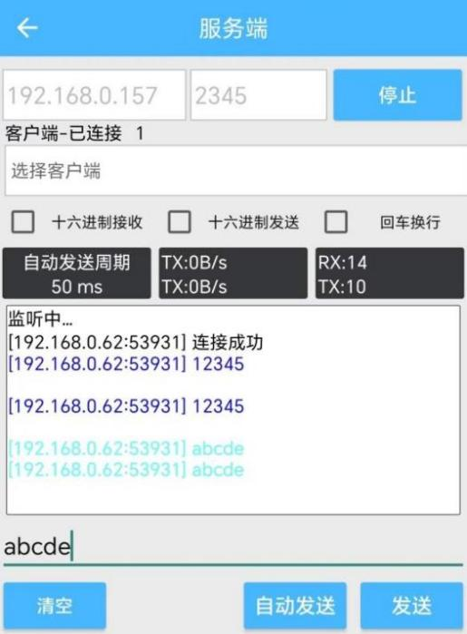 | 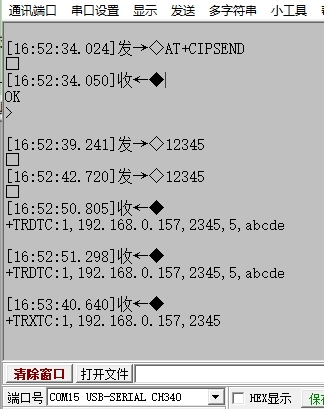 |

- 模块退出透传模式：+++

  注：指令+++ ，结尾不能有回车换行 或 其他字符

  1.  **模块作为AP，模块与手机进行通讯**

      (以模块作为服务端，手机作为客户端为例)

- 模块操作：

1.  设置为AP模式：AT+CWMODE=1

    (AP模式默认参数 -- SSID：WF24 , 密码：12345678 , IP：10.0.0.1)

2.  设置单连接模式：AT+CIPMODE=1

3.  建立TCP服务端：AT+CIPSERVER=1,2345,TCP,2

4.  进入透传模式：AT+CIPSEND

    返回 提示符 \> 说明模块进入透传模式

- 手机端操作：

1.  打开手机WiFi功能，连接上模块的AP，打开 “DX-SMART” APP，选择TCP客户端，点击 “添加客户端”

|  |  |  |
|----|----|----|
| 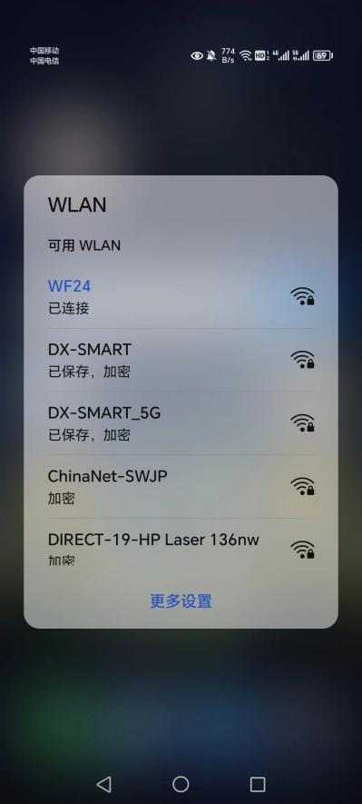 |  | 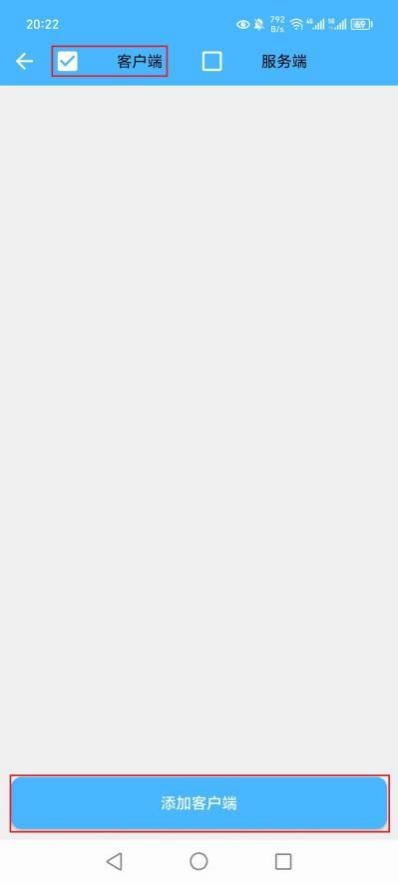 |

2.  输入服务器的IP和端口号，点击 “确定”，选择创建好的客户端，点击 “连接”，即可接入模块的TCP服务端

    **备注：**

|                                                                     |
|---------------------------------------------------------------------|
| 此处服务器的IP和端口号，由模块提供；APP只是输入模块提供的IP和端口号 |

|  |  |  |
|----|----|----|
| 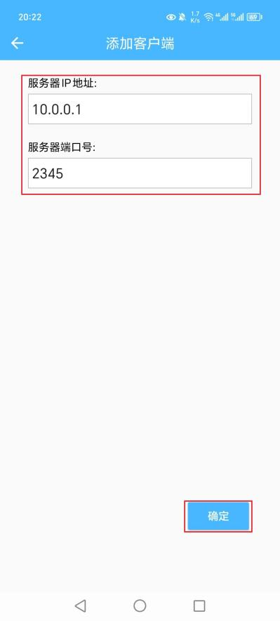 | 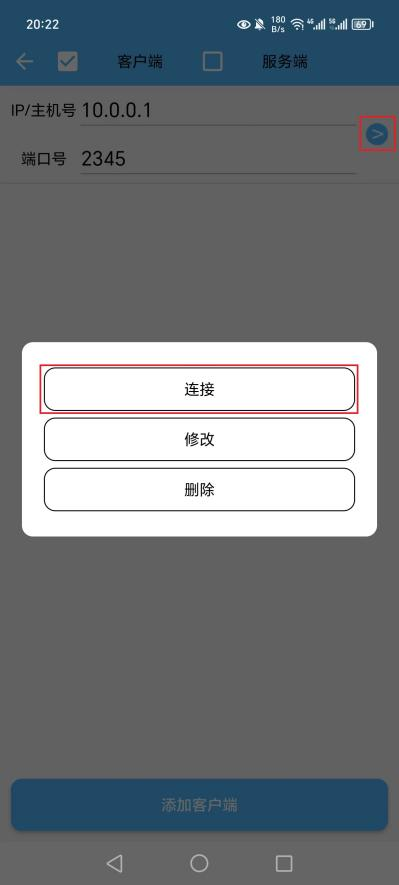 | 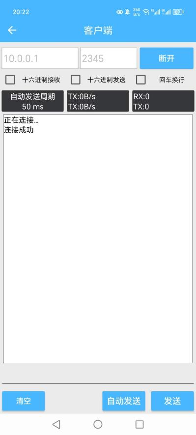 |

- 透传数据：

|  |  |
|----|----|
| 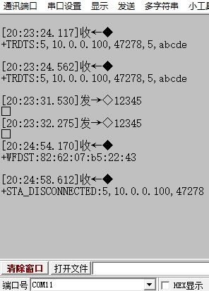 | 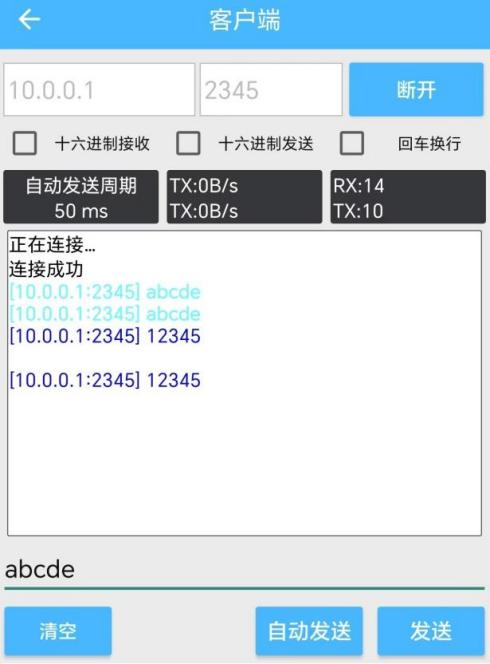 |

- 模块退出透传模式：+++

  注：指令+++ ，结尾不能有回车换行 或 其他字符

  1.  **模块与模块进行通讯**

      (以模块a作为AP和服务端，模块b作为客户端为例)

- 模块a操作：

1.  设置为AP模式：AT+CWMODE=1

    AP模式默认参数 -- SSID：WF24 , 密码：12345678 , IP：10.0.0.1)

2.  设置单连接模式：AT+CIPMODE=1

3.  建立TCP服务端：AT+CIPSERVER=1,2345,TCP,2

    返回 提示符 \> 说明模块进入透传模式

- 模块b操作：

1.  设置为STA模式：AT+CWMODE=0

2.  连接与模块a的AP：AT+CWJAP=WF24,12345678

    返回 +CWJAP:1,'WF24',\<ip\> 说明模块成功连接模块a的AP

3.  设置单连接模式：AT+CIPMODE=1

4.  接入模块a的TCP服务端：AT+CIPSTART=TCP,10.0.0.1,2345

    返回 +CIPSTART:1 OK 说明模块成功接入模块a的TCP服务端

5.  进入透传模式：AT+CIPSEND

    返回 提示符 \> 说明模块进入透传模式

- 透传数据：

  两模块返回提示符 \> 即可透传数据

- 模块退出透传模式：+++

  注：指令+++ ，结尾不能有回车换行 或 其他字符

# UDP示例

1.  **路由器作为AP，模块与手机进行通讯**

    (以手机创建UDP会话，模块接入手机UDP会话为例)

- 手机端操作：

1.  打开手机WiFi功能，连接上路由器，打开 “DX-SMART” APP，选择UDP服务端，点击 “添加服务器”

|  |  |  |
|----|----|----|
|  | 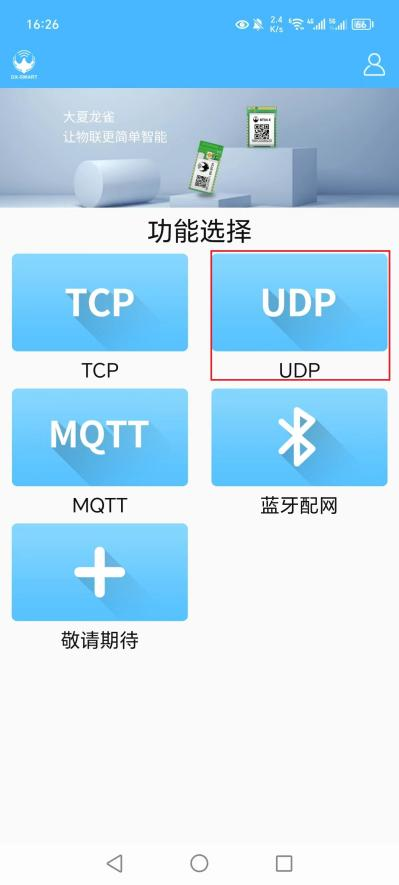 |  |

2.  设置服务器端口号，点击 “确定”，选择建立好的服务端，点击 “连接”，等待客户端发送数据

    **备注：**

<table style="width:99%;">
<colgroup>
<col style="width: 98%" />
</colgroup>
<tbody>
<tr>
<td><ol type="1">
<li>
手机重新连接或变更连接路由器，服务器的IP地址需要手动更新

2. UDP服务器需要接收到客户端的数据后，才能发送数据
</li>
</ol></td>
</tr>
</tbody>
</table>

|  |  |  |
|----|----|----|
|  |  | 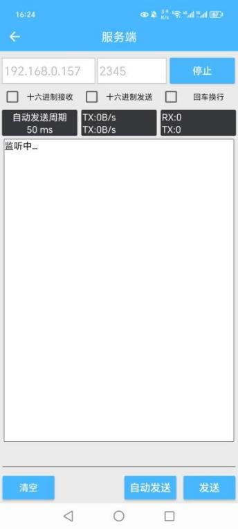 |

- 模块操作：

1.  设置为STA模式：AT+CWMODE=0

2.  连接与手机相同的路由器：AT+CWJAP=DX-SMART,SMART@601

3.  返回 +CWJAP:1,'DX-SMART',\<ip\> 说明模块成功连接路由器

4.  设置单连接模式：AT+CIPMODE=1

5.  接入手机的UDP服务器：AT+CIPSTART=UDP,192.168.0.157,2345,1112,1

    **备注：**

|                                                                   |
|-------------------------------------------------------------------|
| 192.168.0.157与2345是由手机提供IP和端口号，1112是模块设置的端口号 |

6.  进入透传模式：AT+CIPSEND

    返回 提示符 \> 说明模块进入透传模式

- 透传数据：

|  |  |
|----|----|
| 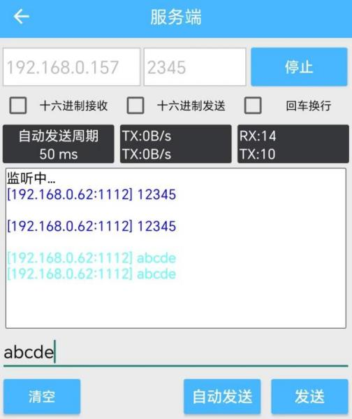 | 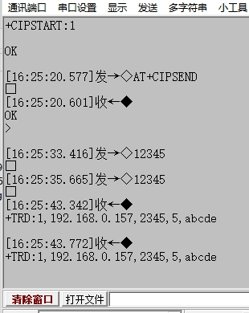 |

- 模块退出透传模式：+++

  注：指令+++ ，结尾不能有回车换行 或 其他字符

  1.  **模块与模块通讯**

      (模块a作为AP，以模块a创建UDP会话，模块b接入模块a的UDP会话为例)

- 模块a操作：

1.  设置为AP模式：AT+CWMODE=1

    (AP模式默认参数 -- SSID：WF24 , 密码：12345678 , IP：10.0.0.1)

2.  设置单连接模式：AT+CIPMODE=1

- 模块b操作：

1.  设置为STA模式：AT+CWMODE=0

2.  连接与模块a的AP：AT+CWJAP=WF24,12345678

    返回 +CWJAP:1,'WF24',\<ip\> 说明模块成功连接模块a的AP

3.  设置单连接模式：AT+CIPMODE=1

- 模块a操作：

1.  创建UDP会话：AT+CIPSTART=UDP,10.0.0.100,2345,1112,1

    **备注：**

|                                                                  |
|------------------------------------------------------------------|
| 10.0.0.100与2345是由模块b提供IP和端口号，1112是模块a设置的端口号 |

2.  进入透传模式：AT+CIPSEND

    返回 提示符 \> 说明模块进入透传模式

- 模块b操作：

1.  接入模块a的UDP会话：AT+CIPSTART=UDP,10.0.0.1,1112,2345,1

    **备注：**

|                                                                |
|----------------------------------------------------------------|
| 10.0.0.1与1112是由模块a提供IP和端口号，2345是模块b设置的端口号 |

2.  进入透传模式：AT+CIPSEND

    返回 提示符 \> 说明模块进入透传模式

- 透传数据：

  两模块返回提示符 \> 即可透传数据

- 模块退出透传模式：+++

  注：指令+++ ，结尾不能有回车换行 或 其他字符

# MQTT示例

1.  **使用公网MQTT服务器，手机和模块作客户端进行通讯**

- 手机建立MQTT客户端：

1.  打开手机WiFi功能，连接上路由器，打开 “DX-SMART” APP，建立MQTT

    客户端

2.  输入MQTT服务器的IP和端口号：broker.emqx.io和1883；设置客户端ID：WF-TEST1

    **备注：**

<table style="width:99%;">
<colgroup>
<col style="width: 98%" />
</colgroup>
<tbody>
<tr>
<td><ol type="1">
<li>
若MQTT服务器有用户名和密码验证，则APP需要输入相应的用户名和密码

2. 若连接成功后自动断开，则需要修改客户端ID，保证客户端ID不重复
</li>
</ol></td>
</tr>
</tbody>
</table>

3.  点击 “确认”，选择建立好的MQTT客户端，点击连接

|  |  |  |
|----|----|----|
| 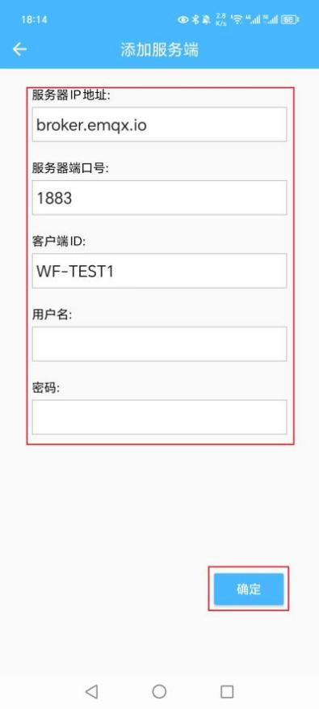 | 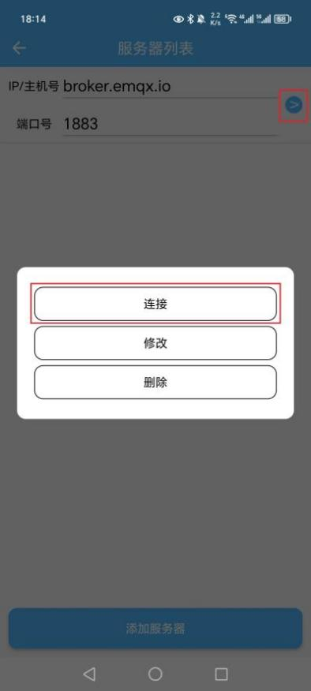 | 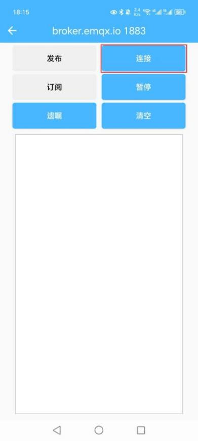 |

- 模块建立MQTT客户端：

1.  设置为STA模式：AT+CWMODE=0

2.  连接路由器：AT+CWJAP=DX-SMART,SMART@601

    返回 +CWJAP:1,'DX-SMART',\<ip\> 说明模块成功连接路由器

3.  配置MQTT客户端所需的客户端ID、用户名和密码：

    设置MQTT客户端ID：AT+MQTTLONGCLIENTID=WF-TEST2

    **备注：**

<table style="width:99%;">
<colgroup>
<col style="width: 98%" />
</colgroup>
<tbody>
<tr>
<td><ol type="1">
<li>
若MQTT服务器有 用户名和密码 验证，则需要输入相应的用户名和密码
</li>
<li>
若连接成功后自动断开，则需要修改客户端ID，保证客户端ID不重复
</li>
<li>
用户名和密码设置指令请参考 应用指导的5.5.3和5.5.4
</li>
</ol></td>
</tr>
</tbody>
</table>

4.  连接MQTT服务器：AT+MQTTCONN=broker.emqx.io,1883,1

    **备注：**

<table style="width:99%;">
<colgroup>
<col style="width: 98%" />
</colgroup>
<tbody>
<tr>
<td><ol type="1">
<li>
返回 +MQTTCONNECTED:broker.emqx.io,1883,1 说明连接成功
</li>
<li>
若连接失败，需要发送指令AT+MQTTCLEAN，再重新操作步骤C、D
</li>
</ol></td>
</tr>
</tbody>
</table>

- 手机与模块 订阅主题：

  (以手机主题为test-app，模块主题为test-wf为例)

1.  手机订阅模块的主题：点击“订阅”，

2.  输入模块主题test-wf，点击“保存”

3.  模块订阅手机的主题：AT+MQTTSUB=test-app,0

|  |  |
|----|----|
| 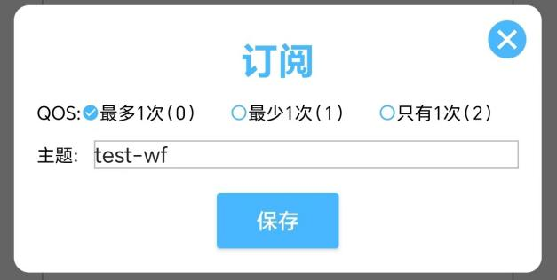 | 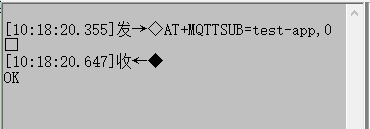 |

- 手机与模块 发布主题：

  (以手机主题为test-app，模块主题为test-wf为例)

1.  手机发布主题：点击 “发布” ，输入手机主题test-app，设置消息内容，点击 “发布”

2.  模块发布主题：AT+MQTTPUBRAW=test-wf,10,0,0

    **备注：**

<table>
<colgroup>
<col style="width: 3%" />
<col style="width: 29%" />
<col style="width: 33%" />
<col style="width: 33%" />
</colgroup>
<tbody>
<tr>
<td></td>
<td colspan="3">返回提示符 &gt; 即可发送数据，数据发送完毕自动退出透传模式</td>
</tr>
<tr>
<td colspan="2">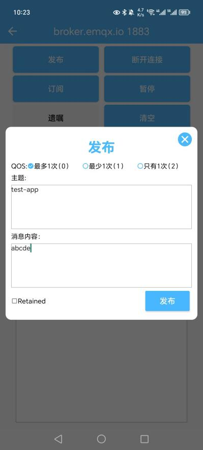</td>
<td>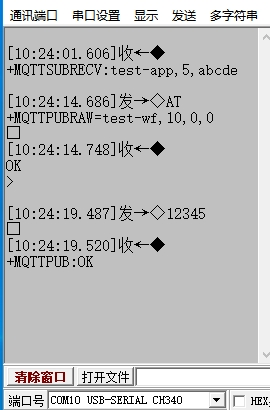</td>
<td>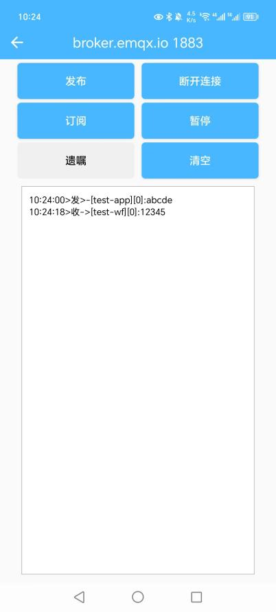</td>
</tr>
</tbody>
</table>

- 模块断开MQTT服务器连接：AT+MQTTCLEAN

# 简易通讯示例

1.  **TCP配对透传模式**

    (以模块a和模块b为例)

<!-- -->

1.  设置简易模式 (模块a)： AT+SIMPLEMODE=1,1

2.  设置简易模式 (模块b)： AT+SIMPLEMODE=1,0

    **备注：**

<table>
<colgroup>
<col style="width: 100%" />
</colgroup>
<tbody>
<tr>
<td><ol type="1">
<li>
设置完后模块自动重启，后续上电即可通讯

2. 多组简易通信模块，可在步骤1、2发送完毕后，退出透传模式，修改AP参数 和STA连接参数
</li>
</ol></td>
</tr>
</tbody>
</table>

1.  **TCP路由透传模式1**

    (以手机作为服务端，模块作为客户端为例)

<!-- -->

1.  手机端设置： 连接路由器后，创建TCP服务端

2.  设置简易模式 (模块)： AT+SIMPLEMODE=2,2

3.  设置客户端 (模块)： AT+SIMPLECLIENT=TCP,192.168.0.111,2345

4.  连接路由器 (模块)： AT+CWJAP=DX-SMART,SMART@601

    **备注：**

<table>
<colgroup>
<col style="width: 100%" />
</colgroup>
<tbody>
<tr>
<td><ol type="1">
<li>
设置完后模块自动重启，后续上电即可通讯

2. 步骤3的IP地址和端口号，由手机端提供
</li>
</ol></td>
</tr>
</tbody>
</table>

1.  **TCP路由透传模式2**

    (以模块a作为服务端，模块b作为客户端为例)

<!-- -->

1.  设置简易模式 (模块a)： AT+SIMPLEMODE=2,3

2.  设置服务端 (模块a)： AT+SIMPLESERVER=1,2345,TCP,2

3.  连接路由器 (模块a): AT+CWJAP=DX-SMART,SMART@601

4.  设置简易模式 (模块b)： AT+SIMPLEMODE=2,2

5.  设置客户端 (模块b)： AT+SIMPLECLIENT=TCP,192.168.0.111,2345

6.  连接路由器 (模块b): AT+CWJAP=DX-SMART,SMART@601

    **备注：**

<table>
<colgroup>
<col style="width: 100%" />
</colgroup>
<tbody>
<tr>
<td><ol type="1">
<li>
设置完后模块自动重启，后续上电即可通讯

2. 步骤5的IP地址和端口号，由模块a提供
</li>
</ol></td>
</tr>
</tbody>
</table>

1.  **MQTT透传模式**

    (以模块a和模块b作为MQTT客户端为例)

<!-- -->

1.  设置简易模式 (模块a和b)： AT+SIMPLEMODE=3,4

2.  连接路由器 (模块a和b)： AT+CWJAP=DX-SMART,SMART@601

3.  配置MQTT客户端参数：

<!-- -->

1.  设置MQTT的ID (模块a)： AT+MQTTLONGCLIENTID=WF-TESTA

2.  设置MQTT的ID (模块b)： AT+MQTTLONGCLIENTID=WF-TESTB

    **备注：**

<table>
<colgroup>
<col style="width: 100%" />
</colgroup>
<tbody>
<tr>
<td><ol type="1">
<li>
若MQTT服务器有 用户名和密码 验证，则需要输入相应的用户名和密码
</li>
<li>
若连接成功后自动断开，则需要修改客户端ID，保证客户端ID不重复

3. 用户名和密码设置指令请参考 应用指导的5.5.3和5.5.4
</li>
</ol></td>
</tr>
</tbody>
</table>

4.  连接MQTT服务器（模块a和b）：AT+MQTTCONN=broker.emqx.io,1883,1

    **备注：**

|                                                          |
|----------------------------------------------------------|
| 若连接失败，需要发送指令AT+MQTTCLEAN，再重新操作步骤3、4 |

5.  模块a和模块b订阅主题：

    (以模块a主题为test-a，模块b主题为test-b为例)

    订阅模块b的主题 (模块a操作) ：AT+MQTTSUB=test-b,0

    订阅模块a的主题 (模块b操作) ：AT+MQTTSUB=test-a,0

6.  模块a和模块b发布主题：

    发布主题 (模块a) ：AT+MQTTPUBRAW=test-a,5,0,0

    发布主题 (模块b) ：AT+MQTTPUBRAW=test-b,5,0,0

    **备注：**

<table>
<colgroup>
<col style="width: 100%" />
</colgroup>
<tbody>
<tr>
<td><ol type="1">
<li>
后续上电即可自动连接MQTT服务器，以及订阅主题

2. 步骤1指令为AT+SIMPLEMODE=3,5 时，完成步骤6后，模块进入透传模式，如需更换发布的主题需要发+++退出透传模式，再发送AT+MQTTPUBRAW指令修改
</li>
</ol></td>
</tr>
</tbody>
</table>

# 附件

## **TCP多连接示例**

(路由器作为AP，以模块a作为服务端，模块b和模块c作为客户端为例)

- 模块a操作：

1.  设置为STA模式：AT+CWMODE=0

2.  连接路由器：AT+CWJAP=DX-SMART,SMART@601

3.  设置多连接模式：AT+CIPMODE=0

4.  建立TCP服务端：AT+CIPSERVER=1,2345,TCP,3

- 模块b操作：

1.  设置为STA模式：AT+CWMODE=0

2.  连接与模块a相同的路由器：AT+CWJAP=DX-SMART,SMART@601

3.  设置单连接模式：AT+CIPMODE=1

4.  接入模块a的TCP服务端：AT+CIPSTART=TCP,192.168.0.60,2345

    **备注：**

|                                              |
|----------------------------------------------|
| 192.168.0.60和2345 是由模块a提供的IP和端口号 |

5.  进入透传模式：AT+CIPSEND

    返回 提示符 \> 说明模块进入透传模式

- 模块c操作：

1.  设置为STA模式：AT+CWMODE=0

2.  连接与模块a相同的路由器：AT+CWJAP=DX-SMART,SMART@601

3.  设置单连接模式：AT+CIPMODE=1

4.  接入模块a的TCP服务端：AT+CIPSTART=TCP,192.168.0.60,2345

    **备注：**

|                                              |
|----------------------------------------------|
| 192.168.0.60和2345 是由模块a提供的IP和端口号 |

5.  进入透传模式：AT+CIPSEND

    返回 提示符 \> 说明模块进入透传模式

- 模块a发送数据：

1.  向模块b发送数据：AT+CIPSEND=2,10

    **备注：**

<table style="width:99%;">
<colgroup>
<col style="width: 98%" />
</colgroup>
<tbody>
<tr>
<td><ol type="1">
<li>
返回提示符 &gt; 即可发送数据，数据发送完毕自动退出透传模式

2. 参数值2为模块a与模块b的会话ID，需在模块a处确认
</li>
</ol></td>
</tr>
</tbody>
</table>

2.  向模块c发送数据：AT+CIPSEND=3,10

    **备注：**

<table style="width:99%;">
<colgroup>
<col style="width: 99%" />
</colgroup>
<tbody>
<tr>
<td><ol type="1">
<li>
返回提示符 &gt; 即可发送数据，数据发送完毕自动退出透传模式

2. 参数值3为模块a与模块c的会话ID，需在模块a处确认
</li>
</ol></td>
</tr>
</tbody>
</table>

1.  **UDP多连接示例**

    (路由器作为AP，以模块a分别与模块b和模块c建立UDP连接为例)

- 模块a操作：

1.  设置为STA模式：AT+CWMODE=0

2.  连接路由器：AT+CWJAP=DX-SMART,SMART@601

3.  设置多连接模式：AT+CIPMODE=0

4.  创建与模块b之间的UDP会话：

    AT+CIPSTART=UDP,192.168.0.61,2345,1112,1

    **备注：**

|                                                                    |
|--------------------------------------------------------------------|
| 192.168.0.61与2345是由模块b提供IP和端口号，1112是模块a设置的端口号 |

5.  创建与模块c之间的UDP会话：

    AT+CIPSTART=UDP,192.168.0.62,7340,9527,1

    **备注：**

|                                                                    |
|--------------------------------------------------------------------|
| 192.168.0.62与7340是由模块c提供IP和端口号，9527是模块a设置的端口号 |

- 模块b操作：

1.  设置为STA模式：AT+CWMODE=0

2.  连接与模块a相同的路由器：AT+CWJAP=DX-SMART,SMART@601

3.  设置单连接模式：AT+CIPMODE=1

4.  接入模块a的UDP会话：AT+CIPSTART=UDP,192.168.0.60,1112,2345,1

    **备注：**

|                                                                    |
|--------------------------------------------------------------------|
| 192.168.0.60与1112是由模块a提供IP和端口号，2345是模块b设置的端口号 |

5.  进入透传模式：AT+CIPSEND

    返回 提示符 \> 说明模块进入透传模式

- 模块c操作：

1.  设置为STA模式：AT+CWMODE=0

2.  连接与模块a相同的路由器：AT+CWJAP=DX-SMART,SMART@601

3.  设置单连接模式：AT+CIPMODE=1

4.  接入模块a的UDP会话：AT+CIPSTART=UDP,192.168.0.60,9527,7340,1

    **备注：**

|                                                                    |
|--------------------------------------------------------------------|
| 192.168.0.60与9527是由模块a提供IP和端口号，7340是模块b设置的端口号 |

5.  进入透传模式：AT+CIPSEND

    返回 提示符 \> 说明模块进入透传模式

- 模块a发送数据：

1.  向模块b发送数据：AT+CPISEND=1,20

    **备注：**

<table style="width:99%;">
<colgroup>
<col style="width: 98%" />
</colgroup>
<tbody>
<tr>
<td><ol type="1">
<li>
模块a需要接收到模块b的数据后，才能发送数据
</li>
<li>
返回提示符 &gt; 即可发送数据，数据发送完毕自动退出透传模式

3. 参数值1为模块a与模块b的会话ID，需在模块a处确认
</li>
</ol></td>
</tr>
</tbody>
</table>

2.  向模块c发送数据：AT+CPISEND=2,20

    **备注：**

<table style="width:99%;">
<colgroup>
<col style="width: 98%" />
</colgroup>
<tbody>
<tr>
<td><ol type="1">
<li>
模块a需要接收到模块c的数据后，才能发送数据
</li>
<li>
返回提示符 &gt; 即可发送数据，数据发送完毕自动退出透传模式

3. 参数值2为模块a与模块c的会话ID，需在模块a处确认
</li>
</ol></td>
</tr>
</tbody>
</table>

1.  **本地MQTT服务器 (EMQX) 搭建**

### 启动服务器

<table>
<colgroup>
<col style="width: 100%" />
</colgroup>
<tbody>
<tr>
<td><ol type="1">
<li>
打开软件windows powershell：

用电脑自带的搜索框，搜索 “windows powershell”，打开该应用
</li>
</ol></td>
</tr>
<tr>
<td>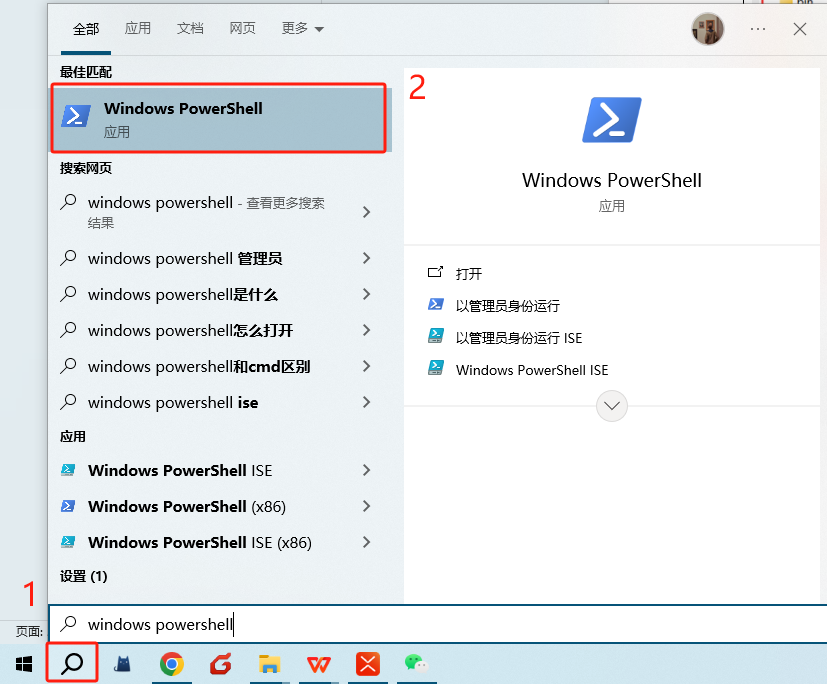</td>
</tr>
</tbody>
</table>

<table>
<colgroup>
<col style="width: 100%" />
</colgroup>
<tbody>
<tr>
<td><ol start="2" type="1">
<li>
解压MQTT服务器压缩包：

在电脑任意一个盘，新建文件夹，例如“EMQX”文件，然后将下载的文件解压

<mark><strong>注意</strong>：文件夹的路径 不能有中文</mark>
</li>
</ol></td>
</tr>
<tr>
<td>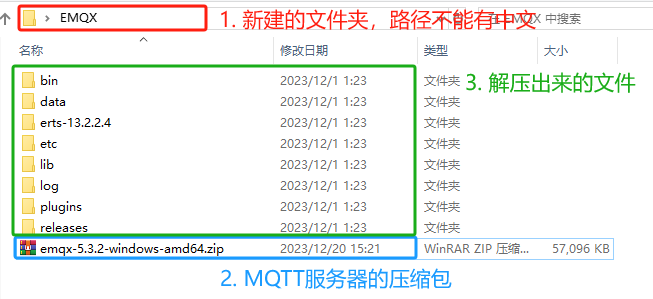</td>
</tr>
</tbody>
</table>

<table>
<colgroup>
<col style="width: 100%" />
</colgroup>
<tbody>
<tr>
<td><ol start="3" type="1">
<li>
复制bin文件路径：

双击进入 <mark>“bin”文件夹</mark>，点击红框部分，按 “Ctrl+C” 复制 “bin” 文件夹的路径，并切换到 “windows powershell”应用
</li>
</ol></td>
</tr>
<tr>
<td>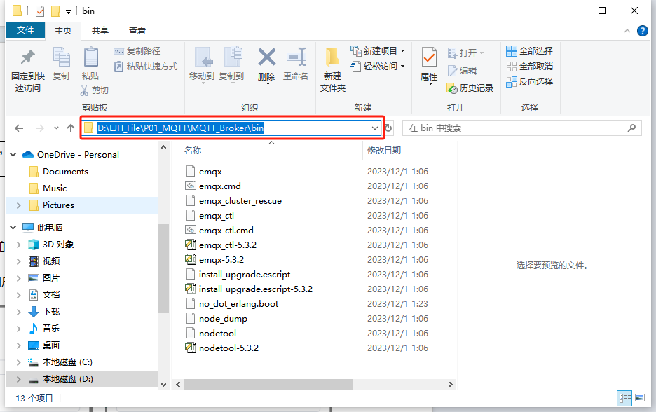</td>
</tr>
</tbody>
</table>

<table>
<colgroup>
<col style="width: 100%" />
</colgroup>
<tbody>
<tr>
<td><ol start="4" type="1">
<li>
输入命令：<strong><mark>cd “path”</mark></strong>，其中 <mark>path为步骤<strong>3</strong>复制的路径</mark>，按下回车键
</li>
<li>
输入命令：<strong><mark>./emqx start</mark></strong>，按下回车键，返回红框信息，则服务器启动成功

<strong>注：步骤(4)的cd 和 “path” 之间需要加一个空格</strong>
</li>
</ol></td>
</tr>
<tr>
<td>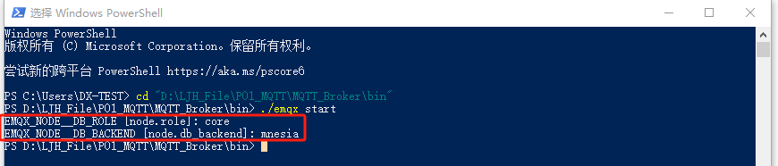</td>
</tr>
</tbody>
</table>

### 确认IP地址和端口号

<table>
<colgroup>
<col style="width: 100%" />
</colgroup>
<tbody>
<tr>
<td><ol type="1">
<li>
服务器默认监听的端口号：<strong>1883</strong> (非操作步骤)
</li>
<li>
输入命令：<strong><mark>ipconfig</mark></strong>，按下回车键，确认服务器所在电脑的IP地址
</li>
</ol></td>
</tr>
<tr>
<td>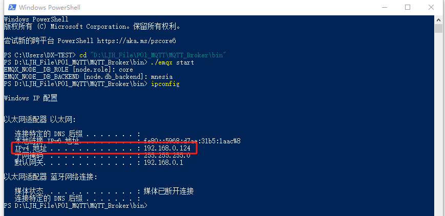</td>
</tr>
<tr>
<td>注：若弹出防火墙相关的询问，需要点击允许，否则无法访问本地MQTT服务器</td>
</tr>
<tr>
<td>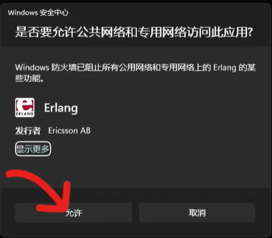</td>
</tr>
</tbody>
</table>

### 创建数据库&添加数据

#### 访问服务器：<http://localhost:18083>

<table>
<colgroup>
<col style="width: 100%" />
</colgroup>
<tbody>
<tr>
<td><ol type="1">
<li>
输入默认账号“admin”，默认密码“public”，然后点击登录按钮
</li>
</ol></td>
</tr>
<tr>
<td style="text-align: left;">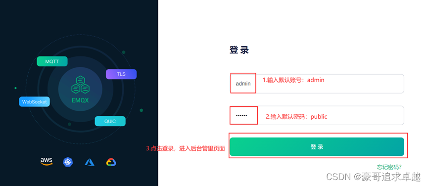</td>
</tr>
</tbody>
</table>

<table>
<colgroup>
<col style="width: 100%" />
</colgroup>
<tbody>
<tr>
<td><ol start="2" type="1">
<li>
选择跳过
</li>
</ol></td>
</tr>
<tr>
<td>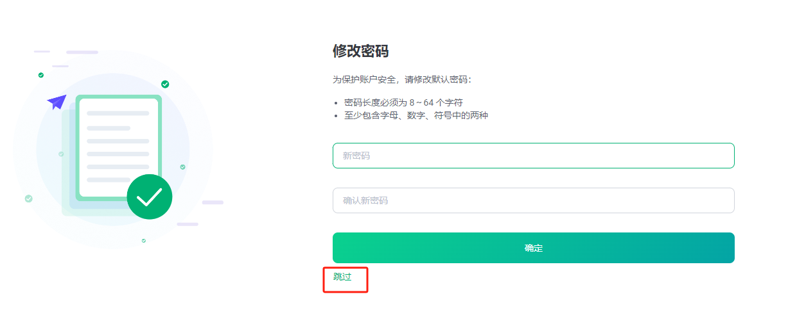</td>
</tr>
</tbody>
</table>

#### 创建数据库 (该操作首次完成后，后续可跳过该步骤)

<table>
<colgroup>
<col style="width: 100%" />
</colgroup>
<tbody>
<tr>
<td><ol type="1">
<li>
点击 “访问控制”，选择 “客户端认证”，点击 “创建”
</li>
</ol></td>
</tr>
<tr>
<td style="text-align: left;">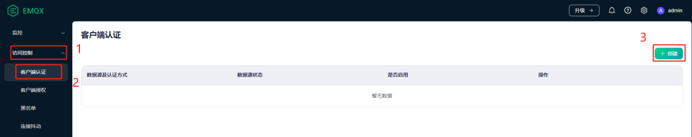</td>
</tr>
</tbody>
</table>

<table>
<colgroup>
<col style="width: 100%" />
</colgroup>
<tbody>
<tr>
<td><ol start="2" type="1">
<li>
选择 “下一步”、“下一步”、点击 “创建”
</li>
</ol></td>
</tr>
<tr>
<td>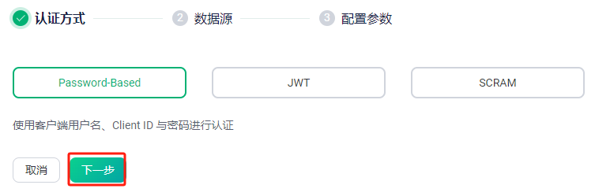</td>
</tr>
<tr>
<td>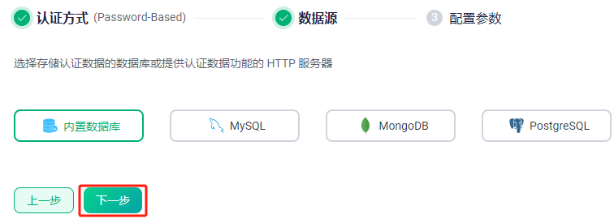</td>
</tr>
<tr>
<td>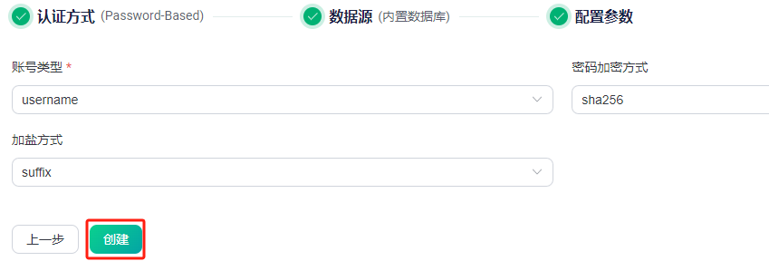</td>
</tr>
</tbody>
</table>

#### 添加用户名和密码 (该操作首次完成后，后续可跳过该步骤)

<table>
<colgroup>
<col style="width: 100%" />
</colgroup>
<tbody>
<tr>
<td><ol type="1">
<li>
点击 “用户管理”，进入用户管理界面后，点击 “+” 按钮
</li>
</ol></td>
</tr>
<tr>
<td>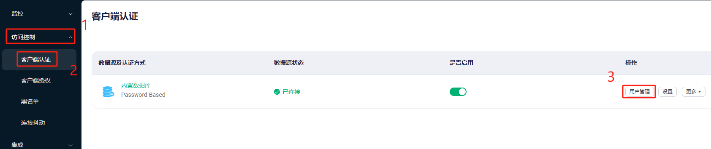</td>
</tr>
<tr>
<td>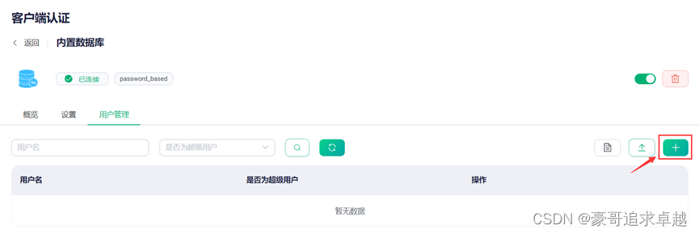</td>
</tr>
</tbody>
</table>

<table>
<colgroup>
<col style="width: 100%" />
</colgroup>
<tbody>
<tr>
<td><ol start="2" type="1">
<li>
添加用户名和密码，勾选”是否为超级用户”，点击保存
</li>
</ol></td>
</tr>
<tr>
<td>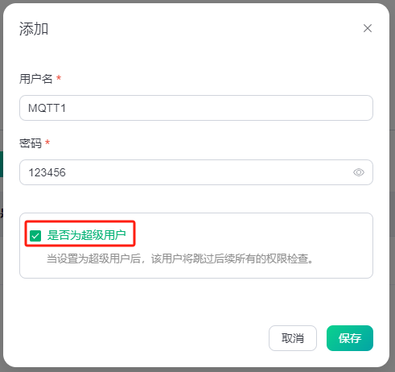</td>
</tr>
</tbody>
</table>

#### 查询客户端连接状态 (非必要操作，可用于查看是否有客户端接入服务器)

<table>
<colgroup>
<col style="width: 100%" />
</colgroup>
<tbody>
<tr>
<td><ol type="1">
<li>
选择 “监控”，点击“客户端”，在该界面点击 “刷新”，即可查询客户端连接状态
</li>
</ol></td>
</tr>
<tr>
<td>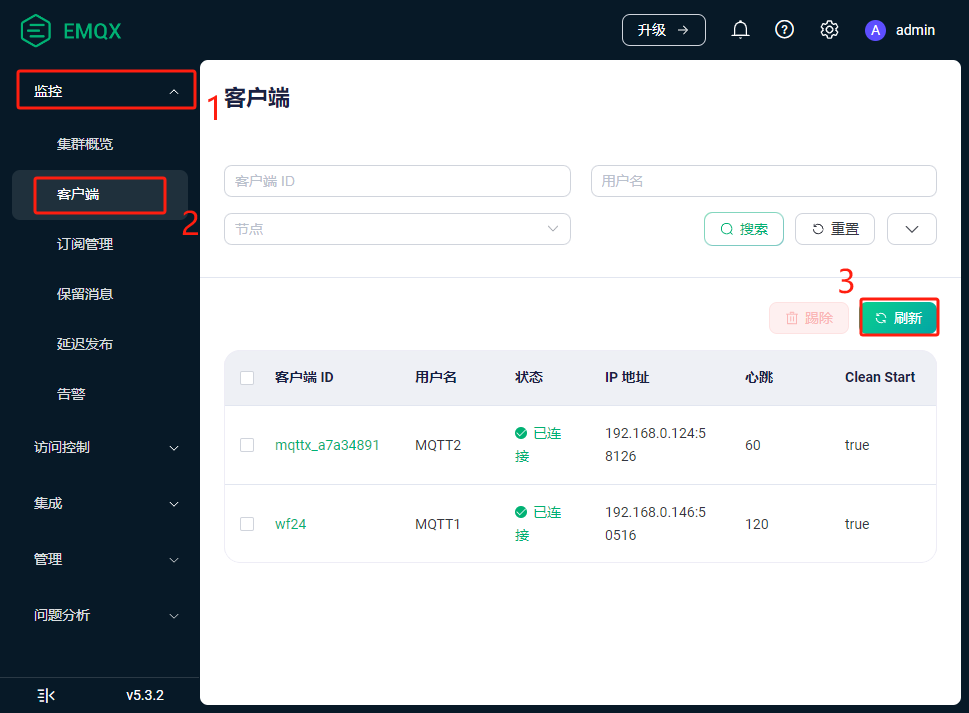</td>
</tr>
</tbody>
</table>
