**DX-WF24**

**Wi-Fi/蓝牙二合一模组**

**技术手册**

> 版本：2.0
>
> 日期：2026-03-17

**更新记录**

|          |            |                  |          |
|:--------:|:----------:|:----------------:|:--------:|
| **版本** |  **日期**  |     **说明**     | **作者** |
|   V1.0   | 2022/12/25 |     初始版本     |   LSL    |
|   V1.1   | 2023/06/12 | 新增硬件部分图表 |   LSL    |
|   V1.2   | 2023/07/10 |   更新硬件参数   |   LSL    |
|   V2.0   | 2026/03/17 |     更新参数     |   YXR    |

**联系我们**

**深圳大夏龙雀科技有限公司**

邮箱：sales@szdx-smart.com

电话：0755-2997 8125

网址：[www.szdx-smart.com](http://www.szdx-smart.com)

地址：深圳市宝安区航城街道航空路庄边工业园厂房A栋4层

**目录**

[1. 模块介绍 [- 5 -](#模块介绍)](#模块介绍)

[1.1. 概述 [- 5 -](#_Toc15025)](#_Toc15025)

[1.2. 特点 [- 5 -](#_Toc9653)](#_Toc9653)

[1.3. 应用 [- 6 -](#_Toc15720)](#_Toc15720)

[1.4. 功能框图 [- 6 -](#_Toc6545)](#_Toc6545)

[1.5. 基础参数 [- 7 -](#_Toc15557)](#_Toc15557)

[2. 应用接口 [- 8 -](#应用接口)](#应用接口)

[2.1. 模块引脚定义 [- 8 -](#_Toc7121)](#_Toc7121)

[2.2. 引脚定义说明 [- 8 -](#_Toc7158)](#_Toc7158)

[2.3. 电源设计 [- 9 -](#_Toc10575)](#_Toc10575)

[2.4. 功耗 [- 12 -](#_Toc4068)](#_Toc4068)

[2.5. 硬件物理接口 [- 13 -](#_Toc2297)](#_Toc2297)

[2.6. 参考连接电路 [- 17 -](#_Toc19757)](#_Toc19757)

[3. 电气特性、射频特性和可靠性 [- 18 -](#电气特性射频特性和可靠性)](#电气特性射频特性和可靠性)

[3.1. 电气特性 [- 18 -](#_Toc31885)](#_Toc31885)

[3.2. 最大额定值 [- 18 -](#_Toc9786)](#_Toc9786)

[3.3. 推荐使用条件 [- 18 -](#_Toc28661)](#_Toc28661)

[3.4. 静电防护 [- 19 -](#_Toc19375)](#_Toc19375)

[4. 机械尺寸及布局建议 [- 20 -](#机械尺寸及布局建议)](#机械尺寸及布局建议)

[4.1. 模块机械尺 [- 20 -](#_Toc19859)](#_Toc19859)

[4.2. 推荐封装 [- 20 -](#_Toc30177)](#_Toc30177)

[4.3. 模块俯视图/底视图 [- 21 -](#_Toc23739)](#_Toc23739)

[4.4. 硬件设计布局建议 [- 22 -](#_Toc19341)](#_Toc19341)

[5. 储存、生产和包装 [- 23 -](#储存生产和包装)](#储存生产和包装)

[5.1. 存储条件 [- 23 -](#_Toc14183)](#_Toc14183)

[2. 在推荐存储条件下，模块可在真空密封袋中存放12个月。 [- 23 -](#_Toc1833)](#_Toc1833)

[5.2. 模块烘烤处理 [- 23 -](#_Toc16645)](#_Toc16645)

[5.3. 回流焊 [- 24 -](#_Toc9405)](#_Toc9405)

[5.4. 包装规格 [- 25 -](#_Toc6507)](#_Toc6507)

**表格索引**

[表 1 ：基础参数表 [- 7 -](#_Toc30009)](#_Toc30009)

[表 2 ：引脚定义说明表 [- 8 -](#_Toc10704)](#_Toc10704)

[表 3 ：电源接口引脚定义表 [- 9 -](#_Toc22153)](#_Toc22153)

[表 4 ：CEN引脚定义表 [- 10 -](#_Toc3088)](#_Toc3088)

[表 5 ：功耗表 [- 12 -](#_Toc439)](#_Toc439)

[表 6 ：SAR ADC 输入通道 [- 16 -](#_Toc29738)](#_Toc29738)

[表 7 ：电气特性 [- 18 -](#_Toc4930)](#_Toc4930)

[表 8 ：绝对最大额定值表 [- 18 -](#_Toc26250)](#_Toc26250)

[表 9 ：推荐运行条件 [- 18 -](#_Toc6670)](#_Toc6670)

[表 10 ：ESD评级 [- 19 -](#_Toc9163)](#_Toc9163)

**图片索引**

[图 1 ：功能框图 [- 7 -](#_Toc5836)](#_Toc5836)

[图 2 ：模块引脚定义 [- 8 -](#_Toc9432)](#_Toc9432)

[图 3 ：突发传输电源要求 [- 10 -](#_Toc7875)](#_Toc7875)

[图 4 ：供电参考电路 [- 10 -](#_Toc32211)](#_Toc32211)

[图 5 ：复位参考电路 [- 11 -](#_Toc19539)](#_Toc19539)

[图 6 ：按键复位参考电路 [- 11 -](#_Toc968)](#_Toc968)

[图 7 ：I2C通信时序图 [- 13 -](#_Toc3547)](#_Toc3547)

[图 8 ：I2C从机时序图 [- 14 -](#_Toc1443)](#_Toc1443)

[图 9 ：SPI通信时序图 [- 14 -](#_Toc1073)](#_Toc1073)

[图 10 ：SPI从机框图 [- 15 -](#_Toc23183)](#_Toc23183)

[图 11 ：8字节控制类型 [- 15 -](#_Toc27786)](#_Toc27786)

[图 12 ：4字节控制类型 [- 15 -](#_Toc15105)](#_Toc15105)

[图 13 ：SPI从机时序图 [- 16 -](#_Toc24986)](#_Toc24986)

[图 14 ：典型应用电路 [- 17 -](#_Toc11001)](#_Toc11001)

[图 15 ：串口电平转换参考电路 [- 17 -](#_Toc14332)](#_Toc14332)

[图 16 ：模块俯视及侧视尺寸图 [- 20 -](#_Toc22917)](#_Toc22917)

[图 17 ：建议封装尺寸图 [- 21 -](#_Toc31187)](#_Toc31187)

[图 18 ：模块俯视图和底视图 [- 21 -](#_Toc6534)](#_Toc6534)

[图 19 ：模块摆放参考位置 [- 22 -](#_Toc17842)](#_Toc17842)

[图 20 ：推荐的回流焊温度曲线 [- 24 -](#_Toc22454)](#_Toc22454)

[图 21 ：载带尺寸（单位：毫米） [- 25 -](#_Toc5305)](#_Toc5305)

[图 22 ：卷盘尺寸（单位：毫米） [- 25 -](#_Toc12778)](#_Toc12778)

[图 23 ：卷带方向 [- 26 -](#_Toc11265)](#_Toc11265)

# 模块介绍

1.  **概述**

    DX-WF24 是一款Wi-Fi/蓝牙二合一模组，是深圳大夏龙雀科技有限公司为智能无线数据传输而打造，采用BK7238芯片，是一款高度集成的单芯片Wi-Fi 802.11n和蓝牙低功耗(BLE) 5.2组合解决方案，专为需要Wi-Fi/蓝牙二合一和紧凑尺寸的应用而设计。集成了功能强大的32位MCU和一套全面的外设接口。本模块支持UART、SPI、I2C等接口，支持IO口控制、ADC采集，具有低功耗、高性能、高速度等优点。除了具有丰富的外设接口外，模组还拥有强大的信号处理能力，适用于 IoT 领域等多种应用场景，例如智能照明、智能家居、室内定位和其他复杂的物联网应用。

2.  **特点**

    Wi-Fi:

- 特性Wi-Fi符合IEEE 802.11 b/g/n 1x1标准

- 支持20MHz通道

- 支持工作模式STA、AP、AP+STA

- 发射功率高达+19 dBm

- 接收灵敏度-99 dBm

  蓝牙BLE：

- 支持5.2蓝牙协议

- 支持蓝牙低功耗(LE)，1 Mbps，2 Mbps，远距离(125 kbps和500 kbps)

- 广播扩展

- 蓝牙测向:到达角(AoA)和离开角(AoD)

- 支持多达16个天线阵列，用于精确的室内定位集成蓝牙LE/WLAN共存(PTA)

  存储器：

- 32位MCU，最高160MHz

- 2 MB SiP Flash

- 288 KB RAM

- UART/JTAG用于下载和调试

  外设 IO 口：

- 具有15个通用数字 lO 口

- 具有一个通用异步接收/发送(UART)接口

- 具有一个SPI接口

- 具有一个I2C接口

- 具有6个32位PWM 通道

- 支持多达4个ADC外部输入通道

  时钟管理：

- 外部振荡器：26 MHz晶体振荡器(X26M)

- 内部振荡器：26 ~ 160 MHz数字控制振荡器(DCO)，32 kHz环形振荡器(ROSC)

- 480 MHz DPLL

  电源管理：

- 工作电压： 2.7 V ~3.6 V (参考值：3.3 V)

- 嵌入LDO稳压器

- 板载 PCB 天线/外接天线可选

- 工作温度范围：-40 ~ +105℃

  1.  **应用**

<!-- -->

- 摄像头视频流传输

- 智慧楼宇

- 智慧农业

- 健康/医疗/看护

- 可穿戴电子产品

- 家庭自动化

- OTT 电视盒/机顶盒设备

- 工业自动化

- 音频设备

- Wi-Fi 玩具

- 零售 & 餐饮

  1.  **功能框图**

下图为DX-WF24 WIFI模块的功能框图，阐述了其如下主要功能：

- 电源部分

- 基带部分

- 存储器

- 射频部分

- 外围接口

<figure>
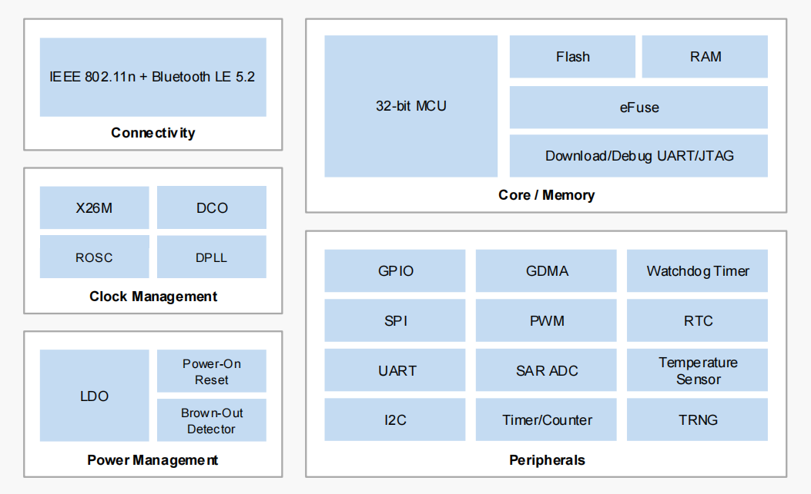
<figcaption>
<strong>图 1</strong><strong>：功能框图</strong>
</figcaption>
</figure>

1.  **基础参数**

|  |  |  |  |
|:--:|:--:|:--:|:--:|
| **参数名称** | **详情** | **参数名称** | **详情** |
| 模块型号 | DX-WF24 | 工作电压 | 3.3V |
| 调制方式 | OFDM、MCS0(GF)、MCS7(GF) | 模块尺寸 | 22（L）×15.2（W）×2.2（H）mm |
| 蓝牙协议 | BLE 5.2 | 协议 | IEEE 802.11 b/g/n |
| 灵敏度 | -99 dBm | 发射功率 | +19 dBm |
| 射频输入阻抗 | 50Ω | 频段 | 2412 ~ 2484 MHz |
| 天线接口 | 板载天线 / 外接天线（可选） | 硬件接口 | SPI、RTC、PWM、UART、ADC、I2C |
| 工作温度 | MIN：-40℃ - MAX：+105℃ | 湿度 | 10%-95% 非冷凝 |

**表 1****：基础参数表**

# 应用接口

1.  **模块引脚定义**

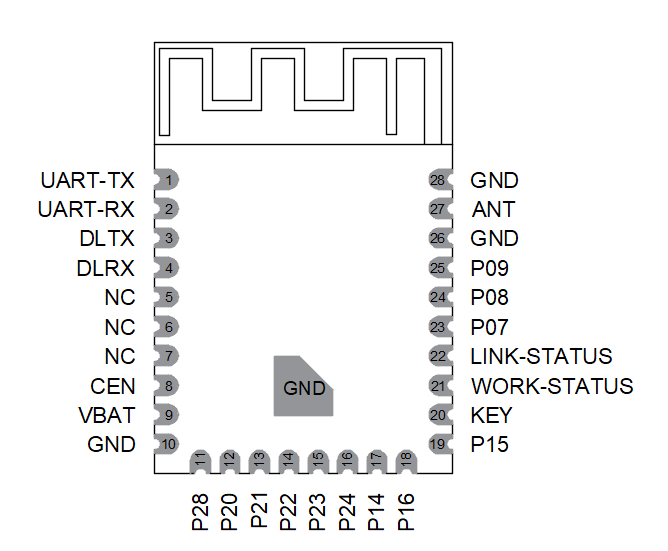

**图 2****：模块引脚定义**

2.  **引脚定义说明**

<table style="width:99%;">
<caption><blockquote>

<strong>表 2</strong><strong>：引脚定义说明表</strong>

</blockquote></caption>
<colgroup>
<col style="width: 17%" />
<col style="width: 18%" />
<col style="width: 27%" />
<col style="width: 35%" />
</colgroup>
<tbody>
<tr>
<td style="text-align: center;"><strong>引脚序号</strong></td>
<td style="text-align: center;"><strong>引脚名称</strong></td>
<td style="text-align: center;"><strong>引脚功能</strong></td>
<td style="text-align: center;"><strong>说明</strong></td>
</tr>
<tr>
<td style="text-align: center;">1</td>
<td style="text-align: center;">UART-TX</td>
<td style="text-align: center;">串口数据输出</td>
<td style="text-align: center;"></td>
</tr>
<tr>
<td style="text-align: center;">2</td>
<td style="text-align: center;">UART-RX</td>
<td style="text-align: center;">串口数据输入</td>
<td style="text-align: center;"></td>
</tr>
<tr>
<td style="text-align: center;">3</td>
<td style="text-align: center;">DLTX</td>
<td style="text-align: center;">烧录口</td>
<td style="text-align: center;"></td>
</tr>
<tr>
<td style="text-align: center;">4</td>
<td style="text-align: center;">DLRX</td>
<td style="text-align: center;">烧录口</td>
<td style="text-align: center;"></td>
</tr>
<tr>
<td style="text-align: center;">5/6/7</td>
<td style="text-align: center;">NC</td>
<td style="text-align: center;">NC</td>
<td style="text-align: center;">空</td>
</tr>
<tr>
<td style="text-align: center;">8</td>
<td style="text-align: center;">CEN</td>
<td style="text-align: center;">复位</td>
<td style="text-align: center;">详情参考2.3.3</td>
</tr>
<tr>
<td style="text-align: center;">9</td>
<td style="text-align: center;">VBAT</td>
<td style="text-align: center;">电源输入引脚</td>
<td style="text-align: center;">3.3V（典型值）</td>
</tr>
<tr>
<td style="text-align: center;">10/26/28</td>
<td style="text-align: center;">GND</td>
<td style="text-align: center;">电源地</td>
<td style="text-align: center;"></td>
</tr>
<tr>
<td style="text-align: center;">11</td>
<td style="text-align: center;">P28</td>
<td style="text-align: center;">I/O</td>
<td style="text-align: center;">可编程输入/输出脚</td>
</tr>
<tr>
<td style="text-align: center;">12</td>
<td style="text-align: center;">P20</td>
<td style="text-align: center;">I/O</td>
<td style="text-align: center;">可编程输入/输出脚</td>
</tr>
<tr>
<td style="text-align: center;">13</td>
<td style="text-align: center;">P21</td>
<td style="text-align: center;">I/O</td>
<td style="text-align: center;">可编程输入/输出脚</td>
</tr>
<tr>
<td style="text-align: center;">14</td>
<td style="text-align: center;">P22</td>
<td style="text-align: center;">I/O</td>
<td style="text-align: center;">可编程输入/输出脚</td>
</tr>
<tr>
<td style="text-align: center;">15</td>
<td style="text-align: center;">P23</td>
<td style="text-align: center;">I/O</td>
<td style="text-align: center;">可编程输入/输出脚</td>
</tr>
<tr>
<td style="text-align: center;">16</td>
<td style="text-align: center;">P24</td>
<td style="text-align: center;">I/O</td>
<td style="text-align: center;">可编程输入/输出脚</td>
</tr>
<tr>
<td style="text-align: center;">17</td>
<td style="text-align: center;">P14</td>
<td style="text-align: center;">I/O</td>
<td style="text-align: center;">可编程输入/输出脚</td>
</tr>
<tr>
<td style="text-align: center;">18</td>
<td style="text-align: center;">P16</td>
<td style="text-align: center;">I/O</td>
<td style="text-align: center;">可编程输入/输出脚</td>
</tr>
<tr>
<td style="text-align: center;">19</td>
<td style="text-align: center;">P15</td>
<td style="text-align: center;">I/O</td>
<td style="text-align: center;">可编程输入/输出脚</td>
</tr>
<tr>
<td style="text-align: center;">20</td>
<td style="text-align: center;">KEY</td>
<td style="text-align: center;">NC</td>
<td style="text-align: center;"></td>
</tr>
<tr>
<td rowspan="2" style="text-align: center;">21</td>
<td rowspan="2" style="text-align: center;">WORK-STATUS</td>
<td rowspan="2" style="text-align: center;">模块工作状态输出脚</td>
<td style="text-align: center;">未连接：1S高电平1S低</td>
</tr>
<tr>
<td style="text-align: center;">连接状态：3S高50ms 低</td>
</tr>
<tr>
<td rowspan="2" style="text-align: center;">22</td>
<td rowspan="2" style="text-align: center;">LINK-STATUS</td>
<td rowspan="2" style="text-align: center;">蓝牙,STA,AP连接状态脚</td>
<td style="text-align: center;">未连接状态：输出低电平</td>
</tr>
<tr>
<td style="text-align: center;">连接状态：输出高电平</td>
</tr>
<tr>
<td style="text-align: center;">23</td>
<td style="text-align: center;">P07</td>
<td style="text-align: center;">I/O</td>
<td style="text-align: center;">可编程输入/输出脚</td>
</tr>
<tr>
<td style="text-align: center;">24</td>
<td style="text-align: center;">P08</td>
<td style="text-align: center;">I/O</td>
<td style="text-align: center;">可编程输入/输出脚</td>
</tr>
<tr>
<td style="text-align: center;">25</td>
<td style="text-align: center;">P09</td>
<td style="text-align: center;">I/O</td>
<td style="text-align: center;">可编程输入/输出脚</td>
</tr>
<tr>
<td style="text-align: center;">27</td>
<td style="text-align: center;">ANT</td>
<td style="text-align: center;">天线</td>
<td style="text-align: center;">可编程输入/输出脚</td>
</tr>
</tbody>
</table>

3.  **电源设计**

    1.  **电源接口**

|            |            |          |            |            |            |          |
|:----------:|:----------:|:--------:|:----------:|:----------:|:----------:|:--------:|
| **引脚名** | **引脚号** | **描述** | **最小值** | **典型值** | **最大值** | **单位** |
|    VBAT    |     9      | 模块电源 |    2.7     |    3.3     |    3.6     |    V     |
|    GND     |  10/26/28  |    地    |     \-     |     0      |     \-     |    V     |

**表 3****：电源接口引脚定义表**

2.  **电源稳定性要求**

DX-WF24的供电范围为 2.7~3.6V，需要确保输入电压不低于 2.7V。下图是在射频突发传输时VBAT电压跌落情况。

<figure>
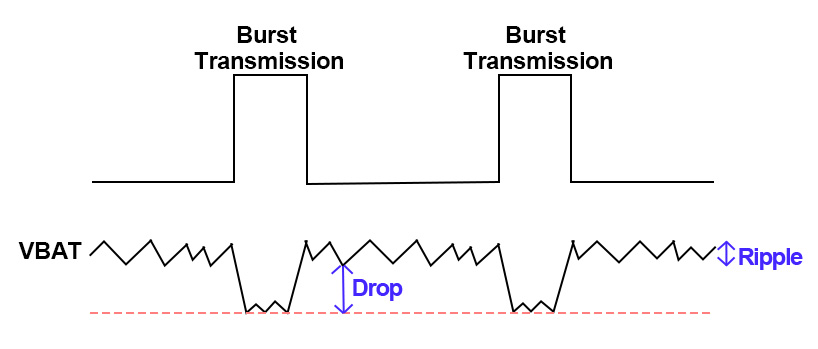
<figcaption>
<strong>图 3</strong><strong>：突发传输电源要求</strong>
</figcaption>
</figure>

为了减少电压跌落，建议给VBAT预留2个(100uF、0.1uF)具有最佳ESR性能的片式多层陶瓷电容(MLCC），且电容靠近 VBAT引脚放置。参考电路如下：

<figure>
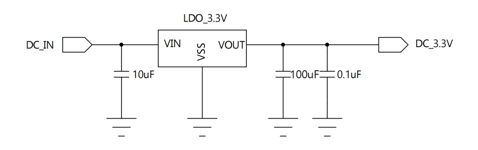
<figcaption>
<strong>图 4</strong><strong>：供电参考电路</strong>
</figcaption>
</figure>

3.  **CEN复位脚说明**

|            |            |         |          |            |
|:----------:|:----------:|:-------:|:--------:|:----------:|
| **引脚名** | **引脚号** | **I/O** | **描述** |  **备注**  |
|    CEN     |     8      |    I    | 模块复位 | 低电平复位 |

**表 4****：CEN引脚定义表**

<figure>
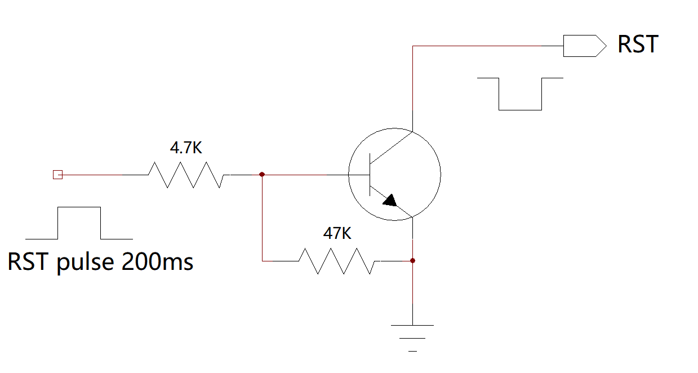
<figcaption>
<strong>图 5</strong><strong>：复位参考电路</strong>
</figcaption>
</figure>

<figure>
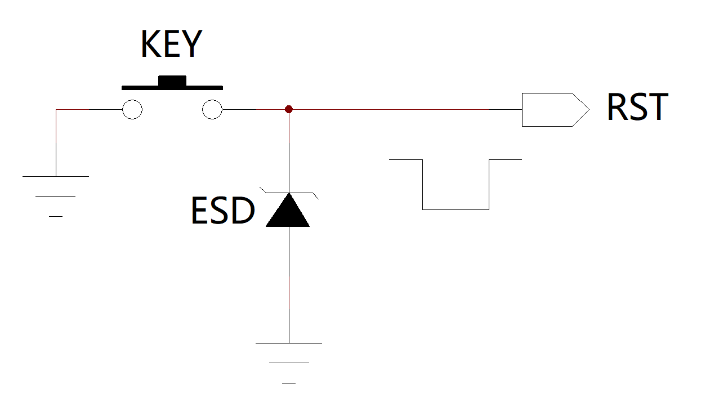
<figcaption>
<strong>图 6</strong><strong>：按键复位参考电路</strong>
</figcaption>
</figure>

4.  **功耗**

<table style="width:97%;">
<caption>
<strong>表 5</strong><strong>：功耗表</strong>
</caption>
<colgroup>
<col style="width: 14%" />
<col style="width: 22%" />
<col style="width: 16%" />
<col style="width: 15%" />
<col style="width: 15%" />
<col style="width: 12%" />
</colgroup>
<tbody>
<tr>
<td style="text-align: center;"><strong>工作模式</strong></td>
<td style="text-align: center;"><strong>工作状态</strong></td>
<td style="text-align: center;"><strong>状态</strong></td>
<td style="text-align: center;"><strong>蓝牙广播</strong></td>
<td style="text-align: center;"><strong>电流</strong></td>
<td style="text-align: center;"><strong>Unit</strong></td>
</tr>
<tr>
<td rowspan="16" style="text-align: center;">正常工作模式</td>
<td style="text-align: center;">STA</td>
<td style="text-align: center;">未连接</td>
<td style="text-align: center;">关闭</td>
<td style="text-align: center;">33.39</td>
<td style="text-align: center;">mA</td>
</tr>
<tr>
<td style="text-align: center;">AP</td>
<td style="text-align: center;">未连接</td>
<td style="text-align: center;">关闭</td>
<td style="text-align: center;">40.85</td>
<td style="text-align: center;">mA</td>
</tr>
<tr>
<td style="text-align: center;">STA和AP</td>
<td style="text-align: center;">未连接</td>
<td style="text-align: center;">关闭</td>
<td style="text-align: center;">42.02</td>
<td style="text-align: center;">mA</td>
</tr>
<tr>
<td style="text-align: center;">STA</td>
<td style="text-align: center;">未连接</td>
<td style="text-align: center;">打开</td>
<td style="text-align: center;">34.17</td>
<td style="text-align: center;">mA</td>
</tr>
<tr>
<td style="text-align: center;">AP</td>
<td style="text-align: center;">未连接</td>
<td style="text-align: center;">打开</td>
<td style="text-align: center;">41.35</td>
<td style="text-align: center;">mA</td>
</tr>
<tr>
<td style="text-align: center;">STA和AP</td>
<td style="text-align: center;">未连接</td>
<td style="text-align: center;">打开</td>
<td style="text-align: center;">42.14</td>
<td style="text-align: center;">mA</td>
</tr>
<tr>
<td style="text-align: center;">STA</td>
<td style="text-align: center;">已连接</td>
<td style="text-align: center;">关闭</td>
<td style="text-align: center;">37.06</td>
<td style="text-align: center;">mA</td>
</tr>
<tr>
<td style="text-align: center;">AP</td>
<td style="text-align: center;">已连接</td>
<td style="text-align: center;">关闭</td>
<td style="text-align: center;">43.13</td>
<td style="text-align: center;">mA</td>
</tr>
<tr>
<td style="text-align: center;">STA和AP</td>
<td style="text-align: center;">已连接</td>
<td style="text-align: center;">关闭</td>
<td style="text-align: center;">43.31</td>
<td style="text-align: center;">mA</td>
</tr>
<tr>
<td style="text-align: center;">STA</td>
<td style="text-align: center;">已连接</td>
<td style="text-align: center;">打开</td>
<td style="text-align: center;">37.82</td>
<td style="text-align: center;">mA</td>
</tr>
<tr>
<td style="text-align: center;">AP</td>
<td style="text-align: center;">已连接</td>
<td style="text-align: center;">打开</td>
<td style="text-align: center;">44.15</td>
<td style="text-align: center;">mA</td>
</tr>
<tr>
<td style="text-align: center;">STA和AP</td>
<td style="text-align: center;">已连接</td>
<td style="text-align: center;">打开</td>
<td style="text-align: center;">42.98</td>
<td style="text-align: center;">mA</td>
</tr>
<tr>
<td style="text-align: center;">STA模式TCP通讯</td>
<td style="text-align: center;">最大数据量</td>
<td style="text-align: center;">打开</td>
<td style="text-align: center;">39.68</td>
<td style="text-align: center;">mA</td>
</tr>
<tr>
<td style="text-align: center;">STA模式TCP通讯</td>
<td style="text-align: center;">待机</td>
<td style="text-align: center;">打开</td>
<td style="text-align: center;">38.42</td>
<td style="text-align: center;">mA</td>
</tr>
<tr>
<td style="text-align: center;">STA模式MQTT通讯</td>
<td style="text-align: center;">最大数据量</td>
<td style="text-align: center;">打开</td>
<td style="text-align: center;">37.55</td>
<td style="text-align: center;">mA</td>
</tr>
<tr>
<td style="text-align: center;">STAMQTT通讯</td>
<td style="text-align: center;">待机</td>
<td style="text-align: center;">打开</td>
<td style="text-align: center;">37.25</td>
<td style="text-align: center;">mA</td>
</tr>
</tbody>
</table>

**备注：**

<table style="width:99%;">
<colgroup>
<col style="width: 99%" />
</colgroup>
<tbody>
<tr>
<td><ol type="1">
<li>
正常工作模式：长待机，长连接工作状态
</li>
<li>
该测试功耗为平均功耗
</li>
</ol></td>
</tr>
</tbody>
</table>

1.  **硬件物理接口**

    1.  **通用数字IO口**

> 模块中定义了7个通用数字lO口。所有这些IO口都可以通过软件进行配置，实现各种功能，如按钮控制、LED驱动或主控制器的中断信号等。不使用时保持悬空。

2.  **UART**

> DX-WF24具有一个通用异步接收/发送(UART)接口，提供全双工，异步串行通信，波特率高达6 Mbps。它们支持设置5/6/7/8位数据，以及奇、偶或无奇偶校验，停止位可以设置1位或者2位。UART1支持Flash下载。

3.  **I2C接口**

> DX-WF24具有一个I2C接口，只需要两条总线，串行数据线(SDA)和串行时钟线(SCL)。I2C接口可以作为主模式或从模式。它支持7位寻址的标准(最高100kbps)和快速(最高400kbps)模式。如果SCL上的低电平或总线空闲持续时间大于可编程阈值，则会对MCU产生中断。

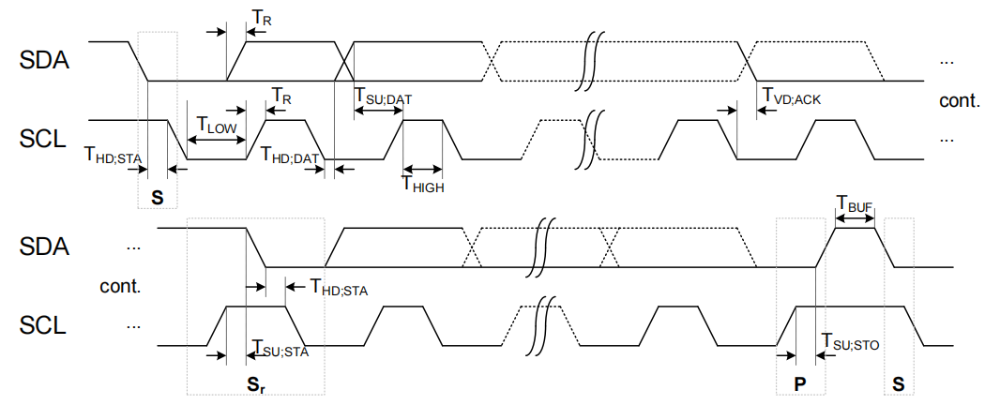

**图 7****：I2C通信时序图**

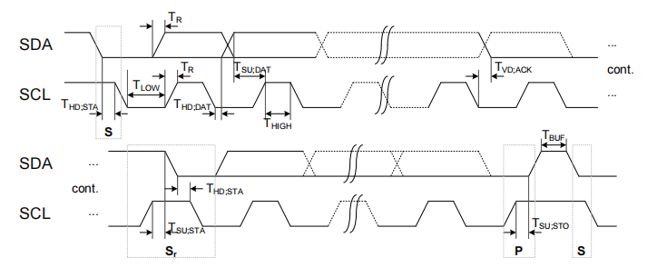

**图 8****：I2C从机时序图**

4.  **PWM**

> DX-WF24具有6个32位PWM通道，标记为PWM0-PWM5(支持定时器模式)。每个PWM通道有三种模式:定时器模式、PWM模式和捕获模式。每个通道的模式都是32位计数的多路复用，PWM运行时钟可选择高速时钟或低功耗时钟。每个PWM独立运行，有独立的占空比。

5.  **SPI接口**

> DX-WF24具有一个SPI接口，可以在主或从模式下工作。SPI接口允许时钟频率在主模式下高达30 MHz，在从模式下高达20 MHz。SPI接口支持可配置8位或16位数据宽度。SPI接口支持4线和3线模式(无CSN引脚)，64位RX FIFO和具有DMA功能的64位TX FIFO。接收数据可以锁存在时钟信号的上升沿或下降沿上。发送数据可由MSB或LSB设置。

<figure>
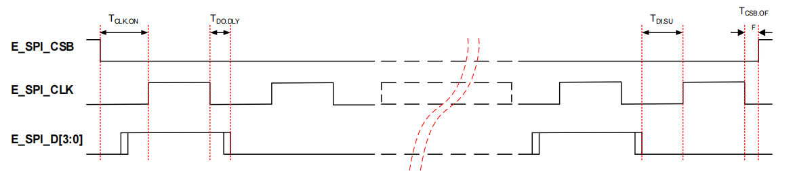
<figcaption>
<strong>图 9</strong><strong>：SPI通信时序图</strong>
</figcaption>
</figure>

> 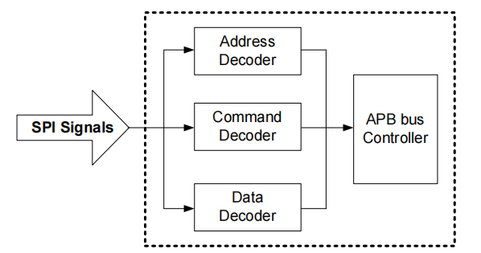

**图 10****：SPI从机框图**

> SPI从接口的通信协议使用4字节或8字节控制信号。在两种可用的通信协议之间，CPU在启动控制之前选择一种。

<figure>
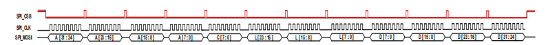
<figcaption>
<strong>图 11</strong><strong>：8字节控制类型</strong>
</figcaption>
</figure>

<figure>
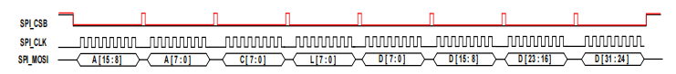
<figcaption>
<strong>图 12</strong><strong>：4字节控制类型</strong>
</figcaption>
</figure>

> 8字节控制类型使用4字节地址、1字节控制和3字节长度。4字节地址显示受内部访问的寄存器的地址。1字节的控制用于通信控制，3字节的长度以字节为单位显示连续访问的数据长度。因此，当应用8字节控制类型时，可连续访问的数据的最大长度为16 MB。4字节控制类型使用2字节的地址、1字节的控制和1字节的长度。2字节地址显示受内部访问的寄存器的地址。1字节控制用于通信控制，1字节长度以字节为单位显示连续访问的数据长度。由于内部使用的是32位地址映射，所以2字节的地址不足以表达一切。因此，先指定上2字节的基址，然后再使用下2字节的地址。

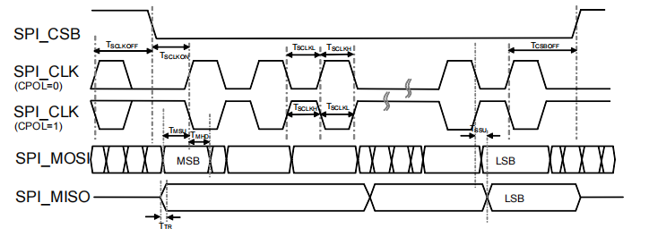

**图 13****：SPI从机时序图**

6.  **ADC**

> DX-WF24有一个10位通用SAR ADC，分辨率可设置为12-14位，具有5KHz至26MHz的可编程采样时钟。支持多达4个外部输入通道，支持在单次模式或连续模式下工作。ADC 支持电压输入范围为0-3.6V。

**表 6****：SAR ADC 输入通道**

|              |              |          |
|:------------:|:------------:|:--------:|
| **通道数量** | **检测电压** | **描述** |
|      1       |     ADC1     |  GPIO26  |
|      2       |     ADC2     |  GPIO24  |
|      3       |     ADC3     |  GPIO20  |
|      4       |     ADC4     |  GPIO28  |

2.  **参考连接电路**

**图 14****：典型应用电路**

<figure>
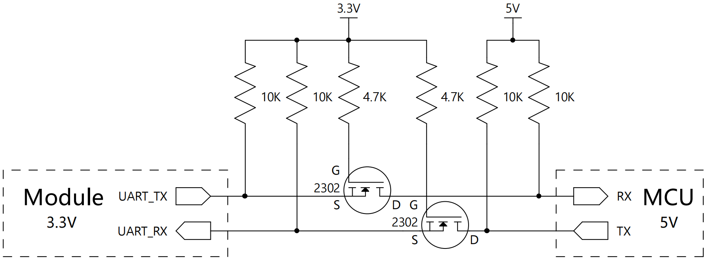
<figcaption>
<strong>图 15</strong><strong>：串口电平转换参考电路</strong>
</figcaption>
</figure>

# 电气特性、射频特性和可靠性

1.  **电气特性**

|          |            |          |            |          |
|:--------:|:----------:|:--------:|:----------:|:--------:|
| **参数** | **最小值** | **典型** | **最大值** | **单位** |
|   VBAT   |    2.7     |   3.3    |    3.6     |    V     |
| 峰值电流 |     \-     |    \-    |    360     |    mA    |

**表 7****：电气特性**

**备注**

|  |
|:---|
| 电压过低可能导致模块无法正常开机；电压过高或者开机过冲也可能对模块造成永久性损坏。 |

2.  **最大额定值**

> 超过绝对最大额定值的压力可能会对设备造成永久性损坏。长时间暴露在绝对最大额定条件下可能会影响设备的可靠性。

|          |                    |            |            |          |
|:--------:|:------------------:|:----------:|:----------:|:--------:|
| **参数** |      **描述**      | **最小值** | **最大值** | **单位** |
|   VBAT   | 电池稳压器供电电压 |    -0.3    |    3.6     |    V     |
|   PRX    |     RX输入功率     |     \-     |     10     |   dBm    |
|   TSTR   |    储存温度范围    |    -55     |    150     |    ℃     |

**表 8****：绝对最大额定值表**

3.  **推荐使用条件**

|          |                     |            |            |            |          |
|:--------:|:-------------------:|:----------:|:----------:|:----------:|:--------:|
| **参数** |      **描述**       | **最小值** | **典型值** | **最大值** | **单位** |
|   VBAT   | 电池/稳压器供电电压 |    2.7     |     \-     |    3.6     |    V     |
|  VCCIF   |    中频供电电压     |    2.7     |     \-     |    3.6     |    V     |
| VCCRXFE  |    RX的电源电压     |    2.7     |     \-     |    3.6     |    V     |

**表 9****：推荐运行条件**

4.  **静电防护**

> 在模块应用中，由于人体静电、微电子间带电摩擦等产生的静电，通过各种途径放电给模块，可能会对模块造成一定的损坏，因此ESD防护应该受到重视。在研发、生产组装和测试等过程中，尤其在产品设计中，均应采取ESD防护措施。例如，在电路设计的接口处以及易受静电放电损伤或影响的点，应增加防静电保护，生产中应佩戴防静电手套等。

**表 10****：ESD评级**

|          |              |            |          |
|:--------:|:------------:|:----------:|:--------:|
| **参数** |   **描述**   | **典型值** | **单位** |
| ESD HBM  |   人体模型   |   ±2000    |    V     |
| VDD_DIO2 | 带电器件模型 |    ±500    |    V     |

# 机械尺寸及布局建议 

本节描述了模块的机械尺寸，所有的尺寸单位为毫米；所有未标注公差的尺寸，公差为±0.3 mm

1.  **模块机械尺**

    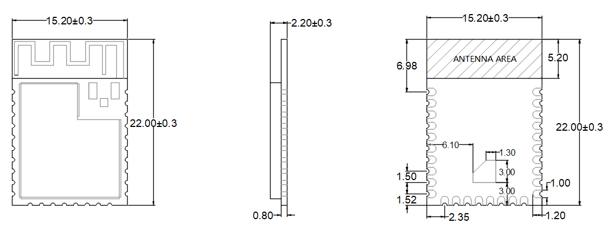

**图 16****：****模块俯视及侧视尺寸图**

2.  **推荐封装**

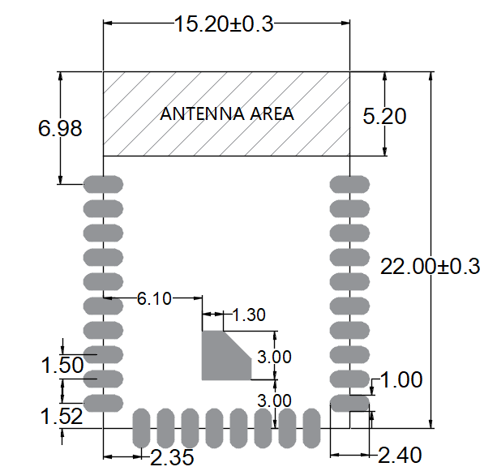

**图 17****：****建议封装尺寸图**

3.  **模块俯视图/底视图**

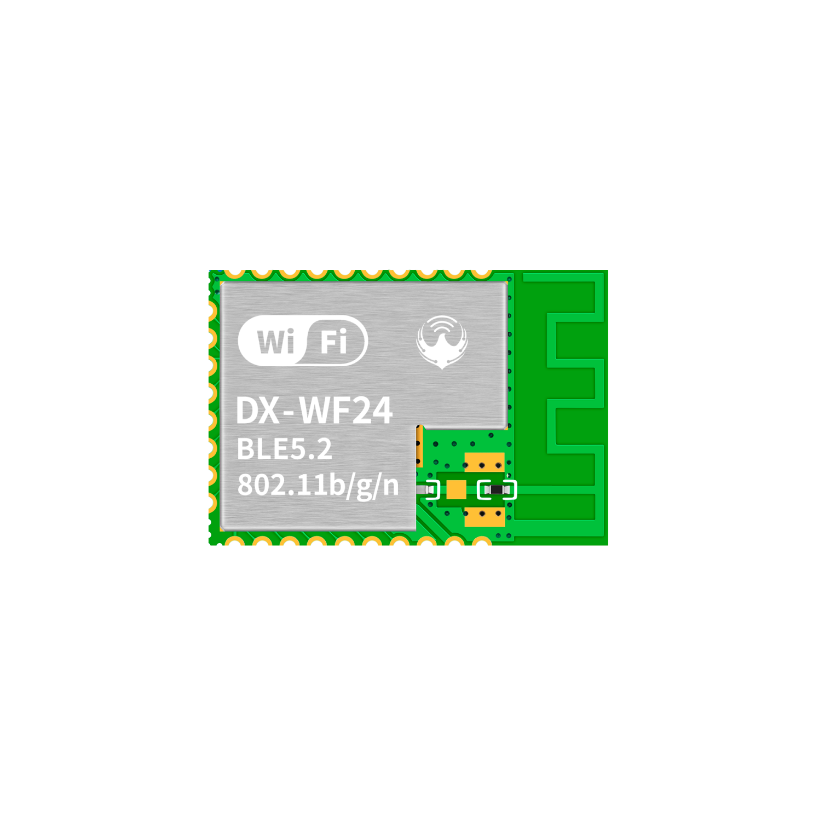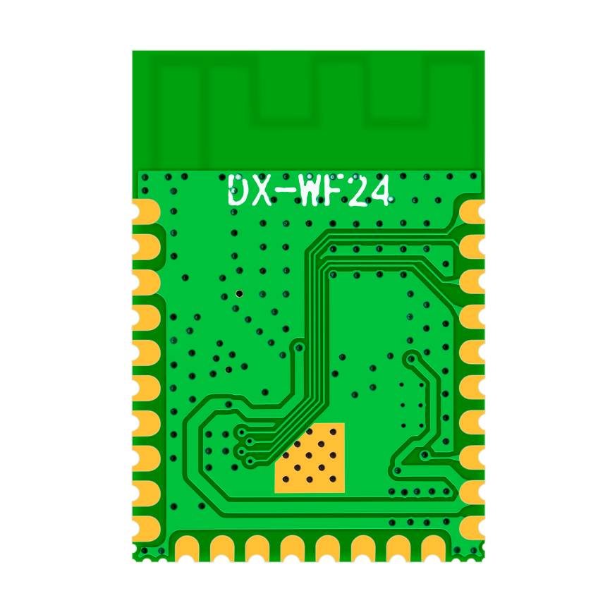

**图 18****：模块俯视图和底视图**

**备注：**

|                                                          |
|:---------------------------------------------------------|
| 上图仅供参考，实际的产品外观和标签信息，请参照模块实物。 |

4.  **硬件设计布局建议**

DX-WF24 蓝牙模块工作在2.4G无线频段，使用的是板载天线，天线的驻波比(VSWR)和效率取决于贴片位置，应尽量避免各种因素对无线收发信号的影响，注意以下几点：

> 1、包围蓝牙的产品外壳避免使用金属，当使用部分金属外壳时，应尽量让模块天线部分远离金属部分。产品内部金属连接线或者金属螺钉，应尽量远离模块天线部分。
>
> 2、模块天线部分应靠载板PCB边缘放置或直接露出载板，不允许放置于板中间，天线方向至少有5mm的自由空间，且天线下方载板铣空，与天线平行的方向不允许铺铜和走线。
>
> 3、建议在基板上的模块贴装位置使用绝缘材料进行隔离，例如在该位置放一个整块的丝印（TopOverLay）

<figure>
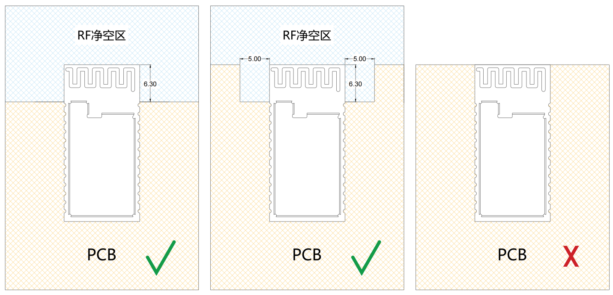
<figcaption>
<strong>图 19</strong><strong>：模块摆放参考位置</strong>
</figcaption>
</figure>

# 储存、生产和包装

1.  **存储条件**

模块以真空密封袋的形式出货。模块的湿度敏感等级为 3（MSL 3），其存储需遵循如下条件：

> 1\. 推荐存储条件：温度23±5°C，且相对湿度为35~60%。
>
> 2. 在推荐存储条件下，模块可在真空密封袋中存放12个月。
>
> 3\. 在温度为23±5°C、相对湿度低于60%的车间条件下，模块拆封后的车间寿命为168小时。在此条件下，可直接对模块进行回流生产或其他高温操作。否则，需要将模块存储于相对湿度小于10 %的环境中（例如，防潮柜）以保持模块的干燥。
>
> 4\. 若模块处于如下条件，需要对模块进行预烘烤处理以防止模块吸湿受潮再高温焊接后出现的 PCB 起泡、裂痕和分层：

- 存储温湿度不符合推荐存储条件；

- 模块拆封后未能根据以上第3条完成生产或存放；

- 真空包装漏气、物料散装；

- 模块返修前；

  1.  **模块烘烤处理**

- 需要在120±5°C条件下高温烘烤8小时；

- 二次烘烤的模块须在烘烤后 24 小时内完成焊接，否则仍需在干燥箱内保存；

**备注：**

<table style="width:99%;">
<colgroup>
<col style="width: 99%" />
</colgroup>
<tbody>
<tr>
<td>
1. 为预防和减少模块因受潮导致的起泡、分层等焊接不良的发生，应严格进行管控，不建议拆开真空包装后长时间暴露在空气中。

2. 烘烤前，需将模块从包装取出，将裸模块放置在耐高温器具上，以免高温损伤塑料托盘或卷盘；二次烘烤的模块须在烘烤后24小时内完成焊接，否则需在干燥箱内保存。拆包、放置模块时请注意ESD防护，例如，佩戴防静电手套。
</td>
</tr>
</tbody>
</table>

1.  **回流焊**

用印刷刮板在网板上印刷锡膏，使锡膏通过网板开口漏印到PCB上，印刷刮板力度需调整合适。为保证模块印膏质量，模块焊盘部分对应的钢网厚度推荐为0.1~0.15mm。

推荐的回流焊温度为 235~250 ºC，最高不能超过250 ºC。为避免模块因反复受热而损坏，强烈推荐客户在完成PCB板第一面的回流焊之后再贴模块。推荐的炉温曲线图（无铅SMT回流焊）和相关参数如下图表所示：

<figure>
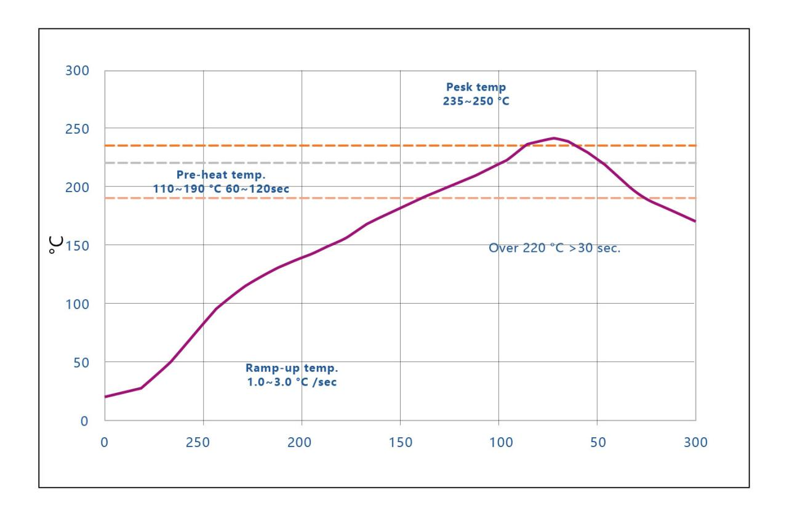
<figcaption>
<strong>图 20</strong><strong>：推荐的回流焊温度曲线</strong>
</figcaption>
</figure>

|                                      |          |          |          |
|:------------------------------------:|:--------:|:--------:|:--------:|
|             **统计名称**             | **下限** | **上限** | **单位** |
|  坡度1（目标=2.0）在30.0和70.0之间   |    1     |    3     |  度/秒   |
|  坡度2（目标=2.0）在70.0和150.0之间  |    1     |    3     |  度/秒   |
| 坡度3（目标=-2.8）在220.0和150.0之间 |    -5    |   -0.5   |  度/秒   |
|          恒温时间 110-190℃           |    60    |   120    |    秒    |
|            @220℃回流时间             |    30    |    65    |    秒    |
|               峰值温度               |   235    |   250    |  摄氏度  |
|            @235℃的总时间             |    10    |    30    |    秒    |

表 20：推荐的回流焊温度

2.  **包装规格**

DX-WF24模块采用卷带包装，并用真空密封袋将其封装，真空密封袋中带有干燥剂和湿度卡。每个载带有20米长，包含1000个模块，卷盘直径为330毫米。具体规格如下：

<figure>
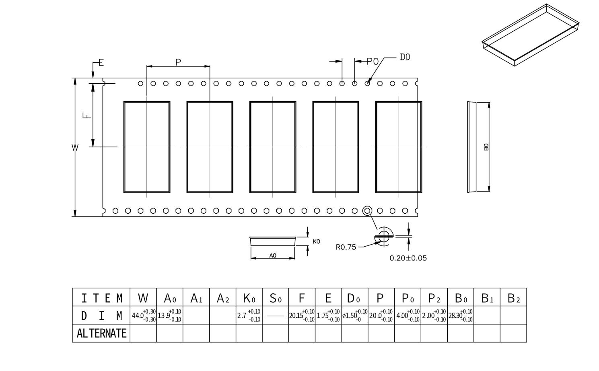
<figcaption>
<strong>图 21</strong><strong>：载带尺寸（单位：毫米）</strong>
</figcaption>
</figure>

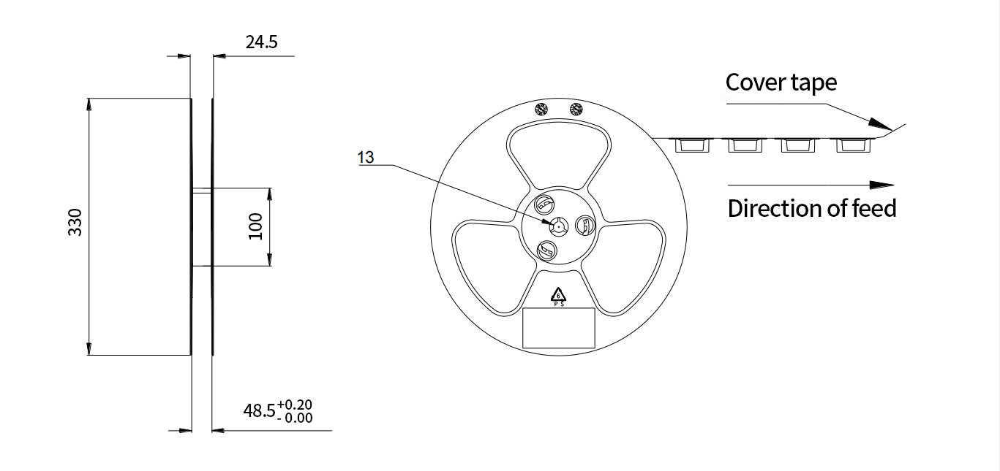

<figure>
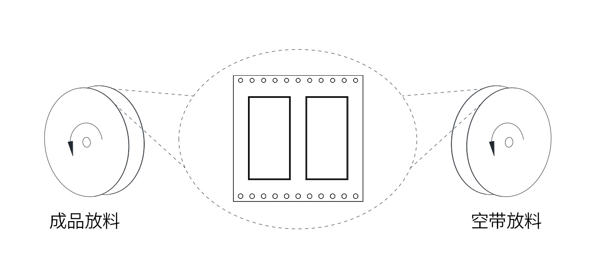
<figcaption>
<strong>图 22</strong><strong>：卷盘尺寸（单位：毫米）</strong>
</figcaption>
</figure>

**图 23****：卷带方向**
