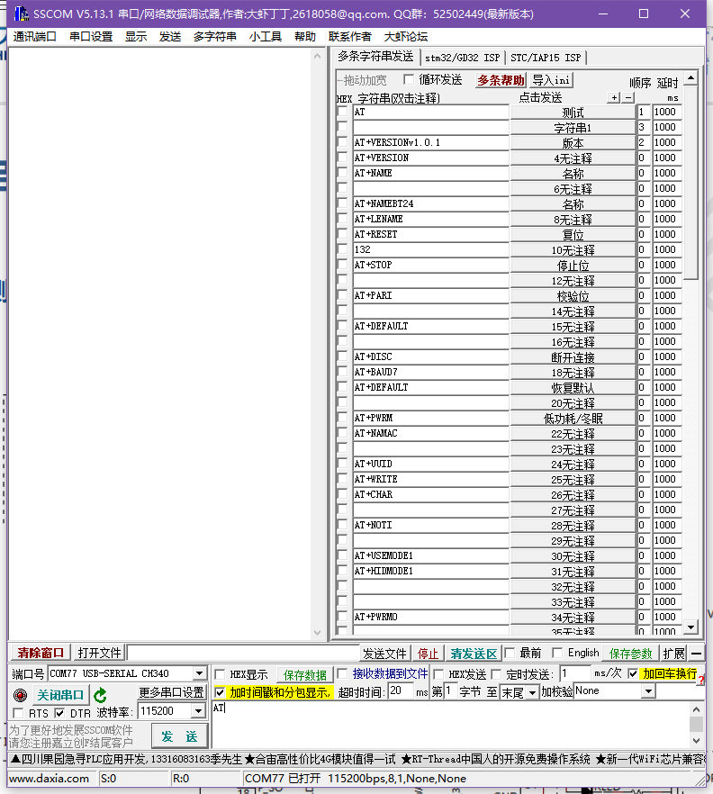
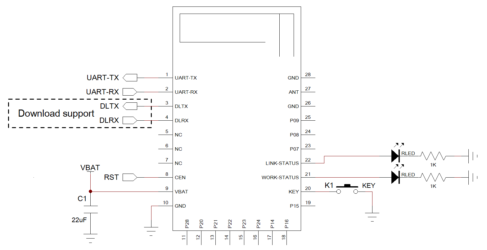

**DX-WF24**

**Wi-Fi/蓝牙二合一模组**

**串口应用指导**

> 版本：2.0
>
> 日期：2026-03-17

**更新记录**

|          |            |                 |          |
|:--------:|:----------:|:---------------:|:--------:|
| **版本** |  **日期**  |    **说明**     | **作者** |
|   V1.0   | 2022/10/1  |    初始版本     |   LSL    |
|   V1.1   | 2023/6/26  |    更改示例     |   LSL    |
|   V1.2   | 2023/8/14  | 更新DUP指令参数 |   LSL    |
|   V1.3   | 2023/10/7  |  更新简易通讯   |   LSL    |
|   V2.0   | 2026/03/17 |  新增模式说明   |   YXR    |

**联系我们**

**深圳大夏龙雀科技有限公司**

邮箱：sales@szdx-smart.com

电话：0755-2997 8125

网址：[www.szdx-smart.com](http://www.szdx-smart.com)

地址：深圳市宝安区航城街道航空路庄边工业园厂房A栋4层

**目录**

[1. 引言 [- 5 -](#引言)](#引言)

[1.1. 串口基本参数 [- 5 -](#_Toc14487)](#_Toc14487)

[1.2. WIFI AP模式基本参数 [- 5 -](#_Toc19173)](#_Toc19173)

[1.3. 蓝牙BLE基本参数 [- 5 -](#_Toc23208)](#_Toc23208)

[1.4. 工作模式 [- 6 -](#_Toc14914)](#_Toc14914)

[2. PC端测试工具 [- 7 -](#pc端测试工具)](#pc端测试工具)

[2.1. 电脑端测试软件 [- 7 -](#_Toc29807)](#_Toc29807)

[3. 串口使用 [- 8 -](#串口使用)](#串口使用)

[3.1. 使用串口读写AT命令 [- 8 -](#_Toc25258)](#_Toc25258)

[3.1.1. 模块测试最小系统 [- 8 -](#_Toc23463)](#_Toc23463)

[4. 相关AT命令详解 [- 9 -](#相关at命令详解)](#相关at命令详解)

[4.1. 命令格式说明 [- 9 -](#_Toc23562)](#_Toc23562)

[4.2. 回应格式说明 [- 9 -](#_Toc27749)](#_Toc27749)

[5. AT命令详解 [- 10 -](#at命令详解)](#at命令详解)

[5.1. 基础指令 [- 10 -](#_Toc19371)](#_Toc19371)

[5.1.1. 测试 AT 启动 [- 10 -](#_Toc12135)](#_Toc12135)

[5.1.2. 查询软件版本 [- 10 -](#_Toc13537)](#_Toc13537)

[5.1.3. 重启模块 [- 10 -](#_Toc26796)](#_Toc26796)

[5.1.4. 恢复出厂设置 [- 11 -](#_Toc1488)](#_Toc1488)

[5.1.5. 设置UART参数配置—保存到flash [- 11 -](#_Toc13626)](#_Toc13626)

[5.2. Wi-Fi AT 命令集 [- 12 -](#_Toc24614)](#_Toc24614)

[5.2.1. 查询/设置 Wi-Fi 模式(Station/SoftAP/Station+SoftAP) [- 12 -](#_Toc2777)](#_Toc2777)

[5.2.2. 查询/设置STA参数 [- 12 -](#_Toc17297)](#_Toc17297)

[5.2.3. 查询连接WIFI的名称和密码 [- 13 -](#_Toc32102)](#_Toc32102)

[5.2.4. 查询/设置连接WIFI后，路由器后台显示名称 [- 13 -](#_Toc14495)](#_Toc14495)

[5.2.5. 查询/设置AP参数 [- 13 -](#_Toc20157)](#_Toc20157)

[5.2.6. 断开与 STA 的连接 [- 14 -](#_Toc28472)](#_Toc28472)

[5.2.7. 断开与 AP 的连接 [- 14 -](#_Toc30389)](#_Toc30389)

[5.2.8. 查询Wi-Fi状态/Wi-Fi信息 [- 15 -](#_Toc12575)](#_Toc12575)

[5.2.9. 查询/设置 开启/关闭TCP/UDP/MQTT数据报头信息 [- 15 -](#_Toc3703)](#_Toc3703)

[5.2.10. 扫描当前可用的 AP [- 15 -](#_Toc9569)](#_Toc9569)

[5.2.11. 查询SoftAP的IP地址 [- 16 -](#_Toc32553)](#_Toc32553)

[5.2.12. 查询/设置Station的IP地址 [- 16 -](#_Toc21561)](#_Toc21561)

[5.2.13. 查询/设置 DHCP [- 17 -](#_Toc21951)](#_Toc21951)

[5.2.14. 查询/设置SNTP服务器 [- 17 -](#_Toc5950)](#_Toc5950)

[5.2.15. 查询SNTP时间 [- 18 -](#_Toc26617)](#_Toc26617)

[5.2.16. 查询/设置STA的MAC地址 [- 19 -](#_Toc16341)](#_Toc16341)

[5.2.17. 查询/设置AP的MAC地址 [- 20 -](#_Toc32013)](#_Toc32013)

[5.2.18. ping 对端主机 [- 20 -](#_Toc20015)](#_Toc20015)

[5.3. BLE AT命令 [- 21 -](#_Toc31446)](#_Toc31446)

[5.3.1. 设置\查询BLE设备名称 [- 21 -](#_Toc25737)](#_Toc25737)

[5.3.2. 查询模块蓝牙地址码 [- 21 -](#_Toc20171)](#_Toc20171)

[5.3.3. 设置\查询BLE广播模式 [- 22 -](#_Toc19859)](#_Toc19859)

[5.3.4. 查询\设置BLE透传模式 [- 22 -](#_Toc25714)](#_Toc25714)

[5.4. TCP/IP AT命令 [- 22 -](#_Toc6779)](#_Toc6779)

[5.4.1. 建立TCP服务器 [- 22 -](#_Toc29025)](#_Toc29025)

[5.4.2. 建立TCP客户端/创建UDP会话 [- 23 -](#_Toc1759)](#_Toc1759)

[5.4.3. 查询 TCP/UDP 连接信息 [- 24 -](#_Toc10307)](#_Toc10307)

[5.4.4. 查询/设置 单连接或多连接 透传模式 [- 24 -](#_Toc19761)](#_Toc19761)

[5.4.5. Wi-Fi 透传模式下发送数据 [- 25 -](#_Toc30467)](#_Toc30467)

[5.4.6. 退出数据模式\[仅适用数据模式\] [- 26 -](#_Toc21485)](#_Toc21485)

[5.4.7. 关闭TCP/UDP连接 [- 26 -](#_Toc389)](#_Toc389)

[5.5. MQTT AT 命令 [- 26 -](#_Toc29035)](#_Toc29035)

[5.5.1. 查询/设置 MQTT 连接属性 [- 26 -](#_Toc8821)](#_Toc8821)

[5.5.2. 查询/设置 MQTT 客户端 ID [- 27 -](#_Toc27542)](#_Toc27542)

[5.5.3. 查询/设置 MQTT 登录用户名 [- 28 -](#_Toc1007)](#_Toc1007)

[5.5.4. 查询/设置 MQTT 密码 [- 28 -](#_Toc31203)](#_Toc31203)

[5.5.5. 连接 MQTT 服务器 [- 29 -](#_Toc73)](#_Toc73)

[5.5.6. 发布 MQTT 主题消息 [- 29 -](#_Toc1154)](#_Toc1154)

[5.5.7. 订阅 MQTT 主题 [- 30 -](#_Toc6917)](#_Toc6917)

[5.5.8. 取消订阅 MQTT Topic [- 31 -](#_Toc29092)](#_Toc29092)

[5.5.9. 断开 MQTT 连接 [- 31 -](#_Toc21565)](#_Toc21565)

[5.5.10. 查询或设置MQTT证书 [- 32 -](#_Toc26178)](#_Toc26178)

[5.6. HTTP相关指令 [- 32 -](#_Toc26298)](#_Toc26298)

[5.6.1. 配置HTTP的URL信息 [- 32 -](#_Toc22543)](#_Toc22543)

[5.6.2. 设置请求头字段 [- 33 -](#_Toc27681)](#_Toc27681)

[5.6.3. 发送HTTP请求 [- 33 -](#_Toc837)](#_Toc837)

[5.6.4. 设置请求体数据 [- 34 -](#_Toc30528)](#_Toc30528)

[5.7. 简易配对 AT 命令 [- 34 -](#_Toc12103)](#_Toc12103)

[5.7.1. 查询/设置 简易配对模式 [- 34 -](#_Toc3175)](#_Toc3175)

[5.7.2. 查询/保存 客户端配置数据 [- 35 -](#_Toc28937)](#_Toc28937)

[5.7.3. 查询/保存 服务端配置数据 [- 36 -](#_Toc24974)](#_Toc24974)

[5.8. URC消息说明 [- 36 -](#_Toc15728)](#_Toc15728)

[5.9. 错误码一览表 [- 37 -](#_Toc18279)](#_Toc18279)

[6. 增值服务 [- 38 -](#增值服务)](#增值服务)

**图片索引**

[图 1 ：电脑端串口软件图 [- 7 -](#_Toc20045)](#_Toc20045)

[图 2 ：模块最小系统图 [- 8 -](#_Toc24561)](#_Toc24561)

# 引言

大夏龙雀科技 DX-WF24 是Wi-Fi/蓝牙二合一模组，拥有802.11 b/g/n协议和BLE 5.2蓝牙协议，模块内置标准串口协议。设备可以通过模块跟移动端、PC端、主设备端、路由器等进行数据交互，并可以使用AT命令对模块参数进行配置和修改。从而使设备以极低的成本、极快的速度加入物联网，让设备更方便、智能。

1.  **串口基本参数**

- 模块串口默认参数：115200bps/8/n/1（波特率/数据位/无校验/停止位）

  1.  **WIFI AP模式基本参数**

- 默认IP地址：10.0.0.1

- 默认名称：WF24

- 默认密码：12345678

  1.  **蓝牙BLE基本参数**

- 默认名称：WF24-BLE

- 默认BLE UUID：SERVICE UUID：FFE0

NOTIFY/WRITE UUID：FFE1

WRITE UUID：FFE2

1.  **工作模式**

- WIFI功能：

简易配对模式：

①正常模式：模块默认此模式，该模式下断电不保存通讯相关指令

②配对透传模式/路由透传模式/MQTT 透传模式：通过指令AT+SIMPLEMODE可设置此模式，该模式下断电可保存通讯相关指令，三种模式具体区别可参考5.6.1备注

- 蓝牙功能：

蓝牙连接前，模块发送指令AT+BLUFISEND=1切换为透传模式，之后连接蓝牙，即可透传数据。

# PC端测试工具

1.  **电脑端测试软件**

> 电脑端测试软件请在资料包中下载安装sscom5.13.1电脑串口软件进行测试，串口软件界面如下图：

<figure>

<figcaption>
<strong>图 1</strong><strong>：电脑端串口软件图</strong>
</figcaption>
</figure>

# 串口使用

1.  **使用串口读写AT命令**

    1.  **模块测试最小系统**

> 

**图 2****：模块最小系统图**

# 相关AT命令详解

1.  **命令格式说明**

**AT+Command=\<param1，param2，param3\> \<CR\>\<LF\>**

- 所有的指令以AT开头，\<CR\>\<LF\>结束，在本文档中表现命令和响应的表格中，省略了 \<CR\>\<LF\>，仅显示命令和响应。

- 所有AT命令字符都为大写。

- \<\>内为可选内容，如果命令中有多个参数，以逗号“，”隔开，实际命令中不包含尖括号。

- \<CR\>为回车字符\r，十六进制为0X0D。

- \<LF\>为换行字符\n，十六进制为0X0A。

- 指令执行成功，返回相应命令以OK结束，失败返回EEROR=\<\>，“\<\>”内容为对应错误码（请参考5.7）。

  1.  **回应格式说明**

**+Indication:\<param1，param2，param3\>\<CR\>\<LF\>**

- 回应指令以加号“+”开头，\<CR\>\<LF\>结束

- 等于“ : ”后面为回应参数

- 如果回应参数中有多个参数，会以逗号“，”隔开

# AT命令详解

1.  **基础指令**

    1.  **测试 AT 启动**

|          |          |          |          |
|:--------:|:--------:|:--------:|:--------:|
| **功能** | **指令** | **响应** | **说明** |
| 测试指令 |    AT    |    OK    |          |

2.  **查询软件版本**

<table style="width:100%;">
<colgroup>
<col style="width: 12%" />
<col style="width: 13%" />
<col style="width: 29%" />
<col style="width: 44%" />
</colgroup>
<tbody>
<tr>
<td style="text-align: center;"><strong>功能</strong></td>
<td style="text-align: center;"><strong>指令</strong></td>
<td style="text-align: center;"><strong>响应</strong></td>
<td style="text-align: center;"><strong>说明</strong></td>
</tr>
<tr>
<td style="text-align: center;">查询版本号</td>
<td style="text-align: center;">AT+GMR</td>
<td style="text-align: center;">
+VERSION=&lt;version&gt;

OK
</td>
<td style="text-align: center;">
&lt;version &gt;软件版本号

依据不同的模块与定制需求版本会有区别
</td>
</tr>
</tbody>
</table>

**举例：**

<table style="width:99%;">
<colgroup>
<col style="width: 99%" />
</colgroup>
<tbody>
<tr>
<td style="text-align: left;">
发送：AT+GMR

返回：+VERSION=WF24_V1.0.2

OK
</td>
</tr>
</tbody>
</table>

3.  **重启模块**

<table style="width:100%;">
<colgroup>
<col style="width: 19%" />
<col style="width: 19%" />
<col style="width: 25%" />
<col style="width: 35%" />
</colgroup>
<tbody>
<tr>
<td style="text-align: center;"><strong>功能</strong></td>
<td style="text-align: center;"><strong>指令</strong></td>
<td style="text-align: center;"><strong>响应</strong></td>
<td style="text-align: center;"><strong>说明</strong></td>
</tr>
<tr>
<td style="text-align: center;">重启模块</td>
<td style="text-align: center;">AT+RST</td>
<td style="text-align: center;">
OK

power on
</td>
<td style="text-align: center;"></td>
</tr>
</tbody>
</table>

4.  **恢复出厂设置**

<table style="width:100%;">
<colgroup>
<col style="width: 19%" />
<col style="width: 19%" />
<col style="width: 25%" />
<col style="width: 35%" />
</colgroup>
<tbody>
<tr>
<td style="text-align: center;"><strong>功能</strong></td>
<td style="text-align: center;"><strong>指令</strong></td>
<td style="text-align: center;"><strong>响应</strong></td>
<td style="text-align: center;"><strong>说明</strong></td>
</tr>
<tr>
<td style="text-align: center;">恢复出厂设置</td>
<td style="text-align: center;">AT+RESTORE</td>
<td style="text-align: center;">
OK

power on
</td>
<td style="text-align: center;"></td>
</tr>
</tbody>
</table>

**备注：**

|  |
|:---|
| 该命令将擦除所有保存到 flash 的参数，并恢复为默认参数，运行该命令会重启设备 |

5.  **设置UART参数配置—保存到flash**

<table style="width:100%;">
<colgroup>
<col style="width: 10%" />
<col style="width: 29%" />
<col style="width: 31%" />
<col style="width: 28%" />
</colgroup>
<tbody>
<tr>
<td style="text-align: center;"><strong>功能</strong></td>
<td style="text-align: center;"><strong>指令</strong></td>
<td style="text-align: center;"><strong>响应</strong></td>
<td style="text-align: center;"><strong>说明</strong></td>
</tr>
<tr>
<td style="text-align: center;">查询参数</td>
<td style="text-align: center;">AT+UART_DEF?</td>
<td style="text-align: center;">
+UART_DEF:

&lt;baudrate&gt;,&lt;databits&gt;,

&lt;stopbits&gt;,&lt;parity&gt;

OK
</td>
<td rowspan="2" style="text-align: center;">
&lt;baudrate&gt;：UART 波特率

支持范围：

4800 9600

19200 38400

57600 115200

230400 460800

921600 2000000

&lt;databits&gt;：数据位

7： 7 bit 数据位

8： 8 bit 数据位

&lt;stopbits&gt;：停止位

1： 1 bit 停止位

2： 2 bit 停止位

&lt;parity&gt;：校验位

0： None

1： Odd

2： Even
</td>
</tr>
<tr>
<td style="text-align: center;">设置参数</td>
<td style="text-align: center;">
AT+UART_DEF=

&lt;baudrate&gt;,&lt;databits&gt;,

&lt;stopbits&gt;,&lt;parity&gt;
</td>
<td style="text-align: center;">
OK

power on
</td>
</tr>
</tbody>
</table>

**举例：**

<table style="width:99%;">
<colgroup>
<col style="width: 99%" />
</colgroup>
<tbody>
<tr>
<td style="text-align: left;">
发送：AT+UART_DEF=115200,8,1,0

返回：

OK

power on

设置完该指令后自动重启生效
</td>
</tr>
</tbody>
</table>

2.  **Wi-Fi AT 命令集**

    1.  **查询/设置 Wi-Fi 模式(Station/SoftAP/Station+SoftAP)**

<table style="width:100%;">
<colgroup>
<col style="width: 17%" />
<col style="width: 25%" />
<col style="width: 22%" />
<col style="width: 33%" />
</colgroup>
<tbody>
<tr>
<td style="text-align: center;"><strong>功能</strong></td>
<td style="text-align: center;"><strong>指令</strong></td>
<td style="text-align: center;"><strong>响应</strong></td>
<td style="text-align: center;"><strong>说明</strong></td>
</tr>
<tr>
<td style="text-align: center;">
查询设备的

Wi-Fi 模式
</td>
<td style="text-align: center;">AT+CWMODE?</td>
<td style="text-align: center;">
+CWMODE:&lt;mode&gt;

OK
</td>
<td rowspan="2" style="text-align: center;">
&lt;mode&gt;：模式

0: Station 模式

1: SoftAP 模式

2: SoftAP+Station 模式

默认：0
</td>
</tr>
<tr>
<td style="text-align: center;">
设置设备的

Wi-Fi 模式
</td>
<td style="text-align: center;">AT+CWMODE=&lt;mode&gt;</td>
<td style="text-align: center;">OK</td>
</tr>
</tbody>
</table>

2.  **查询/设置STA参数**

<table style="width:100%;">
<colgroup>
<col style="width: 17%" />
<col style="width: 22%" />
<col style="width: 27%" />
<col style="width: 32%" />
</colgroup>
<tbody>
<tr>
<td style="text-align: center;"><strong>功能</strong></td>
<td style="text-align: center;"><strong>指令</strong></td>
<td style="text-align: center;"><strong>响应</strong></td>
<td style="text-align: center;"><strong>说明</strong></td>
</tr>
<tr>
<td style="text-align: center;">
查询与Station

需连接的AP信息
</td>
<td style="text-align: center;">AT+CWJAP?</td>
<td style="text-align: center;">
+CWJAP:

&lt;ssid&gt;,&lt;bssid&gt;,

&lt;freq&gt;,&lt;rssi&gt;

OK
</td>
<td rowspan="2" style="text-align: center;">
&lt;ssid&gt;: SSID，最长32个字节

默认：WF24

&lt;pwd&gt;：密码，最长32个字节

默认：12345678

[&lt;bssid&gt;]: 远端mac地址

默认：11:11:11:11:11:11

&lt;freq&gt;:信道

&lt;rssi&gt;:信号强度

&lt;ip&gt;：本机IP地址
</td>
</tr>
<tr>
<td style="text-align: center;">
设置 Station

需连接的AP
</td>
<td style="text-align: center;">
AT+CWJAP=

&lt;ssid&gt;,&lt;pwd&gt;,

[&lt;bssid&gt;]
</td>
<td style="text-align: center;">
OK

+CWJAP:1,&lt;ssid&gt;

&lt;ip&gt;
</td>
</tr>
</tbody>
</table>

**备注：**

<table style="width:99%;">
<colgroup>
<col style="width: 99%" />
</colgroup>
<tbody>
<tr>
<td><ol type="1">
<li>
该指令需模块作为STA模式时生效
</li>
<li>
[ ]内参数可缺省，省略时采用默认参数
</li>
<li>
查询指令需连接AP成功后才有详细详细返回
</li>
<li>
手机连接蓝牙模块，APP发送AT+CWJAP?指令时，不可连发，两次发送指令的间隔需超过2s
</li>
</ol></td>
</tr>
</tbody>
</table>

**示例：**

<table style="width:99%;">
<colgroup>
<col style="width: 99%" />
</colgroup>
<tbody>
<tr>
<td><ol type="1">
<li>
假设目标AP的SSID是abc，密码是0123456789，则命令是：AT+CWJAP=abc,0123456789
</li>
<li>
如果多个AP有相同的SSID是abc，可通过查询目标AP的BSSID，找到目标AP：

AT+CWJAP=abc,0123456789,11:22:33:44:55:66
</li>
</ol></td>
</tr>
</tbody>
</table>

1.  **查询连接WIFI的名称和密码**

<table style="width:100%;">
<colgroup>
<col style="width: 17%" />
<col style="width: 19%" />
<col style="width: 30%" />
<col style="width: 31%" />
</colgroup>
<tbody>
<tr>
<td style="text-align: center;"><strong>功能</strong></td>
<td style="text-align: center;"><strong>指令</strong></td>
<td style="text-align: center;"><strong>响应</strong></td>
<td style="text-align: center;"><strong>说明</strong></td>
</tr>
<tr>
<td style="text-align: center;">查询连接WIFI的名称和密码</td>
<td style="text-align: left;">AT+CWJAPINFO?</td>
<td style="text-align: center;">
+CWJAPINFO:&lt;ssid&gt;,&lt;pwd&gt;

OK
</td>
<td style="text-align: center;">
&lt;ssid&gt;: SSID，最长32个字节

默认：WF24

&lt;pwd&gt;：密码，最长32个字节

默认：12345678
</td>
</tr>
</tbody>
</table>

**备注：**

|                                      |
|--------------------------------------|
| 查询通过AT+CWJAP设置WIFI的名称和密码 |

2.  **查询/设置连接WIFI后，路由器后台显示名称**

<table style="width:100%;">
<colgroup>
<col style="width: 17%" />
<col style="width: 23%" />
<col style="width: 33%" />
<col style="width: 24%" />
</colgroup>
<tbody>
<tr>
<td style="text-align: center;"><strong>功能</strong></td>
<td style="text-align: center;"><strong>指令</strong></td>
<td style="text-align: center;"><strong>响应</strong></td>
<td style="text-align: center;"><strong>说明</strong></td>
</tr>
<tr>
<td style="text-align: center;">查询名称</td>
<td style="text-align: center;">AT+CWHOSTNAME?</td>
<td style="text-align: center;">
+CWHOSTNAME:&lt;host_name&gt;

OK
</td>
<td rowspan="2" style="text-align: center;">
&lt;host_name&gt;:

最大长度为28

默认:WF24
</td>
</tr>
<tr>
<td style="text-align: center;">设置名称</td>
<td style="text-align: center;">AT+CWHOSTNAME=&lt;host_name&gt;</td>
<td style="text-align: center;">OK</td>
</tr>
</tbody>
</table>

3.  **查询/设置AP参数**

<table>
<colgroup>
<col style="width: 17%" />
<col style="width: 21%" />
<col style="width: 25%" />
<col style="width: 35%" />
</colgroup>
<tbody>
<tr>
<td style="text-align: center;"><strong>功能</strong></td>
<td style="text-align: center;"><strong>指令</strong></td>
<td style="text-align: center;"><strong>响应</strong></td>
<td style="text-align: center;"><strong>说明</strong></td>
</tr>
<tr>
<td style="text-align: center;">
查询SoftAP的

配置参数
</td>
<td style="text-align: center;">AT+CWSAP?</td>
<td style="text-align: center;">
+CWSAP:

&lt;ssid&gt;,&lt;pwd&gt;，&lt;channel&gt;,

&lt;ssid hidden&gt;

OK
</td>
<td rowspan="2" style="text-align: center;">
&lt;ssid&gt;: 接入点名称，最大32字节

默认SSID：WF24

&lt;pwd&gt;：密码，最大值为32位

默认密码：12345678

[&lt;channel&gt;]: 信道号

支持范围：0~ 13

默认信道号：11

[&lt;ssid hidden&gt;]: 隐藏SSID

隐藏SSID：1

不隐藏SSID：0

默认：0
</td>
</tr>
<tr>
<td style="text-align: center;">
设置SoftAP的

配置参数
</td>
<td style="text-align: center;">
AT+CWSAP=

&lt;ssid&gt;,&lt;pwd&gt;,

[&lt;channel&gt;],

[&lt;ssid hidden&gt;]
</td>
<td style="text-align: center;">OK</td>
</tr>
</tbody>
</table>

**备注：**

<table style="width:99%;">
<colgroup>
<col style="width: 99%" />
</colgroup>
<tbody>
<tr>
<td><ol type="1">
<li>
该指令需模块作为AP模式时生效
</li>
<li>
[ ]内参数可缺省，省略时采用默认参数
</li>
<li>
&lt;pwd&gt;参数小于8位数时，默认为无密码模式，密码查询参数为0
</li>
</ol></td>
</tr>
</tbody>
</table>

**示例：**

<table style="width:99%;">
<colgroup>
<col style="width: 99%" />
</colgroup>
<tbody>
<tr>
<td><ol type="1">
<li>
设置AP的SSID是abc，密码：0123456789，则命令是 ：AT+CWSAP=abc,0123456789
</li>
<li>
设置AP 的 SSID 是 abc， 密 码 是 0123456789，信道号是8，隐藏SSID，则命令是 ：
</li>
</ol>

AT+CWSAP=abc,0123456789,8,1
</td>
</tr>
</tbody>
</table>

1.  **断开与 STA 的连接**

<table style="width:100%;">
<colgroup>
<col style="width: 25%" />
<col style="width: 22%" />
<col style="width: 19%" />
<col style="width: 32%" />
</colgroup>
<tbody>
<tr>
<td style="text-align: center;"><strong>功能</strong></td>
<td style="text-align: center;"><strong>指令</strong></td>
<td style="text-align: center;"><strong>响应</strong></td>
<td style="text-align: center;"><strong>说明</strong></td>
</tr>
<tr>
<td style="text-align: center;">
断开所有连入

SoftAP 的 Station
</td>
<td style="text-align: center;">AT+CWQIF</td>
<td rowspan="2" style="text-align: center;">
+WFDST:mac

OK
</td>
<td rowspan="2" style="text-align: center;">&lt;mac&gt;: STA的mac地址</td>
</tr>
<tr>
<td style="text-align: center;">
断开某个连入

SoftAP 的 Station
</td>
<td style="text-align: center;">AT+CWQIF=&lt;mac&gt;</td>
</tr>
</tbody>
</table>

**备注：**

|                              |
|------------------------------|
| 该指令需模块作为AP模式时生效 |

**示例：**

|                                                                      |
|----------------------------------------------------------------------|
| 断开某个连入SoftAP 的 Station，则命令是 ：AT+CWQIF=11:22:33:44:55:66 |

2.  **断开与 AP 的连接**

<table style="width:100%;">
<colgroup>
<col style="width: 17%" />
<col style="width: 17%" />
<col style="width: 30%" />
<col style="width: 33%" />
</colgroup>
<tbody>
<tr>
<td style="text-align: center;"><strong>功能</strong></td>
<td style="text-align: center;"><strong>指令</strong></td>
<td style="text-align: center;"><strong>响应</strong></td>
<td style="text-align: center;"><strong>说明</strong></td>
</tr>
<tr>
<td style="text-align: center;">断开连接</td>
<td style="text-align: center;">AT+CWQAP</td>
<td style="text-align: center;">
WIFI DISCONNECTED

OK
</td>
<td style="text-align: center;"></td>
</tr>
</tbody>
</table>

**备注：**

|                               |
|-------------------------------|
| 该指令需模块作为STA模式时生效 |

3.  **查询Wi-Fi状态/Wi-Fi信息**

<table style="width:100%;">
<colgroup>
<col style="width: 12%" />
<col style="width: 18%" />
<col style="width: 20%" />
<col style="width: 47%" />
</colgroup>
<tbody>
<tr>
<td style="text-align: center;"><strong>功能</strong></td>
<td style="text-align: center;"><strong>指令</strong></td>
<td style="text-align: center;"><strong>响应</strong></td>
<td style="text-align: center;"><strong>说明</strong></td>
</tr>
<tr>
<td style="text-align: center;">
查询设备的 Wi-Fi 状态

/Wi-Fi 信息
</td>
<td style="text-align: center;">AT+CWSTATE?</td>
<td style="text-align: center;">
+CWSTATE:

&lt;state&gt;,&lt;ssid&gt;

OK
</td>
<td style="text-align: left;">
&lt;state&gt;：当前 Wi-Fi 状态

0: station 尚未进行任何 Wi-Fi连接

1: station已连接上AP，但尚未获取IPv4 地址

2: station已连接上AP，并已经获取IPv4 地址

3: station正在进行Wi-Fi 连接或 Wi-Fi 重连

4: station 处于Wi-Fi 断开状态

&lt;ssid&gt;：连接AP的SSID
</td>
</tr>
</tbody>
</table>

4.  **查询/设置 开启/关闭TCP/UDP/MQTT数据报头信息**

<table>
<colgroup>
<col style="width: 17%" />
<col style="width: 20%" />
<col style="width: 32%" />
<col style="width: 30%" />
</colgroup>
<tbody>
<tr>
<td style="text-align: center;"><strong>功能</strong></td>
<td style="text-align: center;"><strong>指令</strong></td>
<td style="text-align: center;"><strong>响应</strong></td>
<td style="text-align: center;"><strong>说明</strong></td>
</tr>
<tr>
<td style="text-align: center;">查询数据报头信息</td>
<td style="text-align: center;">AT+REHEAD?</td>
<td style="text-align: center;">
+REHEAD:&lt;mode&gt;

OK
</td>
<td rowspan="2" style="text-align: center;">
&lt;operate&gt;：

0: 关闭数据报头信息

1: 开启数据报头信息

默认：1
</td>
</tr>
<tr>
<td style="text-align: center;">设置数据报头信息</td>
<td style="text-align: center;">
AT+REHEAD=

&lt;mode&gt;
</td>
<td style="text-align: center;">OK</td>
</tr>
</tbody>
</table>

5.  **扫描当前可用的 AP**

<table style="width:100%;">
<colgroup>
<col style="width: 17%" />
<col style="width: 23%" />
<col style="width: 27%" />
<col style="width: 31%" />
</colgroup>
<tbody>
<tr>
<td style="text-align: center;"><strong>功能</strong></td>
<td style="text-align: center;"><strong>指令</strong></td>
<td style="text-align: center;"><strong>响应</strong></td>
<td style="text-align: center;"><strong>说明</strong></td>
</tr>
<tr>
<td style="text-align: center;">
列出当前

可用的 AP
</td>
<td style="text-align: center;">AT+CWLAP?</td>
<td style="text-align: center;">
+CWLAP:&lt;ecn&gt;,&lt;ssid&gt;,

&lt;rssi&gt;,&lt;bssid&gt;,&lt;freq&gt;

OK
</td>
<td style="text-align: center;">
&lt;ecn&gt;:加密方式

&lt;ssid&gt;:AP的SSID

&lt;rssi&gt;:信号强度

&lt;bssid&gt;:远端mac地址

&lt;freq&gt;:信道号
</td>
</tr>
</tbody>
</table>

**备注：**

<table style="width:99%;">
<colgroup>
<col style="width: 99%" />
</colgroup>
<tbody>
<tr>
<td><ol type="1">
<li>
该指令需模块作为STA模式时生效
</li>
</ol></td>
</tr>
</tbody>
</table>

1.  **查询SoftAP的IP地址**

<table>
<colgroup>
<col style="width: 17%" />
<col style="width: 20%" />
<col style="width: 32%" />
<col style="width: 30%" />
</colgroup>
<tbody>
<tr>
<td style="text-align: center;"><strong>功能</strong></td>
<td style="text-align: center;"><strong>指令</strong></td>
<td style="text-align: center;"><strong>响应</strong></td>
<td style="text-align: center;"><strong>说明</strong></td>
</tr>
<tr>
<td style="text-align: center;">
查询SoftAP

的IP地址
</td>
<td style="text-align: center;">AT+CIPAP?</td>
<td style="text-align: center;">
+CIPAP:ip:&lt;ip&gt;

+CIPAP:gateway:&lt;gateway&gt;

+CIPAP:netmask:&lt;netmask&gt;

OK
</td>
<td style="text-align: center;">
&lt;ip&gt;:SoftAP 的 IPv4 地址

&lt;gateway&gt;:网关

&lt;netmask&gt;:子网掩码
</td>
</tr>
</tbody>
</table>

**备注：**

<table style="width:99%;">
<colgroup>
<col style="width: 99%" />
</colgroup>
<tbody>
<tr>
<td><ol type="1">
<li>
该指令需模块作为AP模式时生效，且仅适用于IPv4 网络
</li>
<li>
默认参数：
</li>
</ol>

AP ip:10.0.0.1

gateway:10.0.0.1

netmask:255.255.255.0
</td>
</tr>
</tbody>
</table>

**示例：**

<table style="width:99%;">
<colgroup>
<col style="width: 99%" />
</colgroup>
<tbody>
<tr>
<td style="text-align: left;">
发送：AT+CIPAP?

返回：+CIPAP:ip:10.0.0.1

+CIPAP:gateway:10.0.0.1

+CIPAP:netmask:255.255.255.0
</td>
</tr>
</tbody>
</table>

1.  **查询/设置Station的IP地址**

<table>
<colgroup>
<col style="width: 17%" />
<col style="width: 20%" />
<col style="width: 32%" />
<col style="width: 30%" />
</colgroup>
<tbody>
<tr>
<td style="text-align: center;"><strong>功能</strong></td>
<td style="text-align: center;"><strong>指令</strong></td>
<td style="text-align: center;"><strong>响应</strong></td>
<td style="text-align: center;"><strong>说明</strong></td>
</tr>
<tr>
<td style="text-align: center;">
查询Station

的IP地址
</td>
<td style="text-align: center;">AT+CIPSTA?</td>
<td style="text-align: center;">
+CIPSTA:ip:&lt;ip&gt;

+CIPSTA:gateway:&lt;gateway&gt;

+CIPSTA:netmask:&lt;netmask&gt;

OK
</td>
<td rowspan="2" style="text-align: center;">
&lt;ip&gt;:Station 的 IPv4 地址

&lt;gateway&gt;:网关

&lt;netmask&gt;:子网掩码
</td>
</tr>
<tr>
<td style="text-align: center;">
设置 Station

的静态IP地址
</td>
<td style="text-align: center;">AT+CIPSTA=&lt;ip&gt;,&lt;gateway&gt;，&lt;netmask&gt;</td>
<td style="text-align: center;">OK</td>
</tr>
</tbody>
</table>

**备注：**

<table style="width:99%;">
<colgroup>
<col style="width: 99%" />
</colgroup>
<tbody>
<tr>
<td><ol type="1">
<li>
查询指令需模块作为STA模式，接入AP或者配置静态IP地址后，才能查询到它的IP地址
</li>
<li>
设置指令只能在AT+CWDHCP=0模式下使用，在此模式下IP地址为静态ip地址
</li>
</ol></td>
</tr>
</tbody>
</table>

**示例：**

<table style="width:99%;">
<colgroup>
<col style="width: 99%" />
</colgroup>
<tbody>
<tr>
<td style="text-align: left;">
发送：AT+CIPSTA？

返回：+CIPSTA:ip:192.168.0.230

+CIPSTA:gateway:192.168.0.1

+CIPSTA:netmask:255.255.255.0
</td>
</tr>
</tbody>
</table>

1.  **查询/设置 DHCP**

<table>
<colgroup>
<col style="width: 17%" />
<col style="width: 20%" />
<col style="width: 32%" />
<col style="width: 30%" />
</colgroup>
<tbody>
<tr>
<td style="text-align: center;"><strong>功能</strong></td>
<td style="text-align: center;"><strong>指令</strong></td>
<td style="text-align: center;"><strong>响应</strong></td>
<td style="text-align: center;"><strong>说明</strong></td>
</tr>
<tr>
<td style="text-align: center;">查询DHCP状态</td>
<td style="text-align: center;">AT+CWDHCP?</td>
<td style="text-align: center;">
+CWDHCP:&lt;operate&gt;

OK
</td>
<td rowspan="2" style="text-align: center;">
&lt;operate&gt;：

0: 关闭DHCP

1: 开启DHCP

默认：1
</td>
</tr>
<tr>
<td style="text-align: center;">设置 DHCP状态</td>
<td style="text-align: center;">
AT+CWDHCP=

&lt;operate&gt;
</td>
<td style="text-align: center;">OK</td>
</tr>
</tbody>
</table>

**举例：**

<table style="width:99%;">
<colgroup>
<col style="width: 99%" />
</colgroup>
<tbody>
<tr>
<td style="text-align: left;">
发送：AT+CWDHCP?

返回：+CWDHCP:1

OK
</td>
</tr>
</tbody>
</table>

2.  **查询/设置SNTP服务器**

<table style="width:100%;">
<colgroup>
<col style="width: 20%" />
<col style="width: 20%" />
<col style="width: 28%" />
<col style="width: 30%" />
</colgroup>
<tbody>
<tr>
<td style="text-align: center;"><strong>功能</strong></td>
<td style="text-align: center;"><strong>指令</strong></td>
<td style="text-align: center;"><strong>响应</strong></td>
<td style="text-align: center;"><strong>说明</strong></td>
</tr>
<tr>
<td style="text-align: center;">查询SNTP服务器</td>
<td style="text-align: center;">AT+CIPSNTPCFG?</td>
<td style="text-align: center;">
+CIPSNTPCFG:&lt;enable&gt;,

&lt;timezone&gt;,&lt;sntp server&gt;

OK
</td>
<td rowspan="2" style="text-align: center;">
&lt;enable&gt;：

1: 设置 SNTP 服务器

0: 不设置 SNTP 服务器

&lt;timezone&gt;：时区

数值范围：[-12,12]

&lt;sntp server&gt;：

SNTP 服务器地址或域名
</td>
</tr>
<tr>
<td style="text-align: center;">设置SNTP服务器</td>
<td style="text-align: center;">
AT+CIPSNTPCFG=&lt;enable&gt;,

&lt;timezone&gt;,

&lt;sntp server&gt;
</td>
<td style="text-align: center;">
OK

power on
</td>
</tr>
</tbody>
</table>

**备注：**

<table style="width:99%;">
<colgroup>
<col style="width: 99%" />
</colgroup>
<tbody>
<tr>
<td><ol type="1">
<li>
该指令设置后，模块会自动重启
</li>
<li>
&lt;timezone&gt;参数单位为小时，通过与协调世界时 (UTC) 的偏移来标记大多数时区（UTC−12:00

至 UTC+12:00）
</li>
</ol></td>
</tr>
</tbody>
</table>

**示例：**

<table style="width:99%;">
<colgroup>
<col style="width: 99%" />
</colgroup>
<tbody>
<tr>
<td style="text-align: left;">
使能 SNTP 服务器，设置中国时区 (UTC+08:00)

发送：AT+CIPSNTPCFG=1,8,cn.ntp.org.cn

返回：

OK

使能 SNTP服务器，设置美国纽约的时区 (UTC−05:00)

发送：AT+CIPSNTPCFG=1,-5,"0.pool.ntp.org"

返回：

OK
</td>
</tr>
</tbody>
</table>

1.  **查询SNTP时间**

<table>
<colgroup>
<col style="width: 19%" />
<col style="width: 24%" />
<col style="width: 26%" />
<col style="width: 30%" />
</colgroup>
<tbody>
<tr>
<td style="text-align: center;"><strong>功能</strong></td>
<td style="text-align: center;"><strong>指令</strong></td>
<td style="text-align: center;"><strong>响应</strong></td>
<td style="text-align: center;"><strong>说明</strong></td>
</tr>
<tr>
<td style="text-align: center;">查询SNTP时间</td>
<td style="text-align: center;">AT+CIPSNTPTIME?</td>
<td style="text-align: center;">
+CIPSNTPTIME:

&lt;asctime style time&gt;

OK
</td>
<td style="text-align: center;">
&lt;asctime style time&gt;：

网络时间
</td>
</tr>
</tbody>
</table>

**备注：**

<table style="width:99%;">
<colgroup>
<col style="width: 99%" />
</colgroup>
<tbody>
<tr>
<td><ol type="1">
<li>
该指令需要 连接上可访问公网的WIFI，设置SNTP服务器，且返回NETWORK TIME SUCCWSS

提示，才能获取正确的SNTP时间
</li>
<li>
如30S内无返回NETWORK TIME SUCCWSS提示，则需要更换或重新设置SNTP 服务器
</li>
</ol></td>
</tr>
</tbody>
</table>

**示例：**

<table style="width:99%;">
<colgroup>
<col style="width: 99%" />
</colgroup>
<tbody>
<tr>
<td><ol type="1">
<li>
连接路由器
</li>
</ol>

发送：AT+CWJAP=DX-SMART,xxxxxxxx

返回：

OK

+CWJAP:1,'DX-SMART',192.168.0.189

<ol start="2" type="1">
<li>
使能 SNTP 服务器，设置中国时区 (UTC+08:00)
</li>
</ol>

发送：AT+CIPSNTPCFG=1,8,cn.ntp.org.cn

返回：

OK

power on

NETWORK TIME SUCCWSS

<ol start="3" type="1">
<li>
查询SNTP时间
</li>
</ol>

发送：AT+CIPSNTPTIME

返回：+CIPSNTPTIME:2024-05-08 21:11:38

OK
</td>
</tr>
</tbody>
</table>

1.  **查询/设置STA的MAC地址**

<table>
<colgroup>
<col style="width: 17%" />
<col style="width: 27%" />
<col style="width: 24%" />
<col style="width: 30%" />
</colgroup>
<tbody>
<tr>
<td style="text-align: center;"><strong>功能</strong></td>
<td style="text-align: center;"><strong>指令</strong></td>
<td style="text-align: center;"><strong>响应</strong></td>
<td style="text-align: center;"><strong>说明</strong></td>
</tr>
<tr>
<td style="text-align: center;">
查询STA的

MAC地址
</td>
<td style="text-align: center;">AT+CIPSTAMAC?</td>
<td style="text-align: center;">
+CIPSTAMAC:&lt;mac&gt;

OK
</td>
<td rowspan="2" style="text-align: center;">&lt;mac&gt;：作为STA的mac地址</td>
</tr>
<tr>
<td style="text-align: center;">
设置STA的

MAC地址
</td>
<td style="text-align: center;">AT+CIPSTAMAC=&lt;mac&gt;</td>
<td style="text-align: left;">
OK

power on
</td>
</tr>
</tbody>
</table>

**备注：**

<table style="width:99%;">
<colgroup>
<col style="width: 99%" />
</colgroup>
<tbody>
<tr>
<td style="text-align: left;"><blockquote>

1、如需设置AP+STA模式，即AT+CWMODE=2时，需要把STA的MAC地址和AP的MAC地址设置成一致

</blockquote>

2、设置地址时，MAC最高字节的bit0，不能是1

3、设置完该指令后会自动重启生效
</td>
</tr>
</tbody>
</table>

**示例：**

|                                                          |
|:---------------------------------------------------------|
| 22:33:33:33:33:33为有效地址，11:33:33:33:33:33为无效地址 |

2.  **查询/设置AP的MAC地址**

<table>
<colgroup>
<col style="width: 17%" />
<col style="width: 26%" />
<col style="width: 25%" />
<col style="width: 30%" />
</colgroup>
<tbody>
<tr>
<td style="text-align: center;"><strong>功能</strong></td>
<td style="text-align: center;"><strong>指令</strong></td>
<td style="text-align: center;"><strong>响应</strong></td>
<td style="text-align: center;"><strong>说明</strong></td>
</tr>
<tr>
<td style="text-align: center;">查询AP的MAC地址</td>
<td style="text-align: center;">AT+CIPAPMAC?</td>
<td style="text-align: center;">
+CIPAPMAC:&lt;mac&gt;

OK
</td>
<td rowspan="2" style="text-align: center;">&lt;mac&gt;：作为AP的mac地址</td>
</tr>
<tr>
<td style="text-align: center;">设置AP的MAC地址</td>
<td style="text-align: center;">AT+CIPAPMAC=&lt;mac&gt;</td>
<td style="text-align: left;">
OK

power on
</td>
</tr>
</tbody>
</table>

**备注：**

<table style="width:99%;">
<colgroup>
<col style="width: 99%" />
</colgroup>
<tbody>
<tr>
<td style="text-align: left;"><blockquote>

1、如需设置AP+STA模式，即AT+CWMODE=2时，需要把STA的MAC地址和AP的MAC地址设置成一致

</blockquote>

2、设置地址时，MAC最高字节的bit0，不能是1

3、设置完该指令后会自动重启生效
</td>
</tr>
</tbody>
</table>

**示例：**

|                                                          |
|:---------------------------------------------------------|
| 22:33:33:33:33:33为有效地址，11:33:33:33:33:33为无效地址 |

3.  **ping 对端主机**

<table style="width:100%;">
<colgroup>
<col style="width: 17%" />
<col style="width: 27%" />
<col style="width: 26%" />
<col style="width: 28%" />
</colgroup>
<tbody>
<tr>
<td style="text-align: center;"><strong>功能</strong></td>
<td style="text-align: center;"><strong>指令</strong></td>
<td style="text-align: center;"><strong>响应</strong></td>
<td style="text-align: center;"><strong>说明</strong></td>
</tr>
<tr>
<td rowspan="3" style="text-align: center;">ping 对端主机</td>
<td rowspan="3" style="text-align: center;">AT+PING=&lt;host&gt;</td>
<td style="text-align: center;">
+PING:&lt;time&gt;

OK
</td>
<td rowspan="3" style="text-align: center;">
&lt;host&gt;：域名或IPv4 地址

支持最大字节数：100

&lt;time&gt;： ping 的响应时间，单位：毫秒
</td>
</tr>
<tr>
<td style="text-align: center;">+PING:TIMEOUT</td>
</tr>
<tr>
<td style="text-align: center;">ERROR:&lt;code&gt;</td>
</tr>
</tbody>
</table>

**备注：**

|                                                                    |
|--------------------------------------------------------------------|
| +PING:TIMEOUT// 只有在域名解析失败或PING超时情况下，才会有这个回复 |

**示例：**

<table style="width:99%;">
<colgroup>
<col style="width: 99%" />
</colgroup>
<tbody>
<tr>
<td>
对baidu.com域名进行ping测试

发送：AT+PING=baidu.com

返回：+PING:144

OK
</td>
</tr>
</tbody>
</table>

1.  **BLE AT命令**

    1.  **设置\查询BLE设备名称**

<table style="width:100%;">
<colgroup>
<col style="width: 17%" />
<col style="width: 21%" />
<col style="width: 25%" />
<col style="width: 2%" />
<col style="width: 32%" />
</colgroup>
<tbody>
<tr>
<td style="text-align: center;"><strong>功能</strong></td>
<td style="text-align: center;"><strong>指令</strong></td>
<td colspan="2" style="text-align: center;"><strong>响应</strong></td>
<td style="text-align: center;"><strong>说明</strong></td>
</tr>
<tr>
<td style="text-align: center;">查询蓝牙名</td>
<td style="text-align: center;">AT+BLUFINAME?</td>
<td style="text-align: center;">
+BLUFINAME=&lt;name&gt;

OK
</td>
<td colspan="2" rowspan="2" style="text-align: center;">
&lt;name&gt;蓝牙名

最长为26个字节

默认名称：WF24-BLE
</td>
</tr>
<tr>
<td style="text-align: center;">设置蓝牙名</td>
<td style="text-align: center;">
AT+BLUFINAME=

&lt;name&gt;
</td>
<td style="text-align: center;">OK</td>
</tr>
</tbody>
</table>

**备注：**

|                      |
|:---------------------|
| 设置指令需重启才生效 |

2.  **查询模块蓝牙地址码**

<table style="width:100%;">
<colgroup>
<col style="width: 19%" />
<col style="width: 19%" />
<col style="width: 25%" />
<col style="width: 35%" />
</colgroup>
<tbody>
<tr>
<td style="text-align: center;"><strong>功能</strong></td>
<td style="text-align: center;"><strong>指令</strong></td>
<td style="text-align: center;"><strong>响应</strong></td>
<td style="text-align: center;"><strong>说明</strong></td>
</tr>
<tr>
<td style="text-align: center;">查询MAC地址</td>
<td style="text-align: center;">AT+BLUFIADDR</td>
<td style="text-align: center;">
+BLUFIADDR=&lt;laddr&gt;

OK
</td>
<td style="text-align: center;">&lt;laddr&gt;蓝牙MAC地址码</td>
</tr>
</tbody>
</table>

3.  **设置\查询BLE广播模式**

<table style="width:100%;">
<colgroup>
<col style="width: 17%" />
<col style="width: 28%" />
<col style="width: 18%" />
<col style="width: 34%" />
</colgroup>
<tbody>
<tr>
<td style="text-align: center;"><strong>功能</strong></td>
<td style="text-align: center;"><strong>指令</strong></td>
<td style="text-align: center;"><strong>响应</strong></td>
<td style="text-align: center;"><strong>说明</strong></td>
</tr>
<tr>
<td style="text-align: center;">查询BLE广播模式</td>
<td style="text-align: center;">AT+BLUFI?</td>
<td style="text-align: center;">
+BLUFI=&lt;mode&gt;

OK
</td>
<td rowspan="2" style="text-align: center;">
&lt;mode&gt;:BLE广播模式

关闭BLE广播：0

开启BLE广播：1

默认：1
</td>
</tr>
<tr>
<td style="text-align: center;">设置BLE广播模式</td>
<td style="text-align: center;">AT+BLUFI=&lt;mode&gt;</td>
<td style="text-align: center;">OK</td>
</tr>
</tbody>
</table>

**备注：**

|                        |
|:-----------------------|
| 设置完该指令后立即生效 |

4.  **查询\设置BLE透传模式**

<table style="width:100%;">
<colgroup>
<col style="width: 14%" />
<col style="width: 29%" />
<col style="width: 27%" />
<col style="width: 28%" />
</colgroup>
<tbody>
<tr>
<td style="text-align: center;"><strong>功能</strong></td>
<td style="text-align: center;"><strong>指令</strong></td>
<td style="text-align: center;"><strong>响应</strong></td>
<td style="text-align: center;"><strong>说明</strong></td>
</tr>
<tr>
<td style="text-align: center;">查询BLE透传</td>
<td style="text-align: center;">AT+BLUFISEND?</td>
<td style="text-align: center;">
+BLUFISEND=&lt;mode&gt;

OK
</td>
<td rowspan="2" style="text-align: center;">
&lt;mode&gt;:透传模式

关闭BLE透传：0

开启BLE透传：1

默认：0
</td>
</tr>
<tr>
<td style="text-align: center;">设置BLE透传</td>
<td style="text-align: center;">AT+BLUFISEND=&lt;mode&gt;</td>
<td style="text-align: center;">OK</td>
</tr>
</tbody>
</table>

**备注：**

<table style="width:99%;">
<colgroup>
<col style="width: 99%" />
</colgroup>
<tbody>
<tr>
<td><ol type="1">
<li>
该指令需先用手机APP连接上模块，再输入指令后才能进入透传模式
</li>
<li>
关闭透传模式输入：+++（关闭回车换行）
</li>
<li>
退出透传模式即为AT指令模式
</li>
<li>
设置完该指令后立即生效
</li>
</ol></td>
</tr>
</tbody>
</table>

1.  **TCP/IP AT命令**

    1.  **建立TCP服务器**

<table style="width:99%;">
<colgroup>
<col style="width: 14%" />
<col style="width: 27%" />
<col style="width: 24%" />
<col style="width: 32%" />
</colgroup>
<tbody>
<tr>
<td style="text-align: center;"><strong> 
功能</strong></td>
<td style="text-align: center;"><strong>指令</strong></td>
<td style="text-align: center;"><strong>响应</strong></td>
<td style="text-align: center;"><strong>说明</strong></td>
</tr>
<tr>
<td style="text-align: center;">查询命令</td>
<td style="text-align: center;">AT+CIPSERVER?</td>
<td style="text-align: center;">
+CIPSERVER:&lt;mode&gt;,

&lt;port&gt;,&lt;type&gt;,

OK
</td>
<td rowspan="2" style="text-align: center;">
&lt;mode&gt;:服务器模式

关闭服务器：0

建立服务器：1

&lt;remote port&gt;：远端端口号

&lt;type&gt;:服务器类型

范围：TCP，TCPv6

&lt;MAXLINK&gt;：客户端最大连接数范围：1~7
</td>
</tr>
<tr>
<td style="text-align: center;">
建立TCP

服务器
</td>
<td style="text-align: center;">
AT+CIPSERVER=

&lt;mode&gt;,&lt;port&gt;,

&lt;type&gt;,&lt;maxlink&gt;
</td>
<td style="text-align: center;">OK</td>
</tr>
</tbody>
</table>

**举例：**

<table style="width:99%;">
<colgroup>
<col style="width: 99%" />
</colgroup>
<tbody>
<tr>
<td style="text-align: left;">
建立TCP服务器，设置端口号为9527，服务器类型为TCP，允许最大TCP客户端连接数量为2

发送：AT+CIPSERVER=1,9527,TCP,2

返回：

OK

关闭服务器并且关闭所有连接 
发送：AT+CIPSERVER=0

返回：

OK
</td>
</tr>
</tbody>
</table>

2.  **建立TCP客户端/创建UDP会话**

<table style="width:99%;">
<colgroup>
<col style="width: 16%" />
<col style="width: 26%" />
<col style="width: 23%" />
<col style="width: 33%" />
</colgroup>
<tbody>
<tr>
<td style="text-align: center;"><strong> 
功能</strong></td>
<td style="text-align: center;"><strong>指令</strong></td>
<td style="text-align: center;"><strong>响应</strong></td>
<td style="text-align: center;"><strong>说明</strong></td>
</tr>
<tr>
<td style="text-align: center;">建立TCP客户端/UDP会话</td>
<td style="text-align: center;">
AT+CIPSTART=

&lt;type&gt;,&lt;remote host&gt;,

&lt;remote port&gt;，

&lt;local port&gt;，

&lt;mode&gt;
</td>
<td style="text-align: center;">
+CIPSTART:&lt;link ID&gt;

OK
</td>
<td style="text-align: center;">
&lt;type&gt;：连接方式

范围：TCP、UDP

&lt;remote host&gt;：远端 IPv4 地址

&lt;remote port&gt;：远端端口号

&lt;local port&gt;：本地UDP端口号

&lt;mode&gt;：UDP模式

<blockquote>

0：UDP固定目标模式

1：UDP动态目标模式

</blockquote>

&lt;link ID&gt;：会话ID
</td>
</tr>
</tbody>
</table>

**备注：**

<table style="width:99%;">
<colgroup>
<col style="width: 99%" />
</colgroup>
<tbody>
<tr>
<td><ol type="1">
<li>
&lt;mode&gt;=0，固定目标模式，模块固定与所输入的远端IP和端口号进行UDP通讯
</li>
<li>
&lt;mode&gt;=1，动态目标模式，模块会更新记录远端设备发送数据时的IP和端口号，并与更新记录

后的IP和端口号进行UDP通讯
</li>
<li>
TCP客户端最大建立数量为7
</li>
<li>
UDP会话 最大建立数量为5
</li>
</ol></td>
</tr>
</tbody>
</table>

**举例：**

<table style="width:99%;">
<colgroup>
<col style="width: 99%" />
</colgroup>
<tbody>
<tr>
<td>
TCP通讯：

连接TCP服务器，服务器的ip为192.168.0.202，端口号为9527

发送：AT+CIPSTART=TCP,192.168.0.202,9527

返回：+CIPSTART:0

OK

UDP通讯：

创建UDP传输，远程IP地址为192.168.0.202，远端端口为9527，本地端口为1112，模式为0

发送：AT+CIPSTART=UDP,192.168.0.202,9527,1112,0

返回：+CIPSTART:0

OK
</td>
</tr>
</tbody>
</table>

1.  **查询 TCP/UDP 连接信息**

<table style="width:100%;">
<colgroup>
<col style="width: 11%" />
<col style="width: 18%" />
<col style="width: 12%" />
<col style="width: 26%" />
<col style="width: 31%" />
</colgroup>
<tbody>
<tr>
<td style="text-align: center;"><strong>功能</strong></td>
<td style="text-align: center;"><strong>指令</strong></td>
<td style="text-align: center;"><strong>条件</strong></td>
<td style="text-align: center;"><strong>响应</strong></td>
<td style="text-align: center;"><strong>说明</strong></td>
</tr>
<tr>
<td rowspan="2" style="text-align: center;">查询命令</td>
<td rowspan="2" style="text-align: center;">AT+CIPSTATE?</td>
<td style="text-align: center;">有连接</td>
<td style="text-align: center;">
+CIPSTATE:

&lt;link ID&gt;,&lt;type&gt;,

&lt;remote IP&gt;,

&lt;remote port&gt;,

&lt;local port&gt;,&lt;tetype&gt;

OK
</td>
<td rowspan="2" style="text-align: center;">
&lt;link ID&gt;：会话ID 
&lt;type&gt;：传输类型TCP/UDP/TCPv6/UDPv6 
&lt;remote IP&gt;：远端IP地址

&lt;remote port&gt;：远端端口号 
&lt;local port&gt;：本地端口号 
&lt;tetype&gt;：本机角色

0：TCP客户端 
1：TCP服务器

2：UDP模式
</td>
</tr>
<tr>
<td style="text-align: center;">无连接</td>
<td style="text-align: center;">OK</td>
</tr>
</tbody>
</table>

2.  **查询/设置 单连接或多连接 透传模式**

<table style="width:100%;">
<colgroup>
<col style="width: 11%" />
<col style="width: 23%" />
<col style="width: 30%" />
<col style="width: 33%" />
</colgroup>
<tbody>
<tr>
<td style="text-align: center;"><strong>功能</strong></td>
<td style="text-align: center;"><strong>指令</strong></td>
<td style="text-align: center;"><strong>响应</strong></td>
<td style="text-align: center;"><strong>说明</strong></td>
</tr>
<tr>
<td style="text-align: center;">查询命令</td>
<td style="text-align: center;">AT+CIPMODE?</td>
<td style="text-align: center;">
+CIPMODE:&lt;param&gt;

OK
</td>
<td rowspan="2" style="text-align: center;"><blockquote>

&lt;param&gt;:参数

0：多连接

1：单连接

默认：1

</blockquote></td>
</tr>
<tr>
<td style="text-align: center;">设置命令</td>
<td style="text-align: center;">
AT+CIPMODE=

&lt;param&gt;
</td>
<td style="text-align: center;">OK</td>
</tr>
</tbody>
</table>

**备注：**

<table style="width:99%;">
<colgroup>
<col style="width: 99%" />
</colgroup>
<tbody>
<tr>
<td style="text-align: left;">
1.单连接透传模式：作为TCP客户端，只能接一个服务端；作为TCP服务端，只能被一个客户端连接

UDP通讯时，只能创建一个UDP会话

2.多连接透传模式：作为TCP客户端，可连接多个服务端，作为TCP服务端，可被多个客户端连接

UDP通讯时，可创建多个UDP会话
</td>
</tr>
</tbody>
</table>

3.  **Wi-Fi 透传模式下发送数据**

<table style="width:100%;">
<colgroup>
<col style="width: 16%" />
<col style="width: 24%" />
<col style="width: 19%" />
<col style="width: 38%" />
</colgroup>
<tbody>
<tr>
<td style="text-align: center;"><strong>功能</strong></td>
<td style="text-align: center;"><strong>指令</strong></td>
<td style="text-align: center;"><strong>响应</strong></td>
<td style="text-align: center;"><strong>说明</strong></td>
</tr>
<tr>
<td style="text-align: center;">单连接</td>
<td style="text-align: center;">AT+CIPSEND</td>
<td style="text-align: center;">
OK

&gt;
</td>
<td rowspan="2" style="text-align: left;">
&gt;:代表已进入透传状态，可发送透传数据

&lt;link ID&gt;：连接上设备的会话ID

&lt;length&gt;：需发送单包数据的字节个数
</td>
</tr>
<tr>
<td style="text-align: center;">多连接</td>
<td style="text-align: center;">
AT+CIPSEND=

&lt;link ID&gt;,&lt;length&gt;
</td>
<td style="text-align: center;">
OK

&gt;
</td>
</tr>
</tbody>
</table>

**举例：**

<table style="width:99%;">
<colgroup>
<col style="width: 99%" />
</colgroup>
<tbody>
<tr>
<td style="text-align: left;">
当模块已连接三个设备，三个设备ID分别为0,1,2；现需向ID：1发送数据12345678

发送：AT+CIPMODE=0（设置模块为多连接透传模式）

返回：

OK

发送：AT+CIPSEND=1,8

返回：

OK

&gt;
</td>
</tr>
</tbody>
</table>

4.  **退出数据模式\[仅适用数据模式\]**

<table style="width:100%;">
<colgroup>
<col style="width: 20%" />
<col style="width: 14%" />
<col style="width: 30%" />
<col style="width: 34%" />
</colgroup>
<tbody>
<tr>
<td style="text-align: center;"><strong>功能</strong></td>
<td style="text-align: center;"><strong>指令</strong></td>
<td style="text-align: center;"><strong>响应</strong></td>
<td style="text-align: center;"><strong>说明</strong></td>
</tr>
<tr>
<td style="text-align: center;">退出透传模式</td>
<td style="text-align: center;">+++</td>
<td style="text-align: center;">
Command

// 仅适用数据模式
</td>
<td style="text-align: left;"></td>
</tr>
</tbody>
</table>

**备注：**

<table style="width:99%;">
<colgroup>
<col style="width: 99%" />
</colgroup>
<tbody>
<tr>
<td><ol type="1">
<li>
本条特殊执行命令没有命令回复
</li>
<li>
该命令包含有三个相同的 + 字符（即 ASCII 码： 0x2b），同时命令结尾没有 CR-LF 字符
</li>
<li>
确保第一个 + 字符和第三个 + 字符前后各至少 20 毫秒无输入，且三个 + 字符之间的间隔

不超过 20 毫秒。否则，+ 字符会被当做普通数据发送
</li>
</ol></td>
</tr>
</tbody>
</table>

1.  **关闭TCP/UDP连接**

<table style="width:99%;">
<colgroup>
<col style="width: 16%" />
<col style="width: 23%" />
<col style="width: 24%" />
<col style="width: 34%" />
</colgroup>
<tbody>
<tr>
<td style="text-align: center;"><strong> 
功能</strong></td>
<td style="text-align: center;"><strong>指令</strong></td>
<td style="text-align: center;"><strong>响应</strong></td>
<td style="text-align: center;"><strong>说明</strong></td>
</tr>
<tr>
<td style="text-align: center;">关闭单连接会话</td>
<td style="text-align: center;">AT+CIPCLOSE</td>
<td style="text-align: center;">OK</td>
<td rowspan="2" style="text-align: center;">
&lt;link ID&gt;:连接上设备的会话ID

&lt;link ID&gt;=20时，关闭所有会话
</td>
</tr>
<tr>
<td style="text-align: center;">关闭多连接会话</td>
<td style="text-align: center;">
AT+CIPCLOSE=

&lt;link ID&gt;
</td>
<td style="text-align: center;">
&lt;link ID&gt;,CLOSED

OK
</td>
</tr>
</tbody>
</table>

1.  **MQTT AT 命令**

    1.  **查询/设置 MQTT 连接属性**

<table style="width:100%;">
<colgroup>
<col style="width: 12%" />
<col style="width: 28%" />
<col style="width: 29%" />
<col style="width: 29%" />
</colgroup>
<tbody>
<tr>
<td style="text-align: center;"><strong>功能</strong></td>
<td style="text-align: center;"><strong>指令</strong></td>
<td style="text-align: center;"><strong>响应</strong></td>
<td style="text-align: center;"><strong>说明</strong></td>
</tr>
<tr>
<td style="text-align: center;">查询命令</td>
<td style="text-align: center;">AT+MQTTCONNCFG?</td>
<td style="text-align: center;">
+MQTTCONNCFG:

&lt;keepalive&gt;，&lt;disable_clean_session&gt;，&lt;lwt_topic&gt;,&lt;lwt_msg&gt;,

&lt;lwt_qos&gt;,&lt;lwt_retain&gt;

OK
</td>
<td rowspan="2" style="text-align: center;">
&lt;keepalive&gt;:

MQTT ping 超时时间

范围：[0,7200]

默认：120s

&lt;disable_clean_session&gt;:

MQTT 清理会话标志

1: 使能清理会话 (默认)

0: 禁用清理会话

&lt;lwt_topic&gt;:遗嘱主题

最大长度：64 字节

&lt;lwt_msg&gt;:遗嘱消息

最大长度：64 字节

&lt;lwt_qos&gt;:遗嘱 QoS

0：最多一次 (默认)

1：最少一次

2：只有一次

&lt;lwt_retain&gt;:遗嘱 retain

0：关闭 (默认)

1：开启
</td>
</tr>
<tr>
<td style="text-align: center;">设置命令</td>
<td style="text-align: center;">
AT+MQTTCONNCFG=

&lt;keepalive&gt;，&lt;disable_clean_session&gt;，&lt;lwt_topic&gt;,&lt;lwt_msg&gt;,

&lt;lwt_qos&gt;,&lt;lwt_retain&gt;
</td>
<td style="text-align: center;">OK</td>
</tr>
</tbody>
</table>

**备注：**

|                                         |
|:----------------------------------------|
| 该指令需在未连接MQTT 服务器的状态下使用 |

**示例：**

<table style="width:99%;">
<colgroup>
<col style="width: 99%" />
</colgroup>
<tbody>
<tr>
<td style="text-align: left;">
设置使能清理会话，遗嘱主题为TTT，内容为456，QoS等级为0

发送：AT+MQTTCONNCFG=120,1,TTT,456,0,0

返回：

OK
</td>
</tr>
</tbody>
</table>

2.  **查询/设置 MQTT 客户端 ID**

<table style="width:100%;">
<colgroup>
<col style="width: 11%" />
<col style="width: 29%" />
<col style="width: 36%" />
<col style="width: 21%" />
</colgroup>
<tbody>
<tr>
<td style="text-align: center;"><strong>功能</strong></td>
<td style="text-align: center;"><strong>指令</strong></td>
<td style="text-align: center;"><strong>响应</strong></td>
<td style="text-align: center;"><strong>说明</strong></td>
</tr>
<tr>
<td style="text-align: center;">查询命令</td>
<td style="text-align: center;">AT+MQTTLONGCLIENTID？</td>
<td style="text-align: center;">
+MQTTLONGCLIENTID:&lt;client_id&gt;

OK
</td>
<td rowspan="2" style="text-align: center;">
&lt;client_id&gt;:客户端id

最长为256个字节
</td>
</tr>
<tr>
<td style="text-align: center;">设置命令</td>
<td style="text-align: center;">
AT+MQTTLONGCLIENTID=

&lt;client_id&gt;
</td>
<td style="text-align: center;">OK</td>
</tr>
</tbody>
</table>

**举例：**

<table style="width:99%;">
<colgroup>
<col style="width: 99%" />
</colgroup>
<tbody>
<tr>
<td style="text-align: left;">
设置客户端ID为123456

发送：AT+MQTTLONGCLIENTID=123456

返回：

OK
</td>
</tr>
</tbody>
</table>

3.  **查询/设置 MQTT 登录用户名**

<table style="width:100%;">
<colgroup>
<col style="width: 13%" />
<col style="width: 31%" />
<col style="width: 29%" />
<col style="width: 25%" />
</colgroup>
<tbody>
<tr>
<td style="text-align: center;"><strong>功能</strong></td>
<td style="text-align: center;"><strong>指令</strong></td>
<td style="text-align: center;"><strong>响应</strong></td>
<td style="text-align: center;"><strong>说明</strong></td>
</tr>
<tr>
<td style="text-align: center;">查询命令</td>
<td style="text-align: center;">AT+MQTTLONGUSERNAME?</td>
<td style="text-align: center;">
+MQTTLONGUSERNAME:

&lt;username&gt;

OK
</td>
<td rowspan="2" style="text-align: center;">
&lt;username&gt;:用户名

最长为256个字节
</td>
</tr>
<tr>
<td style="text-align: center;">设置命令</td>
<td style="text-align: center;">
AT+MQTTLONGUSERNAME=

&lt;username&gt;
</td>
<td style="text-align: center;">OK</td>
</tr>
</tbody>
</table>

**备注：**

|                                            |
|:-------------------------------------------|
| MQTT服务器无用户名和密码验证时，跳过该步骤 |

**示例：**

<table style="width:99%;">
<colgroup>
<col style="width: 99%" />
</colgroup>
<tbody>
<tr>
<td style="text-align: left;">
设置MQTT登陆用户名为TEST123

发送：AT+MQTTLONGUSERNAME=TEST123

返回：

OK
</td>
</tr>
</tbody>
</table>

4.  **查询/设置 MQTT 密码**

<table style="width:100%;">
<colgroup>
<col style="width: 13%" />
<col style="width: 31%" />
<col style="width: 29%" />
<col style="width: 25%" />
</colgroup>
<tbody>
<tr>
<td style="text-align: center;"><strong>功能</strong></td>
<td style="text-align: center;"><strong>指令</strong></td>
<td style="text-align: center;"><strong>响应</strong></td>
<td style="text-align: center;"><strong>说明</strong></td>
</tr>
<tr>
<td style="text-align: center;">查询命令</td>
<td style="text-align: center;">AT+MQTTLONGPASSWORD?</td>
<td style="text-align: center;">
+MQTTLONGPASSWORD:

&lt;password&gt;

OK
</td>
<td rowspan="2" style="text-align: center;">
&lt;password&gt;:密码

最长为256个字节
</td>
</tr>
<tr>
<td style="text-align: center;">设置命令</td>
<td style="text-align: center;">AT+MQTTLONGPASSWORD=&lt;password&gt;</td>
<td style="text-align: center;">OK</td>
</tr>
</tbody>
</table>

**备注：**

|                                            |
|:-------------------------------------------|
| MQTT服务器无用户名和密码验证时，跳过该步骤 |

**示例：**

<table style="width:99%;">
<colgroup>
<col style="width: 99%" />
</colgroup>
<tbody>
<tr>
<td style="text-align: left;">
设置密码为123456

发送：AT+MQTTLONGPASSWORD=123456

返回：

OK
</td>
</tr>
</tbody>
</table>

5.  **连接 MQTT 服务器**

<table style="width:100%;">
<colgroup>
<col style="width: 13%" />
<col style="width: 31%" />
<col style="width: 22%" />
<col style="width: 32%" />
</colgroup>
<tbody>
<tr>
<td style="text-align: center;"><strong>功能</strong></td>
<td style="text-align: center;"><strong>指令</strong></td>
<td style="text-align: center;"><strong>响应</strong></td>
<td style="text-align: center;"><strong>说明</strong></td>
</tr>
<tr>
<td style="text-align: center;">查询命令</td>
<td style="text-align: center;">AT+MQTTCONN?</td>
<td style="text-align: center;">
+MQTTCONN:

&lt;state&gt;,&lt;host&gt;,

&lt;port&gt;,

&lt;reconnect&gt;

OK
</td>
<td rowspan="2" style="text-align: center;">
&lt;state&gt;：MQTT的连接状态

0：未连接

1：已连接

&lt;host&gt;：MQTT 服务器IP

最大长度：128 字节

&lt;port&gt;：MQTT服务器 端口号

范围：[0,65535]

&lt;reconnect&gt;：自动重连

0: MQTT 不自动重连 (默认)

1: MQTT 自动重连
</td>
</tr>
<tr>
<td style="text-align: center;">设置命令</td>
<td style="text-align: center;">
AT+MQTTCONN=

&lt;host&gt;,&lt;port&gt;,&lt;reconnect&gt;
</td>
<td style="text-align: center;">OK</td>
</tr>
</tbody>
</table>

**举例：**

<table style="width:99%;">
<colgroup>
<col style="width: 99%" />
</colgroup>
<tbody>
<tr>
<td style="text-align: left;">
设置MQTT服务器IP地址为192.168.0.124，服务器端口号为1883

发送：AT+MQTTCONN=192.168.0.124,1883,0

返回：

OK

+MQTTCONNECTED:192.168.0.124,1883,0
</td>
</tr>
</tbody>
</table>

6.  **发布 MQTT 主题消息**

<table style="width:100%;">
<colgroup>
<col style="width: 18%" />
<col style="width: 24%" />
<col style="width: 19%" />
<col style="width: 37%" />
</colgroup>
<tbody>
<tr>
<td style="text-align: center;"><strong>功能</strong></td>
<td style="text-align: center;"><strong>指令</strong></td>
<td style="text-align: center;"><strong>响应</strong></td>
<td style="text-align: center;"><strong>说明</strong></td>
</tr>
<tr>
<td style="text-align: center;">设置命令</td>
<td style="text-align: center;">
AT+MQTTPUBRAW=

&lt;topic&gt;,&lt;length&gt;,

&lt;qos&gt;,&lt;retain&gt;
</td>
<td style="text-align: center;">
OK

&gt;
</td>
<td style="text-align: center;">
&lt;topic&gt;:MQTT topic

最大长度：128 字节

&lt;length&gt;：MQTT 消息长度

最大长度：1000

&lt;qos&gt;：发布消息的 QoS

0：最多一次 (默认)

1：最少一次

2：只有一次

&lt;retain&gt;:发布 retain

0：关闭 (默认)

1：开启
</td>
</tr>
</tbody>
</table>

**备注：**

<table style="width:99%;">
<colgroup>
<col style="width: 99%" />
</colgroup>
<tbody>
<tr>
<td style="text-align: left;"><blockquote>

retain=1时，服务器为该主题存储一条最新的保留消息，消息发布后才上线的客户端在订阅主题时仍可以接收到该消息

</blockquote></td>
</tr>
</tbody>
</table>

**示例：**

<table style="width:99%;">
<colgroup>
<col style="width: 99%" />
</colgroup>
<tbody>
<tr>
<td style="text-align: left;">
设置主题为wf24，消息长度为12，QoS等级为0，不设置保留消息

发送：AT+MQTTPUBRAW=wf24,12,0,0

返回：

OK

&gt;

发送数据后返回：+MQTTPUB:OK
</td>
</tr>
</tbody>
</table>

7.  **订阅 MQTT 主题**

<table style="width:100%;">
<colgroup>
<col style="width: 13%" />
<col style="width: 31%" />
<col style="width: 22%" />
<col style="width: 32%" />
</colgroup>
<tbody>
<tr>
<td style="text-align: center;"><strong>功能</strong></td>
<td style="text-align: center;"><strong>指令</strong></td>
<td style="text-align: center;"><strong>响应</strong></td>
<td style="text-align: center;"><strong>说明</strong></td>
</tr>
<tr>
<td style="text-align: center;">查询命令</td>
<td style="text-align: center;">AT+MQTTSUB?</td>
<td style="text-align: center;">
+MQTTSUB:

&lt;topic&gt;,&lt;qos&gt;

OK
</td>
<td rowspan="2" style="text-align: center;">
&lt;topic&gt;:订阅的 topic

主题最大长度：120 字节

订阅的最大数量：8个

&lt;qos&gt;:订阅的 QoS

0：最多一次 (默认)

1：最少一次

2：只有一次
</td>
</tr>
<tr>
<td style="text-align: center;">设置命令</td>
<td style="text-align: center;">
AT+MQTTSUB=

&lt;topic&gt;,&lt;qos&gt;
</td>
<td style="text-align: left;">OK</td>
</tr>
</tbody>
</table>

**举例：**

<table style="width:99%;">
<colgroup>
<col style="width: 99%" />
</colgroup>
<tbody>
<tr>
<td style="text-align: left;">
订阅主题，默认QoS服务质量为0

发送：AT+MQTTSUB=phone1,0

返回：

OK

若已订阅过该主题后输入该指令，则返回：ALREADY SUBSCRIBE
</td>
</tr>
</tbody>
</table>

8.  **取消订阅 MQTT Topic**

<table style="width:100%;">
<colgroup>
<col style="width: 17%" />
<col style="width: 21%" />
<col style="width: 31%" />
<col style="width: 28%" />
</colgroup>
<tbody>
<tr>
<td style="text-align: center;"><strong>功能</strong></td>
<td style="text-align: center;"><strong>指令</strong></td>
<td style="text-align: center;"><strong>响应</strong></td>
<td style="text-align: center;"><strong>说明</strong></td>
</tr>
<tr>
<td style="text-align: center;">设置命令</td>
<td style="text-align: center;">
AT+MQTTUNSUB=

&lt;topic&gt;
</td>
<td style="text-align: center;">
OK

若未订阅过该 topic，则返回：

NO UNSUBSCRIBE

OK
</td>
<td style="text-align: center;">
&lt;topic&gt;:订阅的 topic

主题最大长度：120 字节
</td>
</tr>
</tbody>
</table>

**举例：**

<table style="width:99%;">
<colgroup>
<col style="width: 99%" />
</colgroup>
<tbody>
<tr>
<td style="text-align: left;">
发送：AT+MQTTUNSUB=phone1

返回：

OK
</td>
</tr>
</tbody>
</table>

9.  **断开 MQTT 连接**

|          |              |          |          |
|:--------:|:------------:|:--------:|:--------:|
| **功能** |   **指令**   | **响应** | **说明** |
| 设置命令 | AT+MQTTCLEAN |    OK    |          |

**举例：**

<table style="width:99%;">
<colgroup>
<col style="width: 99%" />
</colgroup>
<tbody>
<tr>
<td style="text-align: left;">
发送：AT+MQTTCLEAN

返回：OK

+MQTTDISCONNECTED
</td>
</tr>
</tbody>
</table>

10. **查询或设置MQTT证书**

<table style="width:100%;">
<colgroup>
<col style="width: 10%" />
<col style="width: 23%" />
<col style="width: 34%" />
<col style="width: 30%" />
</colgroup>
<tbody>
<tr>
<td style="text-align: center;"><strong>功能</strong></td>
<td style="text-align: center;"><strong>指令</strong></td>
<td style="text-align: center;"><strong>响应</strong></td>
<td style="text-align: center;"><strong>说明</strong></td>
</tr>
<tr>
<td style="text-align: center;">查询MQTT证书</td>
<td style="text-align: center;">AT+MQTTCERTIFI?</td>
<td style="text-align: center;">
+MQTTCERTIFI:&lt;mode&gt;,&lt;verify_type&gt;,&lt;verify_len&gt;,&lt;verify_data&gt;

OK
</td>
<td rowspan="2" style="text-align: center;">
&lt;mode&gt;：模式 
0:MQTT

1:MQTTS

默认：0

&lt;verify_type&gt;:证书验证方式 
0:无证书验证 
1:单向认证

默认：0 
&lt;verify_len&gt;：长度 
最大长度：2048 
&lt;verify_data&gt;：证书数据
</td>
</tr>
<tr>
<td style="text-align: center;">设置MQTT证书</td>
<td style="text-align: center;">
AT+MQTTCERTIFI=

&lt;mode&gt;,&lt;verify_type&gt;,&lt;verify_len&gt;
</td>
<td style="text-align: center;">OK</td>
</tr>
</tbody>
</table>

**备注：**

<table style="width:99%;">
<colgroup>
<col style="width: 99%" />
</colgroup>
<tbody>
<tr>
<td><ol type="1">
<li>
双向验证需找我司定制
</li>
</ol></td>
</tr>
</tbody>
</table>

1.  **HTTP相关指令**

    1.  **配置HTTP的URL信息**

<table style="width:100%;">
<colgroup>
<col style="width: 14%" />
<col style="width: 24%" />
<col style="width: 21%" />
<col style="width: 38%" />
</colgroup>
<tbody>
<tr>
<td style="text-align: center;"><strong>功能</strong></td>
<td style="text-align: center;"><strong>指令</strong></td>
<td style="text-align: center;"><strong>响应</strong></td>
<td style="text-align: center;"><strong>说明</strong></td>
</tr>
<tr>
<td style="text-align: center;">查询</td>
<td style="text-align: center;">AT+HTTPPARA?</td>
<td style="text-align: center;">
+HTTPPARA:&lt;url&gt;,&lt;port&gt;

OK
</td>
<td rowspan="2" style="text-align: center;">
&lt;url&gt;：URL

范围：0-256字节

&lt;port&gt;：URL端口号

范围：0-65535
</td>
</tr>
<tr>
<td style="text-align: center;">设置</td>
<td style="text-align: center;">
AT+HTTPPARA=

&lt;url&gt;,&lt;port&gt;
</td>
<td style="text-align: center;">OK</td>
</tr>
</tbody>
</table>

**举例：**

<table style="width:99%;">
<colgroup>
<col style="width: 99%" />
</colgroup>
<tbody>
<tr>
<td style="text-align: left;"><blockquote>

发送：AT+HTTPPARA="http://httpbin.org/post",80

返回：OK

</blockquote></td>
</tr>
</tbody>
</table>

2.  **设置请求头字段**

<table style="width:100%;">
<colgroup>
<col style="width: 17%" />
<col style="width: 27%" />
<col style="width: 23%" />
<col style="width: 30%" />
</colgroup>
<tbody>
<tr>
<td style="text-align: center;"><strong>功能</strong></td>
<td style="text-align: center;"><strong>指令</strong></td>
<td style="text-align: center;"><strong>响应</strong></td>
<td style="text-align: center;"><strong>说明</strong></td>
</tr>
<tr>
<td style="text-align: center;">查询</td>
<td style="text-align: center;">AT+HTTPRQH?</td>
<td style="text-align: center;">
+HTTPRQH:&lt;key&gt;:&lt;value&gt;

OK
</td>
<td style="text-align: center;">
&lt;key&gt;：请求头字段的键

范围：1-50字节
</td>
</tr>
<tr>
<td style="text-align: center;">设置请求头字段</td>
<td style="text-align: center;">
AT+HTTPRQH=

&lt;key&gt;,&lt;value&gt;
</td>
<td style="text-align: center;">OK</td>
<td style="text-align: center;">
&lt;value&gt;：请求头字段的值

范围：1-255字节
</td>
</tr>
</tbody>
</table>

**举例：**

<table style="width:99%;">
<colgroup>
<col style="width: 99%" />
</colgroup>
<tbody>
<tr>
<td style="text-align: left;"><blockquote>

发送：AT+HTTPRQH="Content-Type","application/json" 
返回：

</blockquote>

OK
</td>
</tr>
</tbody>
</table>

3.  **发送HTTP请求**

<table style="width:100%;">
<colgroup>
<col style="width: 14%" />
<col style="width: 24%" />
<col style="width: 21%" />
<col style="width: 38%" />
</colgroup>
<tbody>
<tr>
<td style="text-align: center;"><strong>功能</strong></td>
<td style="text-align: center;"></td>
<td style="text-align: center;"><strong>响应</strong></td>
<td style="text-align: center;"><strong>说明</strong></td>
</tr>
<tr>
<td style="text-align: center;">发送请求</td>
<td style="text-align: center;">
AT+HTTPACTION=

&lt;request&gt;
</td>
<td style="text-align: center;">HTTP/1.1 405 METHOD NOT ALLOWED 
...... 
$HTTPRECV:DATA,178 
......</td>
<td style="text-align: center;">
&lt;request&gt;：请求类型

0: GET

1: POST (大数据量)

2: PUT

3: DELETE

4:HEAD
</td>
</tr>
</tbody>
</table>

**举例：**

<table style="width:99%;">
<colgroup>
<col style="width: 99%" />
</colgroup>
<tbody>
<tr>
<td style="text-align: left;"><blockquote>

发送：AT+HTTPACTION=0

返回：

HTTP/1.1 405 METHOD NOT ALLOWED

..........

</blockquote>

OK
</td>
</tr>
</tbody>
</table>

**备注：**

<table style="width:99%;">
<colgroup>
<col style="width: 99%" />
</colgroup>
<tbody>
<tr>
<td><ol type="1">
<li>
请求成功后，模块返回HTTP响应头或HTML文本等信息
</li>
</ol></td>
</tr>
</tbody>
</table>

1.  **设置请求体数据**

<table style="width:100%;">
<colgroup>
<col style="width: 16%" />
<col style="width: 32%" />
<col style="width: 20%" />
<col style="width: 29%" />
</colgroup>
<tbody>
<tr>
<td style="text-align: center;"><strong>功能</strong></td>
<td style="text-align: center;"><strong>指令</strong></td>
<td style="text-align: center;"><strong>响应</strong></td>
<td style="text-align: center;"><strong>说明</strong></td>
</tr>
<tr>
<td style="text-align: center;">设置请求体数据</td>
<td style="text-align: center;">
AT+HTTPDATA=

&lt;data_len&gt;
</td>
<td style="text-align: center;">&gt;</td>
<td style="text-align: center;">
&lt;data_len&gt;：数据长度

范围：1 - 1024字节
</td>
</tr>
</tbody>
</table>

**举例：**

<table style="width:99%;">
<colgroup>
<col style="width: 99%" />
</colgroup>
<tbody>
<tr>
<td style="text-align: left;"><blockquote>

发送：AT+HTTPDATA=10

返回：&gt;

发送：1234567890

返回：

OK

</blockquote></td>
</tr>
</tbody>
</table>

1.  **简易配对 AT 命令**

    1.  **查询/设置 简易配对模式**

<table>
<colgroup>
<col style="width: 17%" />
<col style="width: 23%" />
<col style="width: 28%" />
<col style="width: 30%" />
</colgroup>
<tbody>
<tr>
<td style="text-align: center;"><strong>功能</strong></td>
<td style="text-align: center;"><strong>指令</strong></td>
<td style="text-align: center;"><strong>响应</strong></td>
<td style="text-align: center;"><strong>说明</strong></td>
</tr>
<tr>
<td style="text-align: center;">
查询简易

配对模式
</td>
<td style="text-align: center;">AT+SIMPLEMODE?</td>
<td style="text-align: center;">
+SIMPLEMODE:

&lt;mode&gt;,&lt;stata&gt;

OK
</td>
<td rowspan="2" style="text-align: center;">
&lt;mode&gt;：

0: 正常模式

1: 配对透传模式

2：路由透传模式

3：MQTT透传模式

&lt;stata&gt;：

0：STA+客户端

1: AP+服务器

2: STA+客户端

3: STA+服务端

4: STA+MQTT单发通讯

5： STA+MQTT连发通讯

默认：0，0
</td>
</tr>
<tr>
<td style="text-align: center;">
设置简易

配对模式
</td>
<td style="text-align: center;">
AT+SIMPLEMODE=

&lt;mode&gt;,&lt;stata&gt;
</td>
<td style="text-align: center;">
OK

power on
</td>
</tr>
</tbody>
</table>

**备注：**

<table style="width:99%;">
<colgroup>
<col style="width: 99%" />
</colgroup>
<tbody>
<tr>
<td><ol type="1">
<li>
&lt;mode&gt;=0，正常模式：模块默认为此模式，该模式断电不保存通讯相关指令
</li>
<li>
&lt;mode&gt;=1，配对透传模式：断电保存TCP相关指令，不连接路由器，可快速进行TCP配对连接透传，

且&lt;stata&gt;只能为0或者1
</li>
<li>
&lt;mode&gt;=2，路由透传模式：断电保存TCP相关指令，连接路由器后，可快速进行TCP配对连接透传，

且&lt;stata&gt;只能为2或者3
</li>
<li>
&lt;mode&gt;=3，MQTT透传模式：断电保存MQTT相关指令，可断电自动重连MQTT服务器，且&lt;stata&gt;

只能为4或者5，&lt;stata&gt;=5时，设置发布指令后，模块进入透传模式
</li>
<li>
具体操作请查看操作示例
</li>
<li>
该指令只能在单连接模式下使用
</li>
</ol></td>
</tr>
</tbody>
</table>

1.  **查询/保存 客户端配置数据**

<table style="width:99%;">
<colgroup>
<col style="width: 16%" />
<col style="width: 26%" />
<col style="width: 24%" />
<col style="width: 32%" />
</colgroup>
<tbody>
<tr>
<td style="text-align: center;"><strong> 
功能</strong></td>
<td style="text-align: center;"><strong>指令</strong></td>
<td style="text-align: center;"><strong>响应</strong></td>
<td style="text-align: center;"><strong>说明</strong></td>
</tr>
<tr>
<td style="text-align: center;">查询命令</td>
<td style="text-align: center;">AT+SIMPLECLIENT?</td>
<td style="text-align: center;">
+SIMPLECLIENT:

&lt;type&gt;,

&lt;remote host&gt;,

&lt;remote port&gt;

OK
</td>
<td rowspan="2" style="text-align: center;">
&lt;type&gt;：网络连接类型

范围：TCP、UDP

&lt;remote host&gt;：远端 IP地址

&lt;remote port&gt;：远端端口号
</td>
</tr>
<tr>
<td style="text-align: center;">
建立TCP

客户端
</td>
<td style="text-align: center;">
AT+SIMPLECLIENT=

&lt;type&gt;,

&lt;remote host&gt;,

&lt;remote port&gt;，
</td>
<td style="text-align: left;">OK</td>
</tr>
</tbody>
</table>

**备注：**

<table style="width:99%;">
<colgroup>
<col style="width: 99%" />
</colgroup>
<tbody>
<tr>
<td><ol type="1">
<li>
该指令只能在透传模式和路由透传模式下使用
</li>
<li>
该指令只能在单连接模式下使用
</li>
</ol></td>
</tr>
</tbody>
</table>

**示例：**

<table style="width:99%;">
<colgroup>
<col style="width: 99%" />
</colgroup>
<tbody>
<tr>
<td style="text-align: left;">
发送：AT+SIMPLECLIENT=TCP,192.168.0.224,2345

返回：

OK
</td>
</tr>
</tbody>
</table>

1.  **查询/保存 服务端配置数据**

<table>
<colgroup>
<col style="width: 16%" />
<col style="width: 24%" />
<col style="width: 28%" />
<col style="width: 30%" />
</colgroup>
<tbody>
<tr>
<td style="text-align: center;"><strong> 
功能</strong></td>
<td style="text-align: center;"><strong>指令</strong></td>
<td style="text-align: center;"><strong>响应</strong></td>
<td style="text-align: center;"><strong>说明</strong></td>
</tr>
<tr>
<td style="text-align: center;">查询命令</td>
<td style="text-align: center;">AT+SIMPLESERVER?</td>
<td style="text-align: center;">
+SIMPLESERVER:

&lt;mode&gt;,&lt;port&gt;,&lt;type&gt;,

&lt;MAXLINK&gt;

OK
</td>
<td rowspan="2" style="text-align: center;">
&lt;mode&gt;:服务器模式

关闭服务器：0

建立服务器：1

&lt;remote port&gt;：远端端口号

&lt;type&gt;：服务器类型：

范围：TCP，TCPv6

&lt;MAXLINK&gt;：客户端最大连接数范围：1~7
</td>
</tr>
<tr>
<td style="text-align: center;">
建立TCP

服务端
</td>
<td style="text-align: center;">
AT+SIMPLESERVE=

&lt;mode&gt;,

&lt;port&gt;,&lt;type&gt;
</td>
<td style="text-align: center;">OK</td>
</tr>
</tbody>
</table>

**备注：**

<table style="width:99%;">
<colgroup>
<col style="width: 99%" />
</colgroup>
<tbody>
<tr>
<td><ol type="1">
<li>
该指令只能在透传模式和路由透传模式下使用
</li>
<li>
该指令只能在单连接模式下使用
</li>
</ol></td>
</tr>
</tbody>
</table>

**示例：**

<table style="width:99%;">
<colgroup>
<col style="width: 99%" />
</colgroup>
<tbody>
<tr>
<td style="text-align: left;">
发送：AT+SIMPLESERVER=1,9527,TCP,2

返回：

OK
</td>
</tr>
</tbody>
</table>

1.  **URC消息说明**

<table style="width:99%;">
<colgroup>
<col style="width: 45%" />
<col style="width: 25%" />
<col style="width: 28%" />
</colgroup>
<tbody>
<tr>
<td style="text-align: center;"><strong>响应</strong></td>
<td style="text-align: center;"><strong>信息</strong></td>
<td style="text-align: center;"><strong>参数说明</strong></td>
</tr>
<tr>
<td style="text-align: center;">+WFCST:&lt;mac&gt;</td>
<td style="text-align: center;">有STA接入模块AP</td>
<td rowspan="2" style="text-align: center;">&lt;mac&gt;：STA的mac地址</td>
</tr>
<tr>
<td style="text-align: center;">+WFDST:&lt;mac&gt;</td>
<td style="text-align: center;">有STA断开wifi连接</td>
</tr>
<tr>
<td style="text-align: center;">+STA_CONNECTED:&lt;id&gt;,&lt;ip&gt;,&lt;port&gt;</td>
<td style="text-align: center;">有TCP客户端接入</td>
<td rowspan="8" style="text-align: center;">
&lt;id&gt;：会话ID

&lt;ip&gt;：远端IP地址

&lt;port&gt;：远端端口号

&lt;length&gt;：数据长度

&lt;data&gt;：数据内容

&lt;topic&gt;：订阅的主题
</td>
</tr>
<tr>
<td style="text-align: center;">+STA_DISCONNECTED:&lt;id&gt;,&lt;ip&gt;,&lt;port&gt;</td>
<td style="text-align: center;">有TCP客户端断开连接</td>
</tr>
<tr>
<td style="text-align: center;">+TRXTC:&lt;id&gt;,&lt;ip&gt;,&lt;port&gt;</td>
<td style="text-align: center;">与TCP服务器断开连接</td>
</tr>
<tr>
<td style="text-align: center;">+TRX:&lt;id&gt;,&lt;ip&gt;,&lt;port&gt;</td>
<td style="text-align: center;">断开UDP连接</td>
</tr>
<tr>
<td style="text-align: center;">
+TRDTS:

&lt;id&gt;,&lt;ip&gt;,&lt;port&gt;,&lt;length&gt;,&lt;data&gt;
</td>
<td style="text-align: center;">TCP服务端接收数据</td>
</tr>
<tr>
<td style="text-align: center;">
+TRDTC:

&lt;id&gt;,&lt;ip&gt;,&lt;port&gt;,&lt;length&gt;,&lt;data&gt;
</td>
<td style="text-align: center;">TCP客户端接收数据</td>
</tr>
<tr>
<td style="text-align: center;">
+TRD:

&lt;id&gt;,&lt;ip&gt;,&lt;port&gt;,&lt;length&gt;,&lt;data&gt;
</td>
<td style="text-align: center;">UDP接收数据</td>
</tr>
<tr>
<td style="text-align: center;">
+MQTTSUBRECV:

&lt;topic&gt;,&lt;length&gt;,&lt;data&gt;
</td>
<td style="text-align: center;">MQTT接收数据</td>
</tr>
<tr>
<td style="text-align: center;">ALREADY SUBSCRIBE</td>
<td style="text-align: center;">已订阅该主题</td>
<td style="text-align: center;"></td>
</tr>
<tr>
<td style="text-align: center;">NO UNSUBSCRIBE</td>
<td style="text-align: center;">未订阅该主题</td>
<td style="text-align: center;"></td>
</tr>
<tr>
<td style="text-align: center;">BLE_CONNECT_SUCCESS</td>
<td style="text-align: center;">已连接蓝牙主机</td>
<td style="text-align: center;"></td>
</tr>
<tr>
<td style="text-align: center;">BLE_DISCONNECT_SUCCESS</td>
<td style="text-align: center;">已断开蓝牙连接</td>
<td style="text-align: center;"></td>
</tr>
</tbody>
</table>

2.  **错误码一览表**

EEROR=\<\>中错误码的详细信息列举如下：

|     |                                          |
|:---:|:----------------------------------------:|
| 101 |               参数长度错误               |
| 102 |              状态或模式错误              |
| 103 |               参数数据异常               |
| 104 |                 指令错误                 |
| 201 | 当前网络没有符合的服务器，客户端连接失败 |
| 202 |   已经有一个服务器存在，服务器创建失败   |
| 203 |            MQTT连接服务器失败            |

# 增值服务

为满足客户各种功能要求，我司可以提供以下技术增值服务：

- 模块程序定制，如：IO功能口定制，AT指令定制，广播包定制等。

- 模块PCB硬件定制，可定制成客户需要的硬件要求。

- 各种蓝牙方案定制，可以根据客户需要，定制全套蓝牙软硬件解决方案。

- 全套联网解决方案定制，可以根据客户需求，定制全套可联网，网关解决方案。

|                                              |
|----------------------------------------------|
| 如有以上定制需求，请直接跟我司业务人员联系。 |
